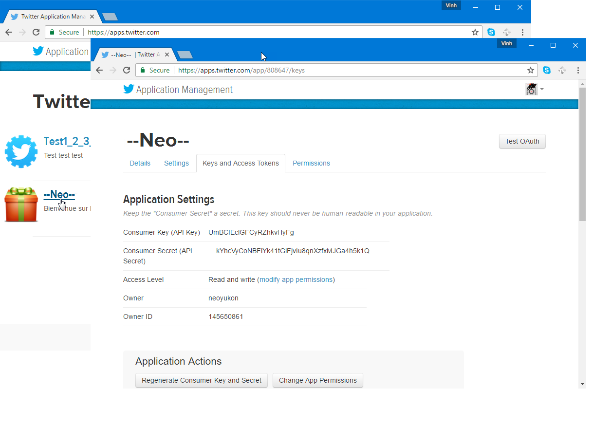

# Konfigurera publicering på Twitter{#configuring-publishing-on-twitter}

För att Adobe Campaign ska kunna skicka tweets till dina Twitter-konton måste du delegera skrivåtkomst till Adobe Campaign för dessa konton. Gör detta genom att utföra följande konfigurationssteg:

* Skapa ett Twitter-konto.
* Skapa ett test-Twitter-konto för att skicka korrektur.
* Skapa ett Twitter-program per Twitter-konto.
* Skapa en ny **[!UICONTROL Twitter]**-typtjänst för varje Twitter-program.

## Förhandskrav {#prerequisites}

Börja med att skapa ett eller flera Twitter-konton att skicka tweetar till.

Om du vill skapa ett Twitter-konto går du till [https://twitter.com](https://twitter.com).

## Skapa ett testkonto på Twitter {#creating-a-test-account-on-twitter}

Vi rekommenderar även att du skapar ett privat Twitter-konto som kan användas för att skicka tweet-korrektur (mer information finns i [Skicka korrektur](../../social/using/publishing-on-twitter.md#sending-the-proof)):

* Skapa ett nytt Twitter-konto.
* Klicka på menyn i det övre högra hörnet och välj **[!UICONTROL Settings]**.
* Markera fliken **[!UICONTROL Security and privacy]** och markera kryssrutan **[!UICONTROL Protect my Tweets]**.
* Klicka på knappen **[!UICONTROL Save Changes]** längst ned på sidan.

## Skapa ett program i Twitter {#creating-an-application-on-twitter}

För att Adobe Campaign ska kunna skicka tweets till dina Twitter-konton måste du skapa ett Twitter-program per Twitter-konto. Gör så här:

1. Logga in på ditt Twitter-konto.
1. Ange följande adress i webbläsaren: [https://apps.twitter.com/](https://apps.twitter.com/).
1. Klicka sedan på knappen **[!UICONTROL Create New App]** till höger.

   

1. Låt guiden vägleda dig genom processen.

   Om du vill att det här programmet ska tillåta att Adobe Campaign skickar tweets till ditt konto går du till fliken **[!UICONTROL Permissions]** i programmet och väljer **[!UICONTROL Read and Write]** i avsnittet **[!UICONTROL Access]**. På fliken **[!UICONTROL Settings]** måste du också lämna fältet **[!UICONTROL Callback URL]** tomt.

   

## Delegera skrivåtkomst till Adobe Campaign {#delegating-write-access-to-adobe-campaign}

För varje Twitter-program måste du skapa en annan **[!UICONTROL Twitter]**-typtjänst som inkluderar programinställningarna.

Det här steget kräver samtidig åtkomst till din Adobe Campaign-konsol och en webbläsare som är inloggad på ditt Twitter-konto:

* **Twitter**: markera det program som skapats tidigare ([https://dev.twitter.com/apps](https://dev.twitter.com/apps)) och klicka på  **[!UICONTROL Keys and Access Tokens]** fliken.

   

* **Adobe Campaign**: Gå till  **[!UICONTROL Profiles and targets]** fliken, klicka på  **[!UICONTROL Services and Subscriptions]** länken och klicka på  **[!UICONTROL Create]** knappen.

   

1. Välj typen **[!UICONTROL Twitter]**.

   

   >[!NOTE]
   >
   >Alternativet **[!UICONTROL Synchronize subscriptions]** är aktiverat som standard. När kryssrutan är markerad återställs listan med Twitter-följare i arbetsflödet för kontosynkronisering (se [Synkronisera Twitter-konton](#synchronizing-twitter-accounts)) så att du kan skicka direktmeddelanden till dem (se [Skicka direktmeddelanden till prenumeranter](../../social/using/publishing-on-twitter.md#sending-direct-messages-to-subscribers)). Om du inte vill återställa listan med följare avmarkerar du den här rutan.

1. Ange etiketten och det interna namnet på tjänsten.

   

   >[!IMPORTANT]
   >
   >**[!UICONTROL Internal name]** för tjänsten måste vara identisk med namnet på Twitter-kontot. Följ stegen nedan för att vara säker på att det inte finns några inmatningsfel.

   * Klicka på knappen **[!UICONTROL Save]**.
   * Klicka på den Twitter-tjänst du nyss skapade i översikten över tjänster.
   * Klicka på fliken **[!UICONTROL Twitter page]**.  Twitter-kontot ska visas.

      

1. I fältet **[!UICONTROL Visitor folder]** väljer du den besökarmapp som följarna ska skapas i. Mer information finns i [Driftsprincip](../../social/using/publishing-on-twitter.md#operating-principle). Som standard skapas följare i roten för mappen **[!UICONTROL Visitors]**.

   

1. I Twitter kopierar du innehållet i fälten **[!UICONTROL Consumer Key (API Key)]** och **[!UICONTROL Consumer Secret (API Secret)]** och klistrar in det i fälten **[!UICONTROL Consumer key]** och **[!UICONTROL Consumer secret]** i konsolen.

   

1. I Twitter kopierar du innehållet i fälten **[!UICONTROL Access Token]** och **[!UICONTROL Access Token Secret]** och klistrar in det i fälten **[!UICONTROL Access token]** och **[!UICONTROL Access token secret]** i konsolen.

   

1. Klicka på **[!UICONTROL Save]** i Adobe Campaign-konsolen. Delegeringen av skrivåtkomst till Adobe Campaign är nu klar.

   

>[!NOTE]
>
>Du måste skapa en **[!UICONTROL Twitter]**-typtjänst per Twitter-program.

Arbetsflödet i **[!UICONTROL Twitter account Synchronization]** synkroniserar Twitter-konton i Adobe Campaign. Mer information finns i [Synkronisera Facebook-sidor](../../social/using/publishing-on-facebook-walls.md#synchronizing-facebook-pages).

## Synkroniserar Twitter-konton {#synchronizing-twitter-accounts}

>[!IMPORTANT]
>
>För att arbetsflödet ska kunna återställa listan över Twitter-prenumeranter måste rutan **[!UICONTROL Twitter account synchronization]** vara markerad i redigeringsavsnittet för tjänsten som är länkad till kontot. Mer information finns i [Delegera skrivåtkomst till Adobe Campaign](#delegating-write-access-to-adobe-campaign).

Med arbetsflödet **[!UICONTROL Twitter account synchronization]**, som nås via noden **[!UICONTROL Administration > Production > Technical workflows > Managing social networks]**, kan du synkronisera Twitter-konton som konfigurerats tidigare med Adobe Campaign. Som standard aktiveras arbetsflödet varje torsdag kl. 7.30.

>[!NOTE]
>
>Det går att starta arbetsflödet när som helst genom att köra förväntad uppgiftsbearbetning. Du kan också redigera schemaläggaren för att ändra arbetsflödets utlösande frekvens. Mer information om schemaläggaren finns i [det här avsnittet](../../workflow/using/scheduler.md).

Nu kan du skicka tweets till dina Twitter-konton och skicka direktmeddelanden till dina följare. Mer information finns i: [Publicera på Twitter](../../social/using/publishing-on-twitter.md).
