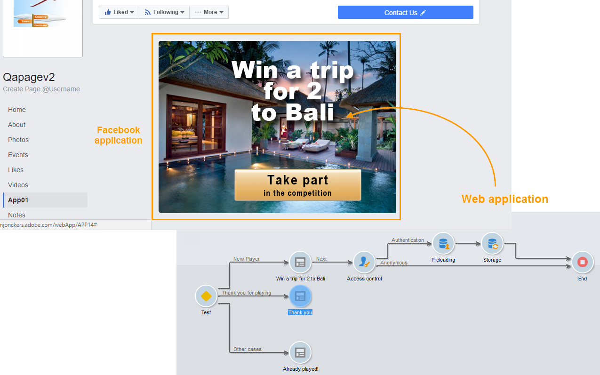

# Skapa ett Facebook-program{#creating-a-facebook-application}

Tack vare webbapplikationer kan ni med Social Marketing visa personaliserat innehåll i era Facebook-applikationer, vilket gör det enklare att hitta potentiella kunder via det här sociala nätverket. Fler exempel på webbprogram av Facebook-typ finns i [Exempel på Facebook-appar](../../social/using/examples-of-facebook-apps.md).

>[!NOTE]
>
>Det går också att integrera Adobe Campaign med en Facebook-applikation som utvecklats av en partner. I det här fallet finns det inget behov av att använda webbprogrammet Adobe Campaign för att hämta Facebook-profiler. Mer information finns i [Konfigurera externa konton](#configuring-external-accounts).

Använd följande konfigurationssteg:

1. Skapa ett eller flera Facebook-program. Mer information finns i: [Skapa ett Facebook-program](../../social/using/publishing-on-facebook-walls.md#creating-a-facebook-application).
1. Ange **[!UICONTROL terms of service]** och **[!UICONTROL Privacy policy]** länkar som ska visas på skärmen för behörighetsbegäran på Facebook. Mer information finns i: Ange [länkar](#entering-the-terms-of-service-and-privacy-policy-links)till användarvillkoren och sekretesspolicyn.
1. Skapa ett externt konto av **[!UICONTROL Facebook Connect]** typen för varje Facebook-program. Mer information finns i: [Konfigurerar externa konton](#configuring-external-accounts).
1. För varje Facebook-program skapar du ett webbprogram av Facebook-typ i Adobe Campaign. Mer information finns i: [Skapa ett webbprogram](#creating-a-facebook-type-web-application)av Facebook-typ.
1. Konfigurera dina Facebook-program så att de visas som flikar på din Facebook-sida. Mer information finns i: Konfigurera [Facebook-flikar](#configuring-facebook-tabs).

## Konfigurera externa konton {#configuring-external-accounts}

För varje Facebook-program måste du skapa ett externt konto av **[!UICONTROL Facebook Connect]** typen.

Det här steget kräver åtkomst till både Adobe Campaign-konsolen och en webbläsare som är inloggad på det Facebook-konto som du använder för sidadministration:

* **Facebook**: markera det tidigare skapade programmet ( [https://developers.facebook.com/apps](https://developers.facebook.com/apps)) och välj fliken **[!UICONTROL Settings]** > **[!UICONTROL Basic]** .

   

   >[!NOTE]
   >
   >Om **[!UICONTROL Facebook Web Games]** avsnittet inte visas klickar du på **[!UICONTROL Add Platform]** knappen längst ned på sidan och väljer **[!UICONTROL Facebook Web Games]**.

* **Adobe Campaign**: gå till **[!UICONTROL Administration > Platform > External accounts]** noden i trädet och klicka på **[!UICONTROL New]**.

   

1. Ange en etikett och ett internt namn och välj **[!UICONTROL Facebook Connect]** typ.

   

1. Välj ett värdläge för programmet: **[!UICONTROL hosted by a partner]** eller **[!UICONTROL hosted by this instance]**.

   

   **Program som hanteras av en partner**

   Det går att integrera Adobe Campaign med en Facebook-applikation som utvecklats av en partner. I det här fallet finns det inget behov av att använda webbprogrammen i Adobe Campaign för att hämta Facebook-profiler. När Facebook-användaren installerar programmet skapas en nyckel (åtkomsttoken). Partnern vidarebefordrar denna åtkomsttoken till Adobe Campaign genom att ringa upp en webbtjänst. Adobe Campaign använder sedan denna token för att logga in på Facebook-databasen och samla in data som delas av användaren via programmet.

   >[!NOTE]
   >
   >Parametrarna för webbtjänsten finns i WSDL-filen som finns här: **`https://<Instance name>/nl/jsp/schemawsdl.jsp?schema=nms:visitor`**

   Om du vill integrera tredjepartsprogrammet i Adobe Campaign måste du kopiera innehållet i **[!UICONTROL App ID]** - och **[!UICONTROL App Secret]** Facebook-fälten och klistra in det i **[!UICONTROL Application ID]** - och **[!UICONTROL Application secret]** -fälten på konsolen.

   

   **Program som är värd för den här instansen**

   Om du vill ha programmet på den här instansen (om du inte har något tredjepartsprogram) måste du använda webbprogrammen för Adobe Campaign för att hämta Facebook-profiler. Mer information finns i [Exempel på Facebook-appar](../../social/using/examples-of-facebook-apps.md).

   Kopiera adressen i fältet i Adobe Campaign-konsolen och klistra in den i **[!UICONTROL Secure Canvas URL]** fältet på Facebook (i **[!UICONTROL Facebook Web games (https)]** **[!UICONTROL Facebook Web Games]** avsnittet).

   

   >[!CAUTION]
   >
   >Du får inte använda den osäkra URL:en under några omständigheter.

   På Facebook kopierar du innehållet i **[!UICONTROL App ID]** och **[!UICONTROL App Secret]** fälten och klistrar in det i **[!UICONTROL Application ID]** - och **[!UICONTROL Application secret]** -fälten i konsolen.

   

1. På Facebook klickar du på **[!UICONTROL Save Changes]** knappen längst ned på sidan.
1. Klicka på knappen på Adobe Campaign-konsolen för att aktivera Adobe Campaign så att data kan återställas i realtid varje gång en fan checkar in via det här programmet. **[!UICONTROL Subscribe]** Mer information finns i: [Exempel på Facebook-appar](../../social/using/examples-of-facebook-apps.md).

   

## Ange länkar till användarvillkor och sekretesspolicy {#entering-the-terms-of-service-and-privacy-policy-links}

Vi rekommenderar att du lägger till **[!UICONTROL Terms of service]** och **[!UICONTROL Privacy policy]** länkar som ska visas på skärmen för behörighetsbegäran på Facebook.

Konfigurationsstegen är följande:

1. Ange följande adress: [https://developers.facebook.com/apps](https://developers.facebook.com/apps)och välj sedan Facebook-programmet.
1. Markera **[!UICONTROL Settings > Basic]** fliken och ange **[!UICONTROL Privacy Policy URL]** fälten och **[!UICONTROL Terms of Service URL]** fälten.

   

## Skapa ett webbprogram av Facebook-typ {#creating-a-facebook-type-web-application}

Med Facebook-programmet för Adobe Campaign kan du visa personaliserat innehåll i ditt Facebook-program. För varje Facebook-program måste du skapa ett webbprogram i Adobe Campaign. Så här skapar du ett Facebook-webbprogram:

1. Gå till **[!UICONTROL Social networks]** universum, klicka på **[!UICONTROL Applications]** länken och sedan på **[!UICONTROL Create]** knappen.

   

1. Välj en mall för Facebook-webbprogram i listan och ange etiketten.

   

   >[!NOTE]
   >
   >Det finns fyra webbprogrammallar för Facebook som standard:
   >
   >* **[!UICONTROL New Facebook application]**: välj den här mallen om du vill starta från ett tomt program.
   >* **[!UICONTROL Pre-entered form]**: Facebook-program med ett formulär och en inloggningsknapp på Facebook som gör att användare kan fylla i formulärfälten automatiskt med data från sin profil. På så sätt kan användarna fylla i formuläret snabbare och varumärkena kan få bättre kvalitetsinformation.
   >* **[!UICONTROL "Canvas page" competition]**: Facebook-program som visas på hela skärmen för en bättre visuell upplevelse för användarna.
   >* **[!UICONTROL "Page Tab" competition]**: Facebook-applikationen är helt integrerad med varumärkessidorna.

1. I **[!UICONTROL Application]** fältet anger du det externa konto som är länkat till Facebook-programmet. Mer information finns i: [Konfigurerar externa konton](#configuring-external-accounts).

   

1. Markera **[!UICONTROL Edit]** fliken och redigera sedan webbprogrammet. Mer information finns i: [Exempel på Facebook-appar](../../social/using/examples-of-facebook-apps.md).

   

1. När webbprogrammet är klart väljer du **[!UICONTROL Dashboard]** fliken och klickar sedan på **[!UICONTROL Publish]** för att publicera online.

   

## Konfigurera Facebook-flikar {#configuring-facebook-tabs}

Du kan konfigurera dina Facebook-program så att de visas som flikar på din Facebook-sida. Gör så här:

1. Markera Facebook-programmet ([https://developers.facebook.com/apps](https://developers.facebook.com/apps)) och välj **[!UICONTROL Settings > Basic]** fliken.

   

1. Klicka på **[!UICONTROL Add Platform]** knappen längst ned på sidan och markera **[!UICONTROL Page Tab]**.

   

1. I fältet **[!UICONTROL Page Tab Name]** i **[!UICONTROL Page Tab]** avsnittet anger du etiketten som du vill att den ska visas på Facebook-sidan.

   

1. I **[!UICONTROL Secure Page Tab URL]** fältet anger du webbprogrammets offentliga URL, som du kommer åt via webbprogrammets **[!UICONTROL Dashboard]** flik. Mer information om hur du skapar webbprogram av Facebook-typ finns i [Skapa ett webbprogram](#creating-a-facebook-type-web-application)av Facebook-typ.

   

1. Klicka på **[!UICONTROL Dashboard]** länken på webbprogrammets **[!UICONTROL Add a page tab]** sida.

   

1. Markera den Facebook-sida som du vill lägga till fliken i och klicka på **[!UICONTROL Add Page Tab]**.

   

