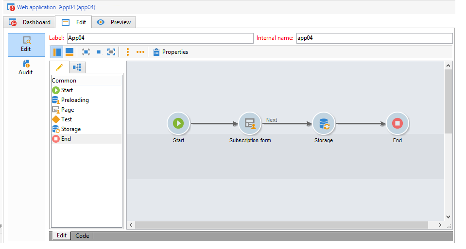

# Exempel på Facebook-appar{#examples-of-facebook-apps}

När en användare klickar på fliken i ett Facebook-program visas den i ett utrymme som är 810 pixlar brett. Adobe Campaign uses a Facebook type web application to let you define and personalize the content displayed in the Facebook application, therefore making it easier to acquire profiles.

>[!NOTE]
>
>Det går också att integrera Adobe Campaign med en Facebook-applikation som utvecklats av en partner. I det här fallet behöver du inte använda Adobe Campaign webbprogram för att hämta Facebook-profiler. Mer information finns i [Konfigurera externa konton](../../social/using/creating-a-facebook-application.md#configuring-external-accounts).

>[!IMPORTANT]
>
>Please comply with the configuration steps described in [Creating a Facebook application](../../social/using/creating-a-facebook-application.md).

>[!NOTE]
>
>I det här avsnittet beskrivs de element som är länkade till webbprogram av Facebook-typ. Alla element som delas med vanliga webbprogram beskrivs i [det här avsnittet](../../web/using/about-web-applications.md).

De exempel på webbapplikationer av Facebook-typ som beskrivs här är:

* Så här skapar du ett Facebook-program i 7 steg. Se [Snabbstart: skapa ett Facebook-program i 7 steg](#quick-start--creating-a-facebook-application-in-7-steps).
* Så här vidarebefordrar du inställningar till ett Facebook-program. Se [Hur man vidarebefordrar inställningar till ett Facebook-program?](#how-to-forward-settings-to-a-facebook-application-).
* Så här hämtar du fläktdata. Refer to [How to acquire fan data?](#how-to-acquire-fan-data-).

>[!IMPORTANT]
>
>De här enkla användningsexemplen finns som exempel på funktioner för webbapplikationer av Facebook-typ.

## Rekommendationer {#recommendations}

Följande begränsningar är direkt kopplade till Facebook:

* You must build all your web applications in HTTPS.
* Ett Facebook-program som visas via en flik har en bredd på 810 pixlar.

## Snabbstart: skapa ett Facebook-program i 7 steg {#quick-start--creating-a-facebook-application-in-7-steps}

I det här exemplet beskrivs hur du visar ett Adobe Campaign-byggt program i Facebook steg för steg. I det här fallet vill vi skapa ett program där du kan visa **Välkommen** när användaren klickar på fliken Program (**App01**).

Så här skapar du programmet:

1. Skapa ett program på Facebook ( [https://developers.facebook.com/apps](https://developers.facebook.com/apps)). Mer information finns i: [Skapa ett Facebook-program](../../social/using/publishing-on-facebook-walls.md#creating-a-facebook-application).

   

1. Skapa en **[!UICONTROL Facebook Connect]** skriv ett externt konto och ange parametrarna för Facebook-programmet. Mer information finns i: [Konfigurera externa konton](../../social/using/creating-a-facebook-application.md#configuring-external-accounts).

   

1. Ange **[!UICONTROL Terms of service]** och **[!UICONTROL Privacy policy]** länkar som ska visas på skärmen för Facebook behörighetsbegäran. Mer information finns i: [Ange länkar till användarvillkor och sekretesspolicy](../../social/using/creating-a-facebook-application.md#entering-the-terms-of-service-and-privacy-policy-links).

   

1. Skapa ett webbprogram av Facebook-typ i Adobe Campaign. Mer information finns i: [Skapa ett webbprogram av typen Facebook](../../social/using/creating-a-facebook-application.md#creating-a-facebook-type-web-application).

   

1. Redigera webbprogrammet. I det här exemplet har vi lagt till en **[!UICONTROL Page]** och definierade en titel för den.

   

1. Distribuera programmet.

   

1. Konfigurera ditt Facebook-program så att det visas som en flik på din Facebook-sida. For more on this, refer to: [Configuring Facebook tabs](../../social/using/creating-a-facebook-application.md#configuring-facebook-tabs).

   

Kontrollera att fliken i **App01** visas på din Facebook-sida. Om du klickar på den bör du ringa upp en **Välkommen** meddelande.

## Hur man vidarebefordrar inställningar till ett Facebook-program? {#how-to-forward-settings-to-a-facebook-application-}

>[!IMPORTANT]
>
>Följ konfigurationsstegen i [Skapa ett Facebook-program](../../social/using/creating-a-facebook-application.md).

I exempel 1 anpassade vi visningen av Facebook-sidan enligt värdet i **[!UICONTROL Fan of the page]** fält. Det går också att bearbeta **[!UICONTROL Application settings]** fält. I det här fältet kan du återställa data som finns i en länk som skapats av Adobe Campaign via Facebook.

Låt oss ta ett exempel på ett företag som bestämmer sig för att skicka en e-postkampanj. I leveransen pekar en länk mot Facebook-programmet. Länken är personaliserad tack vare **[!UICONTROL app_data]** parametern har lagts till i slutet av URL:en. Värdet på den här parametern kan vara en indikator som speglar kundens betydelse. I vårt exempel är värdena för **[!UICONTROL app_data]** parametern är **[!UICONTROL big]** (betydande kund) och **[!UICONTROL small]** (mindre viktig kund).

Once it is personalized, the URL looks like this:

* `http://<path of the Facebook application>&app_data=big` (för en betydande kund)
* `http://<path of the Facebook application>&app_data=small` (för en mindre viktig kund)

Among the anonymous data forwarded to Adobe Campaign by Facebook, the value of the **[!UICONTROL Application parameters]** field is collected, thus enabling Adobe Campaign to personalize application display based on this parameter.

Om användaren är en viktig kund (värdet av **[!UICONTROL app_data]** parametern är **[!UICONTROL big]**) visas följande bild:

If the user is a less significant customer (the value of the **[!UICONTROL app_data]** parameter is **[!UICONTROL small]**), the following image is displayed:

Vi har skapat ett webbprogram som består av följande element för att återskapa det här användningsexemplet:

* A **[!UICONTROL Test]** aktivitet baserad på **[!UICONTROL Application parameter]** fält.
* två sidor som innehåller bilderna som ska visas enligt värdet på **[!UICONTROL Application parameter]** fält.

## Hur får jag tag i fläktdata? {#how-to-acquire-fan-data-}

>[!IMPORTANT]
>
>Följ konfigurationsstegen i [Skapa ett Facebook-program](../../social/using/creating-a-facebook-application.md).

I det här exemplet visas hur du får kontakt med Facebook-användare och erbjuder dem möjlighet att dela sin profilinformation. Låt oss ta ett exempel på ett företag som vill förvärva potentiella kunder och anordna en tävling på sin Facebook-sida för att locka dem.

När en användare klickar på **[!UICONTROL App03]** Vi frågar dem om de vill delta i tävlingen.

Om de väljer att delta i tävlingen erbjuder vi dem att dela med sig av sin profilinformation.

Om de godkänner att dela sin information visas följande skärm.

Vi har skapat ett webbprogram som innehåller följande element för att skapa det här användningsexemplet:

* en **[!UICONTROL Test]**-aktivitet
* tre sidor
* en **[!UICONTROL Access control]** aktivitet
* en **[!UICONTROL Pre-loading]**-aktivitet
* en **[!UICONTROL Save]**-aktivitet
* en **[!UICONTROL End]** aktivitet

### Testaktivitet {#test-activity}

The **[!UICONTROL Test]** aktiviteten baseras på **[!UICONTROL ID]** och **[!UICONTROL Application parameters]** fält.

Den består av tre grenar:

* **[!UICONTROL identifier (UID) is empty]** : identifieraren vidarebefordras endast av Facebook om användaren redan har godkänt att dela informationen. The first branch of the **[!UICONTROL Test]** activity lets you make the competition available only to users who have never entered, i.e. those with an empty ID.
* **[!UICONTROL application parameter equals 'thanks']** : to sidestep a display error linked to Facebook, the web application end page points towards the URL of the Facebook application which the **[!UICONTROL app_data]** parameter is added to using the **[!UICONTROL thanks]** value (for more on this, refer to: [End activity](#end-activity)). Med den andra grenen kan du ta reda på om användaren kommer från **[!UICONTROL End]** den första filialens verksamhet (och har just gått in i tävlingen) för att visa ett tackmeddelande. Mer information om hur du använder ytterligare URL-parametrar finns i: [Hur man vidarebefordrar inställningar till ett Facebook-program?](#how-to-forward-settings-to-a-facebook-application-).
* **[!UICONTROL Default branch]** : om användaren redan har anmält sig till tävlingen (ID redan angivet) vid ett tidigare datum (programparameter skiljer sig från **[!UICONTROL thanks]**) visas en sida som anger att de redan har skrivit.

### Konkurrenssida {#competition-page}

Om du vill stega i sidled på det visningsfel som är länkat till Facebook måste du också välja **[!UICONTROL Parent window]** eller **[!UICONTROL In the top window]** i **[!UICONTROL Window]** på tävlingssidan.

### Åtkomstkontrollaktivitet {#access-control-activity}

The **[!UICONTROL Access control]** kan du visa sidan för begäran om Facebook-tillstånd när användaren går in i tävlingen. If they agree to share their information, it is recovered during pre-loading. Mer information finns i: [Förinläsningsaktivitet](#pre-loading-activity).

Om du tidigare angav ett externt konto när du skapade webbprogrammet (se [Skapa ett webbprogram av typen Facebook](../../social/using/creating-a-facebook-application.md#creating-a-facebook-type-web-application)) behöver du inte redigera aktiviteten. If not, go to the **[!UICONTROL Application]** field and select the external account linked to the Facebook application.

### Förinläsningsaktivitet {#pre-loading-activity}

Select the data source to be used for pre-loading:

* **[!UICONTROL Marketing database]** : Med det här alternativet kan du förhandsladda data via Adobe Campaign-databasen.
* **[!UICONTROL Facebook]** : Med det här alternativet kan du förhandsladda data med Facebook.

**Marknadsföringsdatabas**

Med det här alternativet kan du återställa data för en profil som finns i besökstabellen. Verifieringen görs baserat på det externa Facebook-id som återställts när användaren klickar på fliken för Facebook-programmet. Om du lägger till ett formulär efter **[!UICONTROL Pre-loading]** är de fält som innehåller information i databasen förinlästa.

>[!NOTE]
>
>Mer information om hur du läser in data i förväg via Adobe Campaign-databasen finns i [det här avsnittet](../../web/using/publishing-a-web-form.md#pre-loading-the-form-data).

**Facebook**

Med det här alternativet kan du definiera den Facebook-profilinformation som ska samlas in, bland annat den som användaren har gått med på att dela, för att spara den.

The **[!UICONTROL Database information]** kan du samla in följande data:

* **[!UICONTROL External ID]**: användar-ID
* **[!UICONTROL Gender]**: användarens kön
* **[!UICONTROL Verified]** : I det här fältet anges om användaren har ett verifierat Facebook-konto eller inte.
* **[!UICONTROL Full name]**: användarens fullständiga namn
* **[!UICONTROL First name]**: användarens förnamn
* **[!UICONTROL Last name]**: användarens efternamn
* **[!UICONTROL Language]**: användarens språk

Du kan också välja att samla in profilfotot, listan över vänner, e-postadress, födelsedatum, intressen och plats genom att markera lämpliga rutor.

Innan du klickar **[!UICONTROL Ok]**, kontrollera **[!UICONTROL I agree to comply with Facebook conditions of use]** box.

>[!NOTE]
>
>Om du markerar en eller flera rutor i **[!UICONTROL Private information]** visas åtkomstbegäran för dessa data automatiskt på Facebook behörighetsbegärandeskärm.
>
>För att du ska kunna samla in den valda informationen måste användaren samtycka till att dela den.
>
>Om du vill ha båda typerna av förinläsning (via Adobe Campaign och via Facebook) lägger du till två förinläsningsrutor, den ena efter den andra.

### Spara aktivitet {#save-activity}

The **[!UICONTROL Save]** Med -aktiviteten kan du lagra den information som samlats in under föregående steg i besökstabellen.

Om profilen redan finns i besökartabellen uppdateras deras data med de nya data som samlas in.

Om profilen inte finns i databasen och Facebook-användarens e-postadress har samlats in, skapas en besökare i besökartabellen.

1. I **[!UICONTROL Visitor creation folder]** markerar du mappen som profilen ska skapas i. När det gäller webbprogram av Facebook-typ är standardmappen för att skapa **[!UICONTROL Visitors]**.
1. I **[!UICONTROL Reconciliation mode]** väljer du det avstämningsläge som du vill använda:

   * **[!UICONTROL Automatic]** : Avstämningen görs utifrån e-post, efternamn, förnamn och födelsedatum.
   * **[!UICONTROL Manual]** : Välj en eller flera avstämningsnycklar.
   * **[!UICONTROL None]** : Ingen avstämning kommer att ske.

1. I **[!UICONTROL Mapping]** markerar du det schema som du vill utföra avstämningen på.

   >[!IMPORTANT]
   >
   >Se till att fälten i **[!UICONTROL Social networks]** -fliken anges korrekt i leveransmappningen. Leveranskartor nås via **[!UICONTROL Administration > Campaign management > Target mappings]** nod.

1. Du kan välja en sökmapp för avstämning och en skapandemapp för nya profiler. Om fälten är tomma söks profiler igenom och skapas i standardmappen för mappningsschemat.

### Avsluta aktivitet {#end-activity}

Om du vill gå åt sidan av det visningsfel som är länkat till Facebook måste du kontrollera **[!UICONTROL Use an external URL]** och ange webbadressen till Facebook-programmet, följt av **[!UICONTROL app_data]** parameter och ett värde. Det här värdet används i **[!UICONTROL Test]** aktiviteter för att ta reda på om användaren just har anmält sig till tävlingen och för att visa ett tackmeddelande om det är tillämpligt. Mer information finns i: [Testaktivitet](#test-activity).

I vårt exempel är värdet som används **Tack**.

### Details screen of a visitor {#details-screen-of-a-visitor}

Just like for Twitter followers (refer to: [Operating principle](../../social/using/publishing-on-twitter.md#operating-principle)), recovered Facebook profiles are stored in the visitors&#39; table. To display the list of visitors, go to the **[!UICONTROL Profiles and Targets > Visitors]** node.

Alla Facebook-potentiella kunder som går med på att dela sin profilinformation läggs till i listan över besökare. Om **[!UICONTROL Friends]** kryssrutan är markerad i **[!UICONTROL Pre-load]** aktivitet (se: [Förinläsningsaktivitet](#pre-loading-activity)) läggs även vänner till.

I **[!UICONTROL Summary]** -delen av besökarinformationsfönstret, det finns två möjliga lägen för **[!UICONTROL New Contact]** indikator:

Om en grön bockmarkering visas betyder det att besökaren inte stämdes av mot någon mottagare. I det här fallet skapas en ny profil i listan över mottagare.

Ett rött kryss innebär att besökaren stämdes av mot en mottagare. You can click the magnifier to the right of the **[!UICONTROL Recipient]** field to display the matching recipient.

Gå till detaljfönstret för en mottagare för att visa den matchande besökaren, om tillämpligt. Select the **[!UICONTROL Others]** tab, then double-click the name of the visitor in the **[!UICONTROL Web identities]** section.

The **[!UICONTROL Activities]** Skärmen på en besökares informationssida innehåller följande information:

* Fläktaktiviteter av typen &quot;Open Graph&quot;: uppspelad musik, bevakade videoklipp, artiklar som läses och avbrott i installerade program (Deezer, Spotify, Dailymotion, Yahoo News osv.)

   

* &quot;Likes&quot; och kommentarer som lagts till av fläkten efter leveranser från Adobe Campaign
* sidor som fläkten gillar
* incheckningar av fläkten

   

   >[!NOTE]
   >
   >För att Adobe Campaign ska kunna samla in en fan checkar in måste du klicka på **[!UICONTROL Subscribe]** på skärmen för tjänstkonfiguration. Mer information finns i [Konfigurera externa konton](../../social/using/creating-a-facebook-application.md#configuring-external-accounts).

## Hur man läser in ett formulär i förväg med hjälp av Facebook profildata {#how-to-pre-load-the-fields-of-a-form-using-facebook-profile-data}

The **[!UICONTROL Social Marketing]** Med kan du också lägga till en knapp i ett formulär för att i förväg läsa in fält med hjälp av Facebook profilinformation. Det här alternativet, som är tillgängligt i alla webbprogrammallar (**[!UICONTROL Page]** typaktiviteter) finns i [det här avsnittet](../../web/using/static-elements-in-a-web-form.md#inserting-html-content).

>[!NOTE]
>
>Innan du börjar använda den här funktionen måste du skapa ett Facebook-program och en **[!UICONTROL Facebook Connect]** skriv ett externt konto. For more on this, refer to [Configuring external accounts](../../social/using/creating-a-facebook-application.md#configuring-external-accounts).

**Läs in formulärfälten i förväg med data från Facebook-profilen**

Du skapar ett webbformulär och inkluderar element som användaren inte har någon interaktion med på formulärets sidor; Detta är statiska element som bilder, HTML, ett vågrätt fält eller en hypertextlänk. Läs mer om statiska element i ett webbformulär i [den här sidan](../../web/using/static-elements-in-a-web-form.md).

När du infogar ett statiskt element visas **[!UICONTROL Preload with Facebook]** kan du infoga en knapp i ett formulär för att i förväg läsa in fält med hjälp av Facebook-profilinformation.

När en användare klickar på **[!UICONTROL Fill in automatically]** öppnas Facebook behörighetsfönster.

>[!NOTE]
>
>Du kan ändra listan med utökade rättigheter när du konfigurerar det externa kontot. Om inga utökade behörigheter har konfigurerats vidarebefordrar Facebook basprofilinformationen som standard.\
>Om du vill visa en lista över utökade rättigheter och syntaxen för dessa, [se Facebook dokumentation](https://developers.facebook.com/docs/reference/api/permissions).

Om användaren går med på att dela sin information är formulärfälten förinlästa.

I det här fallet har vi skapat ett webbprogram som består av följande element:

* en sida som innehåller formuläret
* en **[!UICONTROL Record]**-aktivitet
* en **[!UICONTROL End]** aktivitet

Så här lägger du till en förinläsningsknapp:

1. Skapa ett formulär.

   

1. Gå till samma nivå som fälten i formuläret och lägg till en länk.

   

1. Enter the label and select the **[!UICONTROL Button]** type.

   

1. Gå till **[!UICONTROL Action]** fält och markera **[!UICONTROL Preload with Facebook]**.

   

1. Gå till **[!UICONTROL Application]** och välj **[!UICONTROL Facebook Connect]** skriv ett externt konto som skapats tidigare. Mer information finns på [den här sidan](../../social/using/creating-a-facebook-application.md#configuring-external-accounts).

   

