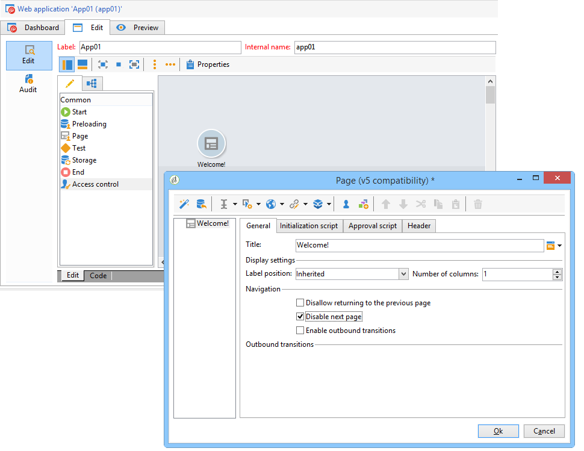
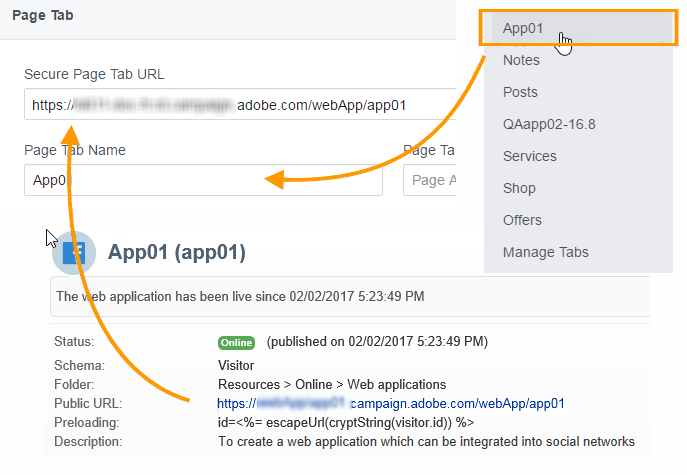
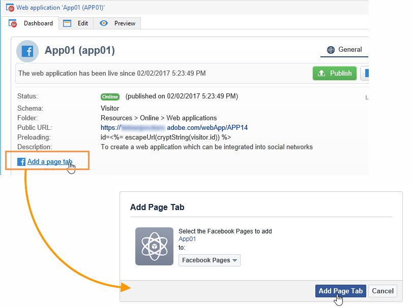
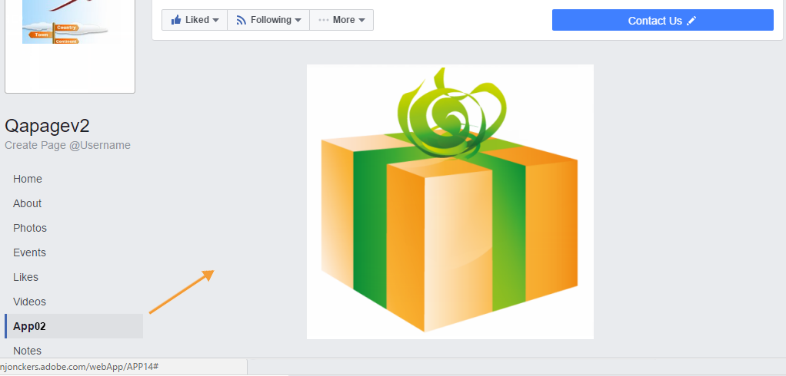
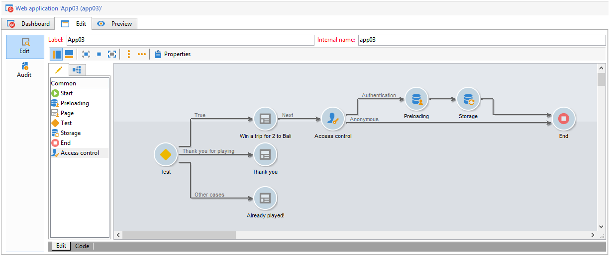
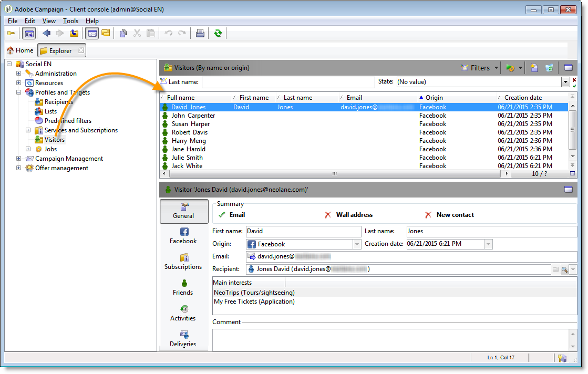

# Exempel på Facebook-appar{#examples-of-facebook-apps}

När en användare klickar på fliken för ett Facebook-program visas den i ett utrymme som är 810 pixlar brett. Adobe Campaign använder ett webbprogram av Facebook-typ för att du ska kunna definiera och personalisera det innehåll som visas i Facebook-programmet, vilket gör det enklare att hämta profiler.

>[!NOTE]
>
>Det går också att integrera Adobe Campaign med en Facebook-applikation som utvecklats av en partner. I det här fallet finns det inget behov av att använda webbprogrammet Adobe Campaign för att hämta Facebook-profiler. Mer information finns i [Konfigurera externa konton](../../social/using/creating-a-facebook-application.md#configuring-external-accounts).

>[!CAUTION]
>
>Följ konfigurationsstegen som beskrivs i [Skapa ett Facebook-program](../../social/using/creating-a-facebook-application.md).

>[!NOTE]
>
>I det här avsnittet beskrivs de element som är länkade till webbprogram av Facebook-typ. Alla element som delas med standardwebbprogram beskrivs i [det här avsnittet](../../web/using/about-web-applications.md).

De exempel på webbapplikationer av Facebook-typ som beskrivs här är:

* Så här skapar du ett Facebook-program i 7 steg. Se [Snabbstart: skapa ett Facebook-program i 7 steg](#quick-start--creating-a-facebook-application-in-7-steps).
* Så här vidarebefordrar du inställningar till ett Facebook-program. Se [Så här vidarebefordrar du inställningar till ett Facebook-program?](#how-to-forward-settings-to-a-facebook-application-).
* Så här hämtar du fläktdata. Se [Så här hämtar du fläktdata?](#how-to-acquire-fan-data-).

>[!CAUTION]
>
>Dessa enkla användningsexempel finns som exempel som illustrerar funktionerna i webbapplikationer av Facebook-typ.

## Rekommendationer {#recommendations}

Följande begränsningar är direkt kopplade till Facebook:

* Du måste skapa alla webbprogram i HTTPS.
* Ett Facebook-program som visas via en flik har en bredd på 810 pixlar.

## Snabbstart: skapa ett Facebook-program i 7 steg {#quick-start--creating-a-facebook-application-in-7-steps}

I det här exemplet beskrivs hur du visar en Adobe Campaign-byggd applikation på Facebook steg för steg. I det här fallet vill vi skapa ett program där du kan visa **välkomstmeddelandet** när användaren klickar på programfliken (**App01**).

Så här skapar du programmet:

1. Skapa ett program på Facebook ( [https://developers.facebook.com/apps](https://developers.facebook.com/apps)). Mer information finns i: [Skapa ett Facebook-program](../../social/using/publishing-on-facebook-walls.md#creating-a-facebook-application).

   

1. Skapa ett externt konto av **[!UICONTROL Facebook Connect]** typen och ange parametrarna för Facebook-programmet. Mer information finns i: [Konfigurerar externa konton](../../social/using/creating-a-facebook-application.md#configuring-external-accounts).

   

1. Ange **[!UICONTROL Terms of service]** och **[!UICONTROL Privacy policy]** länkar som ska visas på skärmen för behörighetsbegäran på Facebook. Mer information finns i: Ange [länkar](../../social/using/creating-a-facebook-application.md#entering-the-terms-of-service-and-privacy-policy-links)till användarvillkoren och sekretesspolicyn.

   

1. Skapa ett webbprogram av Facebook-typ i Adobe Campaign. Mer information finns i: [Skapa ett webbprogram](../../social/using/creating-a-facebook-application.md#creating-a-facebook-type-web-application)av Facebook-typ.

   

1. Redigera webbprogrammet. I det här exemplet har vi lagt till en **[!UICONTROL Page]** aktivitet och definierat en rubrik för den.

   

1. Distribuera programmet.

   

1. Konfigurera ditt Facebook-program så att det visas som en flik på din Facebook-sida. Mer information finns i: Konfigurera [Facebook-flikar](../../social/using/creating-a-facebook-application.md#configuring-facebook-tabs).

   

Kontrollera att fliken i **App01** -programmet visas på din Facebook-sida. Om du klickar på den bör du ringa upp ett **välkomstmeddelande** .

## Hur man vidarebefordrar inställningar till ett Facebook-program? {#how-to-forward-settings-to-a-facebook-application-}

>[!CAUTION]
>
>Följ konfigurationsstegen som beskrivs i [Skapa ett Facebook-program](../../social/using/creating-a-facebook-application.md).

I exempel 1 anpassade vi visningen av Facebook-sidan efter värdet i **[!UICONTROL Fan of the page]** fältet. Det går också att bearbeta **[!UICONTROL Application settings]** fältet. I det här fältet kan du återställa data i en länk som skapats av Adobe Campaign via Facebook.

Låt oss ta ett exempel på ett företag som bestämmer sig för att skicka en e-postkampanj. I leveransen pekar en länk mot Facebook-programmet. Den här länken är personlig tack vare den parameter som har lagts till i slutet av URL:en. **[!UICONTROL app_data]** Värdet på den här parametern kan vara en indikator som speglar kundens betydelse. I vårt exempel är värdena för **[!UICONTROL app_data]** parametern **[!UICONTROL big]** (betydande kund) och **[!UICONTROL small]** (mindre viktig kund).

När webbadressen har anpassats ser den ut så här:

* `http://<path of the Facebook application>&app_data=big` (för en betydande kund)
* `http://<path of the Facebook application>&app_data=small` (för en mindre viktig kund)

Bland de anonyma data som vidarebefordrats till Adobe Campaign av Facebook samlas fältets värde in, vilket gör att Adobe Campaign kan anpassa programvisningen utifrån den här parametern. **[!UICONTROL Application parameters]**

Om användaren är en viktig kund (värdet för **[!UICONTROL app_data]** parametern är **[!UICONTROL big]**) visas följande bild:

Om användaren är en mindre viktig kund (värdet för **[!UICONTROL app_data]** parametern är **[!UICONTROL small]**) visas följande bild:

Vi har skapat ett webbprogram som består av följande element för att återskapa det här användningsexemplet:

* En **[!UICONTROL Test]** aktivitet baserad på **[!UICONTROL Application parameter]** fältet.
* två sidor som innehåller bilderna som ska visas enligt värdet i **[!UICONTROL Application parameter]** fältet.

## Hur får jag tag i fläktdata? {#how-to-acquire-fan-data-}

>[!CAUTION]
>
>Följ konfigurationsstegen som beskrivs i [Skapa ett Facebook-program](../../social/using/creating-a-facebook-application.md).

I det här exemplet visas hur du får kontakt med Facebook-användare och erbjuder dem möjlighet att dela sin profilinformation. Låt oss ta ett exempel på ett företag som vill förvärva potentiella kunder och organisera en tävling på sin Facebook-sida för att locka dem.

När en användare klickar på **[!UICONTROL App03]** fliken frågar vi om de vill delta i tävlingen.

Om de väljer att delta i tävlingen erbjuder vi dem att dela med sig av sin profilinformation.

Om de godkänner att dela sin information visas följande skärm.

Vi har skapat ett webbprogram som innehåller följande element för att skapa det här användningsexemplet:

* en **[!UICONTROL Test]** aktivitet
* tre sidor
* en **[!UICONTROL Access control]** aktivitet
* en **[!UICONTROL Pre-loading]** aktivitet
* en **[!UICONTROL Save]** aktivitet
* en **[!UICONTROL End]** aktivitet

### Testaktivitet {#test-activity}

Aktiviteten **[!UICONTROL Test]** baseras på **[!UICONTROL ID]** fältet och **[!UICONTROL Application parameters]** fältet.

Den består av tre grenar:

* **[!UICONTROL identifier (UID) is empty]** : identifieraren vidarebefordras endast av Facebook om användaren redan har gått med på att dela sin information. Med den första grenen av **[!UICONTROL Test]** aktiviteten kan du göra tävlingen tillgänglig endast för användare som aldrig har anmält sig, dvs. användare med ett tomt ID.
* **[!UICONTROL application parameter equals 'thanks']** : Om du vill lägga ett visningsfel som är länkat till Facebook pekar webbprogrammets slutsida mot webbadressen för det Facebook-program som parametern läggs till i med **[!UICONTROL app_data]** **[!UICONTROL thanks]** värdet (mer information finns i: [Avsluta aktivitet](#end-activity)). I den andra grenen kan du ta reda på om användaren kommer från den första filialens **[!UICONTROL End]** aktivitet (och just har anmält sig till tävlingen) för att visa ett tackmeddelande. Mer information om hur du använder ytterligare URL-parametrar finns i: [Hur man vidarebefordrar inställningar till ett Facebook-program?](#how-to-forward-settings-to-a-facebook-application-).
* **[!UICONTROL Default branch]** : Om användaren redan har anmält sig till tävlingen (ID har redan angetts) vid ett tidigare datum (en annan programparameter än **[!UICONTROL thanks]**) visas en sida som anger att användaren redan har anmält sig.

### Konkurrenssida {#competition-page}

Om du vill gå åt sidan av det visningsfel som är kopplat till Facebook måste du också välja **[!UICONTROL Parent window]** eller **[!UICONTROL In the top window]** på **[!UICONTROL Window]** tävlingssidans område.

### Åtkomstkontrollaktivitet {#access-control-activity}

Med hjälp av den här aktiviteten kan du visa sidan för begäran om behörighet på Facebook när användaren går in i tävlingen. **[!UICONTROL Access control]** Om de samtycker till att dela sina uppgifter återställs de under förinläsningen. Mer information finns i: [Förinläsningsaktivitet](#pre-loading-activity).

Om du tidigare angav det externa kontot när du skapade webbprogrammet (se [Skapa ett webbprogram](../../social/using/creating-a-facebook-application.md#creating-a-facebook-type-web-application)av Facebook-typ) behöver du inte redigera aktiviteten. Om inte går du till **[!UICONTROL Application]** fältet och väljer det externa konto som är länkat till Facebook-programmet.

### Förinläsningsaktivitet {#pre-loading-activity}

Välj den datakälla som ska användas för förinläsning:

* **[!UICONTROL Marketing database]** : Med det här alternativet kan du förhandsladda data via Adobe Campaign-databasen.
* **[!UICONTROL Facebook]** : Med det här alternativet kan du läsa in data i förväg med Facebook.

**Marknadsföringsdatabas**

Med det här alternativet kan du återställa data för en profil som finns i besökstabellen. Verifieringen utförs baserat på det externa Facebook-ID som återställts när användaren klickar på fliken för Facebook-programmet. Om du lägger till ett formulär efter **[!UICONTROL Pre-loading]** aktiviteten förinläses fälten som innehåller information i databasen.

>[!NOTE]
>
>Mer information om hur du läser in data i förväg via Adobe Campaign-databasen finns i [det här avsnittet](../../web/using/publishing-a-web-form.md#pre-loading-the-form-data).

**Facebook**

Med det här alternativet kan du definiera den Facebook-profilinformation som ska samlas in, bland annat den som användaren har gått med på att dela, för att kunna spara den.

Med det här **[!UICONTROL Database information]** alternativet kan du samla in följande data:

* **[!UICONTROL External ID]**: användar-ID
* **[!UICONTROL Gender]**: användarens kön
* **[!UICONTROL Verified]** : I det här fältet anges om användaren har ett verifierat Facebook-konto eller inte.
* **[!UICONTROL Full name]**: användarens fullständiga namn
* **[!UICONTROL First name]**: användarens förnamn
* **[!UICONTROL Last name]**: användarens efternamn
* **[!UICONTROL Language]**: användarens språk

Du kan också välja att samla in profilfotot, listan över vänner, e-postadress, födelsedatum, intressen och plats genom att markera lämpliga rutor.

Markera **[!UICONTROL Ok]** rutan innan du klickar **[!UICONTROL I agree to comply with Facebook conditions of use]** på den.

>[!NOTE]
>
>Om du markerar en eller flera kryssrutor i avsnittet visas åtkomstbegäran för dessa data automatiskt på skärmen för Facebook-behörighetsbegäran. **[!UICONTROL Private information]**
>
>För att du ska kunna samla in den valda informationen måste användaren samtycka till att dela den.
>
>Om du vill ha båda typerna av förinläsning (via Adobe Campaign och via Facebook) lägger du till två förinläsningsrutor, den ena efter den andra.

### Spara aktivitet {#save-activity}

Med den här **[!UICONTROL Save]** aktiviteten kan du lagra den information som samlats in under de föregående stegen i besökstabellen.

Om profilen redan finns i besökartabellen uppdateras deras data med de nya data som samlas in.

Om profilen inte finns i databasen och Facebook-användarens e-postadress har samlats in, skapas en besökare i besökartabellen.

1. I **[!UICONTROL Visitor creation folder]** fältet väljer du den mapp som profilen ska skapas i. Om det är ett webbprogram av Facebook-typ är standardmappen **[!UICONTROL Visitors]**.
1. I **[!UICONTROL Reconciliation mode]** fältet väljer du det avstämningsläge som du vill använda:

   * **[!UICONTROL Automatic]** : Avstämningen görs utifrån e-post, efternamn, förnamn och födelsedatum.
   * **[!UICONTROL Manual]** : Välj en eller flera avstämningsnycklar.
   * **[!UICONTROL None]** : Ingen avstämning kommer att ske.

1. I **[!UICONTROL Mapping]** fältet väljer du det schema som du vill utföra avstämningen på.

   >[!CAUTION]
   >
   >Se till att fälten på **[!UICONTROL Social networks]** fliken anges korrekt i leveransmappningen. Leveransmappningar nås via **[!UICONTROL Administration > Campaign management > Target mappings]** noden.

1. Du kan välja en sökmapp för avstämning och en skapandemapp för nya profiler. Om fälten är tomma söks profiler igenom och skapas i standardmappen för mappningsschemat.

### Avsluta aktivitet {#end-activity}

Om du vill stega förbi det visningsfel som är länkat till Facebook måste du markera **[!UICONTROL Use an external URL]** rutan och ange Facebook-programmets URL, följt av **[!UICONTROL app_data]** parametern och ett värde. Detta värde kommer att användas i aktiviteten för att avgöra om användaren just har anmält sig till tävlingen och för att visa ett tackmeddelande om det är tillämpligt. **[!UICONTROL Test]** Mer information finns i: [Testaktivitet](#test-activity).

I vårt exempel är det värde som används **tack**.

### Besökarens informationsskärm {#details-screen-of-a-visitor}

Precis som för Twitter-följare (se: [Funktionsprincip](../../social/using/publishing-on-twitter.md#operating-principle)) lagras återskapade Facebook-profiler i besökartabellen. Om du vill visa listan med besökare går du till **[!UICONTROL Profiles and Targets > Visitors]** noden.

Alla potentiella Facebook-användare som går med på att dela sin profilinformation läggs till i listan över besökare. Om **[!UICONTROL Friends]** rutan är markerad i **[!UICONTROL Pre-load]** aktiviteten (se: [Förhandsladdning](#pre-loading-activity)) läggs även vänner till.

I delen **[!UICONTROL Summary]** av besökarinformationsfönstret finns det två möjliga lägen för **[!UICONTROL New Contact]** indikatorn:

Om en grön bockmarkering visas betyder det att besökaren inte stämdes av mot någon mottagare. I det här fallet skapas en ny profil i listan över mottagare.

Ett rött kryss innebär att besökaren stämdes av mot en mottagare. Du kan klicka på förstoringsglaset till höger om **[!UICONTROL Recipient]** fältet för att visa den matchande mottagaren.

Gå till detaljfönstret för en mottagare för att visa den matchande besökaren, om tillämpligt. Markera **[!UICONTROL Others]** fliken och dubbelklicka sedan på besökarens namn i **[!UICONTROL Web identities]** avsnittet.

Skärmen **[!UICONTROL Activities]** på en besökares informationssida innehåller följande information:

* Fläktaktiviteter av typen &quot;Open Graph&quot;: uppspelad musik, bevakade videoklipp, artiklar som läses och avbrott i installerade program (Deezer, Spotify, Dailymotion, Yahoo News osv.)

   

* &quot;Likes&quot; och kommentarer som lagts till av fläkten efter leveranser som skickats av Adobe Campaign
* sidor som fläkten gillar
* incheckningar av fläkten

   

   >[!NOTE]
   >
   >Om du vill att Adobe Campaign ska samla in en fan-incheckningar måste du klicka på **[!UICONTROL Subscribe]** knappen på skärmen för tjänstkonfiguration. Mer information finns i [Konfigurera externa konton](../../social/using/creating-a-facebook-application.md#configuring-external-accounts).

## Läs in formulärfälten i förväg med hjälp av Facebook-profildata {#how-to-pre-load-the-fields-of-a-form-using-facebook-profile-data}

I programmet kan du även lägga till en knapp i ett formulär för att läsa in fält i förväg med hjälp av Facebook-profilinformation. **[!UICONTROL Social Marketing]** Det här alternativet, som är tillgängligt i alla webbprogrammallar (**[!UICONTROL Page]** typaktiviteter), beskrivs i [det här avsnittet](../../web/using/static-elements-in-a-web-form.md#inserting-html-content).

>[!NOTE]
>
>Innan du börjar använda den här funktionen måste du skapa ett Facebook-program och ett externt konto av **[!UICONTROL Facebook Connect]** typen. Mer information finns i [Konfigurera externa konton](../../social/using/creating-a-facebook-application.md#configuring-external-accounts).

