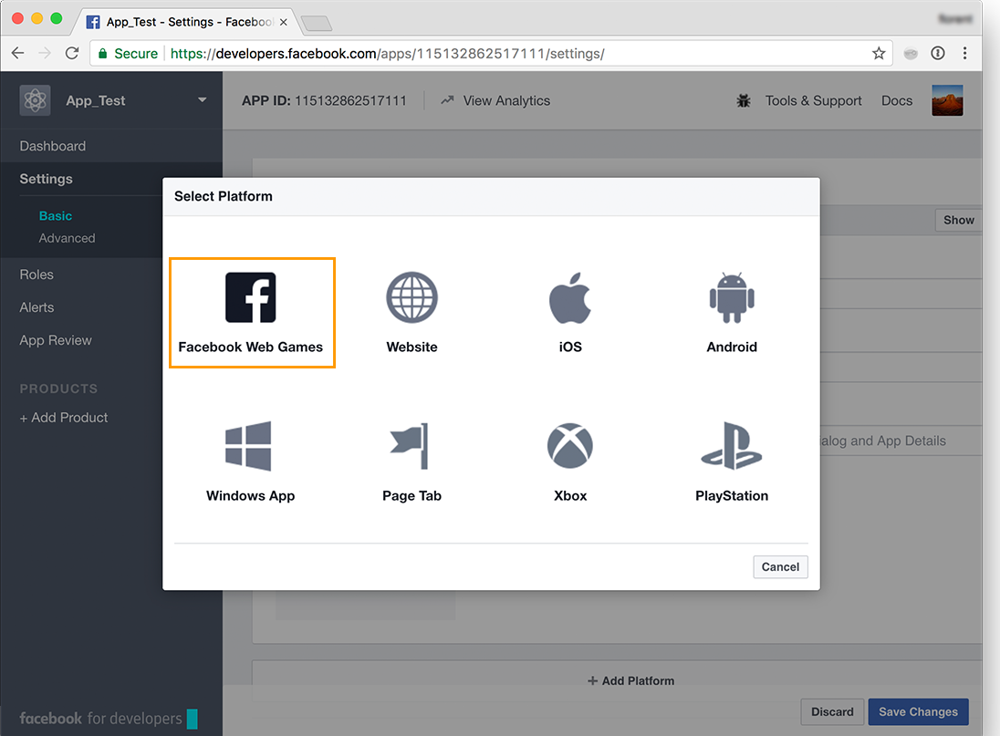
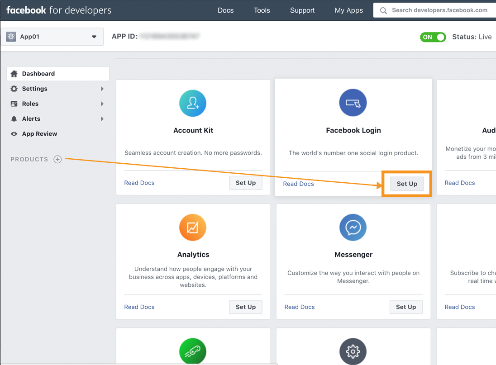
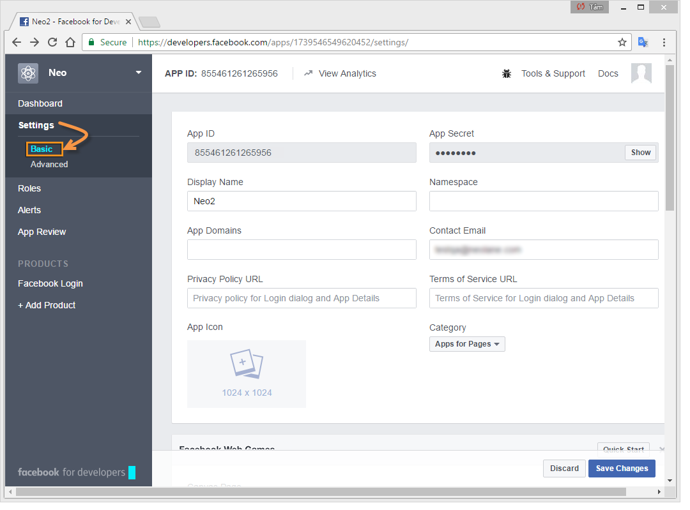

# Publicera på Facebook-väggar{#publishing-on-facebook-walls}

För att Adobe Campaign ska kunna skicka publikationer till Facebook-väggar måste ni delegera skrivåtkomsten för dessa sidor till Adobe Campaign. Detta inbegriper följande konfigurationssteg:

1. Skapa ett Facebook-konto med en eller flera sidor.
1. Skapa en Facebook-testsida för att skicka korrektur.
1. Skapa ett Facebook-program.
1. Ange Facebook-programinställningarna i Adobe Campaign, i det **[!UICONTROL Facebook routing]** externa kontot.

## Förutsättningar {#prerequisites}

Börja med att skapa ett Facebook-konto och flera sidor: dessa kommer att användas för att skicka publikationer.

* Om du vill skapa ett Facebook-konto använder du länken [https://www.facebook.com](https://www.facebook.com) .
* Om du vill skapa en Facebook-sida använder du länken [https://www.facebook.com/pages/create.php](https://www.facebook.com/pages/create.php) .

   Vi rekommenderar att du använder samma Facebook-konto för att administrera alla dina sidor. På så sätt behöver du bara ett Facebook-program och ett externt konto för att skriva på alla sidor i kontot.

   

## Skapa en testsida på Facebook {#creating-a-test-facebook-page}

Vi rekommenderar att du skapar en privat Facebook-sida för att skicka ut korrektur (mer information finns i [Skicka korrektur](../../social/using/publishing-on-facebook.md#sending-the-proof)).

1. Logga in på det Facebook-konto som du använder för att administrera dina sidor.
1. Skapa en ny Facebook-sida.
1. Klicka på **[!UICONTROL Settings]** knappen i det övre högra hörnet.
1. Ändra sidans synlighetsparametrar på **[!UICONTROL General]** fliken: markera **[!UICONTROL Page unpublished]** rutan.
1. Klicka på **[!UICONTROL Save Changes]** knappen.

## Skapa ett Facebook-program {#creating-a-facebook-application}

För att Adobe Campaign ska kunna publicera på era sidor måste ni skapa ett Facebook-program. Gör så här:

1. Logga in på det Facebook-konto som du använder för att administrera sidor.
1. Ange följande adress i webbläsaren: [https://developers.facebook.com/apps](https://developers.facebook.com/apps).

   >[!IMPORTANT]
   >
   >Beroende på vilken typ av konto du har kan en eller flera auktoriseringar vara nödvändiga.
   >
   >Om du vill skapa ett Facebook-program måste du ha ett **verifierat** Facebook-konto.

1. Klicka på **[!UICONTROL Add a New App]** knappen i det övre högra hörnet på sidan. Ange ett appnamn och en e-postadress till kontakten och skicka sedan säkerhetskontrollen.

   

1. Klicka på **[!UICONTROL Settings > Basic]** och välj **[!UICONTROL Add a platform]** typ under **[!UICONTROL Facebook Web Games]** .

   

1. Kontrollera att du ser produkten i den vänstra menyn i **[!UICONTROL Products]** avsnittet **[!UICONTROL Facebook Login]** . Om inte lägger du till en ny produkt och väljer **[!UICONTROL Facebook Login]**.

   

1. När programmet har skapats markerar du fliken och publicerar programmet **[!UICONTROL App Review]** .

   

## Delegera skrivåtkomst till Adobe Campaign {#delegating-write-access-to-adobe-campaign}

Om du vill delegera skrivåtkomst till Adobe Campaign för publicering på sidorna måste du ange parametrarna för det Facebook-program som skapats tidigare.

Det här steget kräver åtkomst till både Adobe Campaign-konsolen och en webbläsare som är inloggad på det Facebook-konto som du använder för sidadministration:

>[!IMPORTANT]
>
>Adobe Campaign-operatorn måste ha administrationsbehörighet för att kunna utföra den här konfigurationen.

* **Facebook**: markera det tidigare skapade programmet ( [https://developers.facebook.com/apps](https://developers.facebook.com/apps)) och välj **[!UICONTROL Settings > Basic]** .

   

   >[!NOTE]
   >
   >Om **[!UICONTROL Facebook Web Games]** avsnittet inte visas klickar du på **[!UICONTROL Add Platform]** knappen längst ned på sidan och väljer **[!UICONTROL Facebook Web Games]**.

* **Adobe Campaign**: gå till **[!UICONTROL Administration > Platform > External Accounts]** noden i trädet, markera det **[!UICONTROL Facebook routing]** externa kontot och klicka på **[!UICONTROL Connector]** fliken.

   

1. Kopiera adressen i fältet i Adobe Campaign-konsolen och klistra in den i **[!UICONTROL Secure Canvas URL]** fältet på Facebook (i **[!UICONTROL Secure Web Games URL (https)]** **[!UICONTROL Facebook Web Games]** avsnittet).

   

   >[!IMPORTANT]
   >
   >Du får inte använda den osäkra URL:en under några omständigheter.

   Kopiera och klistra in den här URL-adressen även under **[!UICONTROL Products]** > **[!UICONTROL Facebook Login]** > **[!UICONTROL Settings]** > **[!UICONTROL Valid OAuth Redirect URIs]**. Om du vill kontrollera URL-adressens giltighet sparar du programmet, kopierar och klistrar in URL-adressen i **[!UICONTROL Redirect URI to Check]** fältet och klickar på **[!UICONTROL Check URI]**.

   

1. På Facebook kopierar du innehållet i **[!UICONTROL App ID]** och **[!UICONTROL App Secret]** fälten och klistrar in det i konsolens matchande fält.

   

1. På Facebook klickar du på **[!UICONTROL Save Changes]** knappen längst ned på sidan.
1. Gå till Adobe Campaign-konsolen och spara det externa kontot.

   >[!NOTE]
   >
   >Fältet är **[!UICONTROL Marketing URL]** valfritt.

1. Klicka på **[!UICONTROL Request the authorization from the application]** länken längst ned på **[!UICONTROL Connector]** fliken i Adobe Campaign-konsolen. Arbetsflödet **[!UICONTROL Synchronize Facebook pages]** aktiveras automatiskt och alla Facebook-sidor som hanteras av administratören samlas in. Mer information finns i [Synkronisera Facebook-sidor](#synchronizing-facebook-pages).

   

   >[!NOTE]
   >
   >Som standard läggs sidorna till i **[!UICONTROL Facebook]** tjänstmappen, som är tillgänglig via **[!UICONTROL Profiles and Targets > Services and Subscriptions]** noden. I **[!UICONTROL Folder]** fältet på **[!UICONTROL Connector]** fliken kan du ändra den tjänstmapp som Facebook-sidorna skapas i efter synkronisering. Du kan också välja de Facebook-sidor du vill synkronisera i Adobe Campaign tack vare **[!UICONTROL Filter]** fältet. Om du lämnar det här fältet tomt synkroniseras alla Facebook-sidor som hanteras av administratören.

1. En dialogruta med de olika behörighetsinställningarna för Facebook visas. Dessa gör att Adobe Campaign kan skicka publikationer till Facebook-kontosidorna.

   Godkänn de olika behörighetsförfrågningarna.

   

1. Adobe Campaign har fått rätt att publicera på väggarna på Facebook-kontots sidor.

   

>[!NOTE]
>
>Om Facebook-kontot administrerar flera sidor konfigurerar du bara ett externt konto så att du kan skriva på valfri sida i Facebook-kontot. För varje nytt Facebook-konto måste du skapa ett nytt externt **[!UICONTROL Routing]** typkonto.

Arbetsflödet synkroniserar alla sidor som administreras av Facebook-kontot så att du kan publicera dem direkt via Adobe Campaign. **[!UICONTROL Synchronization of Facebook pages]** Mer information finns i [Synkronisera Facebook-sidor](#synchronizing-facebook-pages).

## Synkronisera Facebook-sidor {#synchronizing-facebook-pages}

Med **[!UICONTROL Synchronization of Facebook pages]** arbetsflödet, som nås via **[!UICONTROL Administration > Production > Technical workflows > Managing social networks]** noden, kan du synkronisera (i Adobe Campaign) sidorna i det Facebook-konto som konfigurerats tidigare. Som standard är det här arbetsflödet konfigurerat att köras en gång om dagen eller när en administratör klickar på **[!UICONTROL Request an authorization from the application]** länken i tjänstkonfigurationsfönstret (se [Delegera skrivåtkomst till Adobe Campaign](#delegating-write-access-to-adobe-campaign)).

När synkroniseringen är klar visas de insamlade sidorna i den tjänstmapp som anges i det externa kontot (se [Delegera skrivåtkomst till Adobe Campaign](#delegating-write-access-to-adobe-campaign)). Som standard läggs sidor till i roten för den **[!UICONTROL Facebook]** tjänstmapp som är tillgänglig via **[!UICONTROL Profiles and Targets > Services and subscriptions]** menyn.

Du kan nu publicera på Facebook-sidornas väggar direkt via Adobe Campaign. Mer information finns i [Publicera på Facebook](#publishing-on-facebook-walls).
