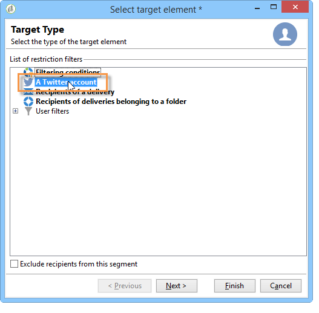
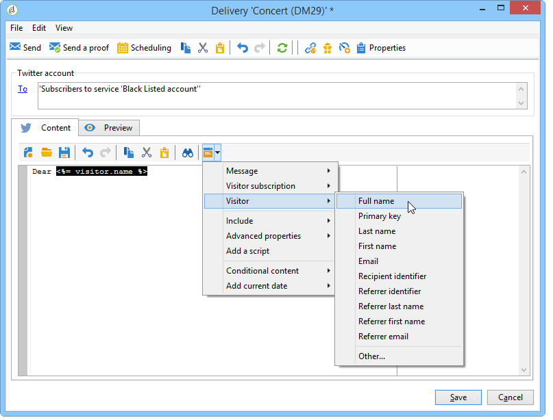

# Publicera på Twitter{#publishing-on-twitter}

## Publicera på dina Twitter-konton {#publishing-on-your-twitter-accounts}

När konfigurationen är klar kan du skicka tweets till dina Twitter-konton via Social Marketing.

### Begränsningar {#limitations}

Följande begränsningar är begränsningar som är inbyggda i Twitter.

* Meddelandet får inte vara längre än 140 tecken.
* Formatet HTML stöds inte.

### Skapa leveransen {#creating-the-delivery}

Skapa en ny leverans baserad på **[!UICONTROL Tweet (twitter)]** leveransmall.

### Välja huvudmål {#selecting-the-main-target}

Markera det eller de konton som du vill skicka tweets till.

1. Klicka på länken **[!UICONTROL To]**.

   

1. Klicka på knappen **[!UICONTROL Add]**.

   

1. Välj **[!UICONTROL A Twitter account]**.

   

1. I **[!UICONTROL Folder]** markerar du den tjänstmapp som innehåller Twitter-kontot. Välj sedan det Twitter-konto som du vill skicka tweeten till.

   

### Välja provtryckets mål {#selecting-the-target-of-the-proof}

The **[!UICONTROL Target of the proofs]** kan du definiera det Twitter-konto som ska användas för testleveranser före den slutliga leveransen. Därför rekommenderar vi att du skapar ett privat Twitter-konto som är dedikerat till att skicka korrektur. Mer information om hur du skapar ett privat Twitter-konto finns i [Skapa ett testkonto på Twitter](../../social/using/configuring-publishing-on-twitter.md#creating-a-test-account-on-twitter). Stegen för val av korrekturmål är desamma som för val av huvudmål. Se [Skapa ett testkonto på Twitter](../../social/using/configuring-publishing-on-twitter.md#creating-a-test-account-on-twitter).

>[!NOTE]
>
>Om du använder samma Twitter-testkonto för alla leveranser kan du spara korrekturmålet i **[!UICONTROL Tweet]** leveransmall, via **[!UICONTROL Resources > Templates > Delivery templates]** nod. Korrekturmålet anges sedan som standard för varje ny leverans.

### Definiera meddelandeinnehållet {#defining-the-message-content}

Skriv in innehållet i tweeten i **[!UICONTROL Content]** -fliken.

### Visa förhandsgranskningen {#viewing-the-preview}

The **[!UICONTROL Preview]** kan du visa en återgivning av tweeten.

1. Klicka på **[!UICONTROL Preview]** -fliken.
1. Klicka på **[!UICONTROL Test personalization]** nedrullningsbar meny och välj **[!UICONTROL Service]**.
1. I **[!UICONTROL Folder]** markerar du den tjänstmapp som innehåller ditt Twitter-konto.
1. Välj det Twitter-konto som du vill testa förhandsgranskningen med.

>[!NOTE]
>
>Förhandsvisningen kan skilja sig något från den slutliga tweeten. Vi rekommenderar starkt att du skickar ett korrektur före slutleverans för att få en exakt återgivning av tweeten. Se [Skicka korrekturet](#sending-the-proof).

### Konfigurerar spårning {#configuring-tracking}

Spårning kan visas i leveransrapporterna och i **[!UICONTROL Edit > Tracking]** fliken för leveransen och tjänsten.

Spårningskonfigurationen är densamma som för en e-postleverans. Mer information om detta finns i [det här avsnittet](../../delivery/using/about-delivery-monitoring.md).

>[!NOTE]
>
>I **[!UICONTROL Tweet]** leveransmall, spårning är aktiverat som standard.

>[!IMPORTANT]
>
>Vi kan inte skilja på robotar som analyserar tweets och användare som faktiskt klickar.

### Skicka korrekturet {#sending-the-proof}

Vi rekommenderar starkt att du skickar ett bevis på din publikation före slutleveransen för att få en exakt återgivning av publikationen på en privat testsida från Twitter. Mer information om hur du skapar ett privat Twitter-konto finns i [Skapa ett testkonto på Twitter](../../social/using/configuring-publishing-on-twitter.md#creating-a-test-account-on-twitter). Stegen för val av korrekturmål finns i [Välja provtryckets mål](#selecting-the-target-of-the-proof).

Korrekturleveranser är identiska med e-postleveranser. Se [det här avsnittet](../../delivery/using/steps-validating-the-delivery.md#sending-a-proof).

### Skicka meddelandet {#sending-the-message}

1. När innehållet är godkänt klickar du på **[!UICONTROL Send]** -knappen.
1. Välj **[!UICONTROL Deliver as soon as possible]** och klicka på **[!UICONTROL Analyze]** -knappen.

   >[!NOTE]
   >
   >The **[!UICONTROL Postpone the delivery]** kan du skjuta upp leveransen till ett senare datum.

   

1. Kontrollera resultatet när analysen är klar.
1. Klicka **[!UICONTROL Confirm delivery]** och sedan klicka **[!UICONTROL Yes]**.

## Skicka direktmeddelanden till prenumeranter {#sending-direct-messages-to-subscribers}

### Verksamhetsprincip {#operating-principle}

The **[!UICONTROL Synchronize Twitter accounts]** arbetsflöde (se [Synkroniserar Twitter-konton](../../social/using/configuring-publishing-on-twitter.md#synchronizing-twitter-accounts)) återställer listan över Twitter-prenumeranter så att du kan skicka direktmeddelanden till dem. De återskapade följarna lagras i en specifik tabell: besökstabellen. Om du vill visa en lista över Twitter följare går du till **[!UICONTROL Profiles and Targets > Visitors]** nod.

>[!IMPORTANT]
>
>För att arbetsflödet ska kunna återskapa listan med Twitter följare måste du **[!UICONTROL Synchronize Twitter accounts]** måste vara markerad i fönstret Redigera för den tjänst som är länkad till kontot. Mer information finns i: [Delegera skrivåtkomst till Adobe Campaign](../../social/using/configuring-publishing-on-twitter.md#delegating-write-access-to-adobe-campaign).

För varje följare återställer Adobe Campaign följande information:

* **[!UICONTROL Origin]**: det sociala nätverkets namn (**Twitter** i detta fall)
* **[!UICONTROL External ID]**: användar-ID
* **[!UICONTROL User name]**: användarens kontonamn
* **[!UICONTROL Full name]**: användarens namn
* **[!UICONTROL Language]**: användarspråk
* **[!UICONTROL Number of friends]**: antal följare
* **[!UICONTROL Time zone]**: användartidszon
* **[!UICONTROL Verified]**: det här fältet anger om användaren har ett verifierat Twitter-konto

### Begränsningar {#limitations-1}

Följande begränsningar är begränsningar som är inbyggda i Twitter.

* Meddelandet får inte vara längre än 140 tecken.
* HTML stöds inte.
* Du kan inte skicka mer än 250 direktmeddelanden per dag. För att undvika att överskrida detta tröskelvärde kan du leverera i flera vågor. Leveranser i påfyllnader konfigureras som e-postleveranser. Mer information om detta finns i [det här avsnittet](../../delivery/using/steps-sending-the-delivery.md#sending-using-multiple-waves).

### Skapa leveransen {#creating-the-delivery-}

Skapa en ny leverans baserad på **[!UICONTROL Tweet (Direct Message)]** leveransmall.

### Välja huvudmål {#selecting-the-main-target-1}

Välj de följare som du vill skicka ditt direktmeddelande till.

1. Klicka på länken **[!UICONTROL To]**.

   

1. Klicka på knappen **[!UICONTROL Add]**.

   

1. Välj en typ av mål.

   

   * Välj **[!UICONTROL Twitter subscribers]** för att skicka ett direktmeddelande till alla kontoföljare.

      >[!IMPORTANT]
      >
      >Du kan inte skicka mer än 250 meddelanden per dag. Om ditt Twitter-konto har fler än 250 följare rekommenderar vi att du levererar i vågor. Detta innebär samma process som för e-postleveranser. Se [det här avsnittet](../../delivery/using/steps-sending-the-delivery.md#sending-using-multiple-waves).

   * Välj **[!UICONTROL Filter conditions]** för att definiera en fråga och visa resultatet. Det här alternativet är detsamma som för e-postleveranser. Se [det här avsnittet](../../platform/using/defining-filter-conditions.md) för mer information.

      

### Välja provtryckets mål {#selecting-the-target-of-the-proof-1}

The **[!UICONTROL Target of the proofs]** kan du välja den följare som ska få korrekturet av ditt direktmeddelande. Markeringsprocessen är densamma som för huvudmålet. Se [Välja huvudmål](#selecting-the-main-target).

>[!NOTE]
>
>Om du vill skicka alla dina korrektur för direktmeddelanden till samma Twitter-följare kan du spara korrekturmålet i dialogrutan **[!UICONTROL Tweet (Direct Message)]** leveransmall, via **[!UICONTROL Resources > Templates > Delivery templates]** nod. Korrekturmålet anges sedan som standard för varje ny leverans.

### Definiera meddelandeinnehåll {#defining-message-content-}

Ange tweetens innehåll i dialogrutan **[!UICONTROL Content]** -fliken.

Anpassningsfält kan användas på samma sätt som för e-postleveranser, t.ex. för att lägga till följarens namn i meddelandets brödtext. Innehållspersonalisering beskrivs närmare i [det här avsnittet](../../delivery/using/about-personalization.md).

Följande steg är samma som när du skickar en tweet till ett Twitter-konto. Se [Publicera på dina Twitter-konton](#publishing-on-your-twitter-accounts).
