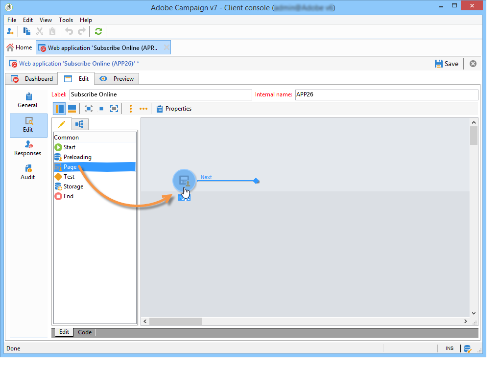

# Viktiga steg för att skapa en undersökning{#getting-started-with-surveys}

Här följer en kort översikt över de viktigaste stegen för att skapa en enkel enkät med hjälp av följande inbyggda mall:

De här stegen är:

1. [Steg 1 - Skapa en undersökning](#step-1---creating-a-survey),
1. [Steg 2 - Välj en mall](#step-2---selecting-the-template),
1. [Steg 3 - Skapa enkäten](#step-3---building-the-survey),
1. [Steg 4 - Skapa sidinnehållet](#step-4---creating-the-page-content),
1. [Steg 5 - Lagra undersökningsdata](#step-5---storing-the-survey-data-),
1. [Steg 6 - Publicera sidorna](#step-6---publishing-the-pages),
1. [Steg 7 - Dela din nätundersökning](#step-7---sharing-your-online-survey).

## Steg 1 - Skapa en undersökning {#step-1---creating-a-survey}

Om du vill skapa en ny undersökning går du till **[!UICONTROL Campaigns]** eller **[!UICONTROL Profiles and targets]** och klicka på **[!UICONTROL Web Applications]** -menyn. Klicka på **[!UICONTROL Create]** ovanför listan med formulär.

## Steg 2 - Välj en mall {#step-2---selecting-the-template}

Välj en undersökningsmall och ge sedan undersökningen ett namn. Det här namnet visas inte för slutanvändarna, men det gör att undersökningen kan identifieras i Adobe Campaign. Klicka **[!UICONTROL Save]** för att lägga till undersökningen i listan över webbprogram.

## Steg 3 - Skapa enkäten {#step-3---building-the-survey}

Undersökningar byggs i ett diagram där följande element är placerade: sidan/sidorna där innehållet ska skapas, stegen för att ladda in och spara data samt testfaserna. Skript och frågor kan också infogas.

Klicka på knappen **[!UICONTROL Edit]** Typ av undersökning.

En undersökning måste innehålla **minst** följande tre komponenter: en sida, en lagringsruta och en slutsida.

* Om du vill skapa en sida väljer du **[!UICONTROL Page]** -objektet i den vänstra delen av redigeraren och placera det i den mellersta delen, som visas nedan:

   

* Välj sedan **[!UICONTROL Storage]** och montera det på sidans utdataövergång.
* Slutligen väljer du **[!UICONTROL End]** och placera den i slutet av lagringsrutans utdataövergång för att få följande diagram:

   

## Steg 4 - Skapa sidinnehållet {#step-4---creating-the-page-content}

I följande exempel använder vi en **[!UICONTROL Page (v5 compatibility)]** textsida. Den här typen av sida öppnas via den avancerade menyn i **[!UICONTROL Edit]** -fliken.

* **Lägg till inmatningsfält**

   Om du vill skapa sidans innehåll måste du redigera det: om du vill göra det dubbelklickar du på **[!UICONTROL Page]** -objekt. Klicka på den första ikonen i verktygsfältet för att öppna guiden för att skapa fält. Om du vill skapa ett inmatningsfält för användarnamnet som ska lagras i det matchande fältet i mottagarens profil, väljer du **[!UICONTROL Edit a recipient]**.

   

   Klicka på **[!UICONTROL Next]** för att markera fältet för datalagring i databasen. I det här fallet fältet &#39;Efternamn&#39;.

   

   Klicka **[!UICONTROL Finish]** för att bekräfta att fält har skapats.

   När informationen lagras i ett fält som redan finns i databasen får fältet som standard det markerade fältets namn, dvs. &#39;Efternamn&#39; i det här exemplet. Du kan ändra den här etiketten enligt nedan:

   

   Skapa nu ett inmatningsfält för användarkontonumret. Upprepa åtgärden och välj Kontonr fält.

   Använd samma procedur för att lägga till ett fält där användaren kan ange en e-postadress.

* **Skapa en fråga**

   Om du vill skapa en fråga högerklickar du på det sista elementet i trädet och väljer **[!UICONTROL Containers > Question]** eller klicka på **[!UICONTROL Containers]** ikon och markera **[!UICONTROL Question]**.

   

   Ange etiketten för frågan och infoga svarsfälten som en underavdelning till frågan. För att göra detta måste den nod som är länkad till frågan vara markerad när du skapar svarsfältet. Lägg till en **[!UICONTROL drop-down listx]** med **[!UICONTROL Selection controls]** eller genom att högerklicka, som visas nedan:

   

   Välj ett lagringsutrymme: välj ett uppräkningsfält för att hämta värdena automatiskt (i det här fallet e-postformatet).

   

   I **[!UICONTROL General]** klickar du på **[!UICONTROL Initialize the list of values from the database]** länk: värdetabellen anges automatiskt.

   

   Klicka **[!UICONTROL OK]** för att stänga redigeraren, och **[!UICONTROL Save]** för att spara ändringar.

   >[!NOTE]
   >
   >För varje fält eller fråga kan du anpassa sidlayouten efter dina behov, tack vare alternativen i **[!UICONTROL Advanced]** -fliken. Layouten för undersökningsskärmar beskrivs i [det här avsnittet](../../web/using/about-web-forms.md).

   Klicka på knappen **[!UICONTROL Preview]** för att visa återgivningen av den undersökning du just har skapat.

   

## Steg 5 - Lagra undersökningsdata {#step-5---storing-the-survey-data-}

I lagringsrutan kan du spara användarsvaren i databasen. Du måste välja en avstämningsnyckel för att identifiera de profiler som redan finns i databasen.

Om du vill göra det redigerar du rutan och väljer det fält som ska användas som avstämningsnyckel när data lagras.

I exemplet nedan uppdateras profilen när du sparar (bekräftar) och en profil sparas i databasen med samma kontonummer som den som anges i formuläret. Om profilen inte finns skapas den.

Klicka **[!UICONTROL OK]** för att bekräfta, klicka sedan på **[!UICONTROL Save]** för att spara enkäten

## Steg 6 - Publicera sidorna {#step-6---publishing-the-pages}

För att användare ska kunna komma åt HTML-sidorna måste programmet vara tillgängligt. Den får inte längre vara i redigeringsskedet utan i produktionen. Om du vill publicera en undersökning måste du publicera den. Så här gör du:

* Klicka på **[!UICONTROL Publish]** som finns ovanför kontrollpanelen för undersökningen.
* Klicka **[!UICONTROL Start]** för att starta publikationen och stänga guiden.

   

   Status för undersökningen ändras till: **Online**.

   

## Steg 7 - Dela din nätundersökning {#step-7---sharing-your-online-survey}

När enkäten är i produktion är den tillgänglig på servern och du kan leverera den. URL:en för att komma åt undersökningen visas på kontrollpanelen.

Om du vill leverera enkäten kan du skicka ett meddelande som innehåller en åtkomstlänk till målpopulationen eller placera URL:en för enkäten på en webbsida, till exempel.

Du kan sedan övervaka användarsvar via rapporter och loggar. Se [Svarsspårning](../../surveys/using/publish--track-and-use-collected-data.md#response-tracking).

>[!CAUTION]
>
>Den offentliga URL:en innehåller undersökningens interna namn. När det interna namnet ändras uppdateras URL-adressen automatiskt: Alla länkar till undersökningen måste också uppdateras.
>
>Om leveranser som innehåller länken till formuläret redan har skickats, kommer länken inte längre att fungera.
