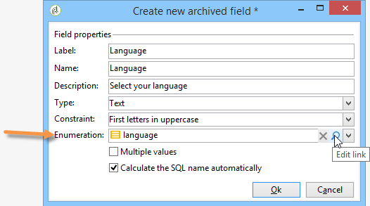
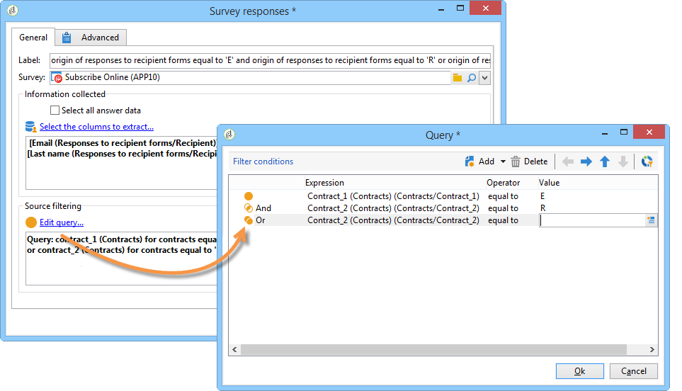

# Hantera svar{#managing-answers}


## Lagra insamlade svar {#storing-collected-answers}

Förutom de vanliga lagringslägena som är gemensamma för alla webbformulär i Adobe Campaign (databasfält och lokal variabel), möjliggör enkäter den dynamiska utökningen av datamodellen med arkiverade fält.

>[!CAUTION]
>
>Det här alternativet är tillgängligt för **Undersökning** endast webbprogram. Det finns inte för andra typer av webbformulär.

### Lagra i ett arkiverat fält {#storing-in-an-archived-field}

Det är enkelt att utöka datamallen genom att lägga till nya lagringsutrymmen för att spara svaren från undersökningar. Om du vill göra det väljer du **[!UICONTROL Store answers to a question]** när du skapar inmatningsfältet. Klicka på **[!UICONTROL New field...]** och ange dess egenskaper:


Ange fältets etikett och namn och välj fälttyp: Text, booleskt, heltal eller decimaltal, datum osv.

Den valda fälttypen innefattar en kontroll av data när användarna anger svar. För **text** kan du lägga till en begränsning (skiftläge, format) eller länka till en befintlig uppräkning för att framtvinga markering.

Om du vill lägga till en begränsning markerar du den i listrutan. Det finns två typer av begränsningar:

1. Skiftläge för tecken

   Den angivna informationen kan lagras i fältet i följande format: enbart versaler, endast gemener, eller med inledande versaler. Den här begränsningen kräver inte att användaren anger data i det valda formatet, men innehållet som anges i fältet konverteras när det sparas.

1. Dataformat

Om det här fältet används i en lista kan uppräkningsvärdena hämtas automatiskt i värdetabellen med hjälp av **[!UICONTROL Initialize the list of values from the database]** ovanför listan med värden.

Du kan till exempel skapa en nedrullningsbar lista där användaren kan välja sitt modersmål. Motsvarande arkiverade fält kan associeras med **språk** uppräkning som innehåller en lista med språk:



The **[!UICONTROL Edit link]** -ikonen till höger om fältet gör att du kan redigera innehållet i uppräkningen:


I **[!UICONTROL General]** -fliken i fältet, **[!UICONTROL Initialize the list of values from the database]** -länken kan du automatiskt ange en lista över de etiketter som finns.


**Exempel**: lagra en mottagares kontrakt i ett fält

Om du vill lagra olika typer av kontrakt i ett fält skapar du en **[!UICONTROL Text]** inmatningsfält och välj **[!UICONTROL Store answers to a question]** alternativ.

Klicka på **[!UICONTROL New field...]** och ange fältegenskaperna. Välj **[!UICONTROL Multiple values]** om du vill aktivera flera värden som ska lagras.


Skapa inmatningsfält för de andra kontrakten och lagra data i samma arkiverade fält.


När användarna godkänner enkäten lagras deras svar i **[!UICONTROL Contracts]** fält.

I vårt exempel finns följande svar:


Svarandens profil innehåller de fyra angivna kontrakten.

De kan visas på **[!UICONTROL Answers]** -fliken i undersökningen genom att visa de relevanta kolumnerna.


Du kan även filtrera mottagare baserat på svar så att endast de användare som intresserar dig visas. Det gör du genom att skapa ett målarbetsflöde och använda **[!UICONTROL Survey responses]** box.


Skapa din fråga baserat på de profiler som du vill återställa. I följande exempel kan du med frågan välja profiler med minst två kontrakt, inklusive ett A-typkontrakt.



För varje formulär kan svaren användas i fält eller etiketter. Använd följande syntax för innehåll som lagras i ett arkiverat fält:

```
<%= ctx.webAppLogRcpData.name of the archived field %
```

>[!NOTE]
>
>För andra typer av fält beskrivs syntaxen i [det här avsnittet](../../platform/using/about-queries-in-campaign.md).

### Lagringsinställningar {#storage-settings}

Du kan arkivera svaren på enkäter i XML-format. På så sätt kan du spara en rå kopia av de insamlade svaren, vilket kan vara användbart om data standardiseras för mycket i en specificerad lista. [Läs mer](../../surveys/using/publish--track-and-use-collected-data.md#standardizing-data)

>[!CAUTION]
>
>Arkivering av råa svar påverkar det lagringsutrymme som krävs. Använd det här alternativet med försiktighet.

Så här gör du:

* Redigera undersökningsegenskaperna via **[!UICONTROL Properties]** knappen **[!UICONTROL Edit]** -fliken.
* Klicka på **[!UICONTROL Advanced parameters]** och kontrollera **[!UICONTROL Save a copy of raw answers]** alternativ.


Du kan aktivera det som standard för alla undersökningar (det här alternativet används när undersökningen publiceras). Om du vill göra det skapar du **[!UICONTROL NmsWebApp_XmlBackup]** option och assign value **[!UICONTROL 1]** till den enligt nedan:


## Poänghantering {#score-management}

Du kan tilldela ett poängvärde till de alternativ som finns på formulärets sidor. Bakgrundsmusik kan bara länkas till stängda frågor: kryssruta, värde från en nedrullningsbar lista, prenumeration osv.


Poängen samlas och sparas på serversidan när sidan bekräftas, dvs. när användaren klickar på **[!UICONTROL Next]** eller **[!UICONTROL Finish]** -knappen.

>[!NOTE]
>
>Du kan använda positiva eller negativa värden, heltal eller icke-heltal.

Bakgrundsmusik kan användas i tester och skript.

>[!CAUTION]
>
>Det går inte att använda bakgrundsmusik i synlighetsvillkoren för fält som finns på samma sida. De kan dock användas på efterföljande sidor.

* Om du vill använda poäng i tester använder du **[!UICONTROL Score]** fält i testberäkningsformeln enligt nedan:

   

* Du kan använda poängen i ett skript.

**Exempel**: beräkna en poäng och använda den som villkor för att visa nästa sida:

* I en undersökning kan du på nästa sida tilldela användare olika poäng beroende på vilket värde som valts i listrutan:

   

* Du kan kombinera den här poängen med ett andra värde, beroende på vilket alternativ du har valt:

   

* När användaren klickar på **[!UICONTROL Next]** läggs de två värdena ihop.

   

* Villkoren kan användas för sidan som ska visas enligt poängen. Detta är konfigurerat enligt följande:

   

   
