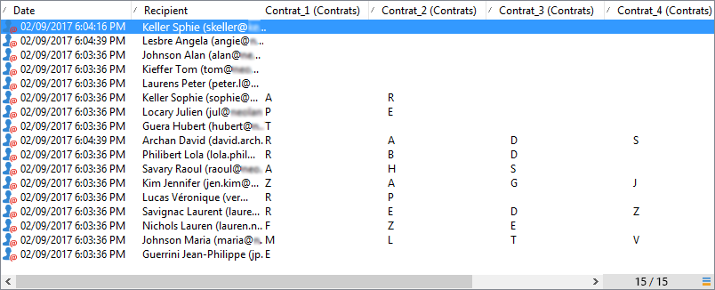

# Hantera svar{#managing-answers}


## Lagra insamlade svar {#storing-collected-answers}

Förutom de vanliga lagringslägena som är gemensamma för alla webbformulär i Adobe Campaign (databasfält och lokal variabel), möjliggör enkäter det dynamiska tillägget av datamodellen med arkiverade fält.

>[!CAUTION]
>
>Det här alternativet är endast tillgängligt för webbprogram av typen **Undersökning**. Det finns inte för andra typer av webbformulär.

### Lagra i ett arkiverat fält {#storing-in-an-archived-field}

Det är enkelt att utöka datamallen genom att lägga till nya lagringsutrymmen för att spara svaren från undersökningar. Det gör du genom att välja alternativet **[!UICONTROL Store answers to a question]** när du skapar indatafältet. Klicka på länken **[!UICONTROL New field...]** och ange dess egenskaper:


Ange fältets etikett och namn och välj fälttyp: Text, booleskt, heltal eller decimaltal, datum osv.

Den valda fälttypen innefattar en kontroll av data när användarna anger svar. För **text**-fält kan du lägga till en begränsning (case, format) eller länka till en befintlig uppräkning för att framtvinga markering.

Om du vill lägga till en begränsning markerar du den i listrutan. Det finns två typer av begränsningar:

1. Skiftläge för tecken

   Den angivna informationen kan lagras i fältet i följande format: enbart versaler, endast gemener, eller med inledande versaler. Den här begränsningen kräver inte att användaren anger data i det valda formatet, men innehållet som anges i fältet konverteras när det sparas.

1. Dataformat

Om det här fältet används i en lista kan uppräkningsvärdena hämtas automatiskt i värdetabellen med hjälp av länken **[!UICONTROL Initialize the list of values from the database]** ovanför värdelistan.

Du kan till exempel skapa en listruta där användaren kan välja sitt modersmål. Motsvarande arkiverade fält kan associeras med uppräkningen **language** som innehåller en lista över språk:


Med ikonen **[!UICONTROL Edit link]** till höger om fältet kan du redigera innehållet i uppräkningen:


På fliken **[!UICONTROL General]** i fältet kan du med länken **[!UICONTROL Initialize the list of values from the database]** automatiskt ange listan med etiketter som visas.


**Exempel**: lagra en mottagares kontrakt i ett fält

Om du vill lagra olika typer av kontrakt i ett fält skapar du ett **[!UICONTROL Text]**-indatafält och väljer alternativet **[!UICONTROL Store answers to a question]**.

Klicka på länken **[!UICONTROL New field...]** och ange fältegenskaperna. Välj alternativet **[!UICONTROL Multiple values]** om du vill aktivera flera värden som ska lagras.


Skapa inmatningsfält för de andra kontrakten och lagra data i samma arkiverade fält.


När användarna godkänner undersökningen lagras deras svar i fältet **[!UICONTROL Contracts]**.

I vårt exempel finns följande svar:


Svarandens profil innehåller de fyra angivna kontrakten.

De kan visas på fliken **[!UICONTROL Answers]** i undersökningen genom att visa de relevanta kolumnerna.



Du kan även filtrera mottagare baserat på svar så att endast de användare som intresserar dig visas. Det gör du genom att skapa ett målarbetsflöde och använda rutan **[!UICONTROL Survey responses]**.


Skapa din fråga baserat på de profiler som du vill återställa. I följande exempel kan du med frågan välja profiler med minst två kontrakt, inklusive ett A-typkontrakt.


För varje formulär kan svaren användas i fält eller etiketter. Använd följande syntax för innehåll som lagras i ett arkiverat fält:

```
<%= ctx.webAppLogRcpData.name of the archived field %
```

>[!NOTE]
>
>För andra typer av fält beskrivs syntaxen i [det här avsnittet](../../platform/using/about-queries-in-campaign.md).

### Lagringsinställningar {#storage-settings}

Du kan arkivera svaren på enkäter i XML-format. På så sätt kan du spara en rå kopia av de insamlade svaren, vilket kan vara användbart om data standardiseras för mycket i en specificerad lista. [Läs mer](../../surveys/using/publish--track-and-use-collected-data.md#standardizing-data)

>[!CAUTION]
>
>Arkivering av råa svar påverkar det lagringsutrymme som krävs. Använd det här alternativet med försiktighet.

Så här gör du:

* Redigera undersökningsegenskaperna via knappen **[!UICONTROL Properties]** på fliken **[!UICONTROL Edit]**.
* Klicka på länken **[!UICONTROL Advanced parameters]** och markera alternativet **[!UICONTROL Save a copy of raw answers]**.


Du kan aktivera det som standard för alla undersökningar (det här alternativet används när undersökningen publiceras). Det gör du genom att skapa alternativet **[!UICONTROL NmsWebApp_XmlBackup]** och tilldela det värdet **[!UICONTROL 1]** enligt nedan:


## Poänghantering {#score-management}

Du kan tilldela ett poängvärde till de alternativ som finns på formulärets sidor. Bakgrundsmusik kan bara länkas till stängda frågor: kryssruta, värde från en nedrullningsbar lista, prenumeration osv.


Poängen samlas och sparas på serversidan när sidan bekräftas, dvs. när användaren klickar på knappen **[!UICONTROL Next]** eller **[!UICONTROL Finish]**.

>[!NOTE]
>
>Du kan använda positiva eller negativa värden, heltal eller icke-heltal.

Bakgrundsmusik kan användas i tester och skript.

>[!CAUTION]
>
>Det går inte att använda bakgrundsmusik i synlighetsvillkoren för fält som finns på samma sida. De kan dock användas på efterföljande sidor.

* Använd fältet **[!UICONTROL Score]** i testberäkningsformeln om du vill använda resultat i tester, vilket visas nedan:

   

* Du kan använda poängen i ett skript.

**Exempel**: beräkna en poäng och använda den som villkor för att visa nästa sida:

* I en undersökning kan du på nästa sida tilldela användare olika poäng beroende på vilket värde som valts i listrutan:

   

* Du kan kombinera den här poängen med ett andra värde, beroende på vilket alternativ du har valt:

   

* När användaren klickar på knappen **[!UICONTROL Next]** läggs de två värdena till.

   

* Villkoren kan användas för sidan som ska visas enligt poängen. Detta är konfigurerat enligt följande:

   

   
