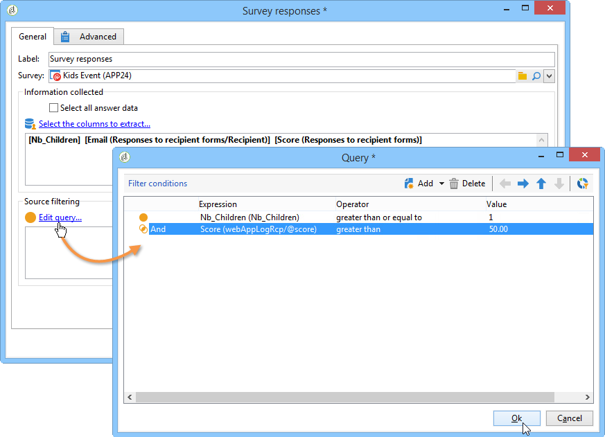

# Publicera, spåra och använd insamlade data{#publish-track-and-use-collected-data}


När formuläret har skapats, konfigurerats och publicerats kan du dela länken med målgruppen och spåra svaren.

>[!NOTE]
>
>Livscykeln för en enkät i Adobe Campaign och dess publicerings- och leveranssätt liknar den för webbformulär: dessa beskrivs i [det här avsnittet](../../web/using/about-web-forms.md).

## Kontrollpanel för undersökning {#survey-dashboard}

Varje undersökning har en egen kontrollpanel där du kan visa status, beskrivning, offentlig URL och tillgänglighetsschema. Här kan du även visa tillgängliga rapporter. [Läs mer](#reports-on-surveys).

Undersökningens offentliga URL visas på kontrollpanelen:


## Svarsspårning {#response-tracking}

Du kan spåra svaren på undersökningen i loggar och rapporter.

### Undersökningsloggar {#survey-logs}

För varje enkät som levereras kan du följa svaren i **[!UICONTROL Logs]** -fliken. På den här fliken visas en lista med de användare som har slutfört undersökningen och deras ursprung:


Dubbelklicka på en rad för att visa enkätformuläret ifyllt av svaranden. Du kan bläddra igenom hela undersökningen och få tillgång till svaren i sin helhet. Dessa kan exporteras i en extern fil. Mer information finns i [Exportera svar](#exporting-answers).

Ursprunget anges i URL:en för undersökningen genom att följande tecken läggs till:

```
?origin=xxx
```

medan enkäten redigeras innehåller URL-adressen parametern **[!UICONTROL __uuid]**, vilket anger att den är i testfas och ännu inte är online. När du kommer åt undersökningen via den här URL:en beaktas inte de poster som skapas i spårningen (rapporter). Ursprunget tvingas till värdet **[!UICONTROL Adobe Campaign]**.

Mer information om URL-parametrar finns i [den här sidan](../../web/using/defining-web-forms-properties.md#form-url-parameters).

### Rapporter om undersökningar {#reports-on-surveys}

På fliken Kontrollpanel kan du få åtkomst till undersökningsrapporter. Klicka på ett rapportnamn för att visa det.


Undersökningsstrukturen visas i **[!UICONTROL Documentation]** rapport.

Två andra rapporter om webbundersökningar finns i **[!UICONTROL Reports]** fliken för enkäterna: **[!UICONTROL General]** och **[!UICONTROL Breakdown of responses]**.

* Allmänt

   Rapporten innehåller allmän information om undersökningen: hur antalet svar ändras över tid och fördelningen per ursprung och språk.

   Exempel på en allmän rapport:

   

* Uppdelning av svar

   Den här rapporten visar hur svaren för varje fråga är uppdelade. Uppdelningen är bara tillgänglig för svar som ges till fält som lagras i **[!UICONTROL Question]** typbehållare. Den är bara giltig för markeringskontroller (ingen uppdelning på textfält, till exempel).

   

## Exportera svar {#exporting-answers}

Svar på en undersökning kan exporteras i en extern fil som kan bearbetas senare. Det finns två sätt att göra detta:

1. Exporterar rapportdata

   Om du vill exportera rapportdata klickar du på **[!UICONTROL Export]** och välj exportformat.

   Mer information om hur du exporterar rapportdata finns i [det här avsnittet](../../reporting/using/about-reports-creation-in-campaign.md).

1. Exportera svar

   Om du vill exportera svaren klickar du på **[!UICONTROL Responses]** -fliken i enkäten och högerklicka. Välj **[!UICONTROL Export...]**.

   

   Ange sedan den information du vill exportera och lagringsfilen.

   Du kan konfigurera innehåll och format för utdatafilen i exportguiden.

   På så sätt kan du:

   * lägga till kolumner i utdatafilen och återskapa informationen om mottagaren (som lagras i databasen),
   * formatera exporterade data,
   * Välj kodningsformat för informationen i filen.

   Om undersökningen du vill exportera innehåller flera **[!UICONTROL Multi-line text]** eller **[!UICONTROL HTML text]** fält, måste exporteras i **[!UICONTROL XML]** format. Välj det här formatet i listrutan i dialogrutan **[!UICONTROL Output format]** fält, enligt nedan:

   

   Klicka **[!UICONTROL Start]** för att köra exporten.

   >[!NOTE]
   >
   >Dataexport och konfigurationsstadierna beskrivs i [det här avsnittet](../../platform/using/about-generic-imports-exports.md).

## Använda insamlade data {#using-the-collected-data}

Den information som samlas in via online-enkäter kan återvinnas inom ramen för ett målinriktat arbetsflöde. Om du vill göra det använder du **[!UICONTROL Survey responses]** box.

I följande exempel vill vi göra ett webberbjudande speciellt för de fem mottagarna med minst två barn och med högst poäng i en nätundersökning. Svaren på den här enkäten är:


I arbetsflödet för målinriktning **[!UICONTROL Survey responses]** kommer att konfigureras enligt följande:


Börja med att välja den berörda enkäten och sedan de data som ska extraheras i fönstrets centrala del. I det här fallet måste vi extrahera minst spalten eftersom den kommer att användas i delningsrutan för att återställa de fem högsta poängen.

Ange filtreringsvillkoren för svar genom att klicka på **[!UICONTROL Edit query...]** länk.



Starta arbetsflödet för målinriktning. Frågan återställer 8 mottagare.


Högerklicka på utdataövergången för samlingsrutan för att visa dem.


Placera sedan en delad ruta i arbetsflödet för att återställa de fem mottagare som har högst poäng.

Konfigurera delningsrutan genom att redigera den:

* Börja med att välja lämpligt schema i dialogrutan **[!UICONTROL General]** och sedan konfigurera delmängden:

   

* Gå till **[!UICONTROL Sub-sets]** och väljer **[!UICONTROL Limit the selected records]** och sedan klicka på **[!UICONTROL Edit...]** länk.

   

* Välj **[!UICONTROL Keep only the first records after sorting]** och markera sorteringskolumnen. Markera alternativet **[!UICONTROL Descending sort]**.

   

* Klicka på **[!UICONTROL Next]** och begränsa antalet poster till 5.

   

* Klicka **[!UICONTROL Finish]** starta sedan om arbetsflödet för att godkänna målanpassning.

## Standardisera data {#standardizing-data}

Det är möjligt att skapa standardiseringsprocesser i Adobe Campaign för data som samlas in med alias. På så sätt kan du standardisera de data som lagras i databasen: För att göra detta definierar du alias i de specificerade listorna som innehåller relevant information. [Läs mer](../../platform/using/managing-enumerations.md#about-enumerations)
