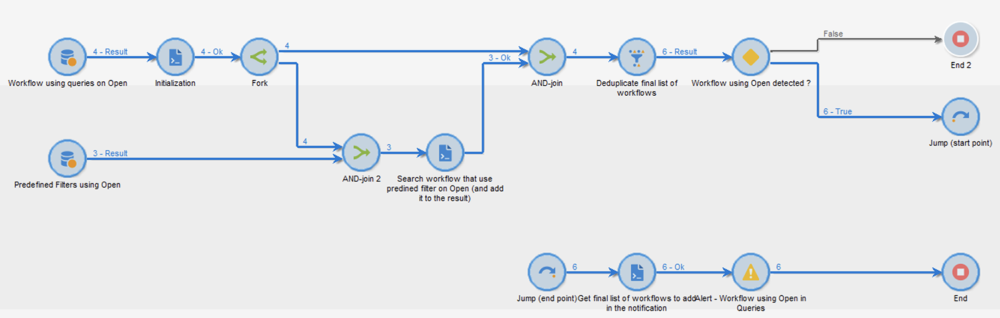

# Skydd av e-postsekretess i appen Apple Mail


## Vad har ändrats?

2021 introducerade Apple nya funktioner för integritetsskydd för sina egna Mail-appar. Den här appen innehåller nu funktionen Apple skydd av personuppgifter. Avsändare kan i princip inte längre använda spårningspixlar för att samla in information om mottagare som har valt att aktivera funktionen Apple skydd av personuppgifter.

## Hur påverkas mina kampanjer?

Adobe Campaign ger möjlighet att använda spårning av pixlar för att spåra e-postöppningar. Ni kan använda den här funktionen inte bara för målinriktning och kampanjer, utan även för mätvärden. Ni kan till exempel använda öppningsfrekvenser via e-post för att mäta kampanjens effektivitet och användarengagemanget. Kort och gott kan segmentering, målinriktning och mätvärden påverkas i era kampanjer.

## Vilka åtgärder ska jag vidta?

Apple nya funktion är den form av saker som kommer att komma in i branschen när det gäller skydd av e-postsekretess. Vi rekommenderar starkt att du följer Adobe rekommendationer.

### Utvärdera effekten på era kampanjutlösare

Utvärdera hur dessa ändringar påverkar era aktuella kampanjutlösare. Identifiera de arbetsflöden där e-postöppningar används som ett kriterium för segmentering, målinriktning eller återmarknadsföring. Läs [tips och råd](#find-email-open-tracking).

### Bevara dina data

Bevara era data och konsolidera era nuvarande kunskaper på olika enheter. Du kan basera nyckeltal för nyckeltal (KPI) på användaragenten. Du kan till exempel skapa nyckeltal runt profiler för personer som använder iOS och Apple Mail. Läs [tips och råd](#preserve-tracking-data).

### Arkivera spårningsloggarna efter kvarhållningsperioden

Arkivera spårningsloggarna även efter Adobe Campaign kvarhållningsperiod:

1. Kontrollera kvarhållningsperiodens längd i din kampanjinstans.
1. Kontrollera dina aktiva målmappningar. Avgör om du använder anpassade profiltabeller förutom den körklara profiltabellen (`nmsRecipient`).
1. Exportera spårningsloggar från Adobe Campaign. Inkludera loggarna som innehåller data om användaragenten och operativsystemet.

### Utvärdera den aktuella trenden för öppna frekvenser

Bestäm vilken andel av publiken som använder appen Apple Mail på en iOS-enhet.
Med hjälp av den här utvärderingen kan du identifiera potentiella avvikelser och orsaken till dem. Du kan avgöra om en lucka beror på problem med kampanjprestanda eller på Apple sekretesspolicy. Läs [tips och råd](#measure-ios-footprint).

### Gör en ny bedömning av er kampanjstrategi och resultatstatistik

Vi rekommenderar framför allt att ni aktivt omvärderar er kampanjstrategi och era kampanjresultatvärden. Du kan fokusera på mer tillförlitliga mätvärden, till exempel klickfrekvens, produktvisningar och inköp.

Vi rekommenderar att du utforskar tillgängliga data och utvärderar korrelationen mellan öppna frekvenser och andra mätvärden. Om dessa mätvärden är konsekvent korrelerade kan ni förbättra era triggers med gott förtroende.

## Tips och råd

### Mät det totala iOS-utrymmet {#measure-ios-footprint}

Om du vill samla in insikter från Adobe Campaign-data kan du använda färdiga rapporter:

* **[!UICONTROL Operating Systems]** rapport

  Använd den här rapporten om du vill identifiera antalet besökare per operativsystem och version. [Läs mer](../../reporting/using/global-reports.md#operating-systems).

  Du kan visa uppdelningen av besökare per operativsystem i relation till det totala antalet besökare.

  

  För varje operativsystem kan du visa uppdelningen av besökare per operativsystemversion.

  

* **[!UICONTROL Breakdown of opens]** rapport

  Använd den här rapporten om du vill identifiera hur stor andel e-post som öppnas per operativsystem. [Läs mer](../../reporting/using/global-reports.md#breakdown-of-opens).

  

### Bestämma hur e-postöppningsspårning används {#find-email-open-tracking}

Du kan identifiera de arbetsflöden där e-postöppningar används som ett kriterium för segmentering, målinriktning och återmarknadsföring.

Om du vill göra det kan du använda **[!UICONTROL type]** attribut för den spårade länkens URL (**[!UICONTROL url/@type]**). För att e-post öppnas är attributet inställt på **[!UICONTROL Open]**. Attributet är tillgängligt från frågeredigeraren, **[!UICONTROL Query]** i ett arbetsflöde och fördefinierade filter. Du kan använda det här attributet som riktkriterium för marknadsföringskampanjer.


I det här exemplet vill en marknadsförare skicka ett belöningserbjudande till de mottagare som har öppnat ett visst e-postmeddelande de senaste sju dagarna och gjort ett köp den senaste månaden. I arbetsflödesfrågor kan du använda e-postöppningar på olika sätt:

* Du kan använda e-postöppning som målvillkor i en fråga.

  Du kan ange, som filtreringsvillkor, att URL-typen för spårningsloggarna för en viss leverans måste anges till **[!UICONTROL Open]**.

  

* Du kan använda ett fördefinierat filter. [Läs mer](../../workflow/using/creating-a-filter.md).

  

  Du kan använda det här fördefinierade filtret i frågeaktiviteter i arbetsflöden.

  

  >[!NOTE]
  >
  >Från ett arbetsflöde kan du inte visa målvillkoren för ett fördefinierat filter.

Om du vill hämta en lista över arbetsflöden där e-postöppningar används som målinriktningskriterier måste du fråga `xtk:workflow` schema. Innehållet i arbetsflödet lagras i **[!UICONTROL XML memo (data)]** i XML-format.


Du kan ange att arbetsflödena måste innehålla följande innehåll:

`expr="[url/@type] = 2"`

Det här målinriktningskriteriet innebär att den spårade URL-typen måste anges till **[!UICONTROL Open]**.


#### Exempel på implementering och exempelpaket

Du kan använda det här exemplet på implementering för att identifiera de arbetsflöden där e-postöppningar används som ett målinriktningskriterium och för att skicka ett meddelande till valfri kampanjoperatör. Du kan använda den här implementeringen för följande syften:

* Du kan mäta den potentiella effekten av att gå över från e-postöppning till en annan KPI i era målarbetsflöden. Om du inte använder e-postöppning krävs ingen ytterligare åtgärd.
* När du utvärderar implementeringen på nytt kan du använda det här exemplet för att undvika att hoppa över arbetsflöden.

I det här exemplet visas en anpassad implementering i ett enda tekniskt arbetsflöde.



>[!IMPORTANT]
>
>Paketet finns bara som exempel och stöds inte av Adobe som en produktfunktion.
>
>Du kan behöva anpassa exempelkoden efter kampanjimplementeringen.
>
>Slutanvändaren är den enda som ansvarar för att installera och använda exempelpaketet.
>
>Vi rekommenderar att du testar och validerar det här paketet i en icke-produktionsmiljö.

Ladda ned [exempelpaket](assets/PKG_Search_workflows_using_Opens_in_queries_V1.xml) och installera det. [Läs mer](../../platform/using/working-with-data-packages.md#importing-packages).

När du har installerat paketet kan du komma åt arbetsflödet från den mapp som innehåller de färdiga tekniska arbetsflödena i din instans:

`/Administration/Production/Technical workflows/nmsTechnicalWorkflow`

Välj **[!UICONTROL Administration]** > **[!UICONTROL Production]** > **[!UICONTROL Technical workflows]**.


Arbetsflödet består av följande huvudsteg:

1. Visa en lista över de arbetsflöden där e-postöppningar används som målinriktningskriterier.
1. Visa en lista över de fördefinierade filter i vilka e-postöppningar används som målvillkor.
1. Lista de arbetsflöden som dessa fördefinierade filter används i.
1. Sammanfoga de två listorna med arbetsflöden i en lista.
1. Skicka ett e-postmeddelande till den angivna operatorn.

Arbetsflödet omfattar följande detaljerade steg:

1. Den inledande aktiviteten är en frågeaktivitet i `xtk:workflow` schema. Den här aktiviteten används för att hitta, i den aktuella instansen, explicita arbetsflödesfrågor som innehåller e-post som öppnas som ett målinriktningskriterium.

   

   

   

   En lista över arbetsflöden returneras som ett resultat.

   

   Eftersom den här informationen återanvänds lagras arbetstabellens namn i en global arbetsflödesinstansvariabel.

   

1. En andra fråga används för att hitta fördefinierade filter som innehåller e-post som öppnas.

   

   

   

   En lista med fördefinierade filter returneras som ett resultat.

   

1. Den här listan med fördefinierade filter används för att hitta de arbetsflöden som dessa filter används i.
1. Båda listorna med arbetsflöden sammanfogas i en lista.

   För detta ändamål används JavaScript-kod.

   

   ```javascript
   const queryPredFilter = xtk.queryDef.create(
     <queryDef schema={vars.targetSchema} operation="select">
        <select>
          <node alias="@id" expr="@id" />
          <node alias="@name" expr="@name"  />
        </select>
        <where/>
     </queryDef>
       ).ExecuteQuery()
   
   var qDef =
     <queryDef schema="xtk:workflow" operation="select">
       <select>
         <node expr="@id"/>
         <node expr="@internalName"/>
         <node expr="@label"/>
       </select>
       <where>
         <condition boolOperator="OR" expr={"data like '%expr=[url/@type] = 2%'" }/>
       </where>
     </queryDef>
   
   for each (var filter in queryPredFilter) {       
   
      //logInfo (filter.@name);
      var condition;
      condition =<condition boolOperator="OR" expr={"data like '%" + filter.@name + "%'" }/>
      qDef.where.appendChild(condition);   
   
   }
   
   var queryWorkflowList = xtk.queryDef.create(qDef);
   var workflowList = queryWorkflowList.ExecuteQuery();
   
   var sWorkflowList = "";
   var iCount = 0
   for each (var workflow in workflowList) {       
   
      //logInfo ("Workflow ID: " + workflow.@id + " in " + instance.vars.mainTargetSchema);
   
      iWorkflowId = workflow.@id;
      iWorkflowName = workflow.@internaName;
      iWorkflowLabel = workflow.@label;
   
       xtk.session.Write(
             <{instance.vars.mainTargetSchema.split(':')[1]}
               _operation="insertOrUpdate"       
               _key="@id"
               xtkschema={instance.vars.mainTargetSchema}
               id={iWorkflowId}
               internaName={iWorkflowName}
               label={iWorkflowLabel}
             />
       )
   }
   ```

1. Dubblerade arbetsflöden tas bort från den sammanfogade listan.

   

1. Ett test utförs för att kontrollera att listan inte är tom.

   

   Om listan inte är tom infogas den i en HTML-tabell för e-postmeddelanden.

   

   ```js
   const queryWorkflow = xtk.queryDef.create(
       <queryDef schema={vars.targetSchema} operation="select">
           <select>
               <node alias="@id" expr="@id" />
               <node alias="@internalName" expr="@internalName"  />
               <node alias="@label" expr="@label"  />
           </select>
           <where/>
       </queryDef>
   ).ExecuteQuery()
   
   var sWorkflowList = '<table border="0" >';
   
   sWorkflowList = sWorkflowList + "<tr><th>Worklow Id</th><th>Name</th><th>Label</th></tr>";
   
   for each (var workflow in queryWorkflow) {       
   
      sWorkflowList = sWorkflowList + "<tr>" +
                       "<td>" + workflow.@id + "</td>" +
                       "<td>" + workflow.@internalName + "</td>" +
                       "<td>" + workflow.@label + "</td>" +
                       "</tr>";
   
   }
   
   sWorkflowList = sWorkflowList + "</table>";
   
   instance.vars.workflowList = sWorkflowList;
   ```

1. Tabellen HTML läggs till i meddelandemallen.

   ```js
   <%= instance.vars.workflowLIst%>
   ```

   

   E-postmeddelandena innehåller en lista med arbetsflöden som innehåller e-post som öppnas som ett målinriktningskriterium i frågor.

   

### Bevara aktuella spårningsdata {#preserve-tracking-data}

#### Vilka data påverkas?

Profildata berikas med spårningsdata från åtgärder som att e-post öppnas och klickningar. Spårning ger även, via användaragenten när denna information är tillgänglig, viktig information om användarens enheter.

Kort och gott: Adobe Campaign spårningsdata innehåller följande information:

* Den profil som är associerad med den person som har öppnat eller klickat via ett visst e-postmeddelande
* Öppningsdatum
* Den enhet som användes, till exempel iPhone eller Mac
* Operativsystemet och versionen, till exempel iOS 15, macOS 12 eller Windows 10
* Programmet, till exempel ett e-postprogram eller en webbläsare, och versionen, till exempel Outlook 2019

#### Varför ska jag behålla spårningsdata?

Vi rekommenderar starkt att du bevarar dessa data av flera anledningar:

* Dessa uppgifter sparas av Adobe Campaign under en begränsad period. Kvarhållningsperioden varierar beroende på instansens konfiguration.

  Kontrollera konfigurationen av instansen. [Läs mer](../../platform/using/privacy-management.md#data-retention).

* Förutom Apple senaste ändringar kan ni använda spårningsdata för att skapa mervärde som ökar målgruppens engagemang.
* Apple kan göra ytterligare ändringar av sina program för e-post och funktionen för skydd av e-postsekretess.

Av alla dessa skäl rekommenderar vi starkt att du exporterar dessa data så snart som möjligt. Annars kan spårningsdata för en del av publiken påverkas negativt.

#### Hur bevarar jag spårningsdata?

Om du vill bevara spårningsdata måste du exportera dem från Adobe Campaign till ditt informationssystem. [Läs mer](../../platform/using/get-started-data-import-export.md).

>[!IMPORTANT]
>
>I följande exempel fokuseras på användningsknappen `nms:Recipient` schema, som är standardprofilschemat. Om du använder ytterligare anpassade målmappningar som är kopplade till anpassade profiler, rekommenderar vi att du utökar den här exportstrategin till alla anpassade loggtabeller. [Läs mer](../../configuration/using/target-mapping.md).

##### Princip

Som standard är `nms:Recipient` schemat är länkat till tre scheman som du måste exportera:

| Schema | Innehåll |
| --- | --- |
| nms:trackingLogRcp | Spåra data, till exempel, användaren, tidpunkten och det berörda meddelandet |
| nms:trackingUrl | Information om länken, inklusive typ, t.ex. ett e-postmeddelande som öppnas eller en klickbar |
| nms:userAgent | Information om enheten |

Tabellerna länkas i datamodellen.


Använd de här relationerna för att skapa en enda exportfråga.


Du kan berika dessa data med användbar information från länkade scheman:

| Schema | Innehåll |
| --- | --- |
| nms:Mottagare | Information om profiler |
| nms:Delivery | Information om meddelandet som användaren reagerade på |

Du kan exportera resultatet till en extern lagringslösning som stöds av Adobe Campaign:

* SFTP
* S3
* Azure Blob

##### Implementering

I det här exemplet visas hur du kan exportera spårningsdata från Adobe Campaign.

1. Skapa ett arbetsflöde som börjar med en fråga.

   Den inledande frågan används för att hämta spårningsloggarna för de senaste tre månaderna.
Du kan använda en stegvis fråga för att extrahera endast de poster som du ännu inte har exporterat.

   Lägg till all nödvändig information från **[!UICONTROL Additional data]** nod.

   

1. Lägg till en **[!UICONTROL Data extraction (file)]** aktivitet. Mappa alla data från frågan till ett extraheringsfilformat.

   

   Välj filformat, till exempel TXT eller CSV.

   

1. Lägg till den tredje och sista aktiviteten för överföring av filen till en lagringslösning som stöds.


##### Avancerad implementering: uppdelning efter iOS-enhet

Du kan använda arbetsflöden för att avgöra om en mottagare använder appen Apple Mail. Du kan dela spårningsloggar efter enhet. Du kan till exempel använda frågefilter för att dela upp poster efter iOS-enhet:

| Program | Operativsystem eller enhet  | Frågefilter |
| --- | --- | --- |
| Apple Mail | iOS 15 | `operating System (Browser) contains 'iOS 15' and browser (Browser) contains 'ApplewebKit'` |
| Apple Mail | iOS 14 eller iOS 13 | `browser contains 'AppleWebKit' and operating System of browser contains 'iOS 14' or operating System of browser contains 'iOS 13'` |
| Apple Mail | iOS mobila enheter: iPad, iPod och iPhone | `device (Browser) contains iPhone or device (Browser) equal to iPod or device (Browser) equal to iPad and browser (Browser) equal to 'AppleWebKit'` |
| Apple Mail | iPhone, iPad eller iPod | `browser (Browser) equal to 'AppleWebKit' and device (Browser) equal to iPhone or device (Browser) equal to iPod or device (Browser) equal to iPad` |
| Apple Mail | Mac | `browser (Browser) equal to 'AppleWebKit' and operating System (Browser) contains 'Mac'` |
| Safari | macOS | `browser (Browser) equal to 'Safari' and device (Browser) equal to PC and operating System (Browser) contains 'Mac'` |
| Safari | Mobila enheter | `browser (Browser) equal to 'Safari' and device (Browser) equal to iPad or device (Browser) equal to iPod or device (Browser) equal to iPhone` |


Du kan använda dessa regler för olika syften:

* Exportera och arkivera data till en extern lagringslösning
* Beräkna nyckeltal som ska bifogas till profiler
* Skapa undertryckningslistor
* Rapportering

I följande exempel visas hur du kan använda arbetsflöden för att dela upp poster på iOS-enheter:

* Det första exempelarbetsflödet omfattar följande aktiviteter:

   1. Den inledande **[!UICONTROL Query]** används för att välja alla e-postöppningar som ska öppnas de senaste tre månaderna.
   1. A **[!UICONTROL Split]** används för att dela upp urvalet via e-postprogram, webbläsare, operativsystem och enhet.

   1. A **[!UICONTROL Deduplication]** aktivitet följer varje **[!UICONTROL Split]** aktivitet. The **[!UICONTROL Deduplication]** används för att ta bort dubblettadresser.

      The **[!UICONTROL Deduplication]** aktiviteten placeras efter **[!UICONTROL Split]** för att undvika att förlora information om mottagare som använder olika enheter.

   1. An **[!UICONTROL End]** aktivitet följer varje **[!UICONTROL Deduplication]** aktivitet.

  Den här typen av arbetsflöde är användbart om du bara lagrar mottagare i den körklara mottagartabellen för målgruppsanpassning.

  

* Arbetsflödet i det andra exemplet omfattar följande aktiviteter:

   1. Den inledande **[!UICONTROL Query]** används för att välja alla e-postöppningar som ska öppnas de senaste tre månaderna.
   1. A **[!UICONTROL Deduplication]** används för att ta bort dubblettadresser.
   1. A **[!UICONTROL Fork]** används:

      * I en och samma övergång **[!UICONTROL Change dimension]** används för att hitta de mottagare som spårningsloggen refererar till.
      * I den andra övergången **[!UICONTROL Split]** används för att dela upp urvalet via e-postprogram, webbläsare, operativsystem och enhet.

   1. An **[!UICONTROL End]** aktiviteten följer varje övergång efter **[!UICONTROL Split]** aktivitet.

  Den här typen av arbetsflöde är användbart om du lagrar mottagare i en annan tabell än den färdiga mottagartabellen.

  
