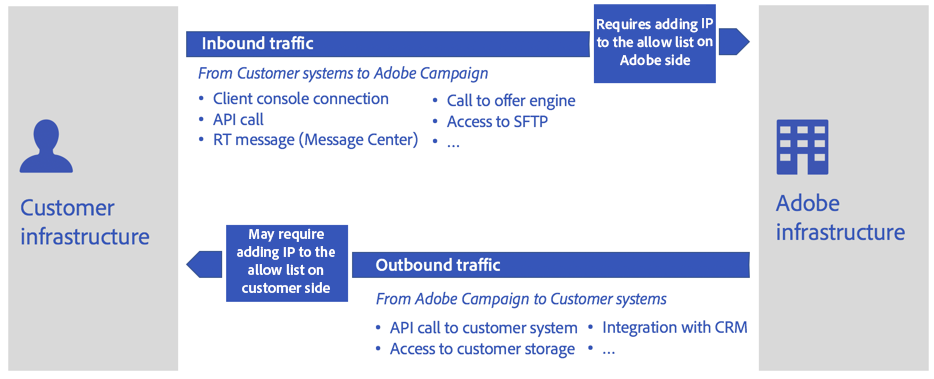

# Migrering till frågor och svar om Public Cloud{#dc-faq}

Adobe avställer det gamla datacentret: Campaign Classic instanser måste överföras till Public Cloud Amazon Web Services (AWS). [Läs mer om det här initiativet](dc-migration.md).

Nedan finns en uppsättning vanliga frågor om det här projektet, effekten på Campaign-miljöer och andra användbara resurser.

För alla andra frågor kan du kontakta [Adobe kundtjänst](https://experienceleague.adobe.com/?support-solution=Campaign#support).

## Infrastrukturpåverkan

Global påverkan på databaser och infrastruktur listas nedan.

* **Kommer databasen att ändras? Vilken version har den nya databasen? Vilket operativsystem kommer att användas?**

   Adobe förbehåller sig rätten att välja och driftsätta den lämpligaste databashanteringsmotorn för att betjäna Adobe Campaign Service under optimala förhållanden.

   Dessutom kommer Adobe inte att lämna någon detaljerad information om infrastrukturen för att säkerställa bästa möjliga säkerhetsnivå.

* **Finns det risk för dataförlust?**

   Databasen kommer att dumpas från det gamla datacentret och återställas i Public Cloud (AWS). När programmet startas om på det nya datacentret återupptas det från exakt det tillstånd det hade innan migreringen. Användarna ser ingen skillnad förutom att vissa schemalagda aktiviteter kommer att ha fördröjts.

* **Finns det några skillnader i paketets storlek mellan det äldre datacentret och det offentliga molnet?**

   Vi etablerar oss i Public Cloud (AWS) med nya paketdefinitioner som baseras på databasstorlek, diskstorlek osv. Om en kund till exempel har en programserver i äldre datacenter kan de ha två programservrar i Public Cloud (AWS) baserat på paketdefinitioner.

* **Kommer versionsnumret eller Campaign-versionen att ändras?**

   Som ett första steg kommer vi att behålla samma Campaign Classic-byggnad med migrering.

   I ytterligare ett steg ska vi uppgradera till den senaste Campaign Classic GA-versionen. Mer information finns på [den här sidan](../../rn/using/rn-overview.md).

* **Vad finns det för plan för att lösa eventuella problem efter migrationen?**

   Omfattande testning utförs innan produktionssystemen migreras. I händelse av problem [Adobe kundtjänst](https://experienceleague.adobe.com/?support-solution=Campaign#support) kommer att förbli huvudkontaktpunkt. Adobe har inrättat ett expertteam för att vid behov ge avancerat stöd.

## Leveranseffekter

Global påverkan på IP-adresser, blockeringslista, underdomäner och URL-adresser anges nedan.

* **Hur ska IP på tillåtelselista hanteras? Kommer kunderna att behöva lägga till nya IP-adresser i tillåtelselista för inkommande trafik från Campaign?**

   IP-adressen för Adobe-servrarna kommer att ändras. Kunderna kan behöva lägga till de nya IP-adresserna i tillåtelselista i systemet.

   [Läs mer](#config) om IP på tillåtelselista.

* **Hur hanterar vi port som lagts till i tillåtelselista för SFTP/FTP-åtkomst?**

   SFTP-konfigurationen (offentliga nycklar + IP till tillåtelselista) kommer också att flyttas från äldre datacenter till offentliga moln (AWS). Ingen åtgärd förväntas från kunden.

* **Ändrar vi IP-adresser?**

   IP-adressen för Adobe-servrarna kommer att ändras. Kunderna kan behöva lägga till de nya IP-adresserna till tillåtelselista i systemet.

   [Läs mer](#config) om IP på tillåtelselista.

* **Hur hanteras underdomänsdelegering?**

   Befintliga underdomäner kommer att flyttas från äldre datacenter till offentliga moln (AWS). Den här delen kommer att hanteras av Adobe Deliverability-teamet som en del av migreringsprocessen.

   Adobe kommer att vägleda kunden genom de tester som krävs för att säkerställa att konfigurationen körs på nya offentliga molnservrar (AWS) efter migreringen.

* **Kommer migreringen att skapa nya URL:er för spårning, resurser och webbprogram?**

   Nej, befintliga URL:er bevaras.

* **Kommer underdomänen att ändras från Neolane.net till campaign.adobe.com?**

   Båda `neolane.net` och `campaign.adobe.com` kommer att finnas på plats efter migreringen. Så här gör du det enkelt: kommer vi att dirigera om neolane.net till nya instanser i Public Cloud (AWS), så att inga ändringar krävs från kunden.

* **Vad är planen för IP-uppvärmning?**

   Först och främst kommer Adobe Deliverability att utvärdera plattformens leveransstatus och rekommendera en plan för övergången till de nya IP-adresserna

   Ingen uppvärmning krävs efter migreringen. Det kan vara ett undantag och i så fall [Adobe kundtjänst](https://experienceleague.adobe.com/?support-solution=Campaign#support) kommer att nå ut till kunderna.

   Planen är dock att göra den här operationen genomskinlig för företaget, till skillnad från den initiala påfarten som görs vid publicering.

   När migreringen är klar kommer Campaign-instansen att ha helt olika sändande IP-adresser. För att säkerställa en smidig övergång kommer Adobe att genomföra en uppfriskande uppgradering av de nya IP-adresserna genom att successivt byta trafik från de gamla till de nya IP-adresserna.

* **Flyttar vi över URL:en på tillåtelselista?**

   Ja, den lagras i serverkonfigurationsfilen som kopieras från källan till den nya instansen.

* **Vilken effekt ska vår delegerade underdomän ha för vår kommunikation?**

   De underdomäner som används för marknadsföringskommunikation är fortfarande desamma. Beroende på implementeringen behövs dock åtgärder på klientsidan:
   * Vid delegering till underdomäner till Adobe (standard) tar Adobe hand om alla ändringar och säkerställer en smidig övergång.
   * Vid konfigurering av CNAME (undantag) ombeds kunden implementera ändringar, i samordning med Adobe.

## Konfiguration och anslutningsmöjligheter

### Kommentarer om IP på tillåtelselista{#config}

Migrering till Public Cloud kommer med nya IP-adresser för Adobe Campaign-programservrar, så att en ändring av IP-adressen kan påverka anslutningen mellan Adobe-servrar och dina informationssystem.

Låt oss titta på de två fallen:

* Inkommande trafik: All nätverksaktivitet som initieras från dina system eller någon annan tredje part till Adobe Campaign-servrar. Konfigurationen hanteras av Adobe och kopieras sedan från äldre till offentliga moln under migreringen. Sedan bevaras anslutningen för inkommande trafik på samma sätt som efter migreringen och inga åtgärder förväntas från kundens sida

* Utgående trafik: All nätverksaktivitet som initieras av Adobe Campaign-servrar till ditt informationssystem eller någon annan tredje part (t.ex.: SMS-provider). Beroende på vilka säkerhetsprinciper som finns i organisationen kan ändringar av IP-adresser kräva att du tillåtslista från informationssystemet eller någon annan tredje part

### Globala effekter

Global påverkan på konfiguration, anslutning till andra system och produkter, API:er och tidszon listas nedan.

* **Kommer migreringen att påverka anslutningen till externa konton?**

   Ja. Tredjepartsintegreringar, till exempel SMS-leverantörer, bör lägga till nya IP-adresser för Adobe Campaign-programservrar i tillåtelselista.

* **Kommer migreringen att påverka anslutningen till Adobe Analytics via Genesis-anslutningen? Vad gäller om du lägger till IP-adresser för Campaign i tillåtelselista på Adobe Analytics-sidan?**

   IP-adresserna för Adobe Campaign-programservrar ändras. Det här steget hanteras av Adobe kundtjänst efter migreringen.

* **Kommer migreringen att påverka anslutningen till andra Adobe-lösningar (AEM, Target, osv.)?**

   Integreringar är en kombination av IP-adresser som deklarerats i tillåtelselista och webbtjänstens kontokonfiguration. Detta redovisas och ägs av Adobe kundtjänst.

   Det kommer att finnas IP-adresser på tillåtelselista som krävs i den externa lösningen när IP-adressen för programservrar ändras. Denna information kommer att tillhandahållas. Andra delar av integreringen är IMS-baserade och bör fungera som de är.

* **Vad gäller för kunder som inte är kopplade till organisations-ID för IMS-integrering?**

   Kunder som inte har IMS får en: ett organisations-ID bifogas till instansen.

* **Påverkar migreringen konfigurationer av flera varumärken?**

   Så snart en underdomän och alla relaterade konfigurationer har flyttats/omdirigerats korrekt från ett äldre datacenter till ett offentligt moln (AWS) förväntar vi oss ingen effekt.

* **Påverkas API-anslutningen av migreringen?**

   IP-adressen för Adobe-servrarna kommer att ändras. Kunderna kan behöva lägga till de nya IP-adresserna till tillåtelselista i systemet.

   [Läs mer](#config) om IP på tillåtelselista.

* **Ser vi till att alla parametrar för JavaScript-minneskonfiguration ställs in korrekt efter migreringen?**

   Vi kopierar instanskonfiguration från äldre datacenter till Public Cloud (AWS), så dessa värden bevaras efter migreringen.

* **Finns det någon risk för åtkomst till vissa filtillägg?**

   Kunden kanske vill tillåta att teckensnittsfiler, Outlook-mötesfiler läses in i mappen för offentliga resurser. Den här konfigurationen görs i den aktuella `config-<instance>.xml` -fil. Detta kopieras över med konfigurationsfiler.

* **Ändrar tidszonen på den nya servern? Kommer kunden att kunna behålla sin aktuella tidszon?**

   Den kan ändras beroende på var nya servrar finns. Kunden kan dock behålla sin aktuella tidszon.

   [Läs mer](../../workflow/using/managing-time-zones.md) om hantering av tidszoner i Adobe Campaign Classic v7.

## Säkerhet och behörigheter

I och med den här migreringen till Public Cloud (AWS) hålls kundmiljöerna uppdaterade med alla nödvändiga säkerhetskrav. Detta inkluderar:

* Senaste operativsystem och säkerhetsuppdateringar med jämna mellanrum
* Isolering av infrastruktur per kund
* Hanterad säkerhet och granskningsrundor för stöd av molninfrastruktur som belastningsutjämnare, säkerhetsregler för nätverk och lagringskryptering.

Hur behörigheter, certifikat och SFTP-åtkomst påverkas visas nedan.

* **Ska vi flytta alla certifikat till de nya servrarna?**

   Ja, alla certifikat flyttas som en del av den här migreringen.

* **Behöver vi begära nya STP-åtkomstnycklar från kunden?**

   Nej, Adobe kopierar SFTP-nycklar på samma sätt som på den nya servern.

* **Hur hanteras SFTP-behörigheter?**

   Vi ser till att nya SFTP-servrar, användare, kataloger och filer har exakt samma behörighetsnivåer.

* **Om SFTP-anslutningen inte kunde upprättas, hur fungerar då lösningen?**

   Det enda anslutningsproblem som kan uppstå är tillåtelselista på kundsidan. Kunden bör lägga till det här testet i icke-produktionsmiljö för att se till att det fungerar innan man går över till produkten.

* **Finns det några datacenterspecifika konfigurationer för tillåtelselista som behöver flyttas över?**

   Nej, det finns ingen datacenterspecifik tillåtelselista-konfiguration att hantera.

* **Ser vi till att anpassade skript körs korrekt i den nya miljön?**

   Kundimplementering kan till exempel använda egna skript (Perl/Shell/Python/Java Script) i arbetsflöden för att ändra filer och mappar.

   På värdinstansen körs skript bara via JavaScript-motorn. Dessa specifika implementeringar kan orsaka säkerhetsluckor och problem efter uppgraderingen. De stöds inte.

* **Fungerar IMS-integreringen som den är i den nya instansen, eller behövs det någon ytterligare konfigurationsuppdatering?**

   Eftersom vi behåller samma DNS-namn bör det fungera som efter migreringen.

## Migreringskörning

De globala effekterna under migreringen listas nedan.

* **Behöver vi planera för att stoppa marknadsföringsaktiviteten under migreringen?**

   Adobe rekommenderar att alla körningar pausas långsammare och helst innan programmet stängs av i det äldre datacentret: leveranser och arbetsflöden. Det underlättar omstarten på molnservern (AWS) eftersom processerna har fått tid att pausa&quot;utan problem&quot; och spara eventuella pågående körningstillstånd.

* **Förväntar vi oss driftavbrott i vår Adobe Campaign-tjänst?**

   Migreringen kommer att innebära ett oundvikligt driftstopp på plattformen. Syftet med denna plan är att ge vägledning om hur man minimerar driftstoppen.

   Dataöverföringen mellan datacenter är på driftstoppets kritiska väg. Data lagras på två sätt:

   * Det viktigaste är databasen
   * Filer på programservern (import och export av data)

   Att minska storleken på databasen är av högsta vikt för att snabba upp dataöverföringen. Förslag:

   * Minska kvarhållningsperioderna för historiska data (leveransloggar, spårningsloggar osv.)
   * Ta bort oanvändbara poster i andra tabeller (leveranser, mottagare, anpassade tabeller)

* **Vilken är den beräknade nedtiden för migrering av en instans?**

   Nedtiden beror helt på storleken på kundens databas och lagringsstorlekar för SFTP-filer. Kontakta kundtjänst för att få en beräknad varaktighet.

* **Meddelanden som skickas från den gamla servern då. Kommer länkar alltid att vara tillgängliga?**

   När migreringen körs kommer endast en tjänst att vara funktionell: omdirigering av e-postlänkar. Alla mottagare kommer att kunna nå landningssidan när de klickar i ett e-postmeddelande. Dessa klick spåras dock inte, så klickfrekvensen för leveranser som påbörjades kort innan migreringen blir lägre än vanligt.

* **Mittkällare/RT-miljöer?**

   MID-inköps- och RT-inköpen hanteras som vilken annan värdbaserad infrastruktur som helst.

* **I vilken ordning kommer migreringar att göras?**

   Miljöerna migreras i följande ordning:

   1. Utvecklingsmiljöer
   1. Scenmiljöer
   1. Produktionsmiljöer
   1. RT-miljöer
   1. Mid-sourcing

* **Vad är återställningsplanen?**

   Återställningsplanen är att växla tillbaka DNS och återställa källdatabasen till skrivskyddad. Så småningom kommer vi att ha automatisering för det.

* **Efter migreringen, kan vi fortfarande komma åt gamla instanser?**

   När programmigreringen är klar finns det ingen plan för att köra någon process igen på det gamla datacentret. Vi förväntar oss att alla data i det äldre datacentret kan raderas, förutom för temporära säkerhetskopieringssyften, tills de schemalagda säkerhetskopieringsprocesserna har körts i Public Cloud (AWS).

* **Hur mycket tid kommer att ges för testning av varje instans efter migrering till Public Cloud?**

   Beroende på kundens komplexitet Bakningstid på minst 1 vecka krävs mellan migreringar av scenmiljön och produktionsmiljön.

* **Vem hanterar tillägg av nya IP:n till tillåtelselista?**

   Adobe kundtjänstteam ansvarar för att se till att kunden och alla tredje parter har tillgång till det nya systemet genom att lägga till de nya IP-adresserna till tillåtelselista.

## Support och andra användbara länkar{#support}

* [Migrering till Adobe Managed Services (Public Cloud)](dc-migration.md)
* [Kampanj - årlig uppgradering](../../rn/using/rn-overview.md#yeary-upgrade)
* [Vanliga frågor om uppgradering](../../platform/using/faq-build-upgrade.md)
