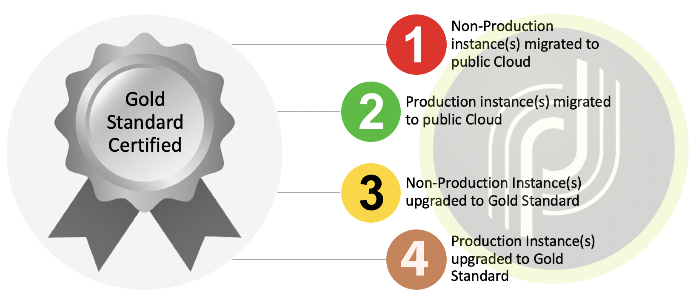

# Översikt{#dc-ovv}

## Kontext

Som värdefull kund hos Adobe Campaign Classic vill vi ge dig den bästa upplevelsen och det bästa värdet. Under årens lopp har vi insett värdet och tillförlitligheten med att vara värd för våra kunder i molnet.  Som en del av [Gold Standard Initiative](../../rn/using/gold-standard.md)flyttar vi alla våra kunder till Adobe Managed Services (Public Cloud på AWS) för att erbjuda bättre och tillförlitligare tjänster.

Det här programmet har tre huvudmål:

* Som åtgärdar identifierade säkerhetsluckor genom att flytta infrastruktur till en säker och modern miljö (AWS).
* Eliminera potentiellt krångliga skalningsprocesser, ge tillgång till våra [Förbättrade MTA:er](../../delivery/using//sending-with-enhanced-mta.md) och förbättra alla underhållsnivåer.
* Förbered din instans för Adobe Campaign Classic framtid, inklusive fler automatiserade, regelbundna uppgraderingar som inte kräver så mycket resurser eller så mycket tid som möjligt.

### Ordlista

* **Bygg uppgradering** - När Adobe Campaign Classic-programvaran uppdateras till det senaste säkra versionsnumret, men ändå ligger kvar på samma större/mindre nivå. Till exempel: Campaign v7 20.2.3 build 9182 to Campaign v7 21.2.5 build 9188. [Läs mer](../../platform/using/faq-build-upgrade.md).
* **MID/RT** - Meddelandekörningsservrar på Adobe Cloud (MID för batchkampanjer och RT för enhetsmeddelanden i realtid)
* **Uppgradering av Gold Standard** - det här programmet ger förbättrad säkerhet, förbättrad support, förbättrat underhåll och stabilitet. Det underlättar också framtida uppgraderingar och ger tillgång till nya funktioner i Campaign.  [Läs mer](../../rn/using/gs-overview.md).
* **AWS** - Amazon Web Services (Amazon Public Cloud)
* **SFTP** - Secured File Transfer Protocol. [Läs mer](../../platform/using/sftp-server-usage.md).

>[!NOTE]
>Migrering från Campaign Classic v7 till Public Cloud påverkar kunder som använder **Adobes hanterade tjänster** endast.

## Fördelar

**Säkerhet**

* Senaste säkerhetskorrigeringar
* Datakryptering har vila
* Förbättrad autentisering (IMS)

**Infrastruktur**

* Flexibel maskinvaruskalbarhet
* Snabbare återställning
* Förbättrad tillförlitlighet och stabilitet
* Harmoniserade operativa förfaranden

**Prestanda**

* Förbättrad e-postkapacitet
* Större databaser
* Korrektur för kampanjversion - Gold Standard

**En robust, tillförlitlig lösning för Adobe Campaign Classic-kunder**

1. Bättre produktionsrutiner, vilket ger ökad tillförlitlighet, snabbare reaktivitet vid problem och snabbare återhämtning vid större incidenter.
1. Högre kapacitet för e-postsändning. Instanser som lagras i det nya datacentret kan dra nytta av en specialiserad infrastruktur för e-postleverans. Det kan leda till högre e-postleveranshastighet eller tillåta att färre IP-adresser skickas.
1. Bättre skalbarhet för maskinvara. Ökning av maskinvaruresurserna kan göras mycket snabbare. Tekniskt sett skulle det vara i storleksordningen 1 timme istället för flera dagar.

**Gold Standard förenklar framtida uppgraderingar**

1. Ju längre organisationen väntar på att uppgradera, desto mer komplex blir uppgraderingen och möjligheten att drabbas av sårbarheter ökar (särskilt när man går över från en äldre version).
1. Med uppgraderingen av Gold Standard kommer din instans att moderniseras och du kan få mer automatiska och regelbundna uppdateringar med mindre manuella åtgärder och mindre resurser.

## Om migreringen

Migreringen till Adobe Managed Services (Public Cloud) sker 2020/2021 för berörda konton. Adobe kommer att leda och vägleda organisationen genom den här resan.

För att få igång den här satsningen får konton som kräver den här migreringen ett e-postmeddelande från Adobe med en tidslinje och tillgång till dokumentation. Detta är ett meddelande om att ditt konto är schemalagt att migreras.

En migrering kan initieras av [öppna ett nytt supportärende för kundtjänst](https://experienceleague.adobe.com/?support-solution=Campaign#support). Använd ämnesraden&quot;Migrera till AWS&quot;.

### Är migreringen obligatorisk?

Migreringen till molnet är **första steget till [Gold Standard-certifiering](../../rn/using/gs-overview.md)** av dina Adobe Campaign-förekomster. Migreringen är obligatorisk om du är värd i ett datacenter som inte är det offentliga molnet (AWS).

Adobe Managed Services-molnet ligger på Amazon Web Services (AWS), en modern, säker och optimerad miljö. [Läs mer om AWS](https://aws.amazon.com/application-hosting/benefits/).

Adobe planerar att avveckla det gamla datacentret. Adobe Campaign-instanser som körs där måste överföras till det nya referensdatacentret, AWS.

Detta är en viktig väg framåt eftersom din nuvarande plats kan exponeras för **säkerhets- och prestandaproblem**.

Dessutom är migreringen nu en **en förutsättning för framtida uppgraderingar** av din Adobe Campaign. Uppgradering av bygge är inte längre möjligt i äldre datacenter.

Adobe vill skydda era data och få er på rätt spår inför Adobe Campaign framtid. Vi behöver ert partnerskap för att göra det till en gemensam framgång!

**Vi har organiserat ett team** av dedikerade kundtjänstassistenter, Customer Success Managers, Product Managers, Engineers, TechOps Specialist och Product Consultants för att hjälpa till och säkerställa att upplevelsen blir smidig och smidig. Vi strävar efter att se till att du har relevant projekt- och kontaktinformation.

Vi har gjort stora ansträngningar för att utveckla tekniker som gör migreringen snabb, sömlös och säker.

### Begränsningar

* Migreringen kommer att innebära ett oundvikligt driftstopp på plattformen. Syftet med denna plan är att ge vägledning om hur man minimerar driftstoppen.
* IP-ändring för dataintegreringar.
* Leveransavlastning av nya IP-sändningsadresser. Planen är dock att göra den här operationen genomskinlig för företaget, till skillnad från den initiala påfarten som görs vid publicering.

Läs mer i Campaign-migrering till [Vanliga frågor om Public Cloud](dc-migration-faq.md).

## Certifiering av resa till Gold Standard

Vi hjälper dig med valideringsstegen mellan varje milstolpe.

## Migreringsväg till Public Cloud

Adobe hanterar de flesta av åtgärderna. Vi behöver dig för validering och godkännande.

## Riktlinjer för migrering

### Global metod

**Databas**

Databasen kommer att dumpas från det gamla datacentret och återställas i Public Cloud (AWS). När programmet startas om på det nya datacentret återupptas det från exakt det tillstånd det var innan det stängdes. Användarna ser ingen skillnad förutom att vissa schemalagda aktiviteter kommer att ha fördröjts.

**Skicka IP-adresser via e-post**

När migreringen är klar kommer Campaign-instansen att ha helt olika sändande IP-adresser. För att säkerställa en smidig övergång kommer Adobe att genomföra en upprustning av de nya IP-sändningarna genom att gradvis övergå från den gamla till den nya IP-adressen.

**IP för dataintegrering**

Dataintegrering på klientsidan kan påverkas av ändringen av IP:n för dataintegrering. Ändringen kan påverka båda riktningarna, beroende på om Campaign fungerar som en server eller en klient.
Vanliga fall:

* SFTP, möjligen båda riktningar
* HTTP, möjligen båda riktningarna
* SMPP (anslutning till SMS-provider), Campaign som klient, ändring av käll-IP

I allmänhet innebär det att kunden bör kontrollera eventuella IP-begränsningar som har angetts på brandväggen och anpassa dem därefter.*

**Kampanjservrar**

Befintliga Campaign-servrar (behållare) kommer att flyttas till Public Cloud (AWS) på ett sätt som&quot;lyft-och-förskjutning&quot;. Det innebär att ingen ny serverinstallation behövs, men hela servern överförs till det nya datacentret. Åtgärden kräver inget mer arbete än teknisk omkonfiguration på låg nivå.

**Servernamn**

Under de underdomäner som används för marknadsföringskommunikation: kommer att förbli desamma. Beroende på implementeringen kan det dock behövas åtgärder på klientsidan:

* Vid delegering till underdomäner (normalt fall) kommer Adobe att ta hand om alla ändringar och säkerställa en smidig övergång
* Vid CNAME-installation (undantag) ombeds klienten att implementera ändringar. Samordning med Adobe kommer att behövas.

Namnen under neolane.net ändras inte för användaråtkomst och dataintegrering.

Det innebär att ändringen blir genomskinlig för användarna och att implementeringar av dataintegrering blir genomskinliga om servernamnen inte ersätts av hårdkodade IP-adresser.

### Förberedelse

**Skicka IP-adresser via e-post**

För det första kommer Adobe Deliverability att utvärdera plattformens leveransstatus och rekommendera en plan för övergången till de nya IP-adresserna.

Adobe kommer att tillhandahålla samma antal IP-adresser i det nya datacentret.

Uppgraderingen av nya IP-adresser kan börja så snart de nya IP-adresserna har etablerats.

**Programrensning**
Dataöverföring mellan datacenter är på driftstoppets kritiska väg.

Data lagras på två sätt:

1. Det viktigaste är databasen
1. Filer på programservern (import och export av data)

Att minska storleken på databasen är av högsta vikt för att snabba upp dataöverföringen.

Förslag:

* Minska kvarhållningsperioderna för historiska data (leveransloggar, spårningsloggar osv.)
* Ta bort oanvändbara poster i andra tabeller (leveranser, mottagare, anpassade tabeller)

### Körning

**Pausa körningar**

Vi rekommenderar att alla körningar pausas långsammare och idealiskt precis innan programmet stängs i det äldre datacentret: leveranser och arbetsflöden. Det underlättar omstarten av Public Cloud (AWS) eftersom processerna har fått tid att pausa&quot;på ett bra sätt&quot; och spara eventuella pågående körningstillstånd.

**Under migreringen**

När migreringen sker är det bara en tjänst som fungerar: omdirigering av e-postlänkar. Mottagarna kommer med andra ord att kunna nå landningssidan när de klickar i ett e-postmeddelande. Dessa klick spelas dock inte in, så klickfrekvensen för leveranser som påbörjades kort innan migreringen är lägre än normalt.

**Starta om**

När programmet har migrerats till den nya miljön kommer det att startas om stegvis:

* Åtkomst till den första konsolen, så att användarna kan kontrollera status utan att något aktivt körs än
* Arbetsflöden och leveranser

### Efter migrering

**Borttagning av instanser i äldre datacenter**

När programmigreringen är klar finns det ingen plan för att köra någon process igen på det gamla datacentret. Vi förväntar oss att alla data i det äldre datacentret kan raderas, förutom för temporära säkerhetskopieringssyften, tills de schemalagda säkerhetskopieringsprocesserna har körts i Public Cloud (AWS).

**DNS-delegering**

Normalt har domänen som används för att skicka e-post (del till höger om @-tecknet i feladressen) från Campaign delegerats till Adobe. Delegeringen kan ändras och implementeras med AWS DNS-servrar.

## Support och andra användbara länkar{#support}

* [Migrering till Adobe Managed Services (Public Cloud) - frågor och svar](dc-migration-faq.md)
* [Gold Standard - uppgradering](../../rn/using/gs-overview.md)
* [Vanliga frågor om uppgradering](../../platform/using/faq-build-upgrade.md)
