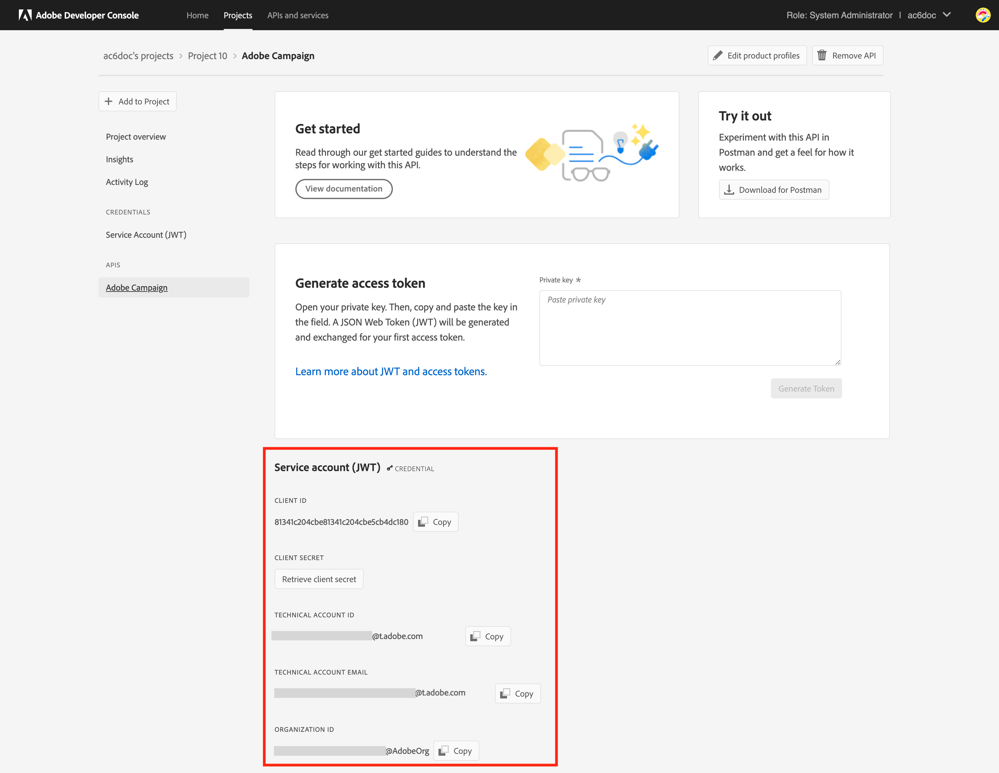

# Kampanjleveransserver {#acc-deliverability}

Från och med version 21.1 av Campaign Classic föreslår Adobe Campaign en ny leveransserver som har hög tillgänglighet och som åtgärdar problem med säkerhetsefterlevnad. Campaign Classic synkroniserar nu leveransregler, utsändningsloggar och undertryckningsadress från och till en ny leveransserver.

Som kund hos Campaign Classic måste ni implementera den nya leveransservern.

>[!NOTE]
>
>Om du har frågor om de här ändringarna kan du kontakta [Adobes kundtjänst](https://helpx.adobe.com/se/enterprise/admin-guide.html/enterprise/using/support-for-experience-cloud.ug.html).

## Vad har ändrats?{#acc-deliverability-changes}

Adobe tar äldre datacenter ur drift på grund av säkerhetsskäl. Adobe Campaign Classic-klienter måste migrera till den nya slutprodukten, som ligger hos Amazon webbtjänst (AWS).

Den nya servern garanterar hög tillgänglighet (99.9) &#x200B; och tillhandahåller säkra och autentiserade slutpunkter så att kampanjservrar kan hämta nödvändiga data: I stället för att ansluta till databasen för varje begäran, cachelagrar den nya leveransservern data för att hantera förfrågningarna där det är möjligt. Den här funktionen förbättrar svarstiden. &#x200B;

## Påverkas du?{#acc-deliverability-impacts}

Om du använder den gamla Adobe Campaign-servern för leverans och miljön implementerades på en lägre version än Campaign 21.1.1 påverkas du. Du måste uppgradera till Campaign 21.1 (eller mer).

Lär dig hur du kontrollerar din version [i det här avsnittet](../../platform/using/launching-adobe-campaign.md#getting-your-campaign-version).

## Hur uppdaterar jag?{#acc-deliverability-update}

Som **värdbaserad kund** kommer Adobe att arbeta med dig för att uppgradera dina instanser till den nyare versionen och skapa projektet i Adobe Developer Console.

Som en **lokal/hybridkund** måste du uppgradera till en av de nyare versionerna för att kunna dra nytta av den nya leveransservern. När alla instanser har uppgraderats kan du [implementera den nya integreringen](#implementation-steps) till Adobe-server och säkerställa en smidig övergång.

## Implementeringssteg (hybridkunder och lokala kunder) {#implementation-steps}

Campaign måste kommunicera med Adobe Shared Services via en IMS-baserad autentisering, vilket ingår i den nya integreringen av leveransservern. Det bästa sättet är att använda den Adobe Developer-baserade gatewaytoken (kallas även Token för tekniskt konto eller Adobe IO JWT).


>[!WARNING]
>
>Dessa åtgärder bör endast utföras av Hybrid och lokalt implementerade implementeringar.
>
>För implementeringar via webbhotell kan du kontakta [Adobe kundtjänst](https://helpx.adobe.com/enterprise/admin-guide.html/enterprise/using/support-for-experience-cloud.ug.html).

### Förhandskrav{#prerequisites}

Kontrollera instanskonfigurationen innan du startar implementeringen.

1. Öppna Campaign-klientkonsolen och logga in på Adobe Campaign som administratör.
1. Bläddra till **Administration > Plattform > Alternativ**.
1. Kontrollera `DmRendering_cuid` alternativvärdet är ifyllt.

   * Om alternativet är ifyllt kan du starta implementeringen.
   * Om inget värde är ifyllt kontaktar du [Adobe kundtjänst](https://helpx.adobe.com/enterprise/admin-guide.html/enterprise/using/support-for-experience-cloud.ug.html) för att få ditt CUID.

      Det här alternativet måste fyllas i för alla Campaign-instanser (MKT, MID, RT, EXEC) med samma värde.

### Steg 1: Skapa/uppdatera ditt Adobe Developer-projekt {#adobe-io-project}

1. Åtkomst [Adobe Developer Console](https://developer.adobe.com/console/home) och logga in med utvecklaråtkomst i din organisation.

   >[!NOTE]
   >
   > Se till att du är inloggad på rätt organisationsportal.

1. Välj **[!UICONTROL Create new project]**.
   


   >[!CAUTION]
   >
   >Om du redan använder Adobe IO JWT-autentiseringsfunktioner för en annan integrering, till exempel Analytics Connector eller Adobe Triggers, måste du uppdatera projektet genom att lägga till **Kampanj-API** till det projektet.
1. Välj **[!UICONTROL Add API]**.
   
1. I **[!UICONTROL Add an API]** fönster, markera **[!UICONTROL Adobe Campaign]**.
   
<!--1. Choose **[!UICONTROL Service Account (JWT)]** as the authentication type.-->
1. Om ditt klient-ID var tomt väljer du **[!UICONTROL Generate a key pair]** för att skapa ett nyckelpar för offentlig och privat nyckel.
   

   Nycklarna laddas sedan ned automatiskt med ett standardutgångsdatum på 365 dagar. När det har gått ut måste du skapa ett nytt nyckelpar och uppdatera integreringen i konfigurationsfilen. Med alternativ 2 kan du välja att manuellt skapa och överföra **[!UICONTROL Public key]** med ett längre utgångsdatum.
   

   >[!CAUTION]
   >
   >Du bör spara `config.zip` när nedladdningsprompten visas eftersom du inte kan ladda ned den igen.

1. Klicka på **[!UICONTROL Next]**.
1. Välj en befintlig **[!UICONTROL Product profile]** eller skapa en ny vid behov. Ingen behörighet krävs för detta **[!UICONTROL Product profile]**. Mer information om **[!UICONTROL Product Profiles]**, se [den här sidan](https://helpx.adobe.com/enterprise/using/manage-developers.html).
   

   Klicka sedan på **[!UICONTROL Save configured API]**.

1. Välj **[!UICONTROL Adobe Campaign]** och kopiera följande information under **[!UICONTROL Service Account (JWT)]**

   

   * **[!UICONTROL Client ID]**
   * **[!UICONTROL Client Secret]**
   * **[!UICONTROL Technical account ID]**
   * **[!UICONTROL Organization ID]**

>[!CAUTION]
>
>Adobe Developer-certifikatet upphör att gälla efter 12 månader. Du måste generera ett nytt nyckelpar varje år.

### Steg 2: Lägg till projektautentiseringsuppgifter i Adobe Campaign {#add-credentials-campaign}

Den privata nyckeln ska kodas i base64 UTF-8-format.

För att göra detta:

1. Använd den privata nyckel som genereras i stegen ovan.
1. Koda den privata nyckeln med följande kommando: `base64 ./private.key > private.key.base64`. Detta sparar base64-innehållet i en ny fil `private.key.base64`.

   >[!NOTE]
   >
   >Extra rader kan ibland läggas till automatiskt när du kopierar/klistrar in den privata nyckeln. Kom ihåg att ta bort den innan du kodar din privata nyckel.

1. Kopiera innehållet från filen `private.key.base64`.
1. Logga in via SSH i varje behållare där Adobe Campaign-instansen är installerad och lägg till projektinloggningsuppgifterna i Adobe Campaign genom att köra följande kommando som `neolane` användare. Detta infogar **[!UICONTROL Technical Account]** autentiseringsuppgifter i instanskonfigurationsfilen.

   ```
   nlserver config -instance:<instance name> -setimsjwtauth:Organization_Id/Client_Id/Technical_Account_ID/<Client_Secret>/<Base64_encoded_Private_Key>
   ```

1. Du måste stoppa och sedan starta om servern för att ändringen ska kunna beaktas. Du kan också köra en `config -reload` -kommando.

### Steg 3: Aktivera den nya leveransservern

Nu kan du aktivera den nya leveransservern. Så här gör du:

1. Öppna klientkonsolen och logga in på Adobe Campaign som administratör.
1. Bläddra till **Administration > Plattform > Alternativ**.
1. Öppna `NewDeliverabilityServer_FeatureFlag` och ange värdet till `1`. Den här konfigurationen bör utföras på alla era Campaign-instanser (MKT, MID, RT, EXEC).

### Steg 4: Validera konfigurationen

Följ stegen nedan för att kontrollera om integreringen är slutförd:


1. Öppna klientkonsolen och logga in på Adobe Campaign.
1. Bläddra till **Administration > Produktion > Tekniska arbetsflöden**.
1. Starta om **Uppdatering för leverans** arbetsflöde (deliverabilityUpdate). Detta bör utföras på alla era Campaign-instanser (MKT, MID, RT, EXEC).
1. Kontrollera loggar: arbetsflödet ska köras utan fel.

Mer vägledning får du av [Adobe kundtjänst](https://helpx.adobe.com/enterprise/admin-guide.html/enterprise/using/support-for-experience-cloud.ug.html).
