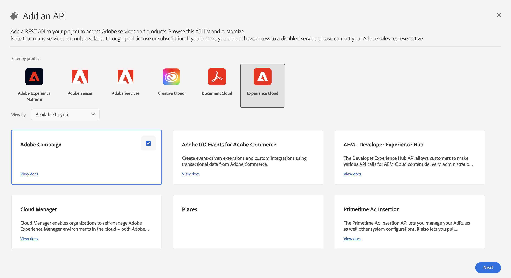
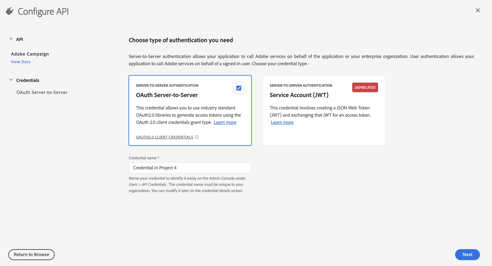
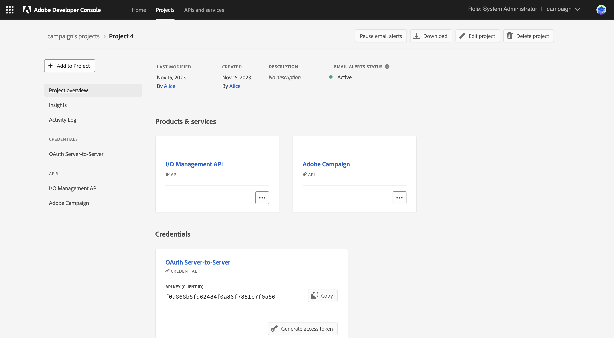

# Migrering av tekniska aktörer från Campaign till Adobe Developer Console {#migrate-tech-users-to-ims}

Som en del i arbetet med att stärka säkerhets- och autentiseringsprocessen, från och med Campaign Classic v7.3.5, förbättras autentiseringsprocessen till Campaign Classicen. Tekniska operatörer bör nu använda [Adobe Identity Management System (IMS)](https://helpx.adobe.com/enterprise/using/identity.html){target="_blank"} to connect to Campaign. Learn more about the new server to server authentication process in [Adobe Developer Console documentation](https://developer.adobe.com/developer-console/docs/guides/authentication/ServerToServerAuthentication/){target="_blank"}. **Adobe rekommenderar att du utför den här migreringen i Campaign v7.3.5 för att smidigt kunna migrera till Campaign v8.**

En teknisk operator är en Campaign-användarprofil som uttryckligen har skapats för API-integrering. I den här artikeln beskrivs stegen som krävs för att migrera en teknisk operatör till ett tekniskt konto via Adobe Developer-konsolen.

## Påverkas du?{#ims-impacts}

Om du gör API-anrop från ett externt system till Campaign till antingen din Campaign Marketing-instans eller till meddelandecenterinstansen i realtid rekommenderar Adobe dig att migrera de tekniska operatörerna till tekniska konton via Adobe Developer Console enligt beskrivningen nedan.

Den här ändringen gäller från och med Campaign Classic v7.3.5 (och senaste [IMS-migreringskompatibla versioner](#ims-versions-tech)) och är **obligatoriskt** för att gå över till Adobe Campaign v8.

## Migreringsprocess {#ims-migration-procedure}

Följ stegen nedan för att skapa tekniska konton i Adobe Developer Console och använd sedan de nya kontona för att kunna ändra autentiseringsmetoderna för alla dina externa system som gör API-anrop i Adobe Campaign.

En översikt över stegen är:

* Skapa ett projekt i Adobe Developer Console
* Tilldela lämpliga API:er till det nyskapade projektet
* Bevilja nödvändiga kampanjproduktprofiler för projektet
* Uppdatera dina API:er för att använda de nya inloggningsuppgifterna för det tekniska kontot
* Ta bort äldre tekniska operatorer från Campaign-instansen


### IMS-migreringskompatibla versioner {#ims-versions-tech}

En förutsättning för migreringen är att du uppgraderar miljön till någon av följande produktversioner:

* Campaign v7.3.5 (rekommenderas)
* Campaign v7.3.3.IMS
* Campaign v7.3.2.IMS

De här kampanjversionerna finns i [Versionsinformation](../../rn/using/latest-release.md).

### Krav för migreringen{#ims-migration-prerequisites}

<!--To be able to create the technical accounts which replace the technical operators, the prerequisite that the proper Campaign Product Profiles exist within the Admin Console for all Campaign instances need to be validated. You can learn more about Product Profiles within the Adobe Console in [Adobe Developer Console documentation](https://developer.adobe.com/developer-console/docs/guides/projects/){target="_blank"}.-->

* Campaign Hosted och Managed Services

  För API-anrop till Message Center-instansen/instanserna bör produktprofilen (som nämns nedan) skapas under uppgraderingen till Campaign v7.3.5 (eller andra [IMS-migreringskompatibel version](#ims-versions-tech)) eller under etableringen av instansen. Observera att om du inte ser produktprofilen bör du kontakta din Transition Manager eller kundsupport för att få produktprofilen skapad innan du startar IMS-migreringen. Den här produktprofilen heter:

  `campaign - <your campaign marketing instance> - messagecenter`

  Om du redan har använt IMS-baserad autentisering för användaråtkomst till Campaign bör de produktprofiler som behövs för API-anropen redan finnas i Admin Console. Om du använder en anpassad operatörsgrupp i Campaign för API-anrop till Marketing-instansen måste du skapa produktprofilen i Admin Console.

  I andra fall måste du kontakta din Adobe Transition Manager (för Managed Services-användare) eller Adobe kundtjänst (för andra värdanvändare) så att Adobe tekniska team kan migrera dina befintliga Operator-grupper och namngivna behörigheter till produktprofilerna i Admin Console.

* Kampanjkunder på plats och hybrider

  För API-anrop till Message Center-instansen/instanserna måste du skapa en produktprofil med namnet:

  `campaign - <your campaign instance> - messagecenter`

  Om du redan har använt IMS-baserad autentisering för användaråtkomst till Campaign bör de produktprofiler som behövs för API-anropen redan finnas i Admin Console. Om du använder en anpassad operatörsgrupp i Campaign för API-anrop till Marketing-instansen måste du skapa produktprofilen i Admin Console.

  Du kan läsa mer om produktprofiler i Adobe-konsolen i [Adobe Developer Console-dokumentation](https://developer.adobe.com/developer-console/docs/guides/projects/){target="_blank"}


### Steg 1 - Skapa ett Campaign-projekt i Adobe Developer Console {#ims-migration-step-1}

Integrationer skapas som en del av en **Projekt** i Adobe Developer Console. Läs mer om projekt i [Adobe Developer Console-dokumentation](https://developer.adobe.com/developer-console/docs/guides/projects/){target="_blank"}.

Du kan använda vilket projekt som helst som du har skapat tidigare eller skapa ett nytt projekt. Stegen för att skapa ett projekt beskrivs i [Adobe Developer Console-dokumentation](https://developer.adobe.com/developer-console/docs/guides/getting-started/){target="_blank"}. Du hittar de viktigaste stegen nedan

<!--
For this migration, you must add below APIs in your project: **I/O Management API** and **Adobe Campaign**.

-->

Om du vill skapa ett nytt projekt klickar du **Skapa nytt projekt** från huvudskärmen i Adobe Developer Console.


Du kan använda **Redigera projekt** om du vill byta namn på projektet.


### Steg 2 - Lägg till API:er i projektet {#ims-migration-step-2}

Från den nya projektskärmen lägger du till de API:er som behövs för att kunna använda det här projektet som ett tekniskt konto för dina API-anrop till Adobe Campaign.

Så här lägger du till API:er i projektet:

1. Klicka på **Lägg till API** för att välja de API:er som ska läggas till i projektet.
   
1. Markera och lägg till Adobe Campaign API i ditt projekt genom att markera kryssrutan i det övre högra hörnet av Adobe Campaign-kortet som visas när du håller muspekaren över kortet
   
1. Klicka **Nästa** längst ned på skärmen.

### Steg 3 - Välj autentiseringstyp  {#ims-migration-step-3}

I **Konfigurera API** väljer du autentiseringstyp. **OAuth Server-till-server** Autentisering krävs för det här projektet. Se till att det är markerat och klicka på **Nästa** längst ned på skärmen.



<!--
Once your project is created in the Adobe Developer Console, add an API that uses Server-to-Server authentication. Learn how to set up the OAuth Server-to-Server credential in [Adobe Developer Console documentation](https://developer.adobe.com/developer-console/docs/guides/authentication/ServerToServerAuthentication/implementation/){target="_blank"}.

When the API has been successfully connected, you can access the newly generated credentials including Client ID and Client Secret, as well as generate an access token.-->

### Steg 4 - Välj produktprofiler {#ims-migration-step-4}

Så som beskrivs i avsnittet Krav måste du tilldela rätt produktprofiler som ska användas i projektet. I det här steget måste du välja den eller de produktprofiler som ska användas av det tekniska konto som skapas.

Om det här tekniska kontot används för att göra API-anrop till Message Center-instansen måste du välja produktprofilen Adobe, som slutar med messagecenter, för den Marketing-instans som är kopplad till Message Center.

För API-anrop till Marketing-instansen/marknadsföringsinstanserna väljer du den produktprofil som motsvarar instansen och operatörsgruppen, till exempel `campaign - <your campaign marketing instance> - Admin`.

Klicka på **Spara konfigurerat API** längst ned på skärmen.

<!--
You can now add your Campaign product profile to the project, as detailed below:

1. Open the Adobe Campaign API.
1. Click the **Edit product profiles** button

    

1. Assign all the relevant Product Profiles to the API, for example 'messagecenter', and save your changes.
1. Browse to the **Credential details** tab of your project, and copy the **Technical Account Email** value.-->

### Steg 5 - Lägg till API:t för I/O-hantering i ditt projekt {#ims-migration-step-5}


Klicka på **[!UICONTROL + Add to Project]** och välja **[!UICONTROL API]** i det övre vänstra hörnet av skärmen för att kunna lägga till API:t för I/O-hantering i det här projektet.


I **Lägg till ett API** skärm, bläddra nedåt för att hitta **API för I/O-hantering** kort. Markera den genom att klicka i kryssrutan som visas när du för muspekaren över kortet. Klicka sedan på **Nästa** längst ned på skärmen.


I **Konfigurera API** OAuth Server-till-Server-autentiseringen finns redan. Klicka **Spara konfigurerat API** längst ned på skärmen.


Detta tar dig tillbaka till projektskärmen i I/O Management API för det nyskapade projektet. Klicka på projektnamnet längst upp på skärmen så kommer du tillbaka till sidan Projektinformation.


### Steg 6 - Verifiera projektkonfigurationen {#ims-migration-step-6}

Granska projektet för att se till att det ser likadant ut som nedan med **API för I/O-hantering** och **ADOBE CAMPAIGN API** visas i avsnittet Produkter och tjänster och **OAuth Server-till-server** i delen Autentiseringsuppgifter.




### Steg 7 - Verifiera konfigurationen {#ims-migration-step-7}

Följ de steg som beskrivs i [Autentiseringsguide för Adobe Developer Console](https://developer.adobe.com/developer-console/docs/guides/authentication/ServerToServerAuthentication/implementation/#generate-access-tokens){target="_blank"} för att generera en åtkomsttoken och kopiera exempelkommandot cURL. Du kan skapa ett SOAP-anrop med dessa autentiseringsuppgifter för att testa att du kan autentisera och ansluta till Adobe Campaign-instansen/instanserna korrekt. Vi rekommenderar att du utför den här valideringen innan du gör alla ändringar i API-integreringarna från tredje part.

### Steg 8 - Uppdatera API-integreringar från tredje part {#ims-migration-step-8}

Du måste nu uppdatera av API-integreringarna och ringa in Adobe Campaign för att använda det nya tekniska kontot.

Mer information om API-integreringssteg finns i kodexemplen nedan.

>[!BEGINTABS]

>[!TAB SOAP-anrop]

```
curl --location --request POST 'https://<instance_name>.campaign.adobe.com/nl/jsp/soaprouter.jsp' \
--header 'Content-Type: text/xml; charset=utf-8' \
--header 'SOAPAction: xtk:queryDef#ExecuteQuery' \
--header 'Authorization: Bearer eyJhw' \
--data-raw '<?xml version="1.0" encoding="utf-8"?>
<soap:Envelope xmlns:soap="http://schemas.xmlsoap.org/soap/envelope/">
  <soap:Body>
    <ExecuteQuery xmlns="urn:xtk:queryDef">
            <sessiontoken></sessiontoken>
            <entity>
                <queryDef schema="nms:recipient" operation="select">
                    <!-- fields to retrieve -->
                    <select>
                        <node expr="@lastName"/>
                        <node expr="@email"/>
                        <node expr="@firstName"/>
                    </select>
                    <!-- condition on email -->
                    <!-- <where><condition expr="@email= '\''joh@com.com'\''"/>
                </where> -->
                </queryDef>
            </entity>
        </ExecuteQuery>
  </soap:Body>
</soap:Envelope>
'
```

>[!TAB  SampleCode Java]

```javascript
import java.io.BufferedReader;
import java.io.InputStreamReader;
import java.io.IOException;
import com.google.gson.Gson;
import com.google.gson.JsonObject;
 
import com.google.gson.JsonSyntaxException;
import org.apache.hc.client5.http.classic.methods.HttpPost;
import org.apache.hc.client5.http.impl.classic.CloseableHttpClient;
import org.apache.hc.client5.http.impl.classic.CloseableHttpResponse;
import org.apache.hc.client5.http.impl.classic.HttpClients;
import org.apache.hc.core5.http.HttpEntity;
import org.apache.hc.core5.http.io.entity.StringEntity;
 
 
public class TAAccessToken {
    public static void main(String[] args) throws IOException {
        String accessToken = null;
        CloseableHttpClient httpClient = HttpClients.createDefault();
        try {
            HttpPost httpPost = new HttpPost("https://ims-na1.adobelogin.com/ims/token/v3");
 
            // Request headers
            httpPost.addHeader("Content-Type", "application/x-www-form-urlencoded");
 
            String clientId = "<client_id>";
            String clientSecret = "<client_secret>";
            String scopes = "<scopes>";
 
            // Define the request body
            String requestBody = "client_id="+clientId+"&client_secret="+clientSecret+"&grant_type=client_credentials&scope="+scopes+"";
            StringEntity requestEntity = new StringEntity(requestBody);
            httpPost.setEntity(requestEntity);
 
            // Execute the request
            CloseableHttpResponse response = httpClient.execute(httpPost);
            try {
                // Get the response entity
                HttpEntity entity = response.getEntity();
                int responseCode = response.getCode();
 
                // Print the response
                if (entity != null) {
                    BufferedReader bufferedReader = new BufferedReader(new InputStreamReader(entity.getContent()));
                    String lineImsToken;
                    StringBuilder responseImsToken = new StringBuilder();
                    while ((lineImsToken = bufferedReader.readLine()) != null) {
                        responseImsToken.append(lineImsToken);
                    }
 
                    String jsonString = responseImsToken.toString();
 
                    try {
                        Gson gson = new Gson();
                        JsonObject jsonObject = gson.fromJson(jsonString, JsonObject.class);
 
                        // Get the value of a specific key
                        accessToken = jsonObject.get("access_token").getAsString();
                    }
                    catch (JsonSyntaxException | NullPointerException e) {
                        System.err.println("Error parsing JSON: " + e.getMessage());
                        e.printStackTrace();
                    }
                    System.out.println("Response Code: " + responseCode);
                    System.out.println("Response Body: " + accessToken);
                }
            } catch (IOException e) {
                e.printStackTrace();
            } finally {
                response.close();
            }
        } finally {
            httpClient.close();
        }
 
        CloseableHttpClient httpClientSoap = HttpClients.createDefault();
        try {
            HttpPost httpPostSoap = new HttpPost("https://<instance_name>.campaign.adobe.com/nl/jsp/soaprouter.jsp");
 
            // Request headers
            httpPostSoap.addHeader("Content-Type", "text/xml; charset=utf-8");
            httpPostSoap.addHeader("SOAPAction", "xtk:queryDef#ExecuteQuery");
            httpPostSoap.addHeader("Authorization", "Bearer "+accessToken);
 
            // Request body
            String xmlData = "<?xml version=\"1.0\" encoding=\"utf-8\"?>\n" +
                    "<soap:Envelope xmlns:soap=\"http://schemas.xmlsoap.org/soap/envelope/\">\n" +
                    "  <soap:Body>\n" +
                    "    <ExecuteQuery xmlns=\"urn:xtk:queryDef\">\n" +
                    "            <sessiontoken></sessiontoken>\n" +
                    "            <entity>\n" +
                    "                <queryDef schema=\"nms:recipient\" operation=\"select\">\n" +
                    "                    <!-- fields to retrieve -->\n" +
                    "                    <select>\n" +
                    "                        <node expr=\"@lastName\"/>\n" +
                    "                        <node expr=\"@email\"/>\n" +
                    "                        <node expr=\"@firstName\"/>\n" +
                    "                    </select>\n" +
                    "                    <!-- condition on email -->\n" +
                    "                    <!-- <where><condition expr=\"@email= '\''joh@com.com'\''\"/>\n" +
                    "                </where> -->\n" +
                    "                </queryDef>\n" +
                    "            </entity>\n" +
                    "        </ExecuteQuery>\n" +
                    "  </soap:Body>\n" +
                    "</soap:Envelope>";
            StringEntity requestEntity = new StringEntity(xmlData);
            httpPostSoap.setEntity(requestEntity);
 
            // Execute the request
            CloseableHttpResponse response = httpClientSoap.execute(httpPostSoap);
            try {
                // Get the response entity
                HttpEntity entity = response.getEntity();
 
                // Print the response
                if (entity != null) {
                    BufferedReader bufferedReader = new BufferedReader(new InputStreamReader(entity.getContent()));
                    String line;
                    while ((line = bufferedReader.readLine()) != null) {
                        System.out.println(line);
                    }
                }
            } catch (IOException e) {
                e.printStackTrace();
            } finally {
                response.close();
            }
        } finally {
            httpClientSoap.close();
        }
 
    }
}
```

>[!TAB SampleCodePython]

```python
import requests
 
oauth_url = 'https://ims-na1.adobelogin.com/ims/token/v3'
data = {
    'grant_type': 'client_credentials',
    'scope': '<scopes>',
    'client_id': '<client_id>',
    'client_secret': '<client_secret>'
}
 
headers = {
    'Content-Type': 'application/x-www-form-urlencoded',
    'Accept': 'application/json'
}
response = requests.post(oauth_url, data=data, headers=headers)
response = response.json()
access_token = response['access_token']
 
 
url = 'https://<instance_name>.campaign.adobe.com/nl/jsp/soaprouter.jsp'
headers = {
    'Content-Type': 'text/xml; charset=utf-8',
    'SOAPAction': 'xtk:queryDef#ExecuteQuery',
    'Authorization': 'Bearer '+access_token
}
xml_data = '''<?xml version="1.0" encoding="utf-8"?>
<soap:Envelope xmlns:soap="http://schemas.xmlsoap.org/soap/envelope/">
  <soap:Body>
    <ExecuteQuery xmlns="urn:xtk:queryDef">
            <sessiontoken></sessiontoken>
            <entity>
                <queryDef schema="nms:recipient" operation="select">
                    <!-- fields to retrieve -->
                    <select>
                        <node expr="@lastName"/>
                        <node expr="@email"/>
                        <node expr="@firstName"/>
                    </select>
                    <!-- condition on email -->
                    <!-- <where><condition expr="@email= '\''joh@com.com'\''"/>
                </where> -->
                </queryDef>
            </entity>
        </ExecuteQuery>
  </soap:Body>
</soap:Envelope>
'''
response = requests.post(url, headers=headers, data=xml_data)
```

>[!ENDTABS]

Mer information finns i [Autentiseringsdokumentation för Adobe Developer Console](https://developer.adobe.com/developer-console/docs/guides/authentication/ServerToServerAuthentication/){target="_blank"}.

Nedan visas exempel på SOAP-anrop som visar före och efter migreringsanrop för tredjepartssystem.

När migreringsprocessen har uppnåtts och validerats uppdateras Soap-anropen enligt nedan:

* Före migreringen: det fanns inget stöd för token för åtkomst till tekniska konton.

  ```sql
  POST /nl/jsp/soaprouter.jsp HTTP/1.1
  Host: localhost:8080
  Content-Type: application/soap+xml;
  SOAPAction: "nms:rtEvent#PushEvent"
  charset=utf-8
  
  <?xml version="1.0" encoding="utf-8"?>  <soapenv:Envelope xmlns:soapenv="http://schemas.xmlsoap.org/soap/envelope/" xmlns:urn="urn:nms:rtEvent">
  <soapenv:Header/>
  <soapenv:Body>
      <urn:PushEvent>
          <urn:sessiontoken>SESSION_TOKEN</urn:sessiontoken>
          <urn:domEvent>
              <!--You may enter ANY elements at this point-->
              <rtEvent type="type" email="name@domain.com"/>
          </urn:domEvent>
      </urn:PushEvent>
  </soapenv:Body>
  </soapenv:Envelope>
  ```

* Efter migreringen: det finns stöd för token för åtkomst till tekniska konton. Åtkomsttoken förväntas anges i `Authorization` sidhuvud som Bearer-token. Användning av sessionstoken bör ignoreras här, vilket visas i exemplet nedan för SOAP-anrop.

  ```sql
  POST /nl/jsp/soaprouter.jsp HTTP/1.1
  Host: localhost:8080
  Content-Type: application/soap+xml;
  SOAPAction: "nms:rtEvent#PushEvent"
  charset=utf-8
  Authorization: Bearer <IMS_Technical_Token_Token>
  
  <?xml version="1.0" encoding="utf-8"?>  <soapenv:Envelope xmlns:soapenv="http://schemas.xmlsoap.org/soap/envelope/" xmlns:urn="urn:nms:rtEvent">
  <soapenv:Header/>
  <soapenv:Body>
      <urn:PushEvent>
          <urn:sessiontoken></urn:sessiontoken>
          <urn:domEvent>
              <!--You may enter ANY elements at this point-->
              <rtEvent type="type" email="name@domain.com"/>
          </urn:domEvent>
      </urn:PushEvent>
  </soapenv:Body>
  </soapenv:Envelope>
  ```


### Steg 9 - (valfritt) Uppdatera den tekniska kontooperatören i Campaign Client Console {#ims-migration-step-9}

Det här steget är valfritt och endast tillgängligt i Marketing Instance(erna), inte i någon Message Center-instans. Om specifika mappbehörigheter eller namngivna rättigheter har definierats för den tekniska operatören, men inte via de tilldelade operatörsgrupperna. Du måste nu uppdatera den nyskapade tekniska kontoanvändaren i Admin Console för att ge mappbehörigheter eller namngivna rättigheter som krävs.

Observera att den tekniska kontoanvändaren INTE finns i Adobe Campaign förrän minst ett API-anrop görs till Campaign-instansen, då IMS skapar användaren i Campaign. Om du inte kan hitta de tekniska användarna i Campaign kontrollerar du att du har lyckats skicka ett API-anrop enligt instruktionerna [i steg 7](#ims-migration-step-7).

1. Om du vill använda ändringarna för den nya tekniska kontoanvändaren letar du reda på dem i Campaign-klientkonsolen via e-postadress. Den här e-postadressen skapades under stegen för att skapa projekt och autentisering ovan.

   Du kan hitta den här e-postadressen genom att klicka på **OAuth Server-till-server** rubrik i **Referenser** -delen av projektet.

   

   I **Information om autentiseringsuppgifter** bläddra nedåt för att hitta **E-post för tekniskt konto** och klicka på **Kopiera** -knappen.

   

1. Nu måste du uppdatera den nyskapade tekniska operatorn i Adobe Campaign Client Console. Du måste tillämpa den befintliga mappbehörigheten för tekniska operatorer på den nya tekniska operatorn.

   Så här uppdaterar du operatorn:

   1. Bläddra från Campaign Client Console Explorer till **Administration > Åtkomsthantering > Operatorer**.
   1. Få åtkomst till den befintliga tekniska operatorn som används för API:er.
   1. Bläddra till mappbehörigheterna och kontrollera rättigheterna.
   1. Använd samma behörigheter för den nyskapade tekniska operatorn. Operatörens e-postadress är **E-post för tekniskt konto** värdet kopierades tidigare.
   1. Spara ändringarna.


>[!CAUTION]
>
>Den nya tekniska operatorn måste ha gjort minst ett API-anrop som ska läggas till i Campaign Client Console.
>

### Steg 10 - Ta bort den gamla tekniska operatorn från Adobe Campaign {#ims-migration-step-10}

När du har migrerat alla tredjepartssystem för att använda det nya tekniska kontot med IMS-autentisering kan du ta bort den gamla tekniska operatorn från Campaign Client Console.

Du gör detta genom att logga in på Campaign Client Console och navigera till **Administration > Åtkomsthantering > Operatorer** och hitta de gamla tekniska användarna och ta bort dem.
