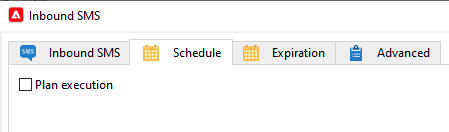

# Inkommande SMS-arbetsflödesaktivitet för infrastruktur med mellanleverantörer {#inbound-sms}

## Begränsningar {#limitations}

* Det här användningsexemplet gäller bara för marknadsinstansen där du samlar in in InSMS-data från instansen/instanserna för Mid-sourcing.
* Implementera inte det här användningsexemplet på Mid-sourcing-instansen.
* Endast ett anpassat arbetsflöde per externt MID-källkonto.

## Implementering {#implementation}

1. Lägg till ett tillägg i `nms:inSMS` schema på din Marketing-instans. Tillägget lägger till ett nytt attribut i `nms:inSMS` och håll reda på primärnyckeln för inSMS-posten som kommer från Mid-sourcing-instansen.

   ```
   <element img="nms:miniatures/mini-sms.png" label="Incoming SMS"
          labelSingular="Incoming SMS" name="inSMS">
   <dbindex name="midInSMSId" unique="false">
     <keyfield xpath="@extAccount-id"/>
     <keyfield xpath="@midInSMSId"/>
   </dbindex>
   
   <attribute label="External Mid SMS ID" name="midInSMSId" type="long"/>
   </element>
   ```

1. Om du vill använda ändringarna i scheman startar du guiden för databasuppdatering. Den här guiden är tillgänglig via **verktyg** > **Avancerat** > **Uppdatera databasstruktur**. Den kontrollerar om databasens fysiska struktur matchar dess logiska beskrivning och kör SQL-uppdateringsskripten. [Läs mer](../../configuration/using/updating-the-database-structure.md)

1. Stoppa och säkerhetskopiera arbetsflödet som innehåller **Inkommande SMS-aktivitet**.

   Säkerhetskopiera motsvarande alternativpekare med följande format `SMS_MO_INDEX_{internal name of the workflow}_{name of the insms workflow activity}_{internal name of the external account to access the mid}`.

[Läs mer om säkerhetskopiering](../../production/using/backup.md)

1. (**VALFRITT**) Om du redan använder en Scheduler-aktivitet öppnar du arbetsflödet och konfigurerar om det enligt följande:

   1. Replikera de aktuella inställningarna från **Schema** -fliken i **Inkommande SMS** aktivitet i din externa **Schemaläggare** aktivitet.

   1. Inaktivera den aktuella inställningen i dialogrutan **Schema** flik för **Inkommande SMS** aktivitet.

      

1. Uppdatera **Inkommande SMS** eget skript.

   Ersätt nedanstående block. Observera att skriptet kan variera om du tidigare har anpassat den här koden.

   ```
   var lastSynchKey = getOption('SMS_MO_INDEX_WKF1105_inSmsUS_smsmidus');
   
   var smsId = application.getNewIds(1);
   
   xtk.session.Write(<inSMS xtkschema="nms:inSMS" _operation="insert"
       id={smsId}
       origin={smsMessage.origin}
       message={smsMessage.message}
       providerId={smsMessage.messageId}/>);
   
   return 2;
   ```

   Med följande nya anpassade skript för att uppdatera inSMS-data baserat på en sammansatt nyckel, som kombinerar primärnyckeln för posten för Mid-sourcing och det externa konto-ID:t för SMS-routningen för marknadsföring.

   ```
   // please enter real external account ID to replace <EXTERNAL ACCOUNT ID>
   var iExtAccountId=<EXTERNAL_ACCOUNT_ID>;
   // make sure to keep the following elements in the custom script (the rest is optional and custom code can be added): _operation="insertOrUpdate", _key="@midInSMSId,@extAccount-id", midInSMSId={smsMessage.id}, inSms.@["extAccount-id"] = iExtAccountId;, var inSms = <inSMS xtkschema="nms:inSMS" _operation="insertOrUpdate"
   
               _key="@midInSMSId,@extAccount-id"
               midInSMSId={smsMessage.id}
               message={smsMessage.message}
               origin={smsMessage.origin}
               providerId={smsMessage.providerId}
               alias={smsMessage.alias}
               messageDate = {smsMessage.messageDate}
               receivalDate = {smsMessage.receivalDate}
               deliveryDate = {smsMessage.deliveryDate}
               largeAccount = {smsMessage.largeAccount}
               countryCode = {smsMessage.countryCode}
               operatorCode = {smsMessage.operatorCode}
               linkedSmsId={smsMessage.linkedSmsId}
               separator = {smsMessage.separator}/>
   inSms.@["extAccount-id"] = iExtAccountId;
   
   xtk.session.Write(inSms);
   
   return 2;
   ```

1. Uppdatera det avancerade initieringsskriptet för inkommande SMS med följande skript.

   Skriptet återställer pekaren för primärnyckeln till 24 timmar före. Arbetsflödet kommer att försöka bearbeta om alla inSMS-data från Mid-sourcing-instansen under de senaste 24 timmarna och lägga till saknade data i Marketing-instansen.

   ```
   // please enter real external account ID to replace <EXTERNAL_ACCOUNT_ID>
   // please enter real pointer option name to replace '<POINTER_OPTION_NAME>'
   // OPTION NAME format: SMS_MO_INDEX_{internal name of the workflow}_inSms_{internal name of the external account to access the mid}
   
   var queryDef = xtk.queryDef.create(
       <queryDef operation="getIfExists" schema="nms:inSMS" lineCount="1">
       <select>
           <node expr="@midInSMSId" alias="@midInSMSId"/>
       </select>
       <where>
           <condition expr="@midInSMSId != 0"/>
           <condition expr={"@created > SubHours(GetDate(), 24)"}/>
           <condition expr={"[@extAccount-id]=<EXTERNAL_ACCOUNT_ID>"}/>
       </where>
       <orderBy>
           <node expr="@midInSMSId"/>
       </orderBy>
       </queryDef>);
   
   var res = parseInt(queryDef.ExecuteQuery().@midInSMSId.toString());
   
   if( !isNaN(res) )
   setOption('<POINTER_OPTION_NAME>', res);
   ```

   >[!WARNING]
   >
   > * Om flera SMS-routningskonton är länkade till samma instans av Mid-sourcing tillåts bara ett arbetsflöde per instans av Mid-sourcing.
   > * Du kan använda valfritt externt konto-ID. Den externa nyckelns roll är att upprätthålla dataavstämningsintegriteten i scenarier där olika MID-källservrar ingår, där SMS-ID:t för MID-källkod kan vara identiskt i andra MID-källkodsinstanser.
   > * Om det finns flera inSMS-arbetsflöden per instans av Mid-sourcing kan dataduplicering ske eftersom SMS-ID:t från mellanleverantörer förblir konstant medan ID:n för det externa kontot varierar.

1. Spara och starta om arbetsflödet.


