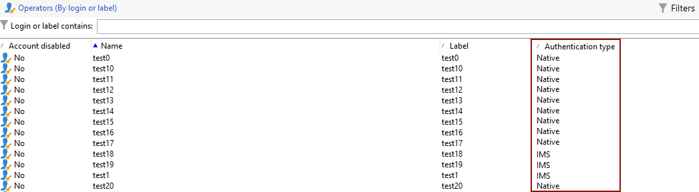

# Migrera kampanjoperatorer till Adobe Identity Management System (IMS) {#migrate-users-to-ims}

Som en del i arbetet med att stärka säkerhets- och autentiseringsprocessen rekommenderar Adobe Campaign att man migrerar slutanvändarens autentiseringsläge från den inbyggda autentiseringen av inloggnings-/lösenordsinformationen till Adobe Identity Management System (IMS). Alla operatorer ska implementera [Adobe Identity Management System (IMS)](https://helpx.adobe.com/enterprise/using/identity.html){target="_blank"} för att ansluta till Campaign.

Läs mer om migreringen på [den här sidan](ac-ims.md).

## Vad har ändrats? {#move-to-ims-changes}

Med Campaign Classic kan alla vanliga användare redan ansluta till Adobe Campaign klientkonsol via Adobe ID via Adobe Identity Management System (IMS). Det finns dock fortfarande användar-/lösenordsanslutningar. Detta är inte längre tillåtet med Campaign v8.

Som en del av arbetet med att förstärka säkerhets- och autentiseringsprocessen anropar nu Adobe Campaign klientprogram Campaign-API:er direkt med IMS-token för tekniskt konto. Migreringen för tekniska operatorer beskrivs i en dedikerad artikel på [den här sidan](ims-migration.md).

Den här ändringen gäller redan i Campaign Classic v7 och kommer att vara **obligatorisk** för att gå över till Campaign v8.

Adobe stöder dig i den här migreringen. Detaljerade riktlinjer för sammanhang och steg för steg finns i artikeln nedan.

## Påverkas du?{#migrate-ims-impacts}

Den här proceduren gäller alla Campaign-användare som inte redan ansluter till Campaign med sin Adobe ID.

Om operatörer i organisationen ansluter till Campaign-klientkonsolen med hjälp av sina inloggnings-/lösenord (dvs. inbyggd autentisering) påverkas du och bör migrera dessa operatorer till Adobe IMS enligt nedan.

Migrering till [Adobe Identity Management System (IMS)](https://helpx.adobe.com/enterprise/using/identity.html){target="_blank"} är ett säkerhetskrav för att göra dina miljöer säkra och standardiserade, eftersom de flesta andra Adobe Experience Cloud-lösningar och -appar redan finns på IMS.

Den här ändringen gäller från och med Campaign Classic v7.4.1 (och den senaste [IMS-migreringskompatibla versionen](ac-ims.md#ims-versions)) och är **obligatorisk** att flytta till Adobe Campaign v8.

## Hur migrerar värdmiljöer och Managed Services-miljöer? {#ims-migration-procedure}

### Förhandskrav {#ims-migration-prerequisites}

Innan du startar migreringsprocessen måste du kontakta din Adobe Transition Manager (för Managed Services-kunder) eller Adobe kundtjänst (för andra värdkunder) så att Adobe tekniska team kan migrera dina befintliga Operator-grupper och namngivna rättigheter till Adobe Identity Management System (IMS).

### Viktiga steg {#ims-migration-steps}

Viktiga steg för migreringen visas nedan:

1. Adobe uppgraderar dina miljöer till Campaign v7.4.1 (eller en [IMS-migreringskompatibel version](ac-ims.md#ims-versions)).
1. Efter uppgraderingen kan du fortfarande skapa nya användare med båda metoderna, som systemspecifik användare eller med IMS.
1. Din interna Campaign-administratör måste lägga till unika e-postmeddelanden till alla inbyggda användare på Campaign-klientkonsolen och bekräfta för din Adobe-representant/kundtjänst när detta är klart.  Det här steget beskrivs närmare i [det här avsnittet](#ims-migration-id).
1. Samarbeta med er Adobe-representant/kundtjänst för att säkra ett datum då Adobe kan genomföra automatiserad migrering för icke-tekniska användare (operatörer) och produktprofiler. Det här steget kräver ett timmars fönster utan driftstopp för någon av dina tjänster.
1. Din interna Campaign-administratör validerar dessa ändringar och godkänner dem. Efter den här migreringen får du inte längre skapa någon ytterligare operator som autentiseras med användarens inloggning och lösenord.

Du kan också migrera dina tekniska operatorer till Adobe Developer Console enligt informationen i [den här tekniken](ims-migration.md).

När migreringen är klar bekräftar du till din Adobe Transition Manager (för Managed Services-användare) eller till kundtjänst på Adobe (för värdkunder). Adobe markerar sedan migreringen som slutförd. Miljön är sedan säker och standardiserad.

## Hur migrerar hybridmiljöer och lokala miljöer? {#ims-migration-procedure-on-prem}

Viktiga steg för migreringen visas nedan:

1. Uppgradera dina miljöer till Campaign v7.4.1 (eller en [IMS-migreringskompatibel version](#ims-versions)).
1. Efter uppgraderingen kan du fortfarande skapa nya användare med båda metoderna, som systemspecifik användare eller med IMS.
1. Din interna Campaign-administratör måste konfigurera Adobe IMS enligt anvisningarna i [det här avsnittet](../../integrations/using/configuring-ims.md).
1. Lägg sedan till unika e-postmeddelanden till alla inbyggda användare på Campaign-klientkonsolen. Det här steget beskrivs närmare i [det här avsnittet](#ims-migration-id).
1. Skapa användare och produktprofiler i Adobe Admin Console enligt informationen i [Campaign v8-dokumentationen](https://experienceleague.adobe.com/docs/campaign/campaign-v8/admin/permissions/manage-permissions.html){target="_blank"}.
1. Aktivera alternativet **Anslut med Adobe ID** för alla operatorer.
1. Implementera Adobe IMS för din anslutning enligt informationen på [den här sidan](../../integrations/using/implementing-ims.md).

Du kan också migrera dina tekniska operatorer till Adobe Developer Console enligt informationen i [den här tekniken](ims-migration.md).

## Vanliga frågor och svar {#ims-migration-faq}

### Hur skapar man användare efter migreringen? {#ims-migration-native}

Adobe rekommenderar att du bara skapar IMS-användare efter uppgradering till Campaign Classic v7.4.1 (eller en [IMS-migreringskompatibel version](#ims-versions)).
Från och med Campaign v7.4.1 kan du förhindra att interna operatorer skapas genom att uppdatera instanskonfigurationen enligt informationen på [den här sidan](impact-ims-migration.md).

Som Campaign-administratör kan du bevilja behörigheter till användare i din organisation via Adobe Admin Console och Campaign Client Console. Användare loggar in på Adobe Campaign med sin Adobe ID. Lär dig hur du konfigurerar behörigheter med IMS i [dokumentationen för Campaign v8](https://experienceleague.adobe.com/docs/campaign/campaign-v8/admin/permissions/gs-permissions.html){target="_blank"}.

### Hur lägger jag till e-post för befintliga användare? {#ims-migration-id}

Som kampanjadministratör måste du lägga till e-post-ID:n till alla inbyggda användare från klientkonsolen. Gör så här:

1. Anslut till klientkonsolen och bläddra till **Administration > Åtkomsthantering > Operatorer**.
1. Välj den operator som ska uppdateras i operatorlistan.
1. Ange operatörens e-postadress i avsnittet **Kontaktpunkter** i operatorformuläret.
1. Spara ändringarna.

<!--You can also import a CSV file to update all your operator profiles with their email.-->

### Hur loggar jag in på Campaign via IMS? {#ims-migration-log}

Lär dig hur du ansluter till Campaign med din Adobe ID i [det här avsnittet](../../integrations/using/implementing-ims.md).

### Kommer det att bli några driftavbrott under den här migreringen? {#ims-migration-downtime}

För kunder som använder Hosted och Managed Services behöver Adobe ett timmars fönster utan driftstopp för någon av dina instanser (arbetsflöden osv.) för att slutföra migreringen (migrera användare och produktprofiler).

Under den här tidsramen måste alla Campaign-användare logga ut och logga in igen med sin Adobe ID när migreringen till IMS är klar.

Adobe rekommenderar starkt att alla användare loggas ut under migreringsfönstret.

### Användare i min organisation använder redan IMS, behöver jag ändå utföra IMS-migrering?{#ims-migration-needed}

Det finns två aspekter av migreringen: migrering av slutanvändare (plus produktprofiler) och migrering av tekniska användare (används i API:er i din anpassade kod).

Om alla användare (kampanjansvariga) använder IMS måste du ändå kontakta din Adobe-representant/kundsupport för att planera migreringen av produktprofiler. Du måste också migrera tekniska användare som du kan ha använt i anpassad kod. Läs mer på [den här sidan](ims-migration.md).

### Hur visar jag din operatörs autentiseringstyp?

Lär dig hur du visar operatörernas autentiseringstyp i Campaign:

1. I **Utforskaren** öppnar du **Administration** `>` **Åtkomsthantering** `>` **Operatorer**.

1. Högerklicka på rubrikraden och välj menyn **Konfigurera lista** .

   

1. Lägg till **Konto inaktiverat** och **autentiseringstyp** som **Utdatakolumner**.

   

Du kan nu se listan över dina **operatorer** och deras **autentiseringstyp**.

>[!MORELIKETHIS]
>
>* [Migrering av tekniska användare till Adobe Developer-konsolen](ims-migration.md)
>* [Versionsinformation om Adobe Campaign Classic v7](../../rn/using/latest-release.md)
>* [Vad är Adobe Identity Management System (IMS)](https://helpx.adobe.com/enterprise/using/identity.html){target="_blank"}
