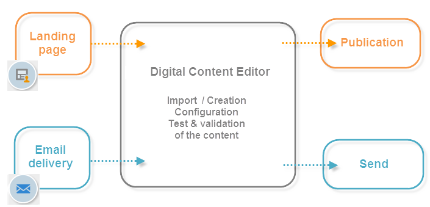

# Om Campaign HTML-redigerare{#about-campaign-html-editor}

DCE ( **Digital Content Editor)** är en redigerare för HTML-innehåll som gör att du enkelt kan skapa eller ändra mallar eller innehåll i HTML-format i Adobe Campaign.

Med redigeraren för digitalt innehåll kan du infoga och formatera sidelement och associera databasfält med element från en HTML-sida. Den erbjuds som standard när du skapar en sida för ett webbprogram, eller är tillgänglig när du skapar leveranser som baseras på en mall där den är aktiv.

>[!NOTE]
>
>I DCE kan du bara utföra de åtgärder som beskrivs i det här avsnittet.
>
>Om du vill lägga till JavaScript-kod på serversidan är det bättre att lägga till den i anpassningsblock. Mer information om hur du skapar och ändrar personaliseringsblock finns på [den här sidan](../../delivery/using/personalization-blocks.md).

>[!CAUTION]
>
>Av sekretesskäl rekommenderar vi att du använder HTTPS för alla externa resurser.

## Allmän åtgärd i Innehållsredigeraren {#content-editor-general-operation}

I det här avsnittet beskrivs de viktigaste stegen för att redigera och överföra innehåll som redigeras med DCE inom ramen för ett webbprogram och i samband med en leverans.

Den allmänna åtgärden är följande:

Så här skapar du ett enkelt webbprogram:

* Skapa ett webbprogram, mer information finns i [Skapa en landningssida](../../web/using/creating-a-landing-page.md),
* Välj befintligt innehåll eller skapa innehåll från en standardmall. Mer information finns i [Mallhantering](../../web/using/template-management.md).
* Mer information om detta finns i [Redigera innehåll](../../web/using/editing-content.md).
* Publicera webbprogrammet. Mer information finns i [Publicera innehåll](../../web/using/creating-a-landing-page.md#step-3---publishing-content) och på [den här sidan](../../web/using/publishing-a-web-form.md#managing-web-forms-delivery-and-tracking).

>[!NOTE]
>
>Ett fullständigt exempel som beskriver hur DCE implementeras inom ramen för ett webbprogram finns i [Skapa en landningssida](../../web/using/creating-a-landing-page.md).

Så här skapar du en e-postleverans:

* Skapa en leverans från en e-posttypsmall där DCE är aktiv,
* Välj befintligt innehåll eller skapa innehåll från en standardmall,
* Redigera och konfigurera onlinematerial,
* Skicka leveransen. Mer information finns i [det här avsnittet](../../delivery/using/communication-channels.md).

>[!NOTE]
>
>Ett fullständigt exempel som beskriver implementeringen av DCE inom ramen för en e-postleverans finns i [det här användningsexemplet](../../web/using/use-case--creating-an-email-delivery.md).

