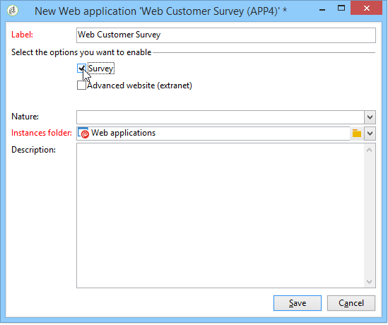

# Om webbprogram{#about-web-applications}

Med Adobe Campaign kan ni skapa och publicera dynamiska och interaktiva webbapplikationer med data från databasen och innehåll som är anpassat efter den anslutna användarens rättigheter.

Du kan skapa sidor, t.ex. ett redigeringsformulär på ett extranät, eller meddelandeformulär som innehåller data från databasen med tabeller, diagram, indataformulär osv. Med den här funktionen kan du utforma och publicera webbsidor där användarna kan leta upp eller ange information.

Detta kan vara ett prenumerationsformulär som innehåller data som har lästs in i förväg med information som finns i Adobe Campaign-databasen, vilket visas nedan:

I det här kapitlet finns en översikt över hur du hanterar webbprogram.

>[!NOTE]
>
>Läs checklistan [för](https://helpx.adobe.com/campaign/kb/acc-security.html) säkerhet och sekretess om du vill veta hur du optimerar säkerheten för webbprogram.

>[!CAUTION]
>
>Av sekretesskäl rekommenderar vi att du använder HTTPS för alla externa resurser.

## Webbprogramsomfång {#web-application-scope}

Webbprogram i Adobe Campaign ger tillgång till följande funktioner:

* Skapa flersidiga formulär. Mer information finns på den här [sidan](../../web/using/about-web-forms.md).
* Hantering av flerspråkiga enkäter med ett integrerat översättningsverktyg. Mer information finns på den här [sidan](../../web/using/translating-a-web-application.md).
* Grafiskt sidhanteringsgränssnitt, sidlayout med flera kolumner. Mer information finns på den här [sidan](../../web/using/designing-a-web-application.md).
* Återger personalisering och fältposition. Mer information finns på den här [sidan](../../web/using/editing-content.md#adding-personalization-content).
* Villkorlig visning av undersökningsfält enligt svar. Mer information finns på den här [sidan](../../web/using/form-rendering.md#defining-fields-conditional-display).
* Slumpmässig visning av frågor. Mer information finns på den här [sidan](../../web/using/building-a-survey.md#adding-questions).
* Villkorlig sidvisning. Mer information finns på den här [sidan](../../web/using/defining-web-forms-page-sequencing.md#conditional-page-display).
* Informationskontroll före validering beroende på den förväntade datatypen (nummer, e-postadress, datum osv.) och de obligatoriska fälten. Mer information finns på den här [sidan](../../web/using/form-rendering.md#defining-control-settings).
* Skicka inbjudningar eller meddelanden via e-post. Mer information finns på den här [sidan](../../web/using/publishing-a-web-form.md#delivering-a-form-via-email).
* Personalisering av fel- och slutmeddelanden. Mer information finns på den här [sidan](../../web/using/defining-web-forms-properties.md#setting-up-an-error-page).
* Användning av bilder, videor, hypertextlänkar, captcha osv. Mer information finns på den här [sidan](../../web/using/editing-content.md).
* Övervakning av svar i realtid. Mer information finns på den här [sidan](../../web/using/publish--track-and-use-collected-data.md#response-tracking).

Den valfria modulen för att skapa **enkäter** har följande extrafunktioner:

* Databasens dynamiska tillägg: Skapa svar som inte ingår i den ursprungliga datamallen. Mer information finns på den här [sidan](../../web/using/managing-answers.md#storing-collected-answers).
* Genererar dedikerade rapporter. Mer information finns på den här [sidan](../../web/using/publish--track-and-use-collected-data.md#reports-on-surveys).

Jämfört med webbprogram har enkäterna ett förenklat grafiskt gränssnitt med ett reducerat antal redigeringskontroller.

>[!NOTE]
>
>Undersökningar finns i [detta avsnitt](../../web/using/about-surveys.md).
>
>De övergripande funktionerna för webbformulär i Adobe Campaign beskrivs i [det här avsnittet](../../web/using/about-web-forms.md).

## Implementering av webbapplikationer {#web-application-implementation}

Om du vill skapa och publicera ett webbprogram måste du:

1. Skapa innehållet (fält, listor, tabeller, diagram osv.).

   Du kan även visa avsnittet som innehåller information om tillgängliga formulärfält: alla dessa fält är också tillgängliga för webbprogram. Den här informationen finns på [den här sidan](../../web/using/adding-fields-to-a-web-form.md).

1. Vid behov kan du lägga till förinläsnings-, test- och sparningssteg och konfigurera åtkomstkontrollsystemet (huvudsakligen inom ramen för en extranätpublikation).
1. Publicera webbprogrammet så att det blir tillgängligt på ett extranät eller i Adobe Campaign.

## Ursprunglig konfiguration för webbprogram {#web-application-initial-configuration}

Webbprogram skapas via **[!UICONTROL Web Applications]** länken på flikarna **[!UICONTROL Campaigns]** och **[!UICONTROL Profiles and targets]** .

Webbprogram lagras i noden **[!UICONTROL Resources > Online > Web Applications]** i Adobe Campaign-trädet. Konfigurationerna är uppdelade i följande mappar:

* **[!UICONTROL Administration > Configuration > Form renderings]**: innehåller återgivningsmallar för webbformulärpresentationen (program och undersökningar). Med mallen kan du generera formuläret. En CSS-formatmall används också. Den här formatmallen kan överladdas på mallnivå. For more on this, refer to [this page](../../web/using/form-rendering.md#selecting-the-form-rendering-template).
* **[!UICONTROL Resources > Templates > Web application templates]**: innehåller formulärmallar. Om du vill skapa ett formulär eller ett webbprogram måste du utgå från en mall.

## Mallar för webbprogram {#web-application-templates}

Som standard innehåller Adobe Campaign en mall per tillgängligt webbprogram.

>[!NOTE]
>
>Du kan konvertera ett befintligt webbprogram till en mall. Om du vill göra det markerar du formuläret och högerklickar. Välj **[!UICONTROL Actions > Save as template...]**.

Du kan skapa nya mallar via noden **[!UICONTROL Resources > Templates > Web Application templates]** i Adobe Campaign-trädet.

Med guiden Skapa kan du välja de alternativ som du vill aktivera, vilket visas nedan.

>[!CAUTION]
>
>Vilka program som är tillgängliga beror på vilka alternativ och moduler du har. Kontrollera licensavtalet.

