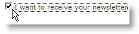

# Lägg till fält i ett webbformulär{#adding-fields-to-a-web-form}

I ett webbformulär gör fälten det möjligt för användare att ange information och välja alternativ. Webbformulär kan innehålla inmatningsfält, urvalsfält, statiskt och avancerat innehåll (bildtexter, prenumerationer osv.).

När du använder guiden för att lägga till fält identifieras fälttypen automatiskt baserat på det valda fältet eller lagringsvariabeln. Du kan redigera den med **[!UICONTROL Type]** nedrullningsbar listruta i **[!UICONTROL General]** -fliken.

När du använder knapparna i verktygsfältet markerar du den typ av fält som du vill lägga till.

Följande fälttyper är tillgängliga:

* Text-/sifferinmatning. Se [Lägga till inmatningsfält](#adding-input-fields).
* Välj nedrullningsbar lista. Se [Lägga till nedrullningsbara listor](#adding-drop-down-lists).
* Flera alternativ via kryssrutor. Se [Lägga till kryssrutor](#adding-checkboxes).
* Exklusivt val via alternativknappar. Se [Lägga till alternativknappar](#adding-radio-buttons).
* Rösta i ett alternativrutnät. Se [Lägga till stödraster](#adding-grids).
* Nummer och datum. Se [Lägga till datum och nummer](#adding-dates-and-numbers).
* Prenumeration/avprenumeration på en informationstjänst. Se [Kryssrutor för prenumeration](#subscription-checkboxes).
* Captcha-validering. Se [Infoga en captcha](#inserting-a-captcha).
* Knappen Hämta. [Överföra en fil](#uploading-a-file).
* Dold konstant. Se [Infoga en dold konstant](#inserting-a-hidden-constant).

Ange svarslagringsläget: uppdaterar ett fält i databasen (lagrar endast det senast sparade värdet) eller lagrar det i en variabel (svaret lagras inte). Mer information finns i [Svarslagringsfält](web-forms-answers.md#response-storage-fields).

>[!NOTE]
>
>Som standard infogas fältet längst ned i det aktuella trädet. Använd pilarna i verktygsfältet för att flytta det uppåt eller nedåt.

## Guiden Skapa fält {#field-creation-wizard}

För varje sida i formuläret kan du lägga till ett fält via den första knappen i verktygsfältet. För att göra det går du till **[!UICONTROL Add using the wizard]** -menyn.

Välj den typ av fält som du vill skapa: du kan välja att lägga till ett fält i databasen, en variabel eller att importera en grupp med fält som har skapats i ett annat formulär och samlats in i en behållare.

Klicka **[!UICONTROL Next]** och markerar lagringsfältet eller variabeln, eller den behållare som du vill importera.

Klicka **[!UICONTROL Finish]** för att infoga det markerade fältet på sidan.

## Lägga till inmatningsfält {#adding-input-fields}

Om du vill lägga till ett inmatningsfält klickar du på **[!UICONTROL Input control]** och välj vilken typ av fält du vill lägga till.

### Typer av indatafält {#types-of-input-fields}

Fem olika typer av textfält kan infogas på en formulärsida:

* **Text**: gör att användaren kan skriva en text på en rad.

   

* **Nummer**: gör att användaren kan ange ett nummer på en rad. Mer information finns i [Lägga till tal](#adding-numbers).

   När sidan har godkänts kontrolleras fältinnehållet för att kontrollera att det angivna värdet är kompatibelt med fältet. Mer information finns i [Definiera kontrollinställningar](form-rendering.md#defining-control-settings).

* **Lösenord**: gör att användaren kan skriva text på en rad. Under textinmatning ersätts tecknen med punkter:

   

   >[!CAUTION]
   >
   >Lösenord lagras okrypterade i databasen.

* **Flerradstext**: gör att användaren kan skriva text på flera rader.

   

   >[!CAUTION]
   >
   >Flerradiga textfält är specifika fält som kan innehålla vagnreturer. Deras lagringsutrymme måste associeras med ett fält som är mappat till ett XML-element, inte ett XML-attribut.

* **Förbättrad text med flera rader**: gör att användaren kan skriva text med en layout som ska sparas i HTML-format.

   

   Du kan välja vilken typ av redigerare som ska vara tillgänglig för användarna. Använd listrutan i dialogrutan **[!UICONTROL HTML editor]** i **[!UICONTROL Advanced]** -fliken.

   

   Hur många ikoner som visas varierar beroende på vilken typ av redigerare som används. För **[!UICONTROL Advanced]** redigeraren kommer återgivningen att se ut så här:

   

### Konfigurera inmatningsfält {#configure-input-fields}

Indatafält konfigureras alla baserat på samma läge med följande alternativ:

The **[!UICONTROL General]** kan du ange fältets namn och vid behov tilldela det ett standardvärde.

Svarslagringsläget kan ändras via **[!UICONTROL Edit storage...]** länk. Värdena kan lagras i ett befintligt fält i databasen. eller så kan du välja att inte spara information i databasen (använd en lokal variabel).

>[!NOTE]
>
>Lagringslägen beskrivs i [Svarslagringsfält](web-forms-answers.md#response-storage-fields)

The **[!UICONTROL Advanced]** Med -fliken kan du definiera visningsparametrar för fältet (placering av etiketter, justering osv.). Se [Definiera webbformulärslayout](defining-web-forms-layout.md).

## Lägga till nedrullningsbara listor {#adding-drop-down-lists}

Du kan infoga en nedrullningsbar lista på en undersökningssida. På så sätt kan användaren välja ett värde bland dem som finns i en nedrullningsbar meny.

Om du vill lägga till en listruta på en formulärsida klickar du på **[!UICONTROL Selection controls > Drop-down list]** i verktygsfältet i sidredigeraren.

Välj svarslagringsläge och bekräfta ditt val.

Definiera etiketter och värden för listan i nedre delen av **[!UICONTROL General]** -fliken. Om informationen lagras i ett befintligt fält i databasen och det är ett uppräkningsfält, kan du fylla i värdena automatiskt genom att klicka **[!UICONTROL Initialize the list of values from the database]** , enligt nedan:

>[!NOTE]
>
>Använd pilarna till höger om värdelistan för att ändra deras ordningsföljd.

Om data lagras i en länkad tabell kan du markera det fält där de värden som ska föreslås i listan sparas. Om du t.ex. väljer en landstabell klickar du på **[!UICONTROL Initialize the list of values from the database...]** och markera önskat fält.

Klicka sedan på **[!UICONTROL Load]** länk för att hämta värdena:

>[!CAUTION]
>
>Upprepa den här åtgärden när listan uppdateras för att uppdatera värdena i erbjudandet.

## Lägga till kryssrutor {#adding-checkboxes}

För att användaren ska kunna välja ett alternativ måste du använda en kryssruta.

Om du vill lägga till en kryssruta i ett formulär klickar du på **[!UICONTROL Selection controls > Checkbox...]** i verktygsfältet i sidredigeraren.

Välj svarslagringsläge och bekräfta ditt val.

Ange etiketten för rutan i dialogrutan **[!UICONTROL Label]** fält för **[!UICONTROL General]** -fliken.

Med en kryssruta kan du tilldela ett värde till lagringsfältet (eller värdet) beroende på om kryssrutan är markerad eller inte. The **[!UICONTROL Values]** kan du ange vilket värde som ska tilldelas om rutan är markerad (i **[!UICONTROL Value]** -fält) och det värde som ska tilldelas om det inte är markerat (i **[!UICONTROL Empty value]** fält). Dessa värden beror på datalagringsformatet.

Om lagringsfältet (eller variabeln) är booleskt, dras värdet som ska tilldelas om rutan inte är markerad automatiskt från. I det här fallet är det bara **[!UICONTROL Value if checked]** -fält erbjuds enligt nedan:

## Exempel: Tilldela ett värde till ett fält om en ruta är markerad {#example--assign-a-value-to-a-field-if-a-box-is-checked}

Vi vill infoga en kryssruta i ett formulär för att skicka en underhållsbegäran, som visas nedan:

Informationen överförs till databasen och till ett befintligt fält (i det här fallet **[!UICONTROL Comment]** fält):

Om rutan &quot;Maintenance required&quot; (Underhåll krävs) är markerad visas **[!UICONTROL Comment]** kommer att innehålla &quot;Maintenance required&quot;. Om rutan inte är markerad visas &quot;Maintenance not required&quot; i kolumnen. Om du vill få det här resultatet använder du följande konfiguration i kryssrutan på formulärsidan:

## Lägga till alternativknappar {#adding-radio-buttons}

Med alternativknappar kan du erbjuda användaren en serie exklusiva alternativ att välja bland. Det här är olika värden för samma fält.

Du kan skapa alternativknappar var för sig (enhetsknappar) eller via en flervalslista, men eftersom alternativknapparna ska markera ett alternativ skapar vi alltid minst ett par alternativknappar, aldrig bara en enda knapp.

>[!CAUTION]
>
>Om du vill göra markeringen obligatorisk måste du skapa en flervalslista.

### Lägg till enskilda knappar {#add-single-buttons}

Om du vill lägga till en alternativknapp på en formulärsida går du till **[!UICONTROL Selection controls > Radio button]** i verktygsfältet i sidredigeraren och välj ett lagringsläge.

Alternativknappar konfigureras på ungefär samma sätt som kryssrutor (se [Lägga till kryssrutor](#adding-checkboxes)). Inget värde tilldelas dock om alternativet inte är markerat. Om flera knappar ska vara beroende av varandra, d.v.s. om du markerar en av dem avmarkeras de andra automatiskt, måste de lagras i samma fält. Om de inte lagras i databasen måste samma lokala variabel användas för tillfällig lagring. Se [Svarslagringsfält](web-forms-answers.md#response-storage-fields).

### Lägga till en lista med knappar {#add-a-list-of-buttons}

Om du vill lägga till alternativknappar via en lista går du till **[!UICONTROL Selection controls>Multiple choice]** i verktygsfältet i sidredigeraren.

Lägg till så många alternativknappar som det finns etiketter för. Fördelen med den här funktionen är att du kan importera värden från ett befintligt fält (om det är ett specificerat fält) och låta användaren välja ett alternativ. Layouten för knappar är dock mindre flexibel.

>[!NOTE]
>
>Du kan inte aktivera flerval i ett webbprogram.
>Du kan dock infoga en **[!UICONTROL Multiple choice]** textfält till ett webbprogram, men då kan användaren inte välja flera värden.

## Lägga till stödraster {#adding-grids}

Rutnät används för att utforma röstsidor i webbprogram. På så sätt kan du erbjuda en lista med alternativknappar för att besvara enkät- eller utvärderingstyper på webbformulär, som visas nedan:

Om du vill använda den här typen av element i ett formulär skapar du ett enkelt rutnät och lägger till en linje för varje element som ska utvärderas.

Antalet alternativknappar på varje rad i rutnätet matchar antalet värden som definieras i det enkla rutnätet.

Endast ett alternativ kan väljas per stödlinje.

>[!NOTE]
>
>I vårt exempel är rutnätets etikett dold. För att göra det går du till **[!UICONTROL Advanced]** -fliken **[!UICONTROL Label position]** display definieras som **[!UICONTROL Hidden]** . Se [Definiera placeringen av etiketter](defining-web-forms-layout.md#defining-the-position-of-labels).

## Lägga till datum och nummer {#adding-dates-and-numbers}

Innehållet i formulärfälten kan formateras så att de matchar data som lagras i databasen eller så att de uppfyller ett visst krav. Du kan skapa lämpliga fält för inmatning av siffror och datum.

### Lägga till datum {#adding-dates}

Om du vill att användaren ska kunna ange ett datum på en formulärsida lägger du till ett inmatningsfält och väljer typ **[!UICONTROL Date...]**.

Ange en etikett för fältet och konfigurera datalagringsläget.

I fönstrets nedre del kan du välja datum- och tidsformat för de värden som lagras i det här fältet.

Du kan också välja att inte visa datum (eller tid).

Du kan välja datum via en kalender eller listruta. Du kan också ange dem direkt i fältet, men de måste matcha det format som anges på skärmen ovan.

>[!NOTE]
>
>Som standard anges datum som används i formulär via en kalender. För flerspråkiga formulär bör du kontrollera att kalendrar finns tillgängliga på alla språk som används. Se [Översätta ett webbformulär](translating-a-web-form.md).

I vissa fall kan det dock vara enklare att använda nedrullningsbara listor (till exempel när du anger födelsedatum).

Om du vill göra det klickar du på **[!UICONTROL Advanced]** och välj indataläge med **[!UICONTROL Drop-down lists]**.

Du kan sedan ange gränser för de värden som finns i listan.

### Lägga till tal {#adding-numbers}

Du kan skapa lämpliga fält för inmatning av tal.

I ett numeriskt fält kan användaren bara ange siffror. Inmatningskontrollen används automatiskt när sidan godkänns.

Beroende på i vilket fält data lagras i databasen kan särskild formatering eller vissa begränsningar användas. Du kan också ange högsta och lägsta värden. Den här fälttypen är konfigurerad på följande sätt:

Standardvärdet är det värde som visas i fältet när formuläret publiceras. Den kan korrigeras av användaren.

Du kan lägga till ett prefix och/eller suffix i det numeriska fältet via **[!UICONTROL Advanced]** enligt nedan:

I formuläret kommer återgivningen att se ut så här:

## Kryssrutor för prenumeration {#subscription-checkboxes}

Du kan lägga till kontroller som tillåter användare att prenumerera på eller avbryta prenumerationen på en eller flera informationstjänster (nyhetsbrev, varningar, meddelanden i realtid osv.). Användaren kontrollerar motsvarande tjänst för att prenumerera.

Om du vill skapa en prenumeration klickar du på **[!UICONTROL Advanced controls>Subscription]**.

Ange kryssrutans etikett och välj informationstjänst med **[!UICONTROL Service]** nedrullningsbar listruta.

>[!NOTE]
>
>Informationstjänster beskrivs i [den här sidan](../../delivery/using/managing-subscriptions.md).

Användaren prenumererar på tjänsten genom att markera det relevanta alternativet.

>[!CAUTION]
>
>Om användaren redan prenumererar på en informationstjänst och kryssrutan som är länkad till den här tjänsten inte är markerad när han eller hon godkänner formuläret, kommer han/hon att avbeställa prenumerationen.

## Infoga en captcha {#inserting-a-captcha}

Syftet med **captcha** testerna för att förhindra att dina webbformulär används på ett bedrägligt sätt.

>[!CAUTION]
>
>Om formuläret innehåller flera sidor måste Captcha alltid placeras på den sista sidan, precis före lagringsrutan, för att förhindra att säkerhetsåtgärder kringgås.

Om du vill infoga en Captcha i ett formulär klickar du på den första knappen i verktygsfältet och väljer **[!UICONTROL Advanced controls>Captcha]**.

Ange fältets etikett. Den här etiketten visas framför Captcha-visningsområdet. Du kan ändra placeringen av den här etiketten i dialogrutan **[!UICONTROL Advanced]** -fliken.

>[!NOTE]
>
>För **[!UICONTROL captcha]** typkontroller, du behöver inte ange ett lagringsfält eller en variabel.

Captcha infogas på sidan med ett inmatningsfält under den visuella informationen. Dessa två element kan inte separeras och betraktas som ett objekt i sidlayouten (de upptar en enda cell).

När sidan har bekräftats visas inmatningsfältet i rött om innehållet i Captcha inte har angetts korrekt.

Du kan skapa ett felmeddelande som ska visas. Om du vill göra det använder du **[!UICONTROL Personalize the message]** i **[!UICONTROL General]** -fliken.

>[!NOTE]
>
>Bildtexter är alltid åtta tecken långa. Du kan inte ändra det här värdet.

## Överföra en fil {#uploading-a-file}

Du kan lägga till ett överföringsfält på en sida. Den här funktionen kan vara användbar för fildelning i intranät.

Om du vill infoga ett överföringsfält på en formulärsida väljer du **[!UICONTROL Advanced controls > File...]** i verktygsfältet i sidredigeraren.

Som standard lagras de överförda filerna i resursfiler som är tillgängliga via **[!UICONTROL Resources > Online > Public resources]** -menyn. Du kan använda ett skript för att ändra det här beteendet. Skriptet kan använda funktionerna som definieras i [Kampanj-JSAPI-dokumentation](https://experienceleague.adobe.com/developer/campaign-api/api/index.html?lang=sv), inklusive sådana som rör filhantering.

Du kan lagra länken till dessa filer i en lokal variabel eller i ett databasfält. Du kan till exempel utöka mottagarschemat för att lägga till en länk till filbaserade resurser.

>[!CAUTION]
>
>* Den här filtypen måste reserveras för formulär med säker åtkomst (med hjälp av autentiseringsuppgifter).
>* Adobe Campaign kontrollerar inte storleken eller typen av resurs som överförts: Därför rekommenderar vi att du endast använder överföringsfält för säkra intranätplatser.
>* Om flera servrar är länkade till instansen (belastningsutjämningsarkitektur) måste du se till att anrop till webbformuläret kommer fram på samma server.
>* Dessa implementeringar kräver hjälp av Adobe Campaign Consulting-teamet.
>

## Infoga en dold konstant {#inserting-a-hidden-constant}

När användaren validerar en av sidorna i formuläret kan du ange ett specifikt värde för ett fält i profilen eller för en variabel.

Det här fältet är inte synligt för användaren, men kan användas för att utöka data i användarprofilen.

Om du vill göra det placerar du en **konstant** på sidan och ange värde och lagringsplats.

I följande exempel **ursprung** fält i mottagarprofilen fylls i automatiskt när en användare godkänner den här sidan. Konstanten visas inte på sidan.

