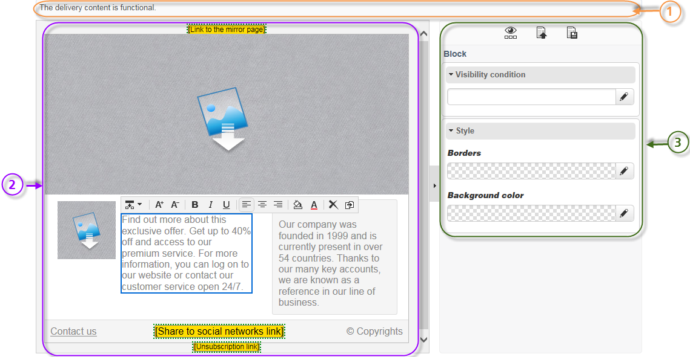
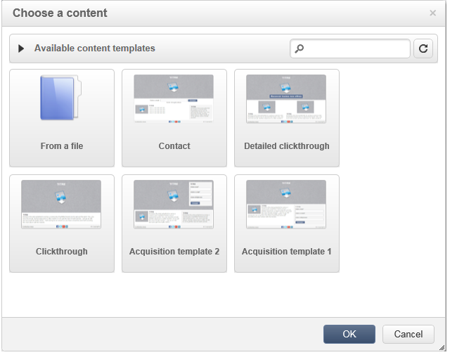
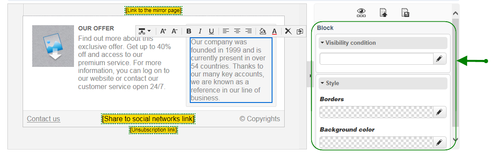

# Gränssnitt för innehållsredigering{#content-editor-interface}

## Redigeringsfönster {#editing-window}

DCE-redigeringsfönstret är indelat i tre olika avsnitt. De gör att du kan visa, ändra och kontrollera innehållets status.

1. Det **övre** avsnittet är ett visningsområde för meddelanden till användaren. Dessa meddelanden anger status för webbprogrammet eller leveransen som skapas, liksom varningar och felmeddelanden för innehållet. Mer information finns i [HTML-innehållsstatus](../../web/using/content-editing-best-practices.md#html-content-statuses).
1. Avsnittet till **vänster** om fönstret är området där du kan redigera innehåll. I det här området kan användaren interagera direkt med innehållet via popup-verktygsfältet: infoga en länk i en bild, ändra teckensnitt, ta bort ett fält osv. Mer information finns i [Redigera formulär](../../web/using/editing-content.md#editing-forms).
1. Avsnittet till **höger** om fönstret är kontrollpanelens område. I det här området grupperas de olika alternativen för redigeraren, särskilt de som gäller konfigurering av sidrubriken och allmänna alternativ för ett block: lägga till en kant, länka ett databasfält med en indatazon, få åtkomst till egenskaper för webbsidor, osv. Mer information finns i avsnitten [Globala alternativ](#global-options) och [Redigera innehåll](../../web/using/editing-content.md) .

## Globala alternativ {#global-options}

I den övre högra delen av redigeraren kan du komma åt globala alternativ som gör att du kan styra det innehåll som skapas just nu.

Den har fyra ikoner:

* Med ikonen **Visa/dölj block** kan du visa blå ramar runt innehållsblocken (motsvarar `
` HTML-taggen).

* Med ikonen **Välj ett annat innehåll** kan användaren läsa in nytt innehåll från en mall (befintlig mall eller en mall som inte är installerad).

   

   >[!CAUTION]
   >
   >Det markerade innehållet ersätter det aktuella innehållet.

* Med ikonen **Spara som mall** kan du spara det aktuella innehållet som en mall. Du måste ange mallens etikett och interna namn. Mallar lagras i **[!UICONTROL Resources > Templates > Content templates]** noden.

   

   När mallen har sparats är den tillgänglig och kan markeras när du skapar nytt innehåll.

   

* Med ikonen **Sidegenskaper** kan du markera innehållsinformation högst upp på HTML-sidan.

   

   >[!NOTE]
   >
   >Den här informationen motsvarar taggarna **`<title>`** och **`<meta>`** HTML på sidan.
   >
   >Nyckelorden måste avgränsas med kommatecken.

## Blockalternativ {#block-options}

Avsnittet till höger om redigeraren grupperar huvudalternativen som gör att du kan agera på innehållet. Om du vill visa dessa alternativ måste du markera ett block: vilken typ av alternativ det är beror på vilket block som är markerat.

Du kan:

* Bestäm visningen för ett eller flera block, se [Definiera ett synlighetsvillkor](../../web/using/editing-content.md#defining-a-visibility-condition).
* Definiera kanter och ramar, se [Lägga till en kant och bakgrund](../../web/using/editing-content.md#adding-a-border-and-background).
* Definiera bildattribut (storlek, bildtext), se [Redigera bildegenskaper](../../web/using/editing-content.md#editing-image-properties),
* Länka databasen till ett formulärelement (indatazon, kryssruta), se [Ändra dataegenskaper för ett formulär](../../web/using/editing-content.md#changing-the-data-properties-for-a-form),
* Gör en del av ett formulär obligatorisk. Se [Ändra dataegenskaper för ett formulär](../../web/using/editing-content.md#changing-the-data-properties-for-a-form).
* Definiera en åtgärd för en knapp, se [Lägga till en åtgärd för en knapp](../../web/using/editing-content.md#adding-an-action-to-a-button).

## Verktygsfältet Innehåll {#content-toolbar}

Verktygsfältet är ett **popup-element** i DCE-gränssnittet som visar olika funktioner beroende på det valda blocket.

>[!CAUTION]
>
>Med vissa verktygsfältsfunktioner kan du formatera HTML-innehållet. Om sidan innehåller en CSS-formatmall kan det emellertid visa sig att **instruktionerna** från formatmallen har **högre prioritet** än instruktionerna som har angetts i verktygsfältet.

