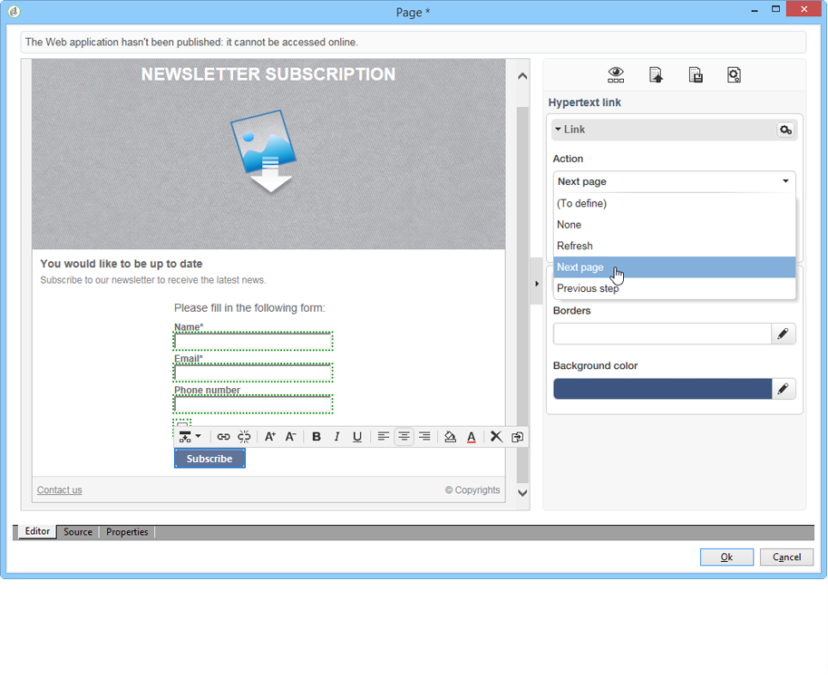

# Skapa en landningssida{#creating-a-landing-page}

## Skapa landningssidor {#about-landing-pages-creation}

I det här exemplet visas hur den digitala redigeraren används för att skapa en landningssida från Adobe Campaign-konsolen.

Innan du börjar konfigurera landningssidan i Adobe Campaign måste du se till att du har **en eller flera mallar** som representerar HTML-sidorna.

Huvudsyftet med det här användningsexemplet är att göra så att formulärfälten för landningssidan motsvarar de interna fälten i Adobe Campaign med funktionerna i DCE.

## Skapa landningssidan {#creating-the-landing-page}

Så här skapar du ett nytt webbprogram av typen Landing Page:

1. Gå till **[!UICONTROL Campaigns]** fliken och klicka på **[!UICONTROL Web application]** länken och klicka sedan på **[!UICONTROL Create]** knappen.
1. Markera **[!UICONTROL New landing page]** mallen, ange en etikett och klicka sedan på **[!UICONTROL Save]**.

   

1. Klicka på **[!UICONTROL Edit]** fliken.
1. Ta bort aktiviteten **End** .
1. Lägg till en **[!UICONTROL Page]** aktivitet efter **[!UICONTROL Storage]** aktiviteten.
1. Redigera aktiviteten **Sida 2** och avmarkera sedan **[!UICONTROL Activate outbound transitions]** alternativet på **[!UICONTROL Properties]** fliken.

   

1. Spara ändringar.

Därefter får du följande ordningsföljd:

>[!NOTE]
>
>Mer information om hur du skapar ett webbprogram finns i [det här avsnittet](../../web/using/creating-a-new-web-application.md).

## Steg 1 - Välja och läsa in mallar {#step-1---selecting-and-loading-templates}

I det här avsnittet ska vi titta på hur du **importerar HTML-innehåll** för varje sida i webbprogrammet.

En mall måste innehålla:

* en **HTML** -fil (obligatorisk)
* en eller flera **CSS** -filer (valfritt)
* en eller flera **bilder** (valfritt)

Så här läser du in mallen på den första sidan:

1. Öppna den första **[!UICONTROL Page]** aktiviteten i webbprogrammet.
1. Välj **[!UICONTROL From a file]** att hämta innehållsmallen.

   

1. Välj den HTML-fil som ska användas.
1. Klicka på **Öppna** för att starta importen.

   Under inläsningen visas listan med delade filer. Importsystemet kontrollerar att alla filer som är länkade till den valda HTML-koden finns där (CSS, bilder osv.).

   Klicka på **[!UICONTROL Close]** knappen när importen är klar.

   

   >[!CAUTION]
   >
   >Du måste vänta tills du får följande meddelande innan du stänger: **[!UICONTROL The external resources have been successfully published]** .

1. Klicka på **[!UICONTROL Properties]** fliken.
1. Ange en **etikett** för varje sida (till exempel: Sida 1= Samla in, sida 2=Tack).

   

Använd dessa steg för varje sida som infogas i webbprogrammet.

>[!CAUTION]
>
>**DCE kör JavaScript-koden för den inlästa HTML-sidan.** JavaScript-fel i HTML-mallen som kan visas i Adobe Campaign-gränssnittet. Felen är inte relaterade till redigeraren. Om du vill kontrollera att det inte finns några fel i de importerade filerna bör du testa dem i en webbläsare (Internet Explorer/Firefox/Chrome) innan du importerar filerna till DCE.

## Steg 2 - Konfigurera innehållet {#step-2---configuring-the-content}

I det här avsnittet ska vi justera importerat innehåll och länka databasens fält till webbsidans format. Webbprogrammet som skapats tidigare är:

### Ändra innehåll {#modifying-content}

Vi börjar med att ändra sidans färger. Så här gör du:

1. Öppna **[!UICONTROL Collection]** sidan.
1. Klicka på bakgrunden.
1. Klicka på **Bakgrundsfärg** till höger.
1. Välj en ny bakgrundsfärg.
1. Bekräfta ändringen genom att klicka på **OK** .

   

1. Använd samma processer för att ändra färg på knappen

   

### Länka formulärfält {#linking-form-fields}

Vi kommer att länka fälten på sidan till fälten i databasen för att spara den angivna informationen.

1. Välj ett formulärfält.
1. Redigera **[!UICONTROL Field]** avsnittet till höger i redigeraren.
1. Markera det databasfält som du vill länka till det markerade fältet.

   

1. Upprepa den här processen för varje fält på sidan.

Du kan göra ett fält obligatoriskt: Klicka till exempel på **[!UICONTROL Email]** fältet och aktivera alternativet **Obligatoriskt** .

### Skapa en länk till nästa sida {#creating-a-link-to-the-next-page}

Det här steget är obligatoriskt eftersom det gör att webbprogrammet kan bestämma sekvensen för nästa steg: När du sparar insamlade data i databasen visas nästa sida (**tack** ).

1. Markera **[!UICONTROL Send it!]** knappen på **[!UICONTROL Collection]** sidan.
1. Klicka på den **[!UICONTROL Action]** nedrullningsbara menyn.
1. Markera **[!UICONTROL Next page]** åtgärden.

   

### Infoga ett anpassningsfält {#inserting-a-personalization-field}

I det här steget kan du anpassa sidan Tack. Så här gör du:

1. Öppna **[!UICONTROL Thank you]** sidan.
1. Placera markören i ett textområde där du vill infoga mottagarens förnamn.
1. Välj **[!UICONTROL Personalization field]** på **[!UICONTROL Insert]** verktygsfältets meny.
1. Markera förnamnet.

   

Anpassningsfältet har en gul bakgrund i redigeraren.

## Steg 3 - Publicera innehåll {#step-3---publishing-content}

Innehållet publiceras från webbprogrammets kontrollpanel. Klicka på **[!UICONTROL Publish]** knappen för att köra den.

Under publiceringen visas en logg. Publiceringssystemet analyserar allt innehåll som finns i webbprogrammet

>[!NOTE]
>
>I publiceringsloggen sorteras varningar och fel efter aktivitet.

Formuläret är nu tillgängligt: URL:en är tillgänglig i programkontrollpanelen och kan skickas till mottagarna.
