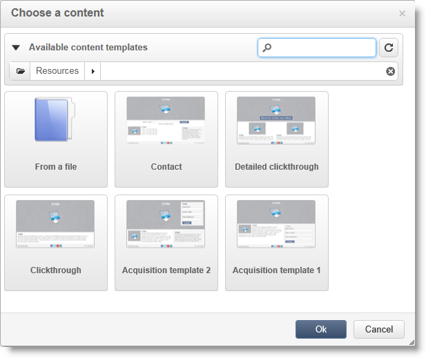

# Skapa en landningssida{#creating-a-landing-page}

## Skapa landningssidor {#about-landing-pages-creation}

I det här exemplet visas hur du använder Digital Editor för att skapa en landningssida från Adobe Campaign-konsolen.

Innan du börjar konfigurera landningssidan i Adobe Campaign bör du kontrollera att **en eller flera mallar** för att representera HTML-sidor.

Huvudsyftet med det här användningsexemplet är att göra så att formulärfälten för landningssidan motsvarar de interna fälten i Adobe Campaign med funktionerna i DCE.

## Skapa landningssidan {#creating-the-landing-page}

Så här skapar du ett nytt webbprogram av typen Landing Page:

1. Gå till **[!UICONTROL Campaigns]** och klicka på **[!UICONTROL Web application]** klicka på **[!UICONTROL Create]** -knappen.
1. Välj **[!UICONTROL New landing page]** mall och ange en etikett, klicka sedan på **[!UICONTROL Save]**.

   

1. Klicka på **[!UICONTROL Edit]** -fliken.
1. Ta bort **End** aktivitet.
1. Lägg till en **[!UICONTROL Page]** efter **[!UICONTROL Storage]** aktivitet.
1. Redigera **Sidan 2** sedan avmarkera **[!UICONTROL Activate outbound transitions]** i **[!UICONTROL Properties]** -fliken.

   

1. Spara ändringar.

Därefter får du följande ordningsföljd:

>[!NOTE]
>
>Mer information om hur du skapar ett webbprogram finns i [det här avsnittet](creating-a-new-web-application.md).

## Steg 1 - Välja och läsa in mallar {#step-1---selecting-and-loading-templates}

I det här avsnittet ska vi titta på hur **importera HTML-innehåll** för varje sida i webbprogrammet.

En mall måste innehålla:

* en **HTML** fil (obligatorisk)
* en eller flera **CSS** filer (valfritt)
* en eller flera **bilder** (valfritt)

Så här läser du in mallen på den första sidan:

1. Öppna den första **[!UICONTROL Page]** webbprogrammets aktivitet.
1. Välj **[!UICONTROL From a file]** för att hämta din innehållsmall.

   

1. Markera den HTML-fil som ska användas.
1. Klicka **Öppna** för att starta importen.

   Under inläsningen visas listan med delade filer. Importsystemet kontrollerar att alla filer som är länkade till det markerade HTML finns där (CSS, bilder osv.).

   Klicka på **[!UICONTROL Close]** när importen är klar.

   

   >[!CAUTION]
   >
   >Du måste vänta tills du får följande meddelande innan du stänger: **[!UICONTROL The external resources have been successfully published]** .

1. Klicka på **[!UICONTROL Properties]** -fliken.
1. Ange **label** för varje sida (till exempel: Sida 1= Samla in, sida 2=Tack).

   

Använd dessa steg för varje sida som infogas i webbprogrammet.

>[!CAUTION]
>
>**DCE kör JavaScript-koden för den inlästa HTML-sidan.** JavaScript-fel i HTML-mallen som kan visas i Adobe Campaign-gränssnittet. Felen är inte relaterade till redigeraren. Om du vill kontrollera att det inte finns några fel i de importerade filerna rekommenderar vi att du testar dem i en webbläsare innan du importerar filerna till DCE.

## Steg 2 - Konfigurera innehållet {#step-2---configuring-the-content}

I det här avsnittet ska vi justera importerat innehåll och länka databasens fält till webbsidans format. Webbprogrammet som skapats tidigare är:

### Ändra innehåll {#modifying-content}

Vi börjar med att ändra sidans färger. Så här gör du:

1. Öppna **[!UICONTROL Collection]** sida.
1. Klicka på bakgrunden.
1. Klicka **Bakgrundsfärg** till höger.
1. Välj en ny bakgrundsfärg.
1. Klicka **OK** för att bekräfta ändringen.

   

1. Använd samma processer för att ändra färg på knappen

   

### Länka formulärfält {#linking-form-fields}

Vi kommer att länka fälten på sidan till fälten i databasen för att spara den angivna informationen.

1. Välj ett formulärfält.
1. Redigera **[!UICONTROL Field]** till höger om redigeraren.
1. Markera det databasfält som du vill länka till det markerade fältet.

   

1. Upprepa den här processen för varje fält på sidan.

Du kan göra ett fält obligatoriskt: till exempel klickar du på **[!UICONTROL Email]** aktivera sedan **Obligatoriskt** alternativ.

### Skapa en länk till nästa sida {#creating-a-link-to-the-next-page}

Det här steget är obligatoriskt eftersom det gör att webbprogrammet kan bestämma sekvensen för nästa steg: Sparar insamlade data i databasen och visar sedan nästa sida (**Tack** sida).

1. Välj **[!UICONTROL Send it!]** knappen **[!UICONTROL Collection]** sida.
1. Klicka på **[!UICONTROL Action]** nedrullningsbar meny.
1. Välj **[!UICONTROL Next page]** åtgärd.

   

### Infoga ett personaliserat fält {#inserting-a-personalization-field}

I det här steget kan du anpassa sidan Tack. Så här gör du:

1. Öppna **[!UICONTROL Thank you]** sida.
1. Placera markören i ett textområde där du vill infoga mottagarens förnamn.
1. Välj **[!UICONTROL Personalization field]** i **[!UICONTROL Insert]** verktygsfältets meny.
1. Markera förnamnet.

   

Anpassningsfältet har en gul bakgrund i redigeraren.

## Steg 3 - Publicera innehåll {#step-3---publishing-content}

Innehållet publiceras från webbprogrammets kontrollpanel. Klicka på **[!UICONTROL Publish]** för att köra den.

Under publiceringen visas en logg. Publiceringssystemet analyserar allt innehåll som finns i webbprogrammet

>[!NOTE]
>
>I publiceringsloggen sorteras varningar och fel efter aktivitet.

Formuläret är nu tillgängligt: URL:en är tillgänglig i programkontrollpanelen och kan skickas till mottagarna.
