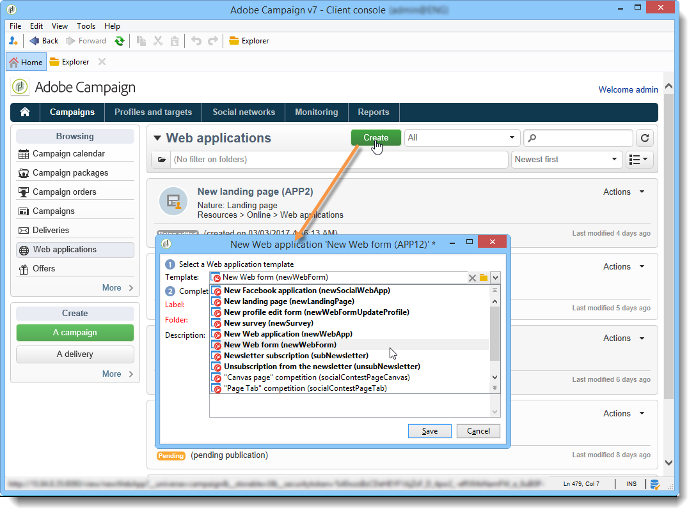

# Skapa ett nytt webbprogram{#creating-a-new-web-application}

Webbprogramstyper väljs när de skapas.

Gå till fliken **Kampanjer** och välj **[!UICONTROL Web Applications]** menyn. Klicka på **[!UICONTROL Create]** knappen. Välj den webbprogrammall som du vill använda:

>[!NOTE]
>
>Skydda alltid de sidor som kan innehålla personlig information. Se checklistan [för](https://helpx.adobe.com/campaign/kb/acc-security.html#privacy)säkerhet och sekretess.

Den här mallen avgör typen av webbprogram. Du kan skapa:

1. Webbformulär (+ ändring av profil)

   Med webbformulär kan du erbjuda webbsidor med inmatnings- eller urvalsfält: Den information som användarna anger kan lagras i Adobe Campaign-databasen. Mer information finns i [webbformulär](../../web/using/about-web-forms.md).

1. Webbprogram

   Med Adobe Campaign kan ni skapa webbapplikationer som ska visas på t.ex. en webbplattform eller ett extranät. På så sätt kan ni redigera data och registrera information i Adobe Campaign. I det här fallet kan du begränsa deras åtkomst till autentiserade användare (via åtkomstkontroll) och konfigurera förinläsning av data baserat på olika kriterier. For more on this, refer to [this section](../../web/using/about-web-applications.md).

1. Landningssidor

   En landningssida är en HTML-sida vars innehåll är tillgängligt på en webbplats och som gör det möjligt för användare att ange information som ska lagras i Adobe Campaigns databasprofil. Innehållet på den här typen av sidor skapas vanligtvis av en specialiserad webbbyrå innan det importeras till Adobe Campaign för publicering, hantering och uppföljning. For more on this, refer to [this page](../../web/using/creating-a-landing-page.md).

1. Undersökningar

   Med Adobe Campaign kan ni, via alternativet **Survey Manager** , utforma och hantera onlineundersökningar och bearbeta deras resultat: skapa dynamiska fält, hantera poäng, exportera svar och dedikerade rapporter. For more on this, refer to [this section](../../web/using/about-surveys.md).

   >[!CAUTION]
   >
   >**Survey Manager** är en valfri Adobe Campaign-modul. Kontrollera licensavtalet.

1. Facebook-program

   Tack vare alternativet för **social marknadsföring** kan ni med Adobe Campaign publicera personaliserat innehåll i en Facebook-applikation. For more on this, refer to [this section](../../social/using/about-social-marketing.md).

   >[!CAUTION]
   >
   >**Social marknadsföring** är en valfri Adobe Campaign-modul. Kontrollera licensavtalet.

Sidkonfigurationsläget och de tillgängliga konfigurationerna kan vara identiska för flera webbprogramstyper. For more on this, refer to [this section](../../web/using/about-web-forms.md).
