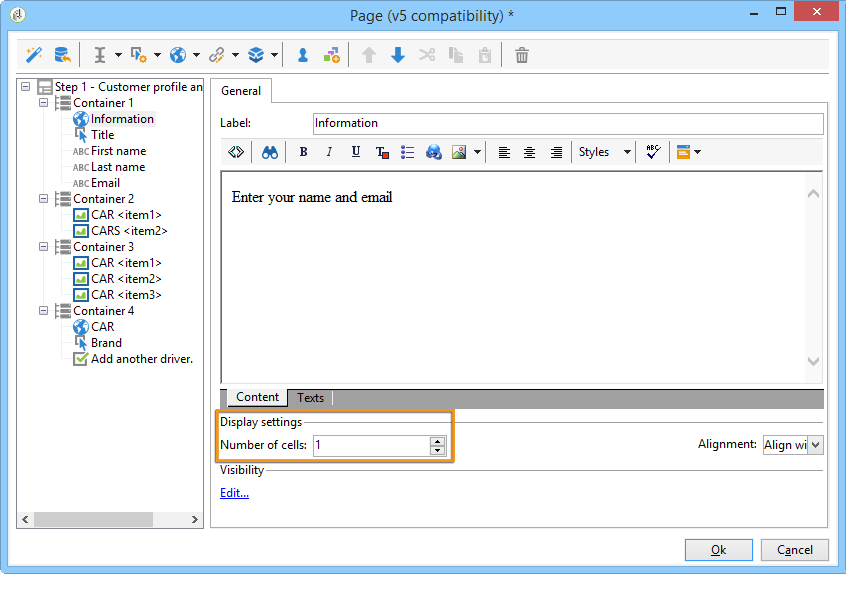
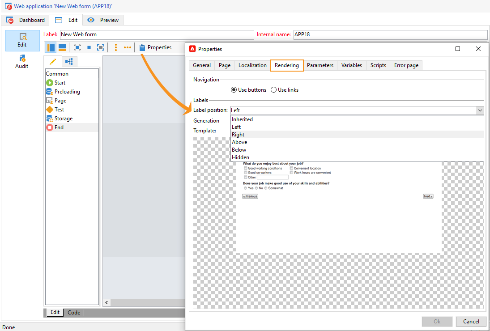

# Definiera ett webbformulärs layout{#defining-web-forms-layout}

## Skapar behållare {#creating-containers}

Med behållare kan du kombinera fälten på en sida och konfigurera deras layout; för att ordna elementen på sidan.

För varje sida i formuläret skapas behållare med knappen **[!UICONTROL Containers]** i verktygsfältet.

Använd en behållare för att gruppera element på sidan utan att lägga till en etikett till den slutliga återgivningen. Elementen grupperas i behållarens underträd. Med standardbehållare kan du hantera layouten.

Exempel:

Etikettens placering tillämpas på element som placeras under behållaren i hierarkin. Den kan vid behov laddas över för varje element. Lägg till eller ta bort kolumner för att ändra layouten. Se [Placera fälten på sidan](#positioning-the-fields-on-the-page).

I exemplet ovan återges följande:

## Placera fälten på sidan {#positioning-the-fields-on-the-page}

Webbformulärets layout definieras sida för sida i varje behållare och kan vid behov överladdas.

Sidorna är uppdelade i kolumner: varje sida innehåller ett visst antal kolumner. Varje fält på sidan upptar **n** celler. Behållare upptar också ett visst antal kolumner och fälten som de innehåller upptar ett visst antal celler.

Som standard byggs sidorna på en enda kolumn och varje element upptar en cell. Det innebär att fält visas under varandra, där var och en tar upp en hel rad, vilket visas nedan:

I följande exempel har standardkonfigurationen behållits. Sidan upptar en enda kolumn som innehåller fyra behållare.

Varje behållare upptar en kolumn och varje element upptar en cell:

Återgivningen är följande:

Du kan anpassa visningsparametrarna för att få följande återgivning:

I det ovanstående återgivningsexemplet upptar varje inmatningsfält, rubrik och bild en cell i behållarens kolumner.

Du kan ändra formateringen i varje behållare. I vårt exempel kan du sprida innehållet i container 4 över två kolumner och distribuera elementen.

Titeln och listan upptar en cell var (och därmed en hel rad i behållaren) och kryssrutan sträcker sig över två celler. Antalet celler som är kopplade till indatafältet definieras på fliken **[!UICONTROL General]** eller fliken **[!UICONTROL Advanced]**, beroende på fälttypen:

## Definiera positionen för etiketterna {#defining-the-position-of-labels}

Du kan definiera justeringen av fält och etiketter i formuläret.

Som standard ärvs visningsparametrarna för fält och annat innehåll på sidan från formulärets allmänna konfiguration, sidans konfiguration eller den överordnade behållarens konfiguration, om sådan finns.

De globala visningsparametrarna för hela formuläret anges i rutan för formuläregenskaper. På fliken **[!UICONTROL Rendering]** kan du välja placering för etiketter.

Den här positionen kan överladdas för varje sida, varje behållare och varje fält via fliken **[!UICONTROL Advanced]**.

Följande justeringar stöds:

* Ärvd: justeringen ärvs från det överordnade elementet (standardvärde), dvs. den överordnade behållaren om sådan finns, eller i annat fall sidan.
* Vänster/höger: etiketten placeras till höger eller till vänster om fältet,
* Över/under: Etiketten är placerad ovanför eller under fältet.
* Dold: etiketten inte visas.
