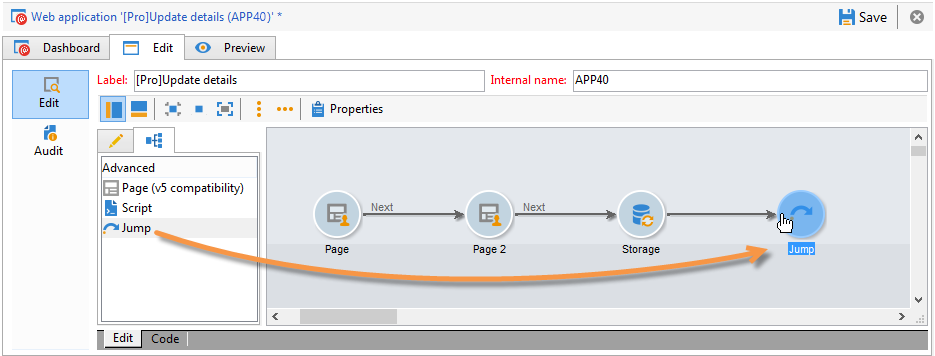

# Definiera sidsekvenser för webbformulär{#defining-web-forms-page-sequencing}

Formuläret kan innehålla en eller flera sidor. Den byggs via ett diagram som låter dig sekvensera sidor, testa, köra skript, hoppa mellan sidor och spela in steg. Det globala diagramdesignläget är samma som för ett Campaign-arbetsflöde.

## Om föregående sida och nästa sida {#about-previous-page-and-next-page}

För varje sida kan du ta bort knapparna **[!UICONTROL Next]** eller **[!UICONTROL Previous]**. Det gör du genom att markera den aktuella sidan och välja alternativet **[!UICONTROL Disable next page]** eller **[!UICONTROL Disallow returning to the previous page]**.


Du kan ersätta de här knapparna med länkar. Se [Infoga HTML-innehåll](static-elements-in-a-web-form.md#inserting-html-content).

## Infoga ett hopp {#inserting-a-jump}

**[!UICONTROL Jump]**-objektet ger åtkomst till en annan sida eller ett annat formulär när användaren klickar på **[!UICONTROL Next]**.

Målet kan vara:

* En annan sida i formuläret. Om du vill göra det väljer du **[!UICONTROL Internal activity]** och anger sedan önskad sida enligt nedan:

   

* Ett annat formulär. Det gör du genom att markera alternativet **[!UICONTROL Explicit]** och ange målformuläret.

   

* Målet kan lagras i en variabel. I så fall väljer du den i listrutan enligt nedan:

   

* På fliken **[!UICONTROL Comment]** kan du ange information som ska visas av operatorn när de klickar på objektet i diagrammet.

   

## Exempel: använda ett annat formulär enligt en URL-parameter {#example--accessing-another-form-according-to-a-parameter-of-the-url}

I följande exempel vill vi konfigurera ett webbformulär som, när det godkänns, visar ett annat formulär som anges av en URL-parameter. Gör så här:

1. Infoga ett hopp i slutet av ett formulär: detta ersätter rutan **[!UICONTROL End]**.

   

1. Lägg till en parameter (**next**) som lagras i en lokal variabel (**next**) i formuläregenskaperna. Lokala variabler beskrivs i [Lagra data i en lokal variabel](web-forms-answers.md#storing-data-in-a-local-variable).

   

1. Redigera objektet **[!UICONTROL Jump]**, markera alternativet **[!UICONTROL Stored in a variable]** och välj variabeln **next** i listrutan.

   

1. Leverans-URL:en måste innehålla målformulärets interna namn, till exempel:

   ```
   https://[myserver]/webForm/APP62?&next=APP22
   ```

   När användaren klickar på knappen **[!UICONTROL Approve]** visas formuläret **APP22**.

## Infoga en länk till en annan sida i formuläret {#inserting-a-link-to-another-page-of-the-form}

Du kan infoga länkar till andra sidor i formuläret. Det gör du genom att lägga till ett statiskt **[!UICONTROL Link]**-tytelement på sidan. Mer information finns i [Infoga en länk](static-elements-in-a-web-form.md#inserting-a-link).

## Villkorlig sidvisning {#conditional-page-display}

### Visa baserat på svar {#display-based-on-responses}

I rutan **[!UICONTROL Test]** kan du ställa in ordningsföljden för sidorna i ett formulär. Du kan definiera olika grenlinjer beroende på testresultaten. På så sätt kan du visa olika sidor beroende på vilka svar användarna ger.

Du kan till exempel visa en annan sida för kunder som redan beställt online och en annan för dem som gjort över tio beställningar. Det gör du genom att infoga ett **[!UICONTROL Number]**-textinmatningsfält på formulärets första sida, där användaren kan ange hur många order han/hon har placerat.


Du kan antingen lagra informationen i ett fält i databasen eller använda en lokal variabel.

>[!NOTE]
>
>Lagringslägena beskrivs i [Svarslagringsfält](web-forms-answers.md#response-storage-fields).

I vårt exempel vill vi använda en variabel:


I formulärets diagram infogar du en testruta för att definiera villkoren. För varje villkor läggs en ny förgrening till vid utskriften av testrutan.


Välj alternativet **[!UICONTROL Activate the default branching]** om du vill lägga till en övergång i de fall där inga villkor är uppfyllda. Det här alternativet är inte nödvändigt om alla möjliga fall täcks av de definierade villkoren.

Definiera sedan sidsekvensen när ett eller flera av villkoren är true, till exempel:


### Visa baserat på parametrar {#display-based-on-parameters}

Du kan också anpassa sidordningen enligt webbformulärets initieringsparametrar eller enligt de värden som lagras i databasen. Se [Formulär-URL-parametrar](defining-web-forms-properties.md#form-url-parameters).

## Lägga till skript {#adding-scripts}

Med **[!UICONTROL Script]**-objektet kan du ange ett JavaScript-skript direkt, t.ex. för att ändra ett fälts värde, hämta data från databasen eller anropa ett Adobe Campaign-API.

## Anpassa slutsidan {#personalizing-the-end-page}

Du måste placera en slutsida i slutet av diagrammet. Slutsidan visas när användaren klickar på knappen **[!UICONTROL Approve]** i webbformuläret.

Om du vill anpassa den här sidan dubbelklickar du på **[!UICONTROL End]** och anger sidans innehåll i den centrala redigeraren.


* Du kan kopiera och klistra in befintligt HTML-innehåll. Det gör du genom att klicka på **[!UICONTROL Display source code]** och infoga HTML-koden.
* Du kan använda en extern URL; Om du vill göra det väljer du motsvarande alternativ och anger URL-adressen till sidan som ska visas.
