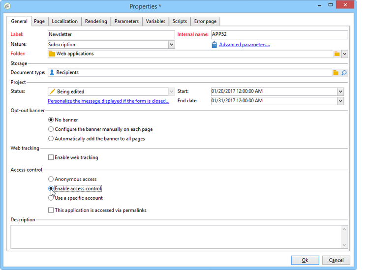

# Definiera egenskaper för webbformulär{#defining-web-forms-properties}

Webbformulären är fullt konfigurerbara och anpassningsbara för att uppfylla era behov. Parametrarna måste anges i egenskapsfönstret.

Egenskapsfönstret är tillgängligt via knappen **[!UICONTROL Properties]** i verktygsfältet i webbformuläret. I det här fönstret kan du komma åt en rad inställningar som är specifika för webbformuläret. Vissa inställningar kan härröra från mallkonfigurationen.

## Övergripande formuläregenskaper {#overall-form-properties}

På fliken **[!UICONTROL General]** i egenskapsfönstret kan du ändra formulärets **etikett** . Vi rekommenderar att du inte ändrar det **interna namnet**.

Formulärmallen väljs när formuläret skapas. Den kan inte ändras senare. Mer information om hur du skapar och hanterar formulärmallar finns i [Använda en webbformulärmall](../../web/using/using-a-web-form-template.md).

## Lagring av formulärdata {#form-data-storage}

Fälten i webbformulär lagras som standard i mottagartabellen. Du kan ändra tabellen som används genom att välja en ny tabell i **[!UICONTROL Document type]** fältet. Med **[!UICONTROL Zoom]** ikonen kan du visa innehållet i den markerade tabellen.

Som standard lagras svaren i **[!UICONTROL Answer to a recipient form]** tabellen.

## Konfigurera en felsida {#setting-up-an-error-page}

Du kan konfigurera en felsida: den här sidan visas om det uppstår fel under formulärkörningen.

Felsidan definieras på motsvarande flik i fönstret för formuläregenskaper.

Som standard visas följande information:

Innehållet i strängarna som visas definieras på fliken **[!UICONTROL Error page]** i egenskapsfönstret. På fliken **[!UICONTROL HTML]** visas återgivningen och på fliken **[!UICONTROL Texts]** kan du ändra textsträngarna och lägga till text om det behövs:

## Formulärlokalisering {#form-localization}

På fliken **[!UICONTROL Localization]** kan du välja design- och visningsspråk för webbformuläret.

Se [Översätta ett webbformulär](../../web/using/translating-a-web-form.md).

## Bläddra bland och återge formulär {#form-browsing-and-rendering}

På fliken **[!UICONTROL Rendering]** kan du definiera vilken typ av bläddring som ska göras mellan sidorna i webbformuläret och den återgivningsmall som ska användas.

Du kan navigera via länkar eller knappar.

Knappar är navigeringselement som standard. De gör att du kan utföra följande åtgärder:

* Godkänn den aktuella sidan och visa nästa sida genom att klicka **[!UICONTROL Next]**. Den här knappen visas på alla sidor utom den sista.
* Visa föregående sida genom att klicka **[!UICONTROL Previous]**. Den här knappen visas på alla sidor utom den första.
* Spara formulärsvaren genom att klicka på **[!UICONTROL Approve]** knappen. Den här knappen visas bara på den sista sidan.

Dessa element visas längst ned på varje sida. Deras positioner kan ändras. Om du vill göra det måste du ändra formatmallen.

>[!NOTE]
>
>Det går att dölja **[!UICONTROL Previous]** knappen på vissa sidor. Det gör du genom att gå till den aktuella sidan och kontrollera **[!UICONTROL Disallow returning to the previous page]** alternativet. Det här alternativet är tillgängligt när sidträdets rot är markerat.

I **[!UICONTROL Template]** fältet på **[!UICONTROL Rendering]** fliken kan du välja ett tema bland de tillgängliga.

Teman sparas i trädnoden **[!UICONTROL Administration>Configuration>Form rendering]** . Se [Välja formuläråtergivningsmall](../../web/using/form-rendering.md#selecting-the-form-rendering-template)

En exempelåtergivning visas i den nedre delen av egenskapsfönstret. Med **[!UICONTROL Edit link]** ikonen kan du visa konfigurationen för det valda temat.

## Texter i formuläret {#texts-in-the-form}

På fliken **[!UICONTROL Page]** kan du definiera innehållet i formulärhuvudet och sidfoten. Se [Definiera sidhuvuden och sidfötter](../../web/using/form-rendering.md#defining-headers-and-footers).

Du kan också hantera översättningar. Se [Översätta ett webbformulär](../../web/using/translating-a-web-form.md).

## Formulärets tillgänglighet {#accessibility-of-the-form}

Ett webbformulär är tillgängligt för användare om det är **[!UICONTROL Online]** och om det aktuella datumet är inom giltighetsperioden. Formulärets status ändras under publiceringssteget (se [Publicera ett formulär](../../web/using/publishing-a-web-form.md#publishing-a-form)). Statusen visas under **Projekt** på fliken **[!UICONTROL General]** i egenskapsfönstret.

Giltighetsperioden löper från **[!UICONTROL Start]** datum till **[!UICONTROL End date]**. Om inga datum anges i dessa fält har formuläret permanent giltighet.

>[!NOTE]
>
>Om formuläret är stängt och dess giltighetsperiod därför inte har nåtts eller löpt ut, eller om det stängdes av Adobe Campaign-operatorn, visas ett meddelande när användaren försöker få åtkomst till det. Du kan anpassa det här meddelandet genom att klicka **[!UICONTROL Personalize the message displayed if the form is closed...]**.

## Åtkomstkontroll {#form-access-control}

Som standard görs åtkomsten till webbformulären i anonymt läge: alla operatorer som har åtkomst till formuläret tilldelas WebApp-operatörsrättigheter.

Du kan aktivera åtkomstkontroll för att visa formuläret, t.ex. när du levererar ett formulär på en intranätsplats, för att autentisera användare. Det gör du genom att visa det aktuella formulärets **[!UICONTROL Properties]** fönster och klicka på **[!UICONTROL Enable access control]** alternativet enligt nedan:

När sidan öppnas visas följande autentiseringsformulär:

Inloggning och lösenord är de som används av Adobe Campaign-operatorer. Mer information finns i [det här avsnittet](../../platform/using/access-management.md).

Med det här **[!UICONTROL Use a specific account]** alternativet kan du begränsa läs- och skrivbehörigheterna för den operator som kommer åt formuläret. Använd listrutan för att välja en operator eller grupp med operatorer som ska ansvara för att bevilja dessa behörigheter.

## URL-parametrar för formulär {#form-url-parameters}

Du kan lägga till ytterligare parametrar i URL:en för ett formulär för att anpassa dess innehåll och initiera ett sammanhang (språk, krypterat mottagar-ID, företag, beräknad formel som lagras i en variabel osv.). Detta gör att du kan ge åtkomst till ett formulär via flera olika URL:er och anpassa sidinnehållet baserat på värdet på de parametrar som anges i URL:en.

Som standard har Adobe Campaign parametrar för att förhandsgranska formuläret och kontrollera fel. Du kan skapa nya inställningar som är länkade till formuläret, som kan använda värdena för ett fält i databasen eller en lokal variabel.

## Standardparametrar {#standard-parameters}

Följande parametrar är tillgängliga som standard:

* **ID** för att ange den krypterade identifieraren.
* **för att** ändra visningsspråk.
* **origo** för att ange den svarande personens ursprung.
* **_uuid** aktiverar formulärvisning före publicering och felspårning. Den här parametern är avsedd för internt bruk (skapande och felsökning): När du öppnar webbformuläret via den här URL:en, beaktas inte de poster som skapas i spårningen (rapporter). Ursprunget tvingas till **[!UICONTROL Adobe Campaign]** värdet.

   Den används med parametrarna **_preview** och/eller **_debug**:

   **_förhandsgranskning** för att visa den senast sparade versionen. Denna parameter får endast användas i testfasen.

   **_debug** för att visa spårningen av indata eller beräknade på formulärets sidor. Detta används för att få mer information om fel, även när formuläret har publicerats.

   >[!CAUTION]
   >
   >När formuläret visas via en URL med parametern **_uuid** tvingas värdet för **[!UICONTROL origin]** parametern till **Adobe Campaign**.

## Lägga till parametrar {#adding-parameters}

Parametrar kan läggas till via fliken **[!UICONTROL Parameters...]** i formulärets egenskapsfönster. De kan göras obligatoriska enligt nedan:

Du måste ange en lagringsplats som parametervärdet hämtas från. Om du vill göra det väljer du ett av lagringsalternativen och klickar sedan på **[!UICONTROL Storage]** fliken för att markera fältet eller variabeln i fråga. Lagringsalternativen finns i [Svarslagringsfält](../../web/using/web-forms-answers.md#response-storage-fields).

Svarandens status (0, 1 eller något annat värde) kan sedan läggas till i URL:en för att komma åt formuläret. Informationen kan återanvändas på formulärets sidor eller i en testruta. De sidor som visas kan villkoras baserat på värdet för sammanhanget, vilket visas nedan:

1. Hemsida för kunder (**status=1**):

   

1. Startsida för potentiella kunder (**status=0**):

   

1. Hemsida för andra profiler (t.ex. **status=12**):

   

Om du vill konfigurera det här formuläret skapar du en testruta och placerar den i början av diagrammet, enligt nedan:

I testrutan kan du konfigurera sidordningsvillkoren:

