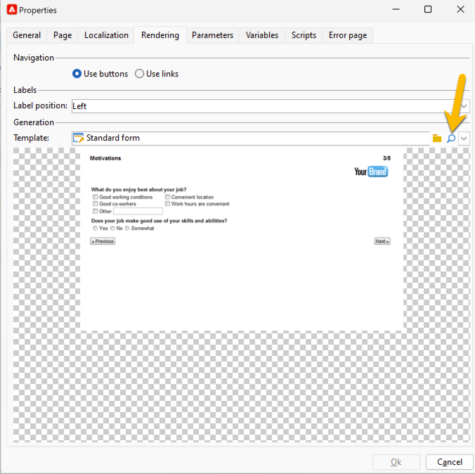
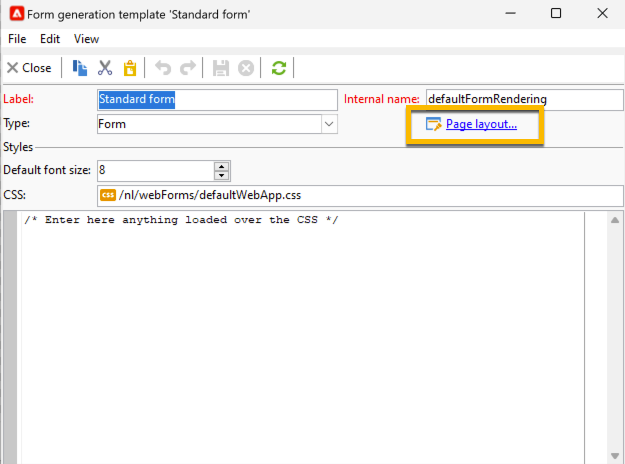
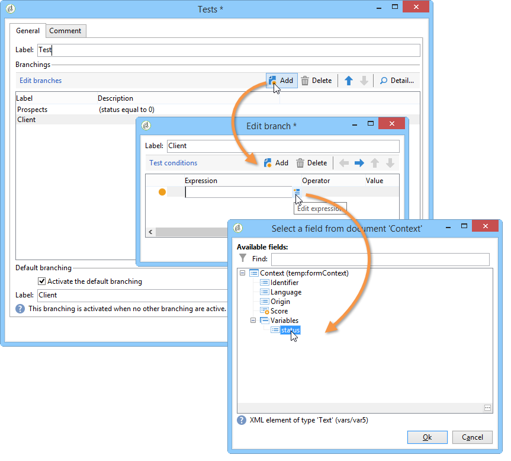

# Definiera egenskaper för webbformulär{#defining-web-forms-properties}

Ni kan konfigurera och anpassa webbformulär helt efter era behov. Parametrarna måste anges i egenskapsfönstret.

Egenskapsfönstret är tillgängligt via knappen **[!UICONTROL Properties]** i webbformulärets verktygsfält. I det här fönstret kan du komma åt en rad inställningar som är specifika för webbformuläret. Vissa inställningar kan härröra från mallkonfigurationen.

## Övergripande formuläregenskaper {#overall-form-properties}

På fliken **[!UICONTROL General]** i egenskapsfönstret kan du ändra **Label** för formuläret. Vi rekommenderar att du inte ändrar det **interna namnet**.

Formulärmallen väljs när formuläret skapas. Den kan inte ändras senare. Mer information om hur du skapar och hanterar formulärmallar finns i [Använda en webbformulärmall](using-a-web-form-template.md).

## Lagring av formulärdata {#form-data-storage}

Fälten i webbformulär lagras som standard i mottagartabellen. Du kan ändra tabellen som används genom att välja en ny tabell i fältet **[!UICONTROL Document type]**. Med ikonen **[!UICONTROL Zoom]** kan du visa innehållet i den markerade tabellen.

Som standard lagras svaren i tabellen **Svar på ett mottagarformulär**.

## Konfigurera en felsida {#setting-up-an-error-page}

Du kan konfigurera en felsida: den här sidan visas om det uppstår fel under formulärkörningen.

Felsidan definieras på motsvarande flik i fönstret för formuläregenskaper.

Som standard visas följande information:

Innehållet i strängarna som visas definieras på fliken **[!UICONTROL Error page]** i egenskapsfönstret. På fliken **[!UICONTROL HTML]** visas återgivningen och på fliken **[!UICONTROL Texts]** kan du ändra textsträngarna och lägga till text om det behövs:

## Formulärlokalisering {#form-localization}

På fliken **[!UICONTROL Localization]** kan du välja design- och visningsspråk för webbformuläret.

Se [Översätta ett webbformulär](translating-a-web-form.md).

## Bläddra bland och återge formulär {#form-browsing-and-rendering}

På fliken **[!UICONTROL Rendering]** kan du definiera typen av bläddring mellan sidorna i webbformuläret och den återgivningsmall som används.

Du kan navigera via länkar eller knappar.

Knappar är navigeringselement som standard. De gör att du kan utföra följande åtgärder:

* Godkänn den aktuella sidan och visa nästa sida genom att klicka på **[!UICONTROL Next]**. Den här knappen visas på alla sidor utom den sista.
* Visa föregående sida genom att klicka på **[!UICONTROL Previous]**. Den här knappen visas på alla sidor utom den första.
* Spara formulärsvaren genom att klicka på knappen **[!UICONTROL Approve]**. Den här knappen visas bara på den sista sidan.

Dessa element visas längst ned på varje sida. Deras positioner kan ändras. Om du vill göra det måste du ändra formatmallen.

>[!NOTE]
>
>Det går att dölja knappen **[!UICONTROL Previous]** på vissa sidor. Det gör du genom att gå till den aktuella sidan och kontrollera alternativet **[!UICONTROL Disallow returning to the previous page]**. Det här alternativet är tillgängligt när sidträdets rot är markerat.

I fältet **[!UICONTROL Template]** på fliken **[!UICONTROL Rendering]** kan du välja ett av de tillgängliga temana.

Teman sparas i noden **[!UICONTROL Administration>Configuration>Form rendering]** i trädet. Se [Välja formuläråtergivningsmall](form-rendering.md#selecting-the-form-rendering-template)

En exempelåtergivning visas i den nedre delen av egenskapsfönstret. Med ikonen **[!UICONTROL Edit link]** kan du visa konfigurationen för det valda temat.

## Logotyp i formuläret {#logo-in-the-form}

Du kan ändra logotypen som används i formuläret med din egen logotyp.

Klicka på glasikonen för din mall på fliken **[!UICONTROL Rendering]** i **[!UICONTROL Properties]** för webbprogrammet:

Klicka på länken **[!UICONTROL Page layout]** i det nya fönstret:

Du kan ändra sökvägen för logotypbilden här:

De tillgängliga bilderna finns under **[!UICONTROL Administration]** > **[!UICONTROL Configuration]** > **[!UICONTROL Images]**. Du kan lägga till din logotyp här.

De här bilderna placeras i katalogen back-end för instansen *datakit\nms\fra\img\activities* eller *datakit\nms\eng\img\activities* (eng eller fra, beroende på instansens språk).

Om du vill ha en ny bild tillgänglig i den här katalogen (och i Bilder) kontaktar du Adobe support för att göra ändringar i backend-katalogerna.

För lokala instanser kan du lägga till bilder i data själv.

Den överförda bilden behöver inte vara synlig från Campaign-klienten. Den rätta sökvägen räcker för att använda som ny logotyp.

## Texter i formuläret {#texts-in-the-form}

På fliken **[!UICONTROL Page]** kan du definiera innehållet i formulärsidhuvudet och -sidfoten. Se [Definiera sidhuvud och sidfot](form-rendering.md#defining-headers-and-footers).

Du kan också hantera översättningar. Se [Översätta ett webbformulär](translating-a-web-form.md).

## Formulärets tillgänglighet {#accessibility-of-the-form}

Ett webbformulär är tillgängligt för användare om det är **[!UICONTROL Online]** och om det aktuella datumet är inom dess giltighetsperiod. Formulärets status ändras under publiceringssteget (se [Publicera ett formulär](publishing-a-web-form.md#publishing-a-form)). Statusen visas i avsnittet **Projekt** på fliken **[!UICONTROL General]** i egenskapsfönstret.

Giltighetsperioden löper från datumet **[!UICONTROL Start]** till **[!UICONTROL End date]**. Om inga datum anges i dessa fält har formuläret permanent giltighet.

>[!NOTE]
>
>Om formuläret är stängt och dess giltighetsperiod därför inte har nåtts eller löpt ut, eller om det stängts av Adobe Campaign-operatorn, visas ett meddelande när användaren försöker få åtkomst till det. Du kan anpassa meddelandet genom att klicka på **[!UICONTROL Personalize the message displayed if the form is closed...]**.

## Åtkomstkontroll {#form-access-control}

Som standard ges åtkomst till webbformulär i anonymt läge: alla operatorer som har åtkomst till formuläret tilldelas behörigheter för WebApp-operatorn.

Du kan aktivera åtkomstkontroll för att visa formuläret, t.ex. när du levererar ett formulär på en intranätsplats, för att autentisera användare. Det gör du genom att visa fönstret **[!UICONTROL Properties]** för det aktuella formuläret och klicka på alternativet **[!UICONTROL Enable access control]**, som visas nedan:

När sidan öppnas visas följande autentiseringsformulär:

Inloggning och lösenord är de som används av Adobe Campaign-operatörer. Mer information om detta finns i [det här avsnittet](../../platform/using/access-management.md).

Med alternativet **[!UICONTROL Use a specific account]** kan du begränsa läs- och skrivbehörigheterna för den operator som kommer åt formuläret. Använd listrutan för att välja en operator eller grupp med operatorer som ska ansvara för att bevilja dessa behörigheter.

## URL-parametrar för formulär {#form-url-parameters}

Du kan lägga till ytterligare parametrar i URL:en för ett formulär för att anpassa dess innehåll och initiera ett sammanhang (språk, krypterat mottagar-ID, företag, beräknad formel som lagras i en variabel osv.). Detta gör att du kan ge åtkomst till ett formulär via flera olika URL:er och anpassa sidinnehållet baserat på värdet på de parametrar som anges i URL:en.

Som standard har Adobe Campaign parametrar för att förhandsgranska formuläret och kontrollera fel. Du kan skapa nya inställningar som är länkade till formuläret, som kan använda värdena för ett fält i databasen eller en lokal variabel.

## Standardparametrar {#standard-parameters}

Följande parametrar är tillgängliga som standard:

* **id** för att ange den krypterade identifieraren.
* **språk** om du vill ändra visningsspråk.
* **origin** för att ange svarandens ursprung.
* **_uid** aktiverar formulärvisning före publicering och felspårning. Den här parametern är avsedd för internt bruk (skapande och felsökning): när du öppnar webbformuläret via den här URL:en beaktas inte de skapade posterna i spårningen (rapporter). Ursprunget tvingas till värdet **[!UICONTROL Adobe Campaign]**.

  Den används med parametrarna **_preview** och/eller **_debug**:

  **_preview** om du vill visa den senast sparade versionen. Denna parameter får endast användas i testfasen.

  **_debug** om du vill visa spårningen för dataindata eller beräknade på formulärets sidor. Detta används för att få mer information om fel, även när formuläret har publicerats.

  >[!CAUTION]
  >
  >När formuläret visas via en URL med parametern **_uid** tvingas värdet för parametern **[!UICONTROL origin]** till **Adobe Campaign**.

## Lägga till parametrar {#adding-parameters}

Parametrar kan läggas till via fliken **[!UICONTROL Parameters...]** i formulärets egenskapsfönster. De kan göras obligatoriska enligt nedan:

Du måste ange en lagringsplats som parametervärdet hämtas från. Välj ett av lagringsalternativen och klicka sedan på fliken **[!UICONTROL Storage]** för att markera fältet eller variabeln i fråga. Lagringsalternativen finns i [Svarslagringsfält](web-forms-answers.md#response-storage-fields).

Svarandens status (0, 1 eller något annat värde) kan sedan läggas till i URL:en för att komma åt formuläret. Informationen kan återanvändas på formulärets sidor eller i en testruta. De sidor som visas kan villkoras baserat på värdet för sammanhanget, vilket visas nedan:

1. Hemsida för kunder (**status=1**):

   

1. Startsida för potentiella kunder (**status=0**):

   

1. Hemsida för andra profiler (t.ex. **status=12**):

   

Om du vill konfigurera det här formuläret skapar du en testruta och placerar den i början av diagrammet, enligt nedan:

I testrutan kan du konfigurera sidordningsvillkoren:

