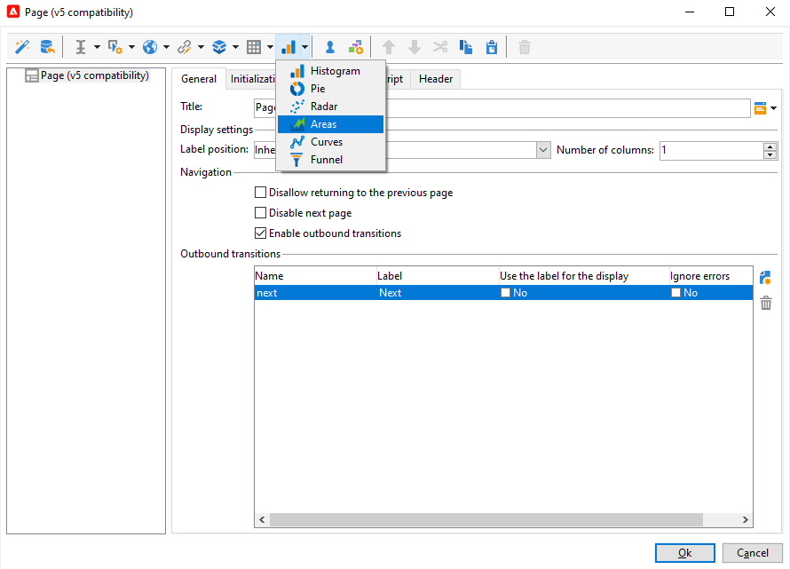
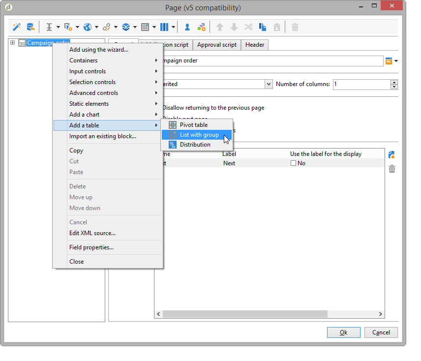

# Designa en webbapplikation{#designing-a-web-application}

Webbprogram skapas och hanteras enligt samma princip som [onlineundersökningar](../../web/using/about-surveys.md).

De funktionella skillnaderna är dock följande:

* Webbprogram använder inga arkiverade fält. Data kan därför bara lagras i databasfält eller lokala variabler.
* Det finns inga inbyggda rapporter om webbprogram.
* Ytterligare fält erbjuds, huvudsakligen för att skapa tabeller och diagram.

>[!CAUTION]
>
>Vi rekommenderar starkt att de konfigurationer som används kontrolleras kontinuerligt för att upptäcka eventuella fel tidigt i konstruktionsprocessen för webbapplikationer. Om du vill kontrollera återgivningen av en ändring sparar du programmet och klickar sedan på underfliken **[!UICONTROL Preview]**.
>
>Innan webbprogrammet har publicerats kan inte slutanvändaren se ändringarna.

## Infoga diagram i ett webbprogram {#inserting-charts-in-a-web-application}

Du kan inkludera diagram i webbprogram. Det gör du genom att använda listrutan med diagram i aktivitetsfältet för att välja vilken typ av diagram som ska infogas.

Du kan också välja menyn **[!UICONTROL Add a chart]**.

## Infoga tabeller i ett webbprogram {#inserting-tables-in-a-web-application}

Om du vill lägga till en tabell använder du listrutan med tabeller i aktivitetsfältet för att välja vilken typ av tabell som ska användas.

Du kan också välja tabelltyp i listrutan.

## Webbprogram av översiktstyp {#overview-type-web-applications}

Adobe Campaign gränssnitt använder många webbprogram för att få åtkomst till, hantera och interagera med mottagare, leveranser, kampanjer, lager med mera.

De visas i gränssnittet i form av kontrollpaneler med bara en sida.

De färdiga webbprogrammen sparas i noden **[!UICONTROL Administration > Configuration > Web applications]**.

## Redigera webbprogram av formulärtyp {#edit-forms-type-web-applications}

Redigera webbtillämpningar för ett extranät kännetecknas av:

* En förinläsningsruta

   I de flesta fall måste de data som ska visas vara förinlästa. Eftersom de användare som använder formulären identifieras (via en åtkomstkontroll) behöver inte förinläsningen krypteras.

* En sparruta
* Lägga till sidor

   Medan webbapplikationer av typen &quot;Översikt&quot; alla har en enda sida kan redigeringsformulären innehålla en serie sidor som bygger på specifika kriterier (tester, val, profil för ansluten operator osv.).

Åtgärden för den här typen av webbprogram liknar **undersökningar**, men utan historikhantering eller fältarkivering. Användarna kommer vanligtvis åt den via en inloggningssida där de måste identifiera sig själva.
