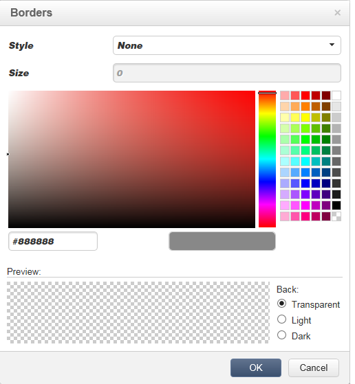
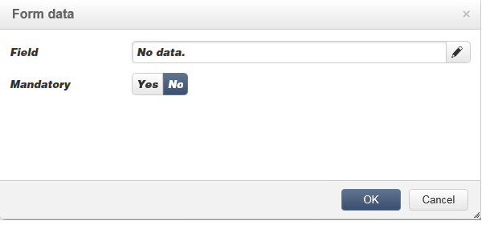
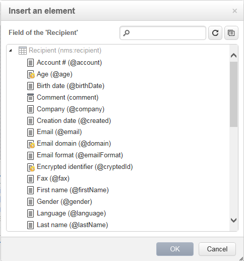

# Redigera innehåll{#editing-content}

## Definiera ett synlighetsvillkor {#defining-a-visibility-condition}

Du kan ange ett synlighetsvillkor för ett webbsidelement: det här elementet visas bara om villkoret uppfylls.

Om du vill lägga till ett synlighetsvillkor markerar du ett block och anger villkoret i **[!UICONTROL Visibility condition]** fältet med uttrycksredigeraren.


>[!NOTE]
>
>Avancerad redigering av uttryck visas på [den här sidan](../../platform/using/defining-filter-conditions.md#list-of-functions).


De här villkoren använder XTK-uttryckssyntaxen (till exempel **ctx.receive).@email != &quot;&quot;** eller **ctx.mottagare.@status==&quot;0&quot;**). Som standard är alla fält synliga.

>[!NOTE]
>
>Det går inte att redigera icke-synliga dynamiska block, till exempel nedrullningsbara menyer.

## Lägga till en kant och bakgrund {#adding-a-border-and-background}

Du kan lägga till en **kantlinje** i ett markerat block. Kanterna definieras med tre alternativ: stil, storlek och färg.



Du kan också definiera en **bakgrundsfärg** genom att välja en färg i färgdiagrammet.


## Redigera formulär {#editing-forms}

### Ändra dataegenskaper för ett formulär {#changing-the-data-properties-for-a-form}

Du kan länka databasfält med indatazon, alternativknapp eller kryssrutetypblock.


>[!NOTE]
>
>Standardfälten är de som finns i webbprogrammets lagringsschema.

Med **fältets** indatazon kan du välja ett databasfält som ska länkas till formulärfältet.

Som standard finns fälten i tabellen **nms:receive** .


Med alternativet **Obligatoriskt fält** kan du bara godkänna sidan om användaren har fyllt i fältet. Om ett obligatoriskt fält inte fylls i visas ett felmeddelande.

För alternativknappar och kryssrutor krävs **** ytterligare konfiguration.

Om mallen som används inte innehåller ett värde som standard måste du slutföra den i redigeraren.

Så här gör du:

* Klicka på **[!UICONTROL Edit]** ikonen.

   

* Ange det specificerade listvärdet (som definieras av det markerade fältet) i **[!UICONTROL Value]** fältet.

   

### Ändra formulärfält {#modifying-form-fields}

Formulärfält som alternativknappar, indatazoner, nedrullningsbara listor osv. kan ändras från verktygsfälten.

Det innebär att du kan:

* Ta bort blocket som innehåller formulärfälten med hjälp av **[!UICONTROL Delete]** -ikonen.
* Duplicera det markerade fältet genom att skapa ett nytt block med hjälp av **[!UICONTROL Duplicate]** -ikonen.
* Redigera fönstret för att länka ett databasfält till formulärzonen med hjälp av **[!UICONTROL Form data]** **[!UICONTROL Edit]** ikonen.

   

## Lägga till en åtgärd till en knapp {#adding-an-action-to-a-button}

När användaren klickar på en knapp kan du definiera en associerad åtgärd. Det gör du genom att välja åtgärden som ska utföras i listrutan.


Följande åtgärder är tillgängliga:

* **[!UICONTROL Refresh]** : uppdaterar den aktuella sidan.
* **[!UICONTROL Next page]** : skapar en länk till nästa sida i webbprogrammet.
* **[!UICONTROL Previous page]** : skapar en länk till föregående sida i webbprogrammet.

>[!NOTE]
>
>Med **[!UICONTROL None]** värdet kan du inte aktivera knappen.

Du kan ändra den etikett som är länkad till knappen i motsvarande fält.

## Lägga till en länk {#adding-a-link}

Du kan infoga en länk i valfritt sidelement: bild, ord, ordgrupp, textblock osv.

Det gör du genom att markera elementet och sedan använda den första ikonen på snabbmenyn.


Med den här ikonen kommer du åt alla tillgängliga typer av länkar.


Anpassningsblock och fält kan bara infogas i textblock.

>[!NOTE]
>
>För varje typ av länk kan du konfigurera öppningsläget: välj målfönstret i listrutan **Mål** . Detta värde motsvarar **`<target>`** HTML-taggen.
>
>Listan över tillgängliga **mål** är följande:

>* Annat (IFrame)
>* Övre fönster (_top)
* Överordnat fönster (_parent)
* Nytt fönster (_blank)
* Aktuellt fönster (_self)
* Standardwebbläsarbeteende


### Länka till en URL {#link-to-a-url}

Med alternativet **Länka till en extern URL** kan du öppna valfri URL-adress från källinnehållet.


Ange länkadressen i fråga i fältet **URL** . URL-fältet ska anges som: **https://www.myURL.com**.

### Länka till ett webbprogram {#link-to-a-web-application}

Med alternativet **Länka till ett webbprogram** kan du komma åt ett Adobe Campaign-webbprogram.


Välj webbprogrammet från motsvarande fält.

Listan med föreslagna webbprogram motsvarar de tillgängliga programmen i **[!UICONTROL Resources > Online > Web Applications]** noden.

### Länka till en åtgärd {#link-to-an-action}

Med **Länk som definierar ett åtgärdsalternativ** kan du konfigurera en åtgärd när du klickar på ett källelement.


>[!NOTE]
Tillgängliga åtgärder beskrivs i avsnittet [Lägga till en åtgärd för en knapp](#adding-an-action-to-a-button) .

### Ta bort en länk {#delete-a-link}

När en länk har infogats finns det två nya ikoner i verktygsfältet: **Redigera länk** och **Bryt länken** som gör att du kan interagera med den skapade länken.

* **[!UICONTROL Edit link]** I kan du visa ett fönster med alla länkens parametrar.
* **[!UICONTROL Break the link]** Med kan du ta bort länken och alla relaterade parametrar efter att du har bekräftat.

>[!NOTE]
Om länken tas bort behålls innehållet fortfarande.

## Ändra teckensnittsattribut {#changing-font-attributes}

När du markerar ett textelement kan du ändra teckensnittsattribut (format, format).


De tillgängliga alternativen är följande:

* **Ikon för Förstora teckensnitt** : ökar storleken på den markerade texten (lägg till `<span style="font size:">`)
* **Ikonen Minska teckensnitt** : minskar storleken på den markerade texten (lägg till `<span style="font size:">`)
* **Fet** ikon: gör markerad text fet (figursätt text med `<strong> </strong>` taggen )
* **Kursiv** ikon: gör markerad text kursiv (figursätt text med `<em> </em>` taggen)
* **Understrykningsikon** : gör markerad text understruken (figursätt text med `<span style="text-decoration: underline;">` taggen )
* **Vänsterjustera** : justerar text till vänster om det markerade blocket (add style=&quot;text-align: left;&quot;)
* **Centrera** : centrerar texten för det markerade blocket (add style=&quot;text-align: center;&quot;)
* **Högerjustera** ikon: justerar text till höger om det markerade blocket (add style=&quot;text-align: right;&quot;)
* **Ändra ikonen för bakgrundsfärg** : Med kan du ändra bakgrundsfärg för det markerade blocket (add style=&quot;background-color: rgba(170, 86, 255, 0,87))
* **Ikon för att ändra textfärg** : gör att du kan ändra textfärgen i det markerade blocket eller bara den markerade texten (`<span style="color: #CODE">`)

>[!NOTE]
* **Ta bort** ikon: tar bort blocket och allt dess innehåll.

* **Duplicera** ikon: duplicerar blocket samt alla format som hör till blocket.


## Hantera bilder och animeringar {#managing-images-and-animations}

Med Digital Content Editor kan du arbeta med **alla typer av bilder** som är kompatibla med webbläsare.

För att vara kompatibelt med DCE måste animeringar **av typen** &quot;Flash&quot; infogas på en HTML-sida på följande sätt:

```
<object type="application/x-shockwave-flash" data="https://www.mydomain.com/flash/your_animation.swf" width="200" height="400">
 <param name="movie" value="https://www.mydomain.com/flash/your_animation.swf" />
 <param name="quality" value="high" />
 <param name="play" value="true"/>
 <param name="loop" value="true"/> 
</object>
```

>[!CAUTION]
Du får inte anropa externa filer i en **script** -tagg på HTML-sidan. Dessa filer importeras inte till Adobe Campaign-servern.

### Lägga till/ta bort/duplicera en bild {#adding---deleting---duplicating-an-image}

Om du vill infoga en bild markerar du ett bildtypsblock och klickar på ikonen **Bild** .


Välj en bildfil som har sparats lokalt.


Ikonen **Ta bort** tar bort  taggen som innehåller bilden.

Ikonen **Duplicera** duplicerar  -taggen och dess innehåll.

>[!CAUTION]
När du duplicerar en bild tas de identifierare som hör till den nya bilden bort.

### Redigera bildegenskaper {#editing-image-properties}

När du markerar ett block som innehåller en bild får du tillgång till följande egenskaper:

* **Med bildtext** kan du definiera bildtexten som är länkad till bilden (motsvarar **alt** HTML-attributet).
* **Med Dimensioner** kan du ange bildstorleken i pixlar.

   

## Lägga till innehåll för personalisering {#adding-personalization-content}

### Infoga ett anpassningsfält {#inserting-a-personalization-field}

Med alternativet **Anpassningsfält** för infogningsikonen kan du lägga till ett databasfält i innehållet, till exempel mottagarens namn. Det här alternativet är bara tillgängligt för textblock.



Som standard hämtas fälten från **[!UICONTROL Recipient]** tabellen. Redigera webbprogrammets egenskaper och markera en annan tabell om det behövs.

Fältnamnet visas i redigeraren, markerat med gult. Den ersätts av målmottagarens profil när personaliseringen genereras (t.ex. när en landningssida förhandsgranskas).

Ett exempel visas i avsnittet [Infoga ett personaliseringsfält](../../web/using/creating-a-landing-page.md#inserting-a-personalization-field) .

### Infoga ett personaliseringsblock {#inserting-a-personalization-block}

Med alternativet **Personalisering-block** kan du infoga dynamiska och personaliserade block i innehållet. Du kan till exempel lägga till en logotyp eller ett gratulationsmeddelande. Det är inte tillgängligt för textblock.


När personaliseringsblocknamnet har infogats visas det i redigeraren, markerat med gult. Den anpassas automatiskt till mottagarprofilen när personalisering genereras.

Mer information om inbyggda personaliseringsblock och hur du definierar anpassade personaliseringsblock finns på [den här sidan](../../delivery/using/personalization-blocks.md).
