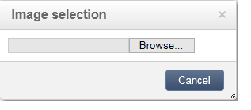

# Redigera innehåll{#editing-content}

## Definiera ett synlighetsvillkor {#defining-a-visibility-condition}

Du kan ange ett synlighetsvillkor för ett webbsideselement: det här elementet visas bara om villkoret uppfylls.

Om du vill lägga till ett synlighetsvillkor markerar du ett block och anger villkoret i **[!UICONTROL Visibility condition]** fält med uttrycksredigeraren.

>[!NOTE]
>
>Avancerad uttrycksredigering visas på [den här sidan](../../platform/using/defining-filter-conditions.md#list-of-functions).

De här villkoren använder XTK-uttryckssyntaxen (till exempel **ctx.mottagare.@email != &quot;&quot;** eller **ctx.mottagare.@status==&quot;0&quot;**). Som standard är alla fält synliga.

>[!NOTE]
>
>Det går inte att redigera icke-synliga dynamiska block, till exempel nedrullningsbara menyer.

## Lägga till en kant och bakgrund {#adding-a-border-and-background}

Du kan lägga till en **border** till ett markerat block. Kanterna definieras med hjälp av tre alternativ: stil, storlek och färg.

Du kan också definiera en **bakgrundsfärg** genom att välja en färg i färgdiagrammet.

## Redigera formulär {#editing-forms}

### Ändra dataegenskaper för ett formulär {#changing-the-data-properties-for-a-form}

Du kan länka databasfält med indatazon, alternativknapp eller kryssrutetypblock.

>[!NOTE]
>
>Standardfälten är de som finns i webbprogrammets lagringsschema.

The **fält** Med indatazonen kan du välja ett databasfält som ska länkas till formulärfältet.

Som standard visas fälten i **nms:mottagare** tabell.

The **Obligatoriskt fält** kan du bara godkänna sidan om användaren har fyllt i fältet. Om ett obligatoriskt fält inte fylls i visas ett felmeddelande.

För alternativknappar och kryssrutor **ytterligare konfiguration krävs**.

Om mallen som används inte innehåller ett värde som standard måste du slutföra den i redigeraren.

Så här gör du:

* Klicka på **[!UICONTROL Edit]** -ikon.

  

* Ange det specificerade listvärdet (definierat av det markerade fältet) i dialogrutan **[!UICONTROL Value]** fält.

  

### Ändra formulärfält {#modifying-form-fields}

Formulärfält som alternativknappar, indatazoner, listrutor osv. kan ändras från verktygsfälten.

Det innebär att du kan:

* Ta bort blocket som innehåller formulärfälten med **[!UICONTROL Delete]** -ikon.
* Duplicera det markerade fältet genom att skapa ett nytt block med **[!UICONTROL Duplicate]** -ikon.
* Redigera **[!UICONTROL Form data]** fönster för att länka ett databasfält till formulärzonen med hjälp av **[!UICONTROL Edit]** -ikon.

  

## Lägga till en åtgärd till en knapp {#adding-an-action-to-a-button}

När användaren klickar på en knapp kan du definiera en associerad åtgärd. Om du vill göra det väljer du den åtgärd som ska utföras i listrutan.

Följande åtgärder är tillgängliga:

* **[!UICONTROL Refresh]** : uppdaterar den aktuella sidan.
* **[!UICONTROL Next page]** : skapar en länk till nästa sida i webbprogrammet.
* **[!UICONTROL Previous page]** : skapar en länk till föregående sida i webbprogrammet.

>[!NOTE]
>
>The **[!UICONTROL None]** kan du inte aktivera knappen.

Du kan ändra den etikett som är länkad till knappen i motsvarande fält.

## Lägga till en länk {#adding-a-link}

Du kan infoga en länk i vilket sidelement som helst: bild, ord, ordgrupp, textblock osv.

Det gör du genom att markera elementet och sedan använda den första ikonen på snabbmenyn.

Med den här ikonen kommer du åt alla tillgängliga typer av länkar.

Anpassningsblock och fält kan bara infogas i textblock.

>[!NOTE]
>
>För varje typ av länk kan du konfigurera öppningsläget: välj målfönstret i **Mål** listruta. Detta värde motsvarar **`<target>`** HTML-tagg.
>
>Listan med tillgängliga **mål** är som följer:
>
>* Annat (IFrame)
>* Övre fönster (_top)
>* Överordnat fönster (_parent)
>* Nytt fönster (_blank)
>* Aktuellt fönster (_self)
>* Standardwebbläsarbeteende
>

### Länka till en URL {#link-to-a-url}

The **Länka till en extern URL** gör att du kan öppna valfri URL-adress från källinnehållet.

Ange länkadressen i fråga i **URL** fält. URL-fältet ska anges som: **https://www.myURL.com**.

### Länka till ett webbprogram {#link-to-a-web-application}

The **Länka till ett webbprogram** kan du använda ett Adobe Campaign-webbprogram.

Välj webbprogrammet från motsvarande fält.

Listan med förslag på webbprogram motsvarar de tillgängliga programmen i **[!UICONTROL Resources > Online > Web Applications]** nod.

### Länka till en åtgärd {#link-to-an-action}

The **Länk som definierar en åtgärd** gör att du kan konfigurera en åtgärd när du klickar på ett källelement.

>[!NOTE]
>
>Tillgängliga åtgärder beskrivs i [Lägga till en åtgärd till en knapp](#adding-an-action-to-a-button) -avsnitt.

### Ta bort en länk {#delete-a-link}

När en länk har infogats finns det två nya ikoner i verktygsfältet: **Redigera länk** och **Bryt länken** som gör att du kan interagera med den skapade länken.

* **[!UICONTROL Edit link]** I kan du visa ett fönster med alla länkens parametrar.
* **[!UICONTROL Break the link]** Med kan du ta bort länken och alla relaterade parametrar efter att du har bekräftat.

>[!NOTE]
>
>Om länken tas bort behålls innehållet fortfarande.

## Ändra teckensnittsattribut {#changing-font-attributes}

När du markerar ett textelement kan du ändra teckensnittsattribut (format, format).

De tillgängliga alternativen är följande:

* **Förstora teckensnitt** ikon: ökar storleken på den markerade texten (lägg till ``)
* **Minska teckensnitt** ikon: minskar storleken på den markerade texten (lägg till ``)
* **Fet** ikon: gör markerad text fet (figursätt text med `<strong> </strong>` tagg)
* **Kursiv** ikon: gör markerad text kursiv (figursätt text med  `<em> </em>` tagg)
* **Understruken** ikon: gör markerad text understruken (figursätt text med `` tagg)
* **Vänsterjustera** ikon: justerar text till vänster om det markerade blocket (add style=&quot;text-align: left;&quot;)
* **Centrera** ikon: centrerar texten för det markerade blocket (add style=&quot;text-align: center;&quot;)
* **Högerjustera** ikon: justerar text till höger om det markerade blocket (add style=&quot;text-align: right;&quot;)
* **Ändra bakgrundsfärgen** icon: gör att du kan ändra bakgrundsfärgen för det markerade blocket (add style=&quot;background-color: rgba(170, 86, 255, 0.87))
* **Ändra textfärg** ikon: gör att du kan ändra textfärgen i det markerade blocket eller bara i den markerade texten (``)

>[!NOTE]
>
>* **Ta bort** ikon: tar bort blocket och allt dess innehåll.
>
>* **Duplicera** ikon: duplicerar blocket samt alla format som hör till blocket.

## Hantera bilder och animeringar {#managing-images-and-animations}

Med Digital Content Editor kan du arbeta med **alla typer av bilder** kompatibelt med webbläsare.

>[!CAUTION]
>
>Du får inte anropa externa filer i en **script** -taggen på HTML-sidan. Dessa filer kommer inte att importeras till Adobe Campaign-servern.

### Lägga till/ta bort/duplicera en bild {#adding---deleting---duplicating-an-image}

Om du vill infoga en bild markerar du ett bildtypsblock och klickar på knappen **Bild** -ikon.

Välj en bildfil som har sparats lokalt.

The **Ta bort** -ikonen tar bort taggen som innehåller bilden.

The **Duplicera** -ikonen duplicerar -taggen och dess innehåll.

>[!CAUTION]
>
>När du duplicerar en bild tas de identifierare som hör till den nya bilden bort.

### Redigera bildegenskaper {#editing-image-properties}

När du markerar ett block som innehåller en bild får du tillgång till följande egenskaper:

* **Bildtext** gör att du kan definiera den bildtext som är länkad till bilden (motsvarar **alt** HTML).
* **Dimensioner** I kan du ange bildstorleken i pixlar.

  

## Lägga till innehåll för personalisering {#adding-personalization-content}

### Infoga ett personaliserat fält {#inserting-a-personalization-field}

The **Anpassningsfält** Med alternativet för ikonen Infoga kan du lägga till ett databasfält i innehållet, till exempel mottagarens namn. Det här alternativet är bara tillgängligt för textblock.

Som standard visas fälten på **[!UICONTROL Recipient]** tabell. Om det behövs kan du redigera webbprogrammets egenskaper och välja en annan tabell.

Fältnamnet visas i redigeraren, markerat med gult. Den ersätts av målmottagarens profil när personaliseringen genereras (t.ex. när en landningssida förhandsgranskas).

Ett exempel visas i [Infoga ett anpassningsfält](creating-a-landing-page.md#inserting-a-personalization-field) -avsnitt.

### Infoga ett personaliseringsblock {#inserting-a-personalization-block}

The **Personaliseringsblock** gör att du kan infoga dynamiska och personliga block i innehållet. Du kan till exempel lägga till en logotyp eller ett gratulationsmeddelande. Det är inte tillgängligt för textblock.

När personaliseringsblocknamnet har infogats visas det i redigeraren, markerat med gult. Den anpassas automatiskt till mottagarprofilen när personalisering genereras.

Mer information om inbyggda personaliseringsblock och hur du definierar anpassade personaliseringsblock finns i [den här sidan](../../delivery/using/personalization-blocks.md).
