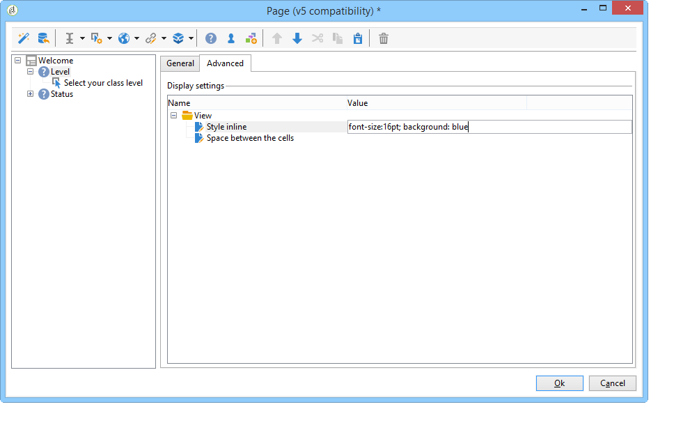
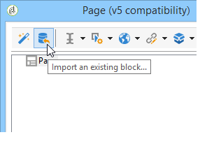
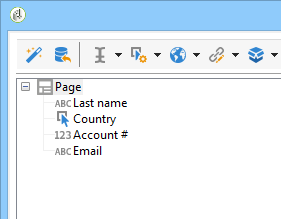

# Formuläråtergivning{#form-rendering}

## Välja formuläråtergivningsmall {#selecting-the-form-rendering-template}

Med formulärinställningarna kan du välja den mall som ska användas för att generera sidorna. Om du vill komma åt dem klickar du på knappen **[!UICONTROL Properties]** i verktygsfältet för formulärdetaljer och väljer fliken **[!UICONTROL Rendering]**. Som standard finns det ett antal mallar (formatmallar).

I det nedre avsnittet av redigeraren kan du visa en återgivning av den valda mallen.

Med zoomfunktionen kan du redigera den valda mallen.

Du kan ändra eller åsidosätta dessa mallar. Om du vill göra det klickar du på länken **[!UICONTROL Page layout...]** och anpassar informationen.

Du kan:

* Ändra bilden som används som logotyp och anpassa dess storlek,
* Ange också sökvägen för åtkomst till förhandsvisningsbilden när användarna väljer den här återgivningsmallen.

På fliken **[!UICONTROL Headers/Footers]** kan du ändra den information som visas i sidhuvuden och sidfötter på varje formulärsida med den här mallen.

Varje rad i avsnittet **[!UICONTROL Page headers]** och **[!UICONTROL Page footers]** motsvarar en rad på HTML-sidan. Klicka på **[!UICONTROL Add]** om du vill skapa en ny rad.

Markera en befintlig rad och klicka på knappen **[!UICONTROL Detail]** för att anpassa den.

Du kan ändra innehållet på raden, lägga till kanter och ändra teckensnittsattributen via de relevanta flikarna. Klicka på **[!UICONTROL OK]** för att bekräfta dessa ändringar.

I fälten **[!UICONTROL Position]** kan du definiera elementens placering i sidhuvudet och sidfoten.

>[!NOTE]
>
>Återgivningsmallar lagras i noden **[!UICONTROL Administration > Configuration > Form rendering]**.\
>Mer information finns i [Anpassa formuläråtergivning](#customizing-form-rendering)

## Anpassa formuläråtergivning {#customizing-form-rendering}

### Ändra layouten för element {#changing-the-layout-of-elements}

Du kan överlagra formatmallen för varje element i formuläret (inmatningsfält, bilder, alternativknappar etc.).

Använd fliken **[!UICONTROL Advanced]** om du vill göra det.

Här kan du definiera följande egenskaper:

* **[!UICONTROL Label position]**: se [Definiera placeringen av etiketter](defining-web-forms-layout.md#defining-the-position-of-labels),
* **[!UICONTROL Label format]**: Radbyte eller Ingen radbrytning,
* **[!UICONTROL Number of cells]** : se [Placera fälten på sidan](defining-web-forms-layout.md#positioning-the-fields-on-the-page),
* **[!UICONTROL Horizontal alignment]** (vänster, höger, centrerad) och **[!UICONTROL Vertical alignment]** (hög, låg, mitten),
* **[!UICONTROL Width]** av zonen: detta kan uttryckas i procent eller i måttenheter, punkter eller pixlar (standardvärde),
* Maximalt **[!UICONTROL Length]**: Maximalt antal tecken tillåts (för typografierna Text, Number och Password),
* **[!UICONTROL Lines]**: antal rader för en **[!UICONTROL Multi-line text]**-typzon,
* **[!UICONTROL Style inline]**: gör att du kan överlagra CSS-formatmallen med ytterligare inställningar. Dessa separeras med **;** tecken, vilket visas i exemplet nedan:

  

### Definiera sidhuvuden och sidfötter {#defining-headers-and-footers}

Fält ordnas i en trädstruktur vars rot har samma namn som sidan. Markera den om du vill ändra namnet.

Fönstrets rubrik måste anges på fliken **[!UICONTROL Page]** i fönstret för formuläregenskaper. Du kan också lägga till ett visst innehåll i sidhuvudet och sidfoten (den här informationen visas på alla sidor). Det här innehållet anges i de matchande avsnitten på fliken **[!UICONTROL Texts]**, vilket visas nedan:

### Lägga till element i sidhuvudet HTML {#adding-elements-to-html-header}

Du kan ange ytterligare element som ska infogas i formulärsidans HTML-sidhuvud. Om du vill göra det anger du elementen på fliken **[!UICONTROL Header]** på den aktuella sidan.

Då kan du t.ex. referera till en ikon som visas i sidans namnlist.

## Definiera kontrollinställningar {#defining-control-settings}

När användaren fyller i formuläret utförs automatiskt en kontroll av vissa fält beroende på format eller konfiguration. Detta gör att du kan göra vissa fält obligatoriska (se [Definiera obligatoriska fält](#defining-mandatory-fields)) eller kontrollera formatet för de data som anges (se [Kontrollera dataformat](#checking-data-format)). Kontroller utförs under sidgodkännande (genom att klicka på en länk eller knapp som aktiverar en utdataövergång).

### Definiera obligatoriska fält {#defining-mandatory-fields}

Om du vill göra vissa fält obligatoriska väljer du det här alternativet när du skapar fältet.

Om användaren godkänner den här sidan utan att ha skrivit in fältet visas följande meddelande:

Du kan anpassa det här meddelandet genom att klicka på länken **[!UICONTROL Personalize this message]**.

Om användaren godkänner den här sidan utan att ha skrivit in fältet visas följande meddelande:

### Kontrollerar dataformat {#checking-data-format}

För formulärkontroller vars värden lagras i ett befintligt fält i databasen, gäller reglerna för lagringsfältet.

För formulärkontroller vars värden lagras i en variabel, beror godkännandereglerna på variabelns format.

Om du till exempel skapar en **[!UICONTROL Number]**-kontroll för att lagra klientnumret, som visas nedan:

Användaren måste ange ett heltal i formulärfältet.

## Definiera villkorlig visning av fält {#defining-fields-conditional-display}

Du kan konfigurera visningen av fält på sidan som ska visas baserat på de värden som användaren väljer. Detta kan gälla ett fält eller en grupp av fält (när de grupperas i en behållare).

För varje element på sidan kan du definiera visningsvillkoren i avsnittet **[!UICONTROL Visibility]**.

Villkoren kan gälla värdet för databasfält eller variabler.

I fältvalsfönstret kan du välja bland följande data:

* Huvudträdet innehåller parametrarna för formulärkontexten. Standardparametrarna är identifieraren (som matchar mottagarens krypterade identifierare), språk och ursprung.

  Se denna [sida](defining-web-forms-properties.md#form-url-parameters) för mer information om detta.

* Underträdet **[!UICONTROL Recipients]** innehåller indatafälten som infogats i formuläret och lagrats i databasen.

  Mer information finns i [Lagra data i databasen](web-forms-answers.md#storing-data-in-the-database).

* Underträdet **[!UICONTROL Variables]** innehåller de tillgängliga variablerna för det här formuläret. Mer information finns i [Lagra data i en lokal variabel](web-forms-answers.md#storing-data-in-a-local-variable).

Mer information finns i användningsexemplet här: [Visa olika alternativ beroende på de valda värdena](use-cases-web-forms.md#displaying-different-options-depending-on-the-selected-values).

Du kan också ange villkor för hur formulärsidor ska visas med objektet **[!UICONTROL Test]**. Se denna [sida](defining-web-forms-page-sequencing.md#conditional-page-display) för mer information om detta.

## Importera element från ett befintligt formulär {#importing-elements-from-an-existing-form}

Det går att importera fält eller behållare från andra webbformulär. På så sätt kan du skapa ett bibliotek med återanvändbara block som infogas i formulär, t.ex. adressblocket, prenumerationsområdet för nyhetsbrevet.

Så här importerar du ett element till ett formulär:

1. Redigera sidan som du vill infoga ett eller flera element i och klicka sedan på **[!UICONTROL Import an existing block]** i verktygsfältet.

   

1. Markera det webbformulär som innehåller de fält som ska importeras och välj de behållare och fält som ska importeras.

   

   >[!NOTE]
   >
   >Med ikonen **[!UICONTROL Edit link]** till höger om källformulärnamnet kan du visa det valda webbformuläret.

1. Bekräfta infogningen genom att klicka på **[!UICONTROL Ok]**.

   
