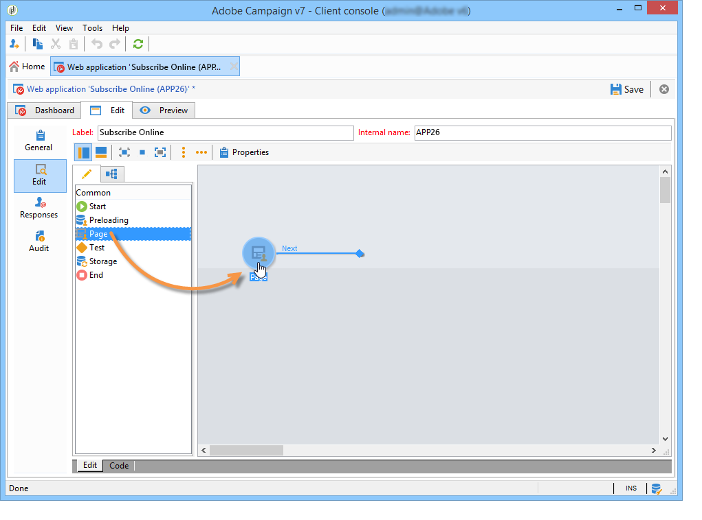

# Komma igång med enkäter{#getting-started-with-surveys}

Här följer en kort översikt över de viktigaste stegen för att skapa en enkel enkät med hjälp av följande mall:

De här stegen är:

1. [Steg 1 - Skapa en undersökning](#step-1---creating-a-survey),
1. [Steg 2 - Välja mall](#step-2---selecting-the-template),
1. [Steg 3 - Skapa enkäten](#step-3---building-the-survey),
1. [Steg 4 - Skapa sidinnehållet](#step-4---creating-the-page-content),
1. [Steg 5 - Lagra undersökningsdata](#step-5---storing-the-survey-data-),
1. [Steg 6 - Publicera sidorna](#step-6---publishing-the-pages),
1. [Steg 7 - Dela din nätundersökning](#step-7---sharing-your-online-survey).

## Steg 1 - Skapa en undersökning {#step-1---creating-a-survey}

Om du vill skapa en ny undersökning går du till **[!UICONTROL Campaigns]** - eller **[!UICONTROL Profiles and targets]** -fliken och klickar på **[!UICONTROL Web Applications]** menyn. Klicka på **[!UICONTROL Create]** knappen ovanför listan med formulär.

## Steg 2 - Välja mall {#step-2---selecting-the-template}

Välj en undersökningsmall och ge sedan undersökningen ett namn. Slutanvändarna ser inte det här namnet, men de kan identifiera undersökningen i Adobe Campaign. Klicka **[!UICONTROL Save]** för att lägga till undersökningen i listan över webbprogram.

## Steg 3 - Skapa enkäten {#step-3---building-the-survey}

Undersökningar byggs i ett diagram där följande element är placerade: sidan/sidorna där innehållet ska skapas, stegen för att ladda in och spara data samt testfaserna. Skript och frågor kan också infogas.

Om du vill skapa ett diagram klickar du på **[!UICONTROL Edit]** undersökningsformuläret.

En undersökning måste innehålla **minst** följande tre komponenter: en sida, en lagringsruta och en slutsida.

* Om du vill skapa en sida markerar du **[!UICONTROL Page]** objektet i den vänstra delen av redigeraren och placerar det i den mellersta delen enligt nedan:

   

* Sedan markerar du objektet och placerar det på sidans utdataövergång. **[!UICONTROL Storage]**
* Slutligen markerar du objektet och placerar det i slutet av lagringsrutans utdataövergång för att få följande diagram: **[!UICONTROL End]**

   

## Steg 4 - Skapa sidinnehållet {#step-4---creating-the-page-content}

I följande exempel använder vi en **[!UICONTROL Page (v5 compatibility)]** textsida. Den här typen av sidor öppnas via den avancerade menyn på **[!UICONTROL Edit]** fliken.

* Lägga till inmatningsfält

   Om du vill skapa sidans innehåll måste du redigera det: Om du vill göra det dubbelklickar du på **[!UICONTROL Page]** objektet. Klicka på den första ikonen i verktygsfältet för att öppna guiden för att skapa fält. Om du vill skapa ett inmatningsfält för användarnamnet som ska lagras i det matchande fältet i mottagarens profil väljer du **[!UICONTROL Edit a recipient]**.

   

   Klicka på **[!UICONTROL Next]** knappen för att välja fältet för datalagring i databasen. I det här fallet fältet &#39;Efternamn&#39;.

   

   Klicka **[!UICONTROL Finish]** för att bekräfta att fältet har skapats.

   När informationen lagras i ett fält som redan finns i databasen får fältet som standard det markerade fältets namn, dvs. &#39;Efternamn&#39; i det här exemplet. Du kan ändra den här etiketten enligt nedan:

   

   Skapa nu ett inmatningsfält för användarkontonumret. Upprepa åtgärden och välj Kontonr fält.

   Använd samma procedur för att lägga till ett fält där användaren kan ange en e-postadress.

* Om du vill skapa en fråga högerklickar du på det sista elementet i trädet och väljer **[!UICONTROL Containers > Question]** eller klickar på **[!UICONTROL Containers]** -ikonen och väljer **[!UICONTROL Question]**.

   

   Ange etiketten för frågan och infoga svarsfälten som en underavdelning till frågan. För att göra detta måste den nod som är länkad till frågan vara markerad när du skapar svarsfältet. Lägg till en **[!UICONTROL drop-down listx]** med hjälp av **[!UICONTROL Selection controls]** ikonen eller genom att högerklicka, som visas nedan:

   

   Välj ett lagringsutrymme: välj ett uppräkningsfält för att hämta värdena automatiskt (i det här fallet e-postformatet).

   

   Klicka på **[!UICONTROL General]** länken på **[!UICONTROL Initialize the list of values from the database]** fliken: värdetabellen anges automatiskt.

   

   Klicka **[!UICONTROL OK]** för att stänga redigeraren och **[!UICONTROL Save]** för att spara ändringarna.

   >[!NOTE]
   >
   >För varje fält eller fråga kan du anpassa sidlayouten efter dina behov, tack vare alternativen på **[!UICONTROL Advanced]** fliken. Layouten för undersökningsskärmar beskrivs i [det här avsnittet](../../web/using/about-web-forms.md).

   Klicka på fliken för att visa återgivningen av den undersökning du just har skapat på **[!UICONTROL Preview]** detaljskärmen.

   

## Steg 5 - Lagra undersökningsdata {#step-5---storing-the-survey-data-}

I lagringsrutan kan du spara användarsvaren i databasen. Du måste välja en avstämningsnyckel för att identifiera de profiler som redan finns i databasen.

Om du vill göra det redigerar du rutan och väljer det fält som ska användas som avstämningsnyckel när data lagras.

I exemplet nedan uppdateras profilen när du sparar (bekräftar) och en profil sparas i databasen med samma kontonummer som den som anges i formuläret. Om profilen inte finns skapas den.

Klicka **[!UICONTROL OK]** för att bekräfta och klicka sedan på **[!UICONTROL Save]** för att spara enkäten

## Steg 6 - Publicera sidorna {#step-6---publishing-the-pages}

För att användare ska kunna komma åt HTML-sidorna måste programmet vara tillgängligt. Den får inte längre vara i redigeringsskedet utan i produktionen. Om du vill publicera en undersökning måste du publicera den. Så här gör du:

* Klicka på knappen **[!UICONTROL Publish]** ovanför kontrollpanelen för undersökningen.
* Klicka **[!UICONTROL Start]** för att starta publikationen och stänga guiden.

   

   Status för undersökningen ändras till: **Online**.

   

## Steg 7 - Dela din nätundersökning {#step-7---sharing-your-online-survey}

När enkäten är i produktion är den tillgänglig på servern och du kan leverera den. URL:en för att komma åt undersökningen visas på kontrollpanelen.

Om du vill leverera enkäten kan du skicka ett meddelande som innehåller en åtkomstlänk till målpopulationen eller placera URL:en för enkäten på en webbsida, till exempel.

Du kan sedan övervaka användarsvar via rapporter och loggar. Se [Svarsspårning](../../web/using/publish--track-and-use-collected-data.md#response-tracking).

>[!CAUTION]
>
>Den offentliga URL:en innehåller undersökningens interna namn. När det interna namnet ändras uppdateras URL-adressen automatiskt: Alla länkar till undersökningen måste också uppdateras.
>
>Om leveranser som innehåller länken till formuläret redan har skickats, kommer länken inte längre att fungera.

