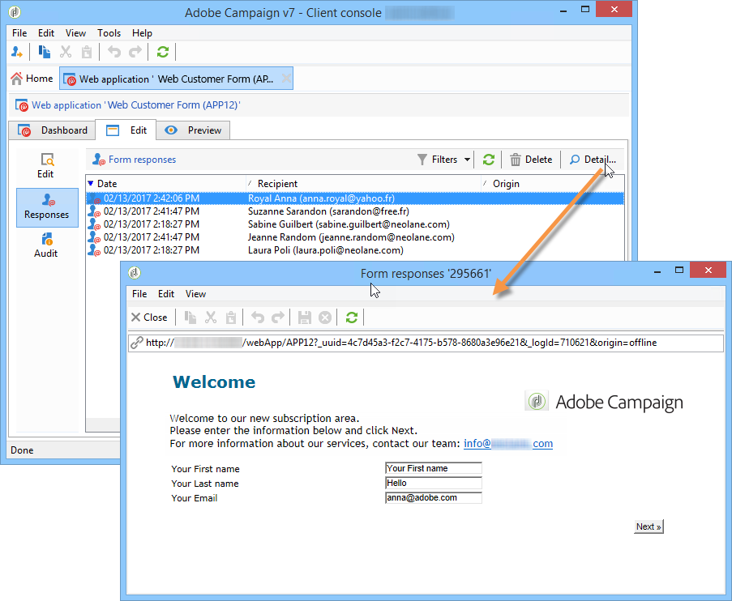

# Publicera ett webbformulär{#publishing-a-web-form}

## Läs in formulärdata i förväg {#pre-loading-the-form-data}

Om du vill uppdatera profilerna som lagras i databasen via ett webbformulär kan du använda en förinläsningsruta. I rutan för förinläsning kan du ange hur posten ska uppdateras i databasen.

Följande identifieringsmetoder är möjliga:

* **[!UICONTROL Adobe Campaign Encryption]**

   Den här krypteringsmetoden använder den krypterade Adobe Campaign-identifieraren (ID). Den här metoden kan bara användas på ett Adobe Campaign-objekt och det krypterade ID:t kan bara genereras av Adobe Campaign-plattformen.

   När du använder den här metoden måste du anpassa formulärets URL för att kunna leverera till e-postadressen genom att lägga till **`<%=escapeUrl(recipient.cryptedId) %>`** parametern. Mer information finns i [Leverera ett formulär via e-post](#delivering-a-form-via-email).

* **[!UICONTROL DES encryption]**

   

   Den här krypteringsmetoden använder en extern identifierare (ID) som är länkad till en nyckel som delas av Adobe Campaign och den externa providern. I **[!UICONTROL Des key]** fältet kan du ange den här krypteringsnyckeln.

* **[!UICONTROL List of fields]**

   Med det här alternativet kan du välja bland fälten i formulärets aktuella sammanhang, de som ska användas för att hitta motsvarande profil i databasen.

   

   Du kan lägga till fält i formuläregenskaperna via **[!UICONTROL Parameters]** fliken (se [Lägga till parametrar](../../web/using/defining-web-forms-properties.md#adding-parameters)). De placeras i formulärets URL-adress eller indatazoner.

   >[!CAUTION]
   >
   >Data i de markerade fälten är inte krypterade. Den får inte tillhandahållas i krypterad form eftersom Adobe Campaign inte kan dekryptera den om **[!UICONTROL Field list]** alternativet är valt.

   I följande exempel baseras förinläsningen av profiler på e-postadressen.

   URL:en kan innehålla den okrypterade e-postadressen, och i så fall har användarna direkt åtkomst till de sidor som berör dem.

   

   Annars blir de ombedda att ange sitt lösenord.

   

   >[!CAUTION]
   >
   >Om flera fält anges i listan måste data i **ALLA FÄLT** matcha data som lagras i databasen för att profilen ska kunna uppdateras. I annat fall skapas en ny profil.
   > 
   >Den här funktionen är särskilt användbar för webbprogram, men rekommenderas inte för offentliga formulär. Det valda åtkomstkontrollalternativet måste vara &quot;Aktivera åtkomstkontroll&quot;.

Du måste markera **[!UICONTROL Skip preloading if identification is empty]** alternativet om du inte vill uppdatera profiler. I det här fallet läggs alla profiler som anges till i databasen när formuläret har godkänts. Det här alternativet används till exempel när formuläret publiceras på en webbplats.

Med det här **[!UICONTROL Auto-load data referenced in the form]** alternativet kan du automatiskt förhandsladda data som matchar inmatnings- och kopplingsfält i formuläret. Uppgifter som det hänvisas till i **[!UICONTROL Script]** och **[!UICONTROL Test]** aktiviteter berörs dock inte. Om det här alternativet inte är markerat måste du definiera fälten med hjälp av **[!UICONTROL Load additional data]** alternativet.

Med det här **[!UICONTROL Load additional data]** alternativet kan du lägga till information som inte används på formulärets sidor, men som ändå kommer att vara förinläst.

Du kan till exempel förhandsladda mottagarens kön och automatiskt dirigera honom eller henne till rätt sida via en testruta.


## Hantera distribution och spårning av webbformulär {#managing-web-forms-delivery-and-tracking}

När formuläret har skapats, konfigurerats och publicerats kan du leverera det och spåra användarsvar.

### Formulärets livscykel {#life-cycle-of-a-form}

En forms livscykel består av tre steg:

1. **Formuläret redigeras**

   Detta är den inledande designfasen. När ett nytt formulär skapas är det i redigeringsfasen. Åtkomst till formuläret, endast i testsyfte, kräver sedan att parametern används i dess URL. **[!UICONTROL __uuid]** Den här URL:en finns på **[!UICONTROL Preview]** underfliken. Se [Formulär-URL-parametrar](../../web/using/defining-web-forms-properties.md#form-url-parameters).

   >[!CAUTION]
   >
   >Så länge formuläret redigeras är dess åtkomst-URL en en särskild URL.

1. **Form Online**

   När designfasen är klar kan blanketten skickas. För det första måste det publiceras. Mer information finns i [Publicera ett formulär](#publishing-a-form).

   Formuläret används **[!UICONTROL Live]** tills det förfaller.

   >[!CAUTION]
   >
   >URL:en för undersökningen får inte innehålla **[!UICONTROL __uuid]** parametern för att kunna levereras.

1. **Formuläret är inte tillgängligt**

   När formuläret har stängts är leveransfasen slut och formuläret blir otillgängligt: det inte längre är tillgängligt för användare.

   Utgångsdatumet kan definieras i fönstret för formuläregenskaper. Mer information finns i [Göra ett formulär tillgängligt online](#making-a-form-available-online)

Ett formulärs publiceringsstatus visas i formulärlistan.


### Publicera ett formulär {#publishing-a-form}

Om du vill ändra ett formulärs status måste du publicera det. Det gör du genom att klicka på **[!UICONTROL Publication]** knappen ovanför listan med webbformulär och välja läge i listrutan.


### Göra ett formulär tillgängligt online {#making-a-form-available-online}

För att användarna ska kunna komma åt formuläret måste det vara i produktion och ha startats, dvs. inom giltighetsperioden. Giltighetsdatumen anges via formulärets **[!UICONTROL Properties]** länk.

* Använd fälten i **[!UICONTROL Project]** avsnittet för att ange start- och slutdatum för formuläret.

   

* Klicka på **[!UICONTROL Personalize the message displayed if the form is closed...]** länken för att definiera felmeddelandet som ska visas om användaren försöker få åtkomst till formuläret medan det inte är giltigt.

   Se [Formulärets](../../web/using/defining-web-forms-properties.md#accessibility-of-the-form)tillgänglighet.

### Leverera ett formulär via e-post {#delivering-a-form-via-email}

När du skickar en inbjudan via e-post kan du använda **[!UICONTROL Adobe Campaign Encryption]** alternativet för datavstämning. Det gör du genom att gå till leveransguiden och anpassa länken till formuläret genom att lägga till följande parameter:

```
<a href="https://server/webApp/APP264?&id=<%=escapeUrl(recipient.cryptedId) %>">
```

I det här fallet måste avstämningsnyckeln för datalagring vara mottagarens krypterade identifierare. Mer information finns i [Förhandsladda formulärdata](#pre-loading-the-form-data).

I det här fallet måste du markera alternativet **[!UICONTROL Update the preloaded record]** i postrutan. Mer information finns i [Spara webbformulär](../../web/using/web-forms-answers.md#saving-web-forms-answers).


### Loggsvar {#log-responses}

Svarsspårning kan aktiveras på en dedikerad flik för att övervaka effekten av webbformuläret. Det gör du genom att klicka på **[!UICONTROL Advanced parameters...]** länken i fönstret för formuläregenskaper och välja **[!UICONTROL Log responses]** alternativet.


Fliken visas så att du kan se svarandens identitet **[!UICONTROL Responses]** .


Markera en mottagare och klicka på **[!UICONTROL Detail...]** knappen för att visa de svar som ges.



Du kan bearbeta svarsloggarna i frågor, till exempel för att endast rikta sig till icke-svarande när du skickar påminnelser, eller för att endast erbjuda specifik kommunikation till svaranden.

>[!NOTE]
>
>Om du vill ha en fullständig spårning av svaren kan du exportera svaren och visa eller skapa dedikerade rapporter med den valfria **undersökningsmodulen** . Mer information finns i [det här avsnittet](../../web/using/about-surveys.md).

