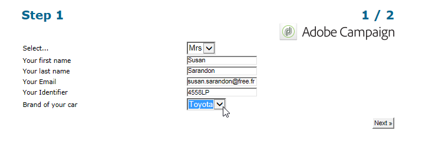
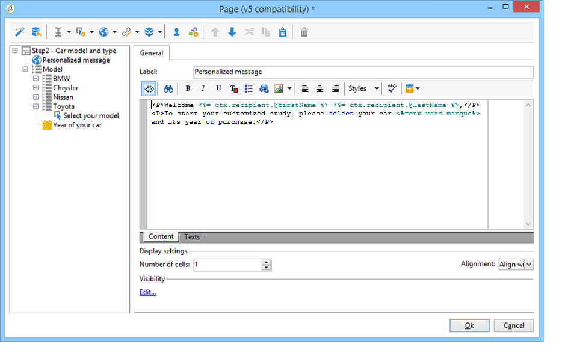
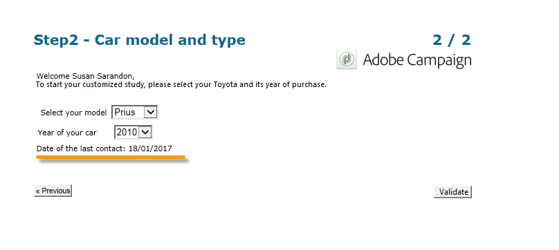

# Statiska element i ett webbformulär{#static-elements-in-a-web-form}

Du kan inkludera element som användaren inte har någon interaktion med på formulärets sidor; det är statiska element som bilder, HTML-innehåll, ett vågrätt fält eller en hypertextlänk. Dessa element skapas med den första knappen i verktygsfältet genom att klicka på **[!UICONTROL Add static element]** menyn.


Följande fälttyper är tillgängliga:

* Värdet baseras på tidigare svar (i formulärsammanhang) eller på databasen.
* Hypertextlänk, HTML, vågrätt fält. Se [Infoga HTML-innehåll](#inserting-html-content).
* Bild sparad i resursbiblioteket eller på en server som är tillgänglig för användare. Se [Infoga bilder](#inserting-images).
* Skript som körs på klientsidan och/eller serversidan. Den måste vara skriven i JavaScript och kompatibel med de flesta webbläsare för att säkerställa korrekt körning på klientsidan.

   >[!NOTE]
   >
   >På serversidan kan skriptet använda de funktioner som definieras i JSAPI-dokumentationen för [Campaign](http://docs.campaign.adobe.com/doc/AC/en/jsapi/index.html).

## Infoga HTML-innehåll {#inserting-html-content}

Du kan inkludera HTML-innehåll på en formulärsida: hypertextlänkar, bilder, formaterade stycken, video- eller Flash-objekt osv.

Med HTML-redigeraren kan du ange det innehåll som ska infogas på formulärsidan. Öppna redigeraren genom att gå till **[!UICONTROL Static elements>HTML]** .

Du kan ange och formatera innehållet direkt eller visa källkodsfönstret för att klistra in externt innehåll. Om du vill växla till källkodsläge klickar du på den första ikonen i verktygsfältet:


Om du vill infoga ett databasfält använder du personaliseringsknappen.


>[!NOTE]
>
>Strängarna som anges i HTML-redigeraren översätts bara om de definieras på **[!UICONTROL Texts]** underfliken. Annars samlas de inte in. Mer information finns i [Översätta ett webbformulär](../../web/using/translating-a-web-form.md).

### Infoga en länk {#inserting-a-link}

Fyll i fälten i redigeringsfönstret enligt följande exempel:

Om du vill lägga till en hypertextlänk går du till **[!UICONTROL Static elements>Link]**.


* Innehållet **[!UICONTROL Label]** i hypertextlänken visas som det kommer att visas på formulärsidan.
* Adressen **[!UICONTROL URL]** är den önskade adressen, t.ex.: [https://www.adobe.com](https://www.adobe.com) för en webbplats eller [mailto:info@adobe.com](mailto:info@adobe.com) för att skicka ett meddelande.
* I **[!UICONTROL Window]** fältet kan du välja visningsläge för länken när det gäller en plats. Du kan välja att öppna länken i ett nytt fönster, det aktuella fönstret eller i ett annat fönster.
* Du kan lägga till en knappbeskrivning enligt nedan:

   

* Du kan välja att visa länken som en knapp eller som en bild. Det gör du genom att välja typ av visning i **[!UICONTROL Type]** fältet.

### Typ av länkar {#types-of-links}

Som standard är länkarna kopplade till en åtgärd av URL-typ, så att en länkmåladress kan anges i URL-fältet.


Du kan definiera andra åtgärder för länken så att användaren kan klicka på länken och göra följande:

* Uppdatera sidan

   Det gör du genom att välja **[!UICONTROL Refresh page]** alternativet i listrutan i **[!UICONTROL Action]** fältet.

   

* Visa nästa/föregående sida

   Det gör du genom att välja **[!UICONTROL Next page]** eller **[!UICONTROL Previous page]** alternativ i listrutan i **[!UICONTROL Action]** fältet.

   

   Du kan dölja **[!UICONTROL Next]** - och/eller **[!UICONTROL Back]** -knapparna om de ska ersättas av en länk. Se den här [sidan](../../web/using/defining-web-forms-page-sequencing.md).

   Länken kommer att ersätta den **[!UICONTROL Next]** knapp som används som standard.

   

* Visa en annan sida

   Med det här **[!UICONTROL Enable a transition]** alternativet kan du visa en viss sida som är kopplad till den utgående övergång som är markerad i **[!UICONTROL Transition]** fältet.

   

   Som standard har en sida bara en utdataövergång. Om du vill skapa nya övergångar markerar du sidan och klickar sedan på **[!UICONTROL Add]** knappen i **[!UICONTROL Output transitions]** avsnittet enligt nedan:

   

   I diagrammet ser det här tillägget ut så här:

   

   >[!NOTE]
   >
   >Mer information om sidordningsföljd i ett webbformulär finns i [Definiera sidsekvenser](../../web/using/defining-web-forms-page-sequencing.md)för webbformulär.

* Läs in formulärfälten i förväg med data från Facebook-profilen

   >[!CAUTION]
   >
   >Den här funktionen är bara tillgänglig om du har installerat **[!UICONTROL Social Marketing]** programmet. Om du vill använda det här alternativet måste du skapa ett Facebook-program tillsammans med ett externt konto av **[!UICONTROL Facebook Connect]** typen. Mer information finns på [den här sidan](../../social/using/creating-a-facebook-application.md#configuring-external-accounts).

   Med det här **[!UICONTROL Preload with Facebook]** alternativet kan du infoga en knapp i ett formulär för att förhandsladda fält med hjälp av Facebook-profilinformation.

   

   När en användare klickar på **[!UICONTROL Fill in automatically]** knappen öppnas fönstret för Facebook-begäran om behörighet.

   

   >[!NOTE]
   >
   >Det går att ändra listan med utökade rättigheter när det externa kontot konfigureras. Om du inte anger några utökade behörigheter vidarebefordrar Facebook grundläggande profilinformation som standard.\
   >Klicka här om du vill visa en lista över utökade rättigheter och syntax för dem: [https://developers.facebook.com/docs/reference/api/permissions/](https://developers.facebook.com/docs/reference/api/permissions/)

   Om användaren går med på att dela sin information är formulärfälten förinlästa.

   

I det här fallet har vi skapat ett webbprogram som består av följande element:

* en sida som innehåller formuläret
* en **[!UICONTROL Record]** aktivitet
* en **[!UICONTROL End]** aktivitet


Så här lägger du till en förinläsningsknapp:

1. Skapa ett formulär.

   

1. Gå till samma nivå som fälten i formuläret och lägg till en länk.

   

1. Ange etiketten och välj **[!UICONTROL Button]** typ.

   

1. Gå till **[!UICONTROL Action]** fältet och välj **[!UICONTROL Preload with Facebook]**.

   

1. Gå till **[!UICONTROL Application]** fältet och välj den **[!UICONTROL Facebook Connect]** typ av externt konto som skapades tidigare. Mer information finns på [den här sidan](../../social/using/creating-a-facebook-application.md#configuring-external-accounts).

   

### Anpassa HTML-innehåll {#personalizing-html-content}

Du kan anpassa HTML-innehållet på en formulärsida med data som registrerats på en tidigare sida. Du kan t.ex. skapa ett webbformulär för bilförsäkring vars första sida gör att du kan ange kontaktinformation och bilens varumärke.



Använd anpassningsfält för att mata in användarnamnet och det valda varumärket på nytt på nästa sida. Vilken syntax som ska användas beror på informationslagringsläget. Mer information finns i [Använda insamlad information](../../web/using/web-forms-answers.md#using-collected-information).

>[!NOTE]
>
>Av säkerhetsskäl ersätts det värde som anges i **`<%=`** formeln med escape-tecken. Undvik detta genom att använda följande syntax: **`<%=`**.

I det här exemplet lagras mottagarens för- och efternamn i ett databasfält, medan deras bilmärke lagras i en variabel. Meddelandet som personaliserats på sidan 2 ska ha följande syntax:



```
<P>Welcome <%= ctx.recipient.@firstName %> <%= ctx.recipient.@lastName %>,</P>
<P>To start your customized study, please select your car <%=ctx.vars.marque%> and its year of purchase.</P>
```

Detta ger följande resultat:


### Använda textvariabler {#using-text-variables}

På fliken **[!UICONTROL Text]** kan du skapa variabelfält som kan användas i HTML mellan &lt;%= och %> tecken med följande syntax: **$(IDENTIFIER)**.

Använd den här metoden om du enkelt vill att strängarna ska vara lokaliserade. Se [Översätta ett webbformulär](../../web/using/translating-a-web-form.md)

Du kan till exempel skapa ett **kontaktfält** som gör att du kan visa strängen&quot;Datum för senaste kontakt:&quot; för HTML-innehållet. Gör så här:

1. Klicka på fliken **[!UICONTROL Text]** i HTML-texten.
1. Klicka på **[!UICONTROL Add]** ikonen.
1. I **[!UICONTROL Identifier]** kolumnen anger du namnet på variabeln
1. Ange standardvärdet i **[!UICONTROL Text]** kolumnen.

   

1. Infoga den här textvariabeln med syntaxen **&lt;%= $(Contact) %>** i HTML-innehållet.

   

   >[!CAUTION]
   >
   >Om du anger dessa tecken i HTML-redigeraren ersätts **&lt;** och **>** fälten med deras escape-tecken. I det här fallet måste du korrigera källkoden genom att klicka på **[!UICONTROL Display source code]** ikonen för HTML-textredigeraren.

1. Öppna formulärets **[!UICONTROL Preview]** etikett för att visa det värde som anges i HTML:

   

I det här operativsystemet kan du faktorisera texten i webbformulär och hantera översättningar med det integrerade översättningsverktyget. Mer information finns i [Översätta ett webbformulär](../../web/using/translating-a-web-form.md).

## Infoga bilder {#inserting-images}

För att bilder ska kunna inkluderas i formulär måste de sparas på en server som är tillgänglig utifrån.

Välj **[!UICONTROL Static elements>Image]** menyn.

Välj bildkällan som ska infogas: den kan komma från det offentliga resursbiblioteket eller lagras på en extern server som är tillgänglig utifrån.


Om det här är en bild från biblioteket markerar du den i kombinationsrutan för fältet. Om den finns i en extern fil anger du sökvägen. Etiketten visas genom att pekaren förs över bilden (sammanfaller med ett ALT-fält i HTML) eller när bilden inte visas.

Bilden kan visas i redigerarens centrala del.
