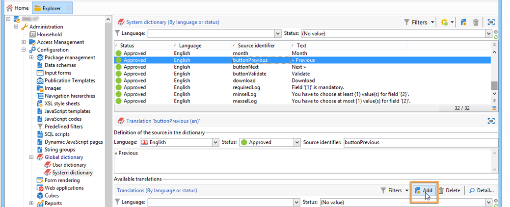

# Översätta ett webbformulär{#translating-a-web-form}

Det går att lokalisera ett webbprogram till flera språk.

Du kan utföra översättningar direkt i Adobe Campaign-konsolen (se [Hantera översättningar i redigeraren](#managing-translations-in-the-editor)) eller exportera och importera strängar för att externalisera översättning (se [Externalizing translation](#externalizing-translation)).

Listan över översättningsspråk som är tillgängliga som standard finns i [Ändra visningsspråk](#changing-forms-display-language)för formulär.

Webbprogrammet är utformat på ett redigeringsspråk: det här är referensspråket som används för att ange etiketter och annat innehåll som ska översättas.

Standardspråket är det språk som webbprogrammet visas på om ingen språkinställning läggs till i dess URL.

>[!NOTE]
>
>Som standard är redigeringsspråket och standardspråket samma som konsolspråket.

## Välja språk {#choosing-languages}

Om du vill definiera ett eller flera översättningsspråk klickar du på **[!UICONTROL Properties]** knappen för webbprogrammet och sedan på **[!UICONTROL Localization]** fliken. Klicka på **[!UICONTROL Add]** knappen för att definiera ett nytt översättningsspråk för webbprogrammet.

>[!NOTE]
>
>I det här fönstret kan du även ändra standardspråk och redigeringsspråk.


När du lägger till översättningsspråk för ett webbprogram (eller när standardspråket och redigeringsspråket är olika) läggs en underflik till på **[!UICONTROL Translation]** fliken för att hantera översättningar **[!UICONTROL Edit]** .

Adobe Campaign innehåller ett verktyg för översättning och hantering av flerspråkiga översättningar. Med den här redigeraren kan du visa strängarna som ska översättas eller godkännas, ange översättningar direkt i gränssnittet eller importera/exportera teckensträngar för att göra översättningar externt.

## Hantera översättningar i redigeraren {#managing-translations-in-the-editor}

### Samlar in strängar {#collecting-strings}

På fliken **[!UICONTROL Translations]** kan du ange översättningar för de teckensträngar som webbprogrammet består av.

Första gången du öppnar den här fliken innehåller den inga data. Klicka på **[!UICONTROL Collect the strings to translate]** länken för att uppdatera strängarna i webbprogrammet.

Adobe Campaign samlar in etiketter för fält och strängar som definierats på **[!UICONTROL Texts]** flikarna för alla statiska element: HTML-block, Javascript osv. Statiska element beskrivs i [Statiska element i ett webbformulär](../../web/using/static-elements-in-a-web-form.md).


>[!CAUTION]
>
>Denna process kan ta flera minuter beroende på den datavolym som ska bearbetas.
> 
>Om det visas en varning om att vissa översättningar saknas i systemordlistan finns mer information i [Översätta systemsträngar](#translating-the-system-strings).

Varje gång en sträng översätts läggs dess översättning till i översättningsordlistan.

När samlingsprocessen upptäcker att det redan finns en översättning visas den översättningen i strängens **[!UICONTROL Text]** kolumn. Strängens status ändras till **[!UICONTROL Translated]**.

För teckensträngar som aldrig har översatts är **[!UICONTROL Text]** fältet tomt och statusen är **[!UICONTROL To translate]**.

### Filtrera strängar {#filtering-strings}

Som standard visas varje översättningsspråk i webbprogrammet. Det finns två standardfilter: språk och status. Klicka på **[!UICONTROL Filters]** knappen och sedan på **[!UICONTROL By language or status]** för att visa de matchande listrutorna. Du kan också skapa ett avancerat filter. Mer information finns på [den här sidan](../../platform/using/creating-filters.md#creating-an-advanced-filter).


Välj översättningsspråk i **[!UICONTROL Language]** listrutan.

Om du bara vill visa oöversatta strängar väljer du **[!UICONTROL To translate]** i **[!UICONTROL Status]** listrutan. Du kan även visa endast översatta eller godkända strängar.

### Översätta strängar {#translating-strings}

1. Om du vill översätta ett ord dubbelklickar du på raden i stränglistan.

   

   Källsträngen visas i fönstrets övre del.

1. Ange översättningen i det nedre avsnittet. Markera **[!UICONTROL Translation approved]** alternativet om du vill godkänna det.

   >[!NOTE]
   >
   >Översättningsgodkännande är valfritt och blockerar inte processen.

   Ej godkända översättningar visas som **[!UICONTROL Translated]**. Godkända översättningar visas som **[!UICONTROL Approved]**.

## Extern översättning {#externalizing-translation}

Det går att exportera och importera teckensträngar för att översätta dem med ett annat verktyg än Adobe Campaign.

>[!CAUTION]
>
>När du har exporterat strängarna ska du inte göra några översättningar med det integrerade verktyget. Detta skulle leda till en konflikt när du importerar översättningarna på nytt och dessa kommer att gå förlorade.

### Exportera filer {#exporting-files}

1. Markera det eller de webbprogram vars strängar du vill importera, högerklicka och välj sedan **[!UICONTROL Actions > Export strings for translation...]**

   

1. Välj en **[!UICONTROL Export strategy]** :

   * **[!UICONTROL One file per language]**: vid exporten genereras en fil per översättningsspråk. Varje fil är gemensam för alla valda webbprogram.
   * **[!UICONTROL One file per Web application]**: vid exporten skapas en fil per valt webbprogram. Varje fil kommer att innehålla alla översättningsspråk.

      >[!NOTE]
      >
      >Den här typen av export är inte tillgänglig för XLIFF-export.

   * **[!UICONTROL One file per language and per Web application]**: flera filer genereras vid exporten. Varje fil kommer att innehålla ett översättningsspråk per webbprogram.
   * **[!UICONTROL One file for all]**: vid exporten skapas en flerspråkig fil för alla webbprogram. Den kommer att innehålla alla översättningsspråk för alla valda webbprogram.

      >[!NOTE]
      >
      >Den här typen av export är inte tillgänglig för XLIFF-export.

1. Välj sedan **[!UICONTROL Target folder]** var filerna ska spelas in.
1. Markera filformatet ( **[!UICONTROL CSV]** eller **[!UICONTROL XLIFF]** ) och klicka på **[!UICONTROL Start]**.


>[!NOTE]
>
>Namnen på exportfilerna genereras automatiskt. Om du utför samma export flera gånger kommer du att ersätta befintliga filer med de nya. Om du vill behålla de tidigare filerna ändrar du **[!UICONTROL Target folder]** och klickar sedan **[!UICONTROL Start]** igen för att köra exporten.

När du exporterar filer i **CSV-format** länkas varje språk till status och godkännandestatus. Godkännandet **?** kan du godkänna en översättning. Den här kolumnen kan innehålla värdena **Ja** eller **Nej**. När det gäller den integrerade redigeraren (se [Hantera översättningar i redigeraren](#managing-translations-in-the-editor)) är godkännande av översättningar valfritt och blockerar inte processen.

### Importera filer {#importing-files}

När den externa översättningen är klar kan du importera de översatta filerna.

1. Gå till listan med webbprogram, högerklicka och välj **[!UICONTROL Actions > Import translated strings...]**

   >[!NOTE]
   >
   >Du behöver inte välja vilka webbprogram som berörs av översättningen. Placera markören var som helst i listan över webbprogram.

   

1. Markera filen som ska importeras och klicka sedan på **[!UICONTROL Upload]**.

   

>[!NOTE]
>
>Externa översättningar har alltid företräde framför interna översättningar. I händelse av konflikter skrivs den interna översättningen över med den externa översättningen.

## Ändra visningsspråk för formulär {#changing-forms-display-language}

Webbformulär visas på det standardspråk som anges på fliken **[!UICONTROL Localization]** i webbprogramsegenskaperna. Om du vill ändra språk måste du lägga till följande tecken i slutet av URL:en (där **xx** är språkets symbol):

```
?lang=xx
```

om språket är den första eller enda parametern i URL:en. Till exempel: **https://myserver/webApp/APP34?lang=en**

```
&lang=xx
```

om det finns andra parametrar före språket i URL:en. Till exempel: **https://myserver/webApp/APP34?status=1&amp;lang=en**

De översättningsspråk och ordlistor som är tillgängliga som standard visas nedan.

**Standardsystemordlista**: vissa språk innehåller en standardordlista som innehåller översättningen av systemsträngarna. Mer information finns i [Översätta systemsträngar](#translating-the-system-strings).

**Kalenderhantering**: sidorna i ett webbprogram kan innehålla en kalender för att ange datum. Som standard är den här kalendern tillgänglig på flera språk (översättning av dagar, datumformat).

<table> 
 <tbody> 
  <tr> 
   <td> <strong>Språk (symboler)</strong><br /> </td> 
   <td> <strong>Standardsystemordlista</strong><br /> </td> 
   <td> <strong>Kalenderhantering</strong><br /> </td> 
  </tr> 
  <tr> 
   <td> German (de)<br /> </td> 
   <td> ja<br /> </td> 
   <td> ja<br /> </td> 
  </tr> 
  <tr> 
   <td> Engelska (en)<br /> </td> 
   <td> ja<br /> </td> 
   <td> ja<br /> </td> 
  </tr> 
  <tr> 
   <td> Engelska (USA) (en_US)<br /> </td> 
   <td> </td> 
   <td> </td> 
  </tr> 
  <tr> 
   <td> Engelska (Storbritannien) (en_GB)<br /> </td> 
   <td> </td> 
   <td> </td> 
  </tr> 
  <tr> 
   <td> Arabiska (ar)<br /> </td> 
   <td> </td> 
   <td> </td> 
  </tr> 
  <tr> 
   <td> Kinesiska (zh)<br /> </td> 
   <td> </td> 
   <td> </td> 
  </tr> 
  <tr> 
   <td> Koreanska (ko)<br /> </td> 
   <td> </td> 
   <td> </td> 
  </tr> 
  <tr> 
   <td> Danish (da)<br /> </td> 
   <td> ja<br /> </td> 
   <td> ja<br /> </td> 
  </tr> 
  <tr> 
   <td> Spanska (es)<br /> </td> 
   <td> ja<br /> </td> 
   <td> ja<br /> </td> 
  </tr> 
  <tr> 
   <td> Estniska (et)<br /> </td> 
   <td> </td> 
   <td> </td> 
  </tr> 
  <tr> 
   <td> Finska (fi)<br /> </td> 
   <td> </td> 
   <td> ja<br /> </td> 
  </tr> 
  <tr> 
   <td> Franska (fr)<br /> </td> 
   <td> ja<br /> </td> 
   <td> ja<br /> </td> 
  </tr> 
  <tr> 
   <td> French (Belgium) (fr_BE)<br /> </td> 
   <td> </td> 
   <td> </td> 
  </tr> 
  <tr> 
   <td> Franska (Frankrike) (fr_FR)<br /> </td> 
   <td> </td> 
   <td> </td> 
  </tr> 
  <tr> 
   <td> Grekiska (el)<br /> </td> 
   <td> </td> 
   <td> ja<br /> </td> 
  </tr> 
  <tr> 
   <td> Hebreiska (he)<br /> </td> 
   <td> </td> 
   <td> </td> 
  </tr> 
  <tr> 
   <td> Ungerska (hu)<br /> </td> 
   <td> </td> 
   <td> ja<br /> </td> 
  </tr> 
  <tr> 
   <td> Indonesiska (id)<br /> </td> 
   <td> </td> 
   <td> </td> 
  </tr> 
  <tr> 
   <td> Iriska (ga)<br /> </td> 
   <td> </td> 
   <td> </td> 
  </tr> 
  <tr> 
   <td> Italienska (it)<br /> </td> 
   <td> ja<br /> </td> 
   <td> ja<br /> </td> 
  </tr> 
  <tr> 
   <td> Italienska (Italien) (it_IT)<br /> </td> 
   <td> </td> 
   <td> </td> 
  </tr> 
  <tr> 
   <td> Italienska (Schweiz) (it_CH)<br /> </td> 
   <td> </td> 
   <td> </td> 
  </tr> 
  <tr> 
   <td> Japanska (ja)<br /> </td> 
   <td> </td> 
   <td> </td> 
  </tr> 
  <tr> 
   <td> Lettiska (lv)<br /> </td> 
   <td> </td> 
   <td> ja<br /> </td> 
  </tr> 
  <tr> 
   <td> Litauiska (lt)<br /> </td> 
   <td> </td> 
   <td> </td> 
  </tr> 
  <tr> 
   <td> Maltesiska (mt)<br /> </td> 
   <td> </td> 
   <td> </td> 
  </tr> 
  <tr> 
   <td> Nederländska (nl)<br /> </td> 
   <td> </td> 
   <td> ja<br /> </td> 
  </tr> 
  <tr> 
   <td> Nederländska (Belgien) (nl_BE)<br /> </td> 
   <td> </td> 
   <td> </td> 
  </tr> 
  <tr> 
   <td> Nederländska (Nederländerna) (nl_NL)<br /> </td> 
   <td> </td> 
   <td> </td> 
  </tr> 
  <tr> 
   <td> Norska (Norge) (no_NO)<br /> </td> 
   <td> </td> 
   <td> ja<br /> </td> 
  </tr> 
  <tr> 
   <td> Polska (pl)<br /> </td> 
   <td> </td> 
   <td> ja<br /> </td> 
  </tr> 
  <tr> 
   <td> Portugisiska (pt)<br /> </td> 
   <td> </td> 
   <td> ja<br /> </td> 
  </tr> 
  <tr> 
   <td> Portugisiska (Brasilien) (pt_BR)<br /> </td> 
   <td> </td> 
   <td> </td> 
  </tr> 
  <tr> 
   <td> Portugisiska (Portugal) (pt_PT)<br /> </td> 
   <td> </td> 
   <td> </td> 
  </tr> 
  <tr> 
   <td> Ryska (ru)<br /> </td> 
   <td> </td> 
   <td> ja<br /> </td> 
  </tr> 
  <tr> 
   <td> Slovenska (sl)<br /> </td> 
   <td> </td> 
   <td> </td> 
  </tr> 
  <tr> 
   <td> Slovakiska (sk)<br /> </td> 
   <td> </td> 
   <td> </td> 
  </tr> 
  <tr> 
   <td> Swedish (sv)<br /> </td> 
   <td> ja<br /> </td> 
   <td> ja<br /> </td> 
  </tr> 
  <tr> 
   <td> Svenska (Finland) (sv_FI)<br /> </td> 
   <td> </td> 
   <td> </td> 
  </tr> 
  <tr> 
   <td> Svenska (Sverige) (sv_SE)<br /> </td> 
   <td> </td> 
   <td> </td> 
  </tr> 
  <tr> 
   <td> Tjeckiska (cs)<br /> </td> 
   <td> </td> 
   <td> </td> 
  </tr> 
  <tr> 
   <td> Thailändska (th)<br /> </td> 
   <td> </td> 
   <td> </td> 
  </tr> 
  <tr> 
   <td> vietnamesiska (vi)<br /> </td> 
   <td> </td> 
   <td> </td> 
  </tr> 
  <tr> 
   <td> Waloon (wa)<br /> </td> 
   <td> </td> 
   <td> </td> 
  </tr> 
 </tbody> 
</table>

>[!NOTE]
>
>Om du vill lägga till andra språk än de som erbjuds som standard, se [Lägga till ett översättningsspråk](#adding-a-translation-language)

## Exempel: visa ett webbprogram på flera språk {#example--displaying-a-web-application-in-several-languages}

Följande webbformulär finns på fyra språk: Engelska, franska, tyska och spanska. Teckensträngarna har översatts via fliken **[!UICONTROL Translation]** i webbformuläret. Eftersom standardspråket är engelska kan du använda standard-URL:en för att visa den på engelska när enkäten publiceras.


Lägg till **?lang=fr** i slutet av URL:en för att visa den på franska:

>[!NOTE]
>
>Listan med symboler för varje språk finns i [Ändra visningsspråk](#changing-forms-display-language)för formulär.


Du kan lägga till **?lang=es** eller **?lang=de** om du vill visa det på spanska eller tyska.

>[!NOTE]
>
>Lägg till **&amp;lang=** om andra parametrar redan används för det här webbprogrammet.\
>Till exempel: **https://myserver/webApp/APP34?status=1&amp;lang=en**

## Avancerad översättningskonfiguration {#advanced-translation-configuration}

>[!CAUTION]
>
>Det här avsnittet är endast avsett för expertanvändare.

### Översätta systemsträngar {#translating-the-system-strings}

Systemsträngar är färdiga teckensträngar som används i alla webbprogram. Till exempel: **[!UICONTROL Next]** , **[!UICONTROL Previous]**, **[!UICONTROL Approve]** knappar, **[!UICONTROL Loading]** meddelanden osv. Som standard innehåller vissa språk en ordlista med översättningar för dessa strängar. Listan med språk finns i [Ändra visningsspråk](#changing-forms-display-language)för formulär.

Om du översätter webbprogrammet till ett språk som inte har översatts av systemordlistan visas ett varningsmeddelande om att vissa översättningar saknas.


Så här lägger du till ett språk:

1. Gå till trädet Adobe Campaign och klicka på **[!UICONTROL Administration > Configuration > Global dictionary > System dictionary]** .
1. I fönstrets övre del väljer du den systemsträng som ska översättas och klickar sedan **[!UICONTROL Add]** i det nedre avsnittet.

   

1. Markera översättningsspråket och ange en översättning för strängen. Du kan godkänna översättningen genom att markera **[!UICONTROL Translation validated]** alternativet.

   

   >[!NOTE]
   >
   >Översättningsgodkännande är valfritt och blockerar inte processen.

>[!CAUTION]
>
>Ta inte bort de färdiga systemsträngarna.

### Lägga till ett översättningsspråk {#adding-a-translation-language}

Om du vill översätta webbprogram till andra språk än standardspråken (se [Ändra visningsspråk](#changing-forms-display-language)för formulär) måste du lägga till ett nytt översättningsspråk.

1. Klicka på noden **[!UICONTROL Administration > Platform > Itemized lists]** i Adobe Campaign-trädet och välj **[!UICONTROL Languages available for translation]** i listan. Listan med tillgängliga översättningar visas i fönstrets nedre del.

   

1. Klicka på **[!UICONTROL Add]** knappen, ange bildens **[!UICONTROL Internal name]** identifierare **[!UICONTROL Label]** och identifierare (flagga). Kontakta administratören om du vill lägga till en ny bild.

   

