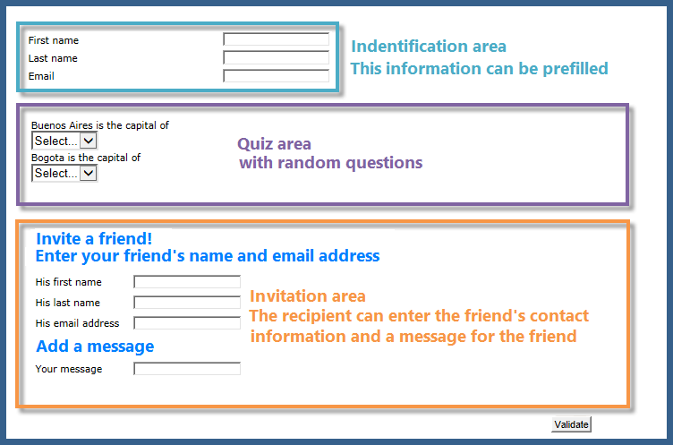
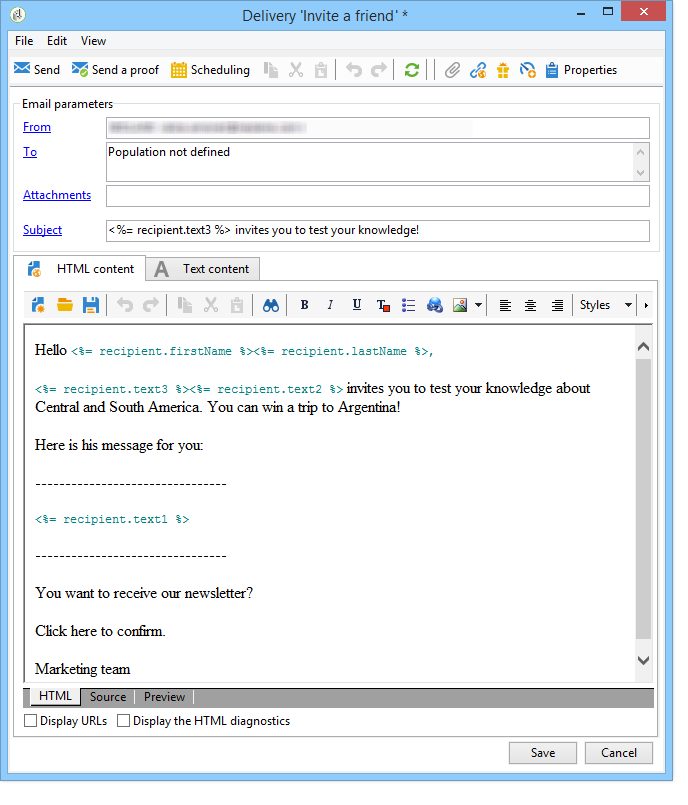
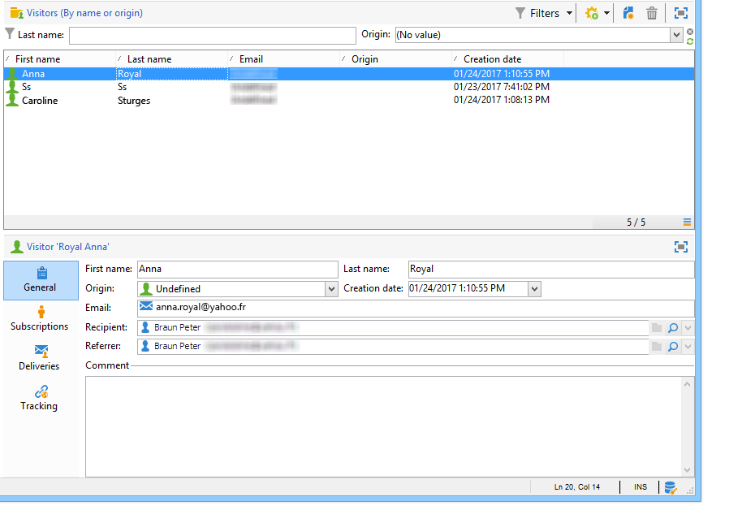

# Användningsfall: skapa ett referensformulär{#use-case-creating-a-refer-a-friend-form}

I det här exemplet vill vi erbjuda mottagarna i databasen en tävling. Webbformuläret innehåller ett avsnitt där du kan ange svar och ett annat där du kan hänvisa en vän genom att ange dennes e-postadress.



Identifierings- och konkurrensblocken skapas med hjälp av de processer som beskrivs ovan.

Så här konfigurerar och skapar du referensblocket:

1. Skapa ett tävlingswebbformulär med frågor och ett fält för att ange en väns kontaktinformation enligt nedan:

   

   I fältet **Ditt meddelande** kan du skriva ett meddelande till mottagaren. Referenten måste även ange sitt **efternamn**, **förnamn** och **e-post**.

   Informationen som anges i fälten lagras i en specifik tabell som kallas besökstabell.

   >[!NOTE]
   >
   >Så länge mottagaren inte har gett sitt samtycke kan du inte lagra dem hos mottagarna i databasen. De kommer att lagras tillfälligt i **besökstabellen** (**nms:visitor**) som är utformad för virala marknadsföringskampanjer. Det här registret rensas regelbundet tack vare **reningsåtgärder** .
   >
   >I det här exemplet vill vi att målmottagarna ska föreslå att de deltar i den tävling som rekommenderas av deras referent. I det här meddelandet vill vi dock även erbjuda dem en prenumeration på en av våra informationstjänster. Om de prenumererar kan de lagras i databasen.

   

   Innehållet i fälten som berör referenten kommer att användas i skriptet för att skapa profilen och i det meddelande som skickas till dem.

1. Börja med att skapa ett skript som länkar referenten till referenten.

   Den innehåller följande instruktioner:

   

   ```
   ctx.recipient.visitor.@id = xtk.session.GetNewIds(1)
   ctx.recipient.visitor.@forwardUrl = "APP5"
   ctx.recipient.visitor.@referrerEmail = ctx.recipient.@email
   ctx.recipient.visitor.@referrerFirstName = ctx.recipient.@firstName
   ctx.recipient.visitor.@referrerLastName = ctx.recipient.@lastName
   ```

   Efternamnet, förnamnet och e-postadressen som anges i sididentifieringsblocket identifieras som referentens efternamn, förnamn och e-postadress. Dessa fält matas in på nytt i texten i det meddelande som skickas till domaren.

   APP5-värdet matchar det interna namnet på webbformuläret: Med hjälp av den här informationen kan du ta reda på var referenten befinner sig, d.v.s. länka besökaren till det webbformulär som de skapades på.

1. I lagringsrutan kan du samla in information och lagra den i databasen.

   

1. Skapa sedan leveransmallen som är länkad till informationstjänsten som skapades under steg 1. Den kommer att väljas i informationsfältet **[!UICONTROL Choose scenario]** .

   Leveransmallen som används för att skapa meddelandet om hänvisningserbjudande innehåller följande information:

   

   Den här mallen har följande egenskaper:

   * Välj besökstabellen som målmappning.

      

   * Referentens kontaktinformation samt informationen om referenten hämtas från besökstabellen. Den infogas med personaliseringsknappen.

      

   * Den här mallen innehåller en länk till tävlingsformuläret och prenumerationslänken för den som hänvisas till att prenumerera på nyhetsbrevet.

      Prenumerationslänken infogas via ett anpassningsblock. Som standard kan du prenumerera på **nyhetsbrevstjänsten** . Det här anpassningsblocket kan ändras för att passa dina behov, till exempel för att prenumerera på en annan tjänst.

   * Det interna namnet (&#39;referrer&#39; here) används i meddelandets leveransskript enligt nedan.
   >[!NOTE]
   >
   >Mer information om leveransmallar finns på [den här sidan](../../delivery/using/about-templates.md) .

1. Skapa det andra skriptet för att leverera prenumerationsmeddelandena.

   

   ```
   // Updtate visitor to have a link to the referrer recipient
   ctx.recipient.visitor.@referrerId = ctx.recipient.@id
   ctx.recipient.visitor.@xtkschema = "nms:visitor"
   ctx.recipient.visitor.@_operation = "update" 
   ctx.recipient.visitor.@_key = "@id" 
   xtk.session.Write(ctx.recipient.visitor)
   
   // Send email to friend
   nms.delivery.QueueNotification("referrer",
   <delivery>
   <targets>
     <deliveryTarget>
       <targetPart type='query' exclusion='false' ignoreDeleteStatus='false'>
         <where>
           <condition expr={'@id IN ('+ ctx.recipient.visitor.@id +')' }/>
         </where>
       </targetPart>
      </deliveryTarget>
     </targets>
    </delivery>)
   ```

1. Publicera tävlingsformuläret och skicka en inbjudan till mottagarna av det ursprungliga målet. När någon av dem bjuder in en vän skapas en leverans baserad på mallen för **hänvisningserbjudande** .

   

   Referenten läggs till i besökarmappen i **[!UICONTROL Administration > Visitors node]**:

   

   Deras profil innehåller den information som anges av deras referent. Den lagras baserat på de konfigurationer som anges i formulärskriptet. Om de bestämmer sig för att prenumerera på nyhetsbrevet sparas de i mottagartabellen.

