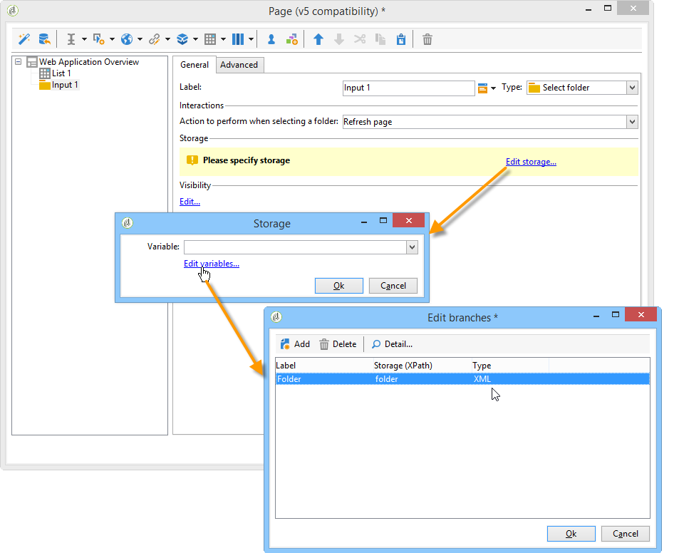
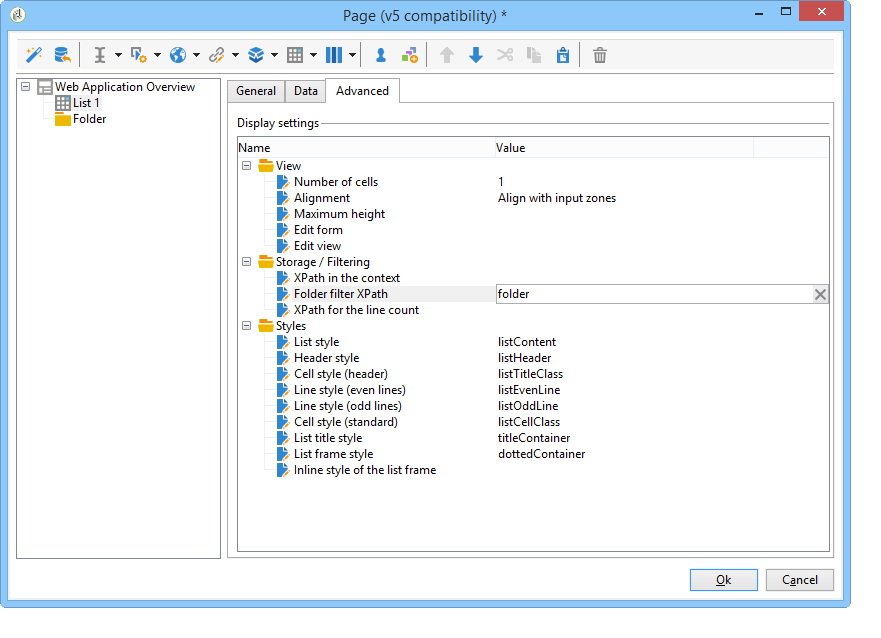
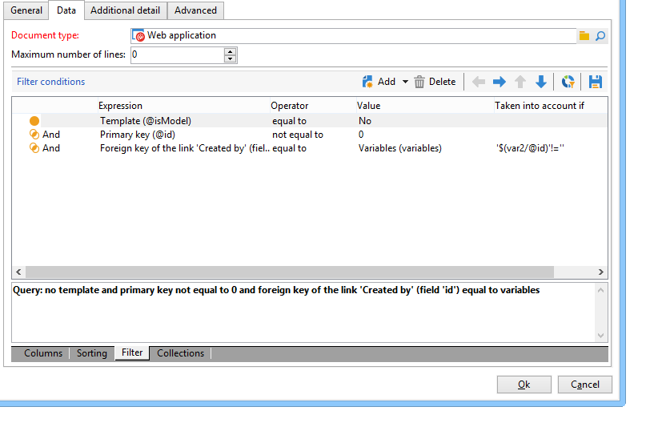

# Användningsexempel: skapa översiktssidor{#use-cases-creating-overviews}

I följande exempel skapar vi webbprogram av översiktstyp som visar alla webbprogram i din databas. Konfigurera följande element:

* ett filter i mappen (se [Lägga till ett filter i en mapp](#adding-a-filter-on-a-folder)),
* en knapp för att skapa ett nytt webbprogram (se [Lägga till en knapp för att konfigurera ett nytt webbprogram](#adding-a-button-to-configure-a-new-web-application)),
* Detaljvisning för varje post i listan (se [Lägga till detaljer i en lista](#adding-detail-to-a-list)).
* ett filter per länkredigeringsverktyg (se [Skapa ett filter med en ländredigerare](#creating-a-filter-using-a-link-editor)),
* en uppdateringslänk (se [Skapa en uppdateringslänk](#creating-a-refresh-link)).


## Skapa ett webbprogram med en sida {#creating-a-single-page-web-application}

1. Skapa ett enda **[!UICONTROL Page]**-webbprogram och inaktivera utgående övergångar och övergångar till nästa sida.

   

1. Ändrar sidans rubrik.

   Den här titeln visas i översiktshuvudet och i webbprogramöversikten.

1. I webbprogrammets egenskaper ändrar du återgivningen av programmet genom att välja mallen **[!UICONTROL Single-page Web application]**.

   

1. Öppna aktiviteten **[!UICONTROL Page]** i webbprogrammet och öppna en lista (**[!UICONTROL Static element > List]**).
1. På fliken **[!UICONTROL Data]** i listan väljer du typ av **[!UICONTROL Web applications]**-dokument och **[!UICONTROL Label]**-, **[!UICONTROL Creation date]**- och **[!UICONTROL Type of application]**-utdatakolumner.
1. På underfliken **[!UICONTROL Filter]** skapar du följande filter så som visas nedan för att endast visa webbprogram och exkludera mallar från vyn.

   

1. Stäng konfigurationsfönstret på sidan och klicka på **[!UICONTROL Preview]**.

   Listan över webbprogram som finns i din databas visas.

   

## Lägga till ett filter i en mapp {#adding-a-filter-on-a-folder}

I en översikt kan du välja att få åtkomst till data beroende på var de finns i Adobe Campaign-trädet. Detta är ett filter på en mapp. Använd följande process för att lägga till den i översikten.

1. Placera markören på noden **[!UICONTROL Page]** i webbprogrammet och lägg till ett **[!UICONTROL Select folder]**-element (**[!UICONTROL Advanced controls > Select folder]**).
1. Klicka på länken **[!UICONTROL Edit variables]** i **[!UICONTROL Storage]**-fönstret som visas.
1. Ändra variabeletiketten så att den passar dina behov.
1. Ändra variabelnamnet med **mappvärdet**.

   >[!NOTE]
   >
   >Variabelns namn måste matcha namnet på elementet som är länkat till mappen (definierat i schemat), dvs. **mapp** i det här fallet. Du måste återanvända det här namnet när du refererar till tabellen.

1. Använd typen **[!UICONTROL XML]** på variabeln.

   

1. Välj interaktionen **[!UICONTROL Refresh page]**.

   

1. Placera markören i listan och på fliken **[!UICONTROL Advanced]** refererar du till den variabel som tidigare skapats på fliken **[!UICONTROL Folder filter XPath]** i listan. Du måste använda namnet på elementet som berörs av mapplänken, dvs. **mapp**.

   

   >[!NOTE]
   >
   >I det här skedet finns webbprogrammet inte i programkontexten och filtret kan därför inte testas i mappen.

## Lägga till en knapp för att konfigurera ett nytt webbprogram {#adding-a-button-to-configure-a-new-web-application}

1. Placera markören på **[!UICONTROL Page]**-elementet och lägg till en länk (**[!UICONTROL Static elements > Link]**).
1. Ändra länketiketten eftersom den visas på knappen i översikten.

   I vårt exempel är etiketten **Ny**.

1. Infoga följande URL i URL-fältet: **xtk://open/?schema=nms:webApp&amp;form=nms:newWebApp**.

   >[!NOTE]
   >
   >**nms:** webAppsammanfaller med webbprogrammets schema.
   >
   >**nms:** newWebAppsammanfaller med den nya guiden för att skapa webbprogram.

1. Välj att visa URL:en i samma fönster.
1. Lägg till webbprogramsikonen i bildfältet: **/nms/img/webApp.png**.

   Den här ikonen visas på knappen **[!UICONTROL New]**.

1. Ange **button** i fältet **[!UICONTROL Style]**.

   Det här formatet hänvisas till i den **[!UICONTROL Single-page Web application]**-mall som valts tidigare.

   

## Lägga till detaljer i en lista {#adding-detail-to-a-list}

När du konfigurerar en lista i översikten kan du välja att visa ytterligare information för varje post i listan.

1. Placera markören på listelementet som du skapade tidigare.
1. På fliken **[!UICONTROL General]** väljer du visningsläget **[!UICONTROL Columns and additional detail]** i listrutan.

   

1. Lägg till kolumnen **[!UICONTROL Primary key]**, **[!UICONTROL Internal name]** och **[!UICONTROL Description]** på fliken **[!UICONTROL Data]** och välj alternativet **[!UICONTROL Hidden field]** för var och en av dem.

   

   På så sätt visas informationen bara i detalj för varje post.

1. Lägg till följande kod på fliken **[!UICONTROL Additional detail]**:

   ```
   <div class="detailBox">
     <div class="actionBox">
       <span class="action"><a title="Open" class="linkAction" href="xtk://open/?schema=nms:webApp&form=nms:webApp&pk=
       <%=webApp.id%>">Open...</a></span>
       <% 
       if( webApp.@appType == 1 ) { //survey
       %>
       <span class="action"><a target="_blank" title="Reports" class="linkAction" href="/xtk/report.jssp?_context=selection&
         _schema=nms:webApp&_selection=<%=webApp.@id%>
         &__sessiontoken=<%=document.controller.getSessionToken()%>">Reports</a></span>
       <% 
       } 
       %>
     </div>
     <div>
       Internal name: <%= webApp.@internalName %>
     </div>
     <%
     if( webApp.desc != "" )
     {
     %>
     <div>
       Description: <%= webApp.desc %>
     </div>
     <% 
     } 
     %>
   </div>
   ```

>[!NOTE]
>
>Det tar fem minuter att uppdatera JavaScript-bibliotek på servern. Du kan starta om servern för att undvika att vänta på den här fördröjningen.

## Filtrera och uppdatera listan {#filtering-and-updating-the-list}

I det här avsnittet skapar du ett filter för att visa översikten över webbprogram som har skapats av en viss operator. Det här filtret skapas med en ländredigerare. När du har valt en operator kan du uppdatera listan för att använda filtret; detta kräver att en uppdateringslänk skapas.

Dessa två element grupperas i samma behållare för att grafiskt grupperas i översikten.

1. Placera markören på **[!UICONTROL Page]**-elementet och välj **[!UICONTROL Container > Standard]**.
1. Ange **2** som antal kolumner, så att länkredigeraren och länken ligger bredvid varandra.

   

   Mer information om elementlayout finns i [det här avsnittet](about-web-forms.md).

1. Använd **prickatFilter**.

   Det här formatet refereras till i **[!UICONTROL Single-page Web applicatio]**-mallen som valts tidigare.

   

### Skapa ett filter med en ländredigerare {#creating-a-filter-using-a-link-editor}

1. Placera markören på den behållare som skapades under föregående steg och infoga en ländredigerare via menyn **[!UICONTROL Advanced controls]**.
1. I lagringsfönstret som öppnas automatiskt väljer du alternativet **[!UICONTROL Variables]**, klickar sedan på länken **[!UICONTROL Edit variables]** och skapar en XML-variabel för att filtrera data.

   

1. Ändra etiketten.

   Den visas bredvid fältet **[!UICONTROL Filter]** i översikten.

1. Välj tabellen Operator som ett programschema.

   

1. Placera markören på listelementet och skapa ett filter via fliken **[!UICONTROL Data > Filter]**:

   * **Uttryck:** Sekundärnyckel för länken&quot;Skapad av&quot;
   * **Operator:** är lika med
   * **Värde:** Variabler (variabler)
   * **Beaktas if:** &#39;$(var2/@id)&#39;!=&#39;&#39;&#39;

   

>[!CAUTION]
>
>Webbprogramanvändaren måste vara en identifierad operator med rätt Adobe Campaign-behörighet för att få tillgång till informationen. Den här typen av konfiguration fungerar inte för anonyma webbprogram.

### Skapa en uppdateringslänk {#creating-a-refresh-link}

1. Placera markören på behållaren och infoga en **[!UICONTROL Link]** via menyn **[!UICONTROL Static elements]**.
1. Ändra etiketten.
1. Välj **[!UICONTROL Refresh data in a list]**.
1. Lägg till listan som skapades tidigare.

   

1. Lägg till uppdateringsikonen i fältet **[!UICONTROL Image]**: **/xtk/img/refresh.png**.
1. Med hjälp av sorteringspilarna kan du ordna om de olika elementen i webbprogrammet enligt nedan.

   

Webbprogrammet är nu konfigurerat. Du kan förhandsgranska fliken **[!UICONTROL Preview]**.


