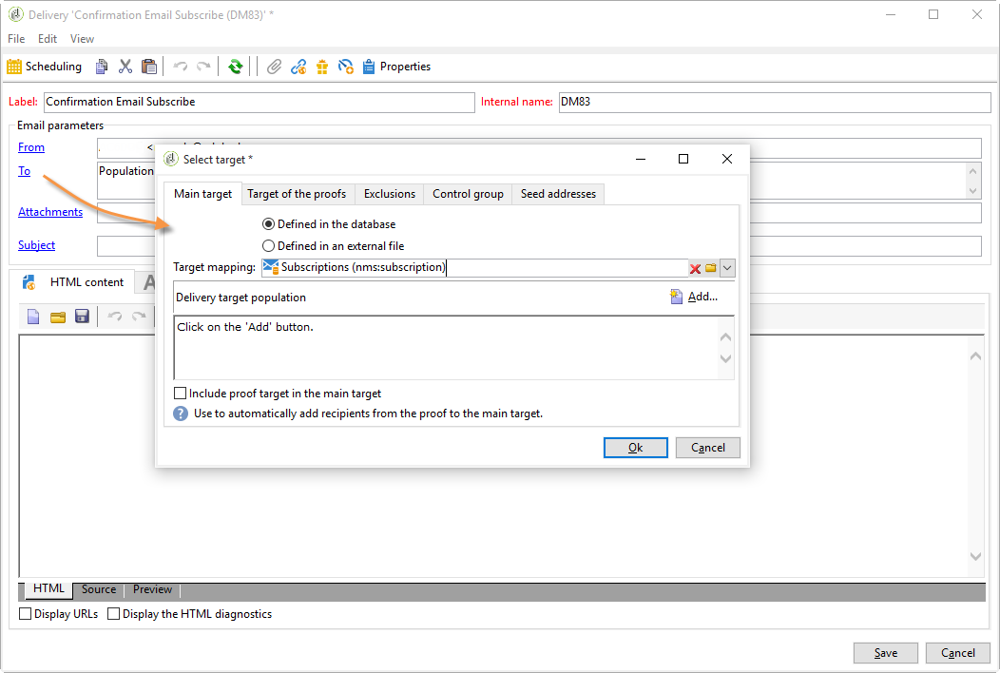
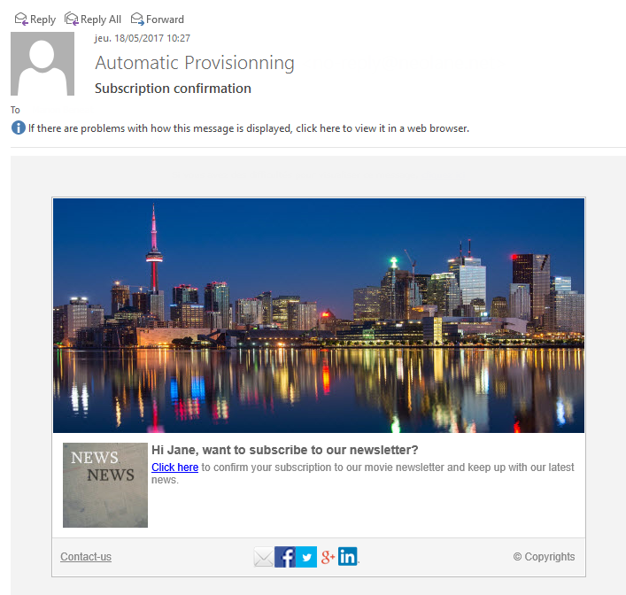

# Användningsexempel: webbformulär{#use-cases-web-forms}

## Skapa ett prenumerationsformulär med dubbel anmälan {#create-a-subscription--form-with-double-opt-in}

När du erbjuder informationstjänster måste mottagarna prenumerera för att få all länkad kommunikation. För att undvika felaktig kommunikation och för att säkerställa att mottagaren prenumererar avsiktligt rekommenderar vi att du skickar en bekräftelse på prenumerationen för att skapa en dubbel anmälan. Prenumerationen träder endast i kraft när användaren klickar på länken i bekräftelsemeddelandet.

Det här exemplet baseras på följande scenario:

1. Skapa ett prenumerationsformulär för nyhetsbrev på en webbplats som innehåller en kryssruta för att prenumerera på en tillfällig tjänst. Med den här tjänsten kan du leverera bekräftelsemeddelanden för prenumerationer.
1. Skapa bekräftelseleveransen för prenumerationen med en leveransmall som är länkad till webbformuläret. Den innehåller bekräftelselänken som anropar formuläret för prenumeration på nyhetsbrev och visar ett meddelande om godkännande av prenumeration.

### Steg 1 - Skapa informationstjänster {#step-1---creating-information-services}

1. Skapa prenumerationstjänsten för nyhetsbrev som ska erbjudas dina mottagare. Mer information om hur du skapar nyhetsbrev finns i [det här avsnittet](../../delivery/using/about-services-and-subscriptions.md).

   

1. Skapa en andra informationstjänst, en tillfällig tjänst som är länkad till en leveransmall för att skicka bekräftelsemeddelanden för prenumerationer.

   

### Steg 2 - Skapa bekräftelsemeddelanden {#step-2---creating-confirmation-messages}

Bekräftelsemeddelanden skickas via en dedikerad leveransmall som refereras till på tillfällig tjänstnivå.

1. I **[!UICONTROL Explorer]** väljer du **[!UICONTROL Resources > Templates > Delivery templates]**.
1. Skapa en leveransmall för att skicka bekräftelsemeddelanden för prenumerationer.
1. Klicka på **[!UICONTROL To]** knappen i **[!UICONTROL Email parameters]** för att associera leveransmallen med målmappningen för prenumerationer i stället för mottagare.

   

1. Eftersom mottagarna av den här leveransen inte har bekräftat sitt godkännande finns de fortfarande kvar i databasblocklistan. För att de ska kunna ta emot den här kommunikationen måste du godkänna leveranser som baseras på den här mallen för målmottagare som finns i blocklistan.

   Klicka på **[!UICONTROL Exclusions]** fliken om du vill göra det.

1. Klicka på **[!UICONTROL Edit...]** länken och avmarkera **[!UICONTROL Exclude recipients who no longer want to be contacted (blocklist)]** alternativet.

   <!-- -->

   >[!CAUTION]
   >
   >Det här alternativet kan endast inaktiveras i den här typen av sammanhang.

1. Anpassa leveransen och infoga bekräftelselänken i meddelandeinnehållet. Med den här länken kan du komma åt webbformuläret och registrera en prenumerationsbekräftelse.

   

1. Länka URL:en till webbformuläret med DCE. Eftersom webbformuläret inte har skapats ännu bör du ersätta värdet så snart du har skapat det.

   

1. Länka slutligen den här mallen till den temporära tjänst som skapades tidigare.

   

### Steg 3 - Skapa prenumerationsformuläret {#step-3---creating-the-subscription-form}

Webbformuläret innehåller funktioner för både mottagarens prenumeration och prenumerationsbekräftelse.

Arbetsflödet för webbformulär kommer att innehålla följande aktiviteter:


Gör så här:

1. Skapa ett webbformulär och välj en mall **[!UICONTROL Newsletter subscription (subNewsletter)]**.

   

1. På fliken **[!UICONTROL Edit]** måste vi konfigurera det befintliga arbetsflödet eftersom vi vill lägga till ett bekräftelsemeddelande till mottagarna som vill prenumerera.

   Om du vill göra det dubbelklickar du på **[!UICONTROL Preloading]** rutan och konfigurerar den enligt följande.

   

   Det innebär att om användaren öppnar formuläret via länken i bekräftelsemeddelandet, läses profilinformationen in. Om de öppnar webbformuläret via en sida på webbplatsen läses ingen information in.

1. Lägg till en **[!UICONTROL Test]** aktivitet i arbetsflödet.

   

   Aktiviteten kan **[!UICONTROL Test]** beröra mottagarens e-postadress. I det här fallet ska du konfigurera det på följande sätt:

   

1. Lägg till två **[!UICONTROL Script]** aktiviteter i arbetsflödet.

   

   Den första **[!UICONTROL Script]** aktiviteten lägger till mottagare i blockeringslistan tills de har bekräftat sin prenumeration på nyhetsbrevet. Innehållet ska vara följande:

   ```
   ctx.recipient.@blockList=1
   ```

   

   Den andra **[!UICONTROL Script]** aktiviteten tillåter att leveranser skickas till användarna och prenumererar på dem i nyhetsbrevet. De sista två raderna i skriptet gör att du kan överföra dina mottagare från den tillfälliga mappen till en annan mapp och stämma av med befintliga profiler så fort de har bekräftat prenumerationen.

   ```
   ctx.recipient.@blockList=0
   nms.subscription.Subscribe("INTERNAL_NAME_OF_THE_NEWSLETTER", ctx.recipient, false)
   ctx.recipient.folder = <folder name="nmsRootRecipient"/>
   nms.subscription.Unsubscribe("TEMP", ctx.recipient)
   ```

   >[!NOTE]
   >
   >Partitionen kan också rensas **[!UICONTROL Temp]** regelbundet med ett arbetsflöde.

   

1. Dubbelklicka på **[!UICONTROL Subscription]** aktiviteten för att anpassa prenumerationsformuläret och länka en kryssruta till den tillfälliga tjänst som skapats tidigare.

   

1. Konfigurera **[!UICONTROL Storage]** aktiviteten för att spara informationen som anges på formulärsidan.

   Med den här aktiviteten kan du skapa mottagarprofiler i en dedikerad temporär fil för att skilja dem från profilerna i databasen som kommunikationen kan skickas till.

   

   >[!NOTE]
   >
   >Du får inte definiera några avstämningsalternativ.

1. Lägg till två **[!UICONTROL End]** aktiviteter för att visa ett meddelande för användaren.

   I den andra **[!UICONTROL End]** rutan visas bekräftelsemeddelandet när prenumerationen är klar.

   

1. När webbformuläret har skapats och konfigurerats kan du nu referera till det i leveransmallen för att skicka bekräftelsemeddelanden.

   

### Steg 4 - Publicera och testa formuläret {#step-4---publishing-and-testing-the-form}

Nu kan du publicera formuläret så att det blir tillgängligt för användarna.


Prenumerationen på nyhetsbrevet omfattar följande steg:

1. Webbplatsens användare loggar in på prenumerationssidan och godkänner formuläret.

   

   De meddelas via ett meddelande i webbläsaren att deras begäran har beaktats.

   

   Användaren läggs till i Adobe Campaign-databasen i **[!UICONTROL Temp]** mappen, och deras profil läggs till i blocklistan tills de bekräftar sin prenumeration med e-postmeddelandet.

   

1. Ett bekräftelsemeddelande med en länk för att godkänna prenumerationen skickas till dem.

   

1. När de klickar på den här länken visas godkännandesidan i webbläsaren.

   

   I Adobe Campaign uppdateras användarprofilen:

   * De finns inte längre med i blockeringslistan.
   * de prenumererar på informationstjänsten.

      

## Visa olika alternativ beroende på de valda värdena {#displaying-different-options-depending-on-the-selected-values}

I följande exempel ombeds användaren att välja en fordonstyp. Du kan visa tillgängliga fordonskategorier beroende på vilken typ som valts. Det innebär att de objekt som visas i den högra kolumnen beror på användarens val:


* När användaren väljer &quot;privat fordon&quot; erbjuds valet mellan &quot;Compact&quot; och &quot;Minivan&quot;.

   

* När användaren väljer &quot;nyttofordon&quot; visas ett urval i en nedrullningsbar lista:

   

I det här exemplet lagras inte fordonstypen i databasen. Listrutan är konfigurerad enligt följande:


Den här informationen lagras i en lokal variabel.

Den högra kolumnens villkorliga visning är konfigurerad i behållarna:


* Villkorlig synlighet för fält för ett privat fordon:

   

* Villkorlig synlighet för fälten för ett nyttofordon:

   

