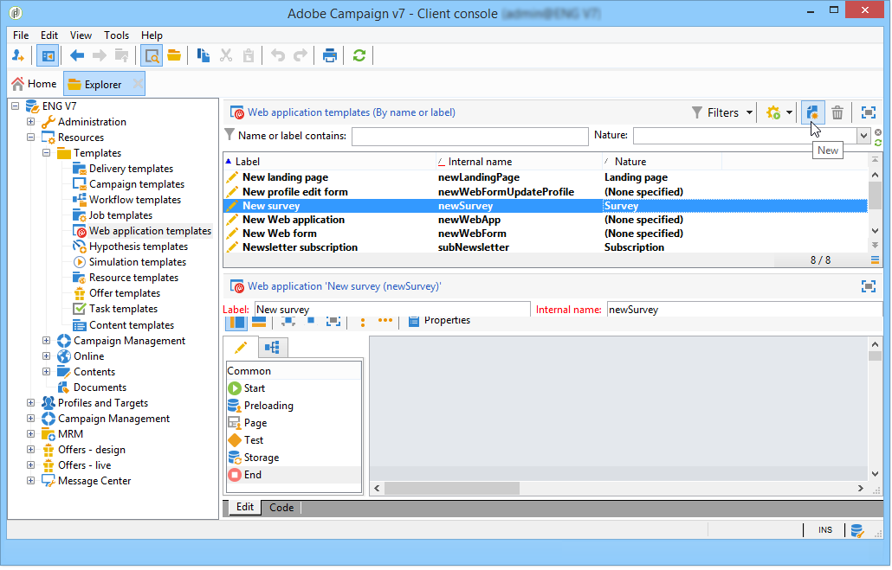

# Använd en webbformulärsmall{#using-a-web-form-template}

Formulärmallar är återanvändbara konfigurationer där du kan skapa nya formulär. Som standard lagras formulärmallar med webbprogrammallar i noden **[!UICONTROL Resources > Templates > Web application templates]**.

Härifrån kan du antingen skapa nya mallar eller konvertera ett befintligt formulär till en mall.

## Konvertera ett befintligt formulär till en mall {#convert-an-existing-form-into-a-template}

Ett formulär kan ändras till en mall och dess konfiguration återanvänds. Om du vill göra det markerar du formuläret, högerklickar och väljer **[!UICONTROL Actions > Save as template...]**.

Den här åtgärden öppnar fönstret där du kan skapa webbprogram. Du kan ange namn och beskrivning för mallen och välja den mapp där den ska sparas.

## Skapa en ny formulärmall {#create-a-new-form-template}

Om du vill skapa en webbformulärmall högerklickar du på listan med webbprogrammallar och väljer **[!UICONTROL New]**. Du kan också använda knappen **[!UICONTROL New]** ovanför listan med mallar.

Ange namnet på mallen. I fältet **[!UICONTROL Instance folder]** väljer du den mapp där de webbformulär som skapats utifrån den här mallen sparas. I fältet **[!UICONTROL Nature]** kan du lägga till beskrivande information för att sortera och/eller filtrera dina olika webbprogramsmallar.

Klicka på knappen **[!UICONTROL Save]** för att skapa mallen, bygg sedan innehållet i mallen och definiera dess parametrar.

Du kan nu välja den här mallen när du skapar ett nytt formulär.
