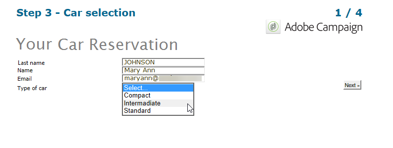
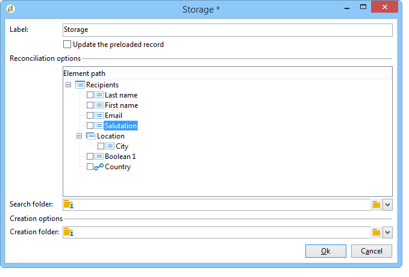

# Svar på webbformulär{#web-forms-answers}


## Svarslagringsfält {#response-storage-fields}

Svar på formulär kan sparas i ett databasfält eller tillfälligt i en lokal variabel. Lagringsläget för svar väljs när fält skapas. Den kan redigeras via länken **[!UICONTROL Edit storage...]**.

För varje inmatningsfält i ett formulär finns följande lagringsalternativ tillgängliga:


* **[!UICONTROL Edit a recipient]**

  Du kan välja ett fält i databasen: användarnas svar sparas i det här fältet. För varje användare sparas endast det senast angivna värdet: det läggs till i profilen: [Lagra data i databasen](#storing-data-in-the-database).

* **[!UICONTROL Variable]**

  Om du inte vill lagra information i databasen kan du använda en variabel. Lokala variabler kan deklareras uppströms. Se [Lagra data i en lokal variabel](#storing-data-in-a-local-variable).

### Lagra data i databasen {#storing-data-in-the-database}

Om du vill spara data i ett befintligt fält i databasen klickar du på ikonen **[!UICONTROL Edit expression]** och väljer den i listan med tillgängliga fält.


>[!NOTE]
>
>Standardreferensdokumentet är schemat **nms:mottagare**. Om du vill visa det eller välja ett nytt, markerar du formuläret i listan och klickar på knappen **[!UICONTROL Properties]**.

### Lagra data i en lokal variabel {#storing-data-in-a-local-variable}

Du kan använda lokala variabler så att även om data inte lagras i databasen kan de återanvändas på sidan eller de andra sidorna, till exempel för att placera villkor på visningen av ett fält eller för att anpassa ett meddelande.

Det innebär att du kan använda värdet för ett osparat fält för att godkänna visningen av en grupp alternativ på sidan. På sidan nedan lagras fordonstypen inte i databasen:


Den lagras i en variabel som måste markeras när listrutan skapas, eller via länken **[!UICONTROL Edit storage...]**.


Du kan visa befintliga variabler och skapa nya via länken **[!UICONTROL Edit variables...]**. Klicka på knappen **[!UICONTROL Add]** för att skapa en ny variabel.


Den tillagda variabeln är tillgänglig i listan med lokala variabler när sidans inmatningsfält skapas.

>[!NOTE]
>
>För varje formulär kan du skapa variabler uppströms. Om du vill göra det markerar du formuläret och klickar på knappen **[!UICONTROL Properties]**. Fliken **[!UICONTROL Variables]** innehåller de lokala variablerna för formuläret.

**Exempel på lokal lagring med konditionering**

I exemplet ovan visas behållaren som innehåller data om privata fordon endast om alternativet **[!UICONTROL Private]** väljs i listrutan, vilket anges i synlighetsvillkoret:


Om användaren väljer ett privat fordon finns följande alternativ i webbformuläret:



Behållaren som innehåller uppgifter om nyttofordon visas om alternativet Professional väljs, uttryckt i synlighetsvillkoret:


Detta innebär att om användaren väljer ett nyttofordon, erbjuder formuläret följande alternativ:


## Använda insamlade uppgifter {#using-collected-information}

För varje formulär kan svaren återanvändas i fälten eller etiketterna. Följande syntaxer måste användas:

* För innehåll som lagras i ett fält i databasen:

  ```
  <%=ctx.recipient.@field name%
  ```

* För innehåll som lagras i en lokal variabel:

  ```
  <%= ctx.vars.variable name %
  ```

* För innehåll som lagras i ett textfält i HTML:

  ```
  <%== HTML field name %
  ```

  >[!NOTE]
  >
  >Till skillnad från andra fält där `<%=` tecken ersätts med escape-tecken, sparas HTML-innehållet som det är med syntaxen `<%==` .

## Spara svar på webbformulär {#saving-web-forms-answers}

Om du vill spara den information som samlas in på sidorna i ett formulär måste du placera en lagringsruta i diagrammet.


Det finns två sätt att använda den här rutan:

* Om webbformuläret nås via en länk som skickas i ett e-postmeddelande, och om användaren som ansluter till programmet redan finns i databasen, kan du markera alternativet **[!UICONTROL Update the preloaded record]**. Mer information finns i [Leverera ett formulär via e-post](publishing-a-web-form.md#delivering-a-form-via-email).

  I det här fallet använder Adobe Campaign den krypterade primärnyckeln för användarprofilen, som är en unik identifierare som tilldelas varje profil av Adobe Campaign. Du måste konfigurera informationen så att den kan läsas in i förväg via förinläsningsrutan. Mer information finns i [Förinläsning av formulärdata](publishing-a-web-form.md#pre-loading-the-form-data).

  >[!CAUTION]
  >
  >Det här alternativet åsidosätter användardata, inklusive e-postadressen om det finns ett fält där de ska anges. Den kan inte användas för att skapa nya profiler och kräver en förinläsningsruta i formuläret.

* Om du vill utöka data för mottagare i databasen redigerar du lagringsrutan och väljer avstämningsnyckeln. För intern användning (vanligtvis ett intranätsystem) eller för ett formulär som används för att skapa nya profiler, till exempel, kan du välja avstämningsfält. I rutan finns alla fält i databasen som används på de olika sidorna i webbprogrammet:

  

Som standard importeras data till databasen av en **[!UICONTROL Update or insertion]**-åtgärd: om den finns i databasen uppdateras elementet (till exempel det valda nyhetsbrevet eller den e-postadress som har angetts). Om den inte finns läggs informationen till.

Du kan dock ändra detta beteende. Det gör du genom att markera elementets rot och välja den åtgärd som ska utföras i listrutan:


Du kan välja en sökmapp för avstämning och skapandemappen för nya profiler. Om dessa fält är tomma söks profilerna igenom och skapas i operatorns standardmapp.

>[!NOTE]
>
>Möjliga åtgärder är: **[!UICONTROL Simple reconciliation]**, **[!UICONTROL Update or insertion]**, **[!UICONTROL Insertion]**, **[!UICONTROL Update]**, **[!UICONTROL Deletion]**.\
>Operatorns standardmapp är den första mappen som operatorn har skrivbehörighet för.\
>Se [det här avsnittet](../../platform/using/access-management.md).
