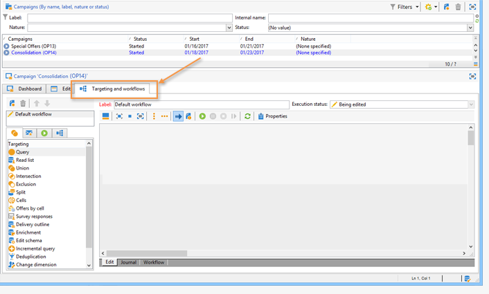
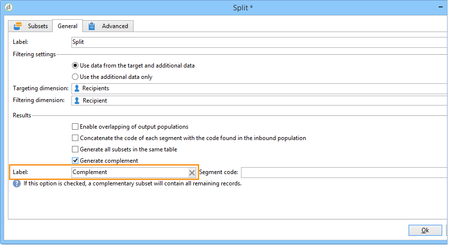
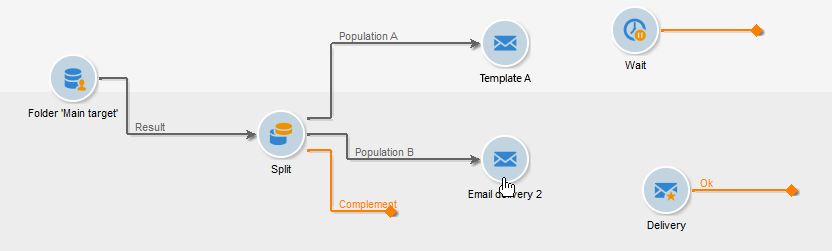

# A/B-tester{#a-b-testing}

Om du har flera olika innehåll för en e-postleverans och vill ta reda på vilken version som har störst effekt på målpopulationen, kan du skicka de olika versionerna till vissa av dina mottagare och sedan välja den version som har störst framgång och skicka den till övriga mottagare.

I det här fallet ska vi jämföra två e-postleveranser via ett arbetsflöde för målinriktning. Meddelandet och texten är identiska i båda leveranserna: bara layouten ändras.

Målgruppen är uppdelad i tre delar: två testgrupper och den återstående populationen. En annan version av leveransen skickas till varje testgrupp. Efter leveransen konfigureras en 5-dagars vänteperiod innan resultaten av de bästa öppningsfrekvenserna samlas in. Innehållet i leveransen med det högsta poängtalet återskapas sedan av ett skript och skickas till populationen som inte användes som testgrupp.

Observera att de kriterier som avgör vilken leverans som är bäst kan ändras efter dina behov. Det kan vara öppningsfrekvensen, klickfrekvensen, prenumerationstakten, reaktiviteten osv.

Dessutom gäller testet i det här fallet endast två leveranser, men du kan testa så många versioner som behövs. Lägg bara till aktiviteter i arbetsflödet.

Så här skapar du A/B-testet:

* [Steg 1: Skapa ett målarbetsflöde](#step-1--creating-a-targeting-workflow)
* [Steg 2: Konfigurerar populationsexempel](#step-2--configuring-population-samples)
* [Steg 3: Skapa två leveransmallar](#step-3--creating-two-delivery-templates)
* [Steg 4: Konfigurera leveranser i arbetsflödet](#step-4--configuring-the-deliveries-in-the-workflow)
* [Steg 5: Skapa skriptet](#step-5--creating-the-script)
* [Steg 7: Starta arbetsflödet](#step-7--starting-the-workflow)
* [Steg 8: Analyserar resultatet](#step-8--analyzing-the-result).

## Steg 1:Skapa ett målarbetsflöde {#step-1--creating-a-targeting-workflow}

Du måste skapa ett arbetsflöde på fliken **[!UICONTROL Targeting and Workflows]** i en kampanj. Det består av en **[!UICONTROL Query]** aktivitet, en **[!UICONTROL Split]** aktivitet som är kopplad till två **[!UICONTROL Email delivery]** aktiviteter, en **[!UICONTROL Wait]** aktivitet, en **[!UICONTROL JavaScript code]** aktivitet och en **[!UICONTROL Delivery]** aktivitet.

1. Om du inte redan har gjort det skapar du en kampanj (mer information finns i det här [avsnittet](../../campaign/using/setting-up-marketing-campaigns.md#creating-a-campaign)).

   

1. Gå till **[!UICONTROL Targeting and Workflows]** fliken.

   

1. Ändra etiketten för det befintliga arbetsflödet eller klicka **[!UICONTROL Add]** för att skapa ett nytt (mer information finns i det här [avsnittet](../../campaign/using/marketing-campaign-deliveries.md#selecting-the-target-population)).

   

1. Använd musen för att dra och släppa aktiviteter i arbetsflödesdiagrammet, inklusive en **[!UICONTROL Query]** (**[!UICONTROL Target]** tabb), en **[!UICONTROL Split]** (**[!UICONTROL Target]** tabb), två **[!UICONTROL Email deliveries]** (**[!UICONTROL Deliveries]** tabb), en **[!UICONTROL Wait]** aktivitet (**[!UICONTROL Flow Control]** tabb), en **[!UICONTROL JavaScript code]** aktivitet (**[!UICONTROL Actions]** **[!UICONTROL Delivery]****[!UICONTROL Actions]** tabb) och en¥-aktivitet (¥-flik).


## Steg 2: Konfigurerar populationsexempel {#step-2--configuring-population-samples}

### Konfigurera aktiviteten Fråga {#configuring-the-query-activity}

* Dubbelklicka på **[!UICONTROL Query]** aktiviteten.

   

* Klicka på **[!UICONTROL Edit query]** länken och välj de mottagare som du vill ange som mål.

   

* Länka **[!UICONTROL Query]** aktiviteten till **[!UICONTROL Split]** aktiviteten.

   

### Konfigurera den delade aktiviteten {#configuring-the-split-activity}

Med den här aktiviteten kan du skapa flera populationer: den som får A, den som får B, och den återstående befolkningen. Om du använder slumpmässig markering kan du bara rikta in dig på en del av populationen av varje leverans.

1. Skapar population A:

   * Dubbelklicka på **[!UICONTROL Split]** aktiviteten.

      

   * Ändra etiketten till A på den befintliga fliken.

      

   * Välj **[!UICONTROL Limit the selected records]** alternativet.

      

   * Klicka på **[!UICONTROL Edit]** länken, markera **[!UICONTROL Activate random sampling]** och klicka på **[!UICONTROL Next]**.

      

   * Ange tröskelvärdet till 10 % och klicka sedan på **[!UICONTROL Finish]**.

      

1. Skapar population B:

   * Klicka **[!UICONTROL Add]** för att skapa en ny flik för population B.

      

   * Begränsa populationen till 10% som tidigare.

      

1. Skapar den återstående populationen:

   * Gå till **[!UICONTROL General]** fliken.

      

   * Välj **[!UICONTROL Generate complement]**.

      

   * Ändra etiketten för att ange att den här populationen varken innehåller A eller B och klicka för **[!UICONTROL OK]** att stänga aktiviteten.

      

## Steg 3: Skapa två leveransmallar {#step-3--creating-two-delivery-templates}

Vi vill nu skapa två leveransmallar. Varje mall kommer att refereras i en aktivitet som är länkad till **[!UICONTROL Email delivery]** **[!UICONTROL Split]** aktiviteten. Mer information finns i det här [avsnittet](../../delivery/using/about-templates.md).

1. Gå till **[!UICONTROL Resources > Delivery template]** mappen.
1. Duplicera **[!UICONTROL Email]** leveransmallen.

   

1. Skapa innehållet som ska användas för leverans A.

   

1. Upprepa den här processen om du vill skapa en mall för leverans B.

   

## Steg 4: Konfigurera leveranser i arbetsflödet {#step-4--configuring-the-deliveries-in-the-workflow}

Nästa steg är att konfigurera leveranserna. De är avsedda för de tre populationer som skapades under det föregående steget: [Steg 2: Konfigurerar populationsexempel](#step-2--configuring-population-samples). De första två leveranserna gör att du kan skicka olika innehåll till populationen A och B. Den tredje leveransen är avsedd för den population som varken erhöll A eller B. Innehållet beräknas med ett skript och är identiskt med antingen A eller B, beroende på vilken som har den högsta öppna frekvensen. Vi måste konfigurera en vänteperiod för den tredje leveransen för att ta reda på resultatet av leveranserna A och B. Det är därför den tredje leveransen innehåller en **[!UICONTROL Wait]** aktivitet.

1. Gå till **[!UICONTROL Split]** aktiviteten och länka övergången avsedd för population A till en av e-postleveranserna som redan finns i arbetsflödet.

   

1. Dubbelklicka på leveransen för att öppna den.
1. Välj mall för leverans A i listrutan.

   

1. Klicka **[!UICONTROL Continue]** för att visa leveransen och spara den.

   

1. Länka övergången för den **[!UICONTROL Split]** aktivitet som ska fyllas i B till den andra e-postleveransen.

   

1. Öppna leveransen, välj mallen i leverans B och spara sedan leveransen.

   

1. Länka övergången som är avsedd för den återstående populationen till **[!UICONTROL Wait]** aktiviteten.

   

1. Öppna **[!UICONTROL Wait]** aktiviteten och konfigurera en vänteperiod på 5 dagar.

   

1. Länka **[!UICONTROL Wait]** aktiviteten till **[!UICONTROL JavaScript code]** aktiviteten.

   

## Steg 5: Skapa skriptet {#step-5--creating-the-script}

Valet av leveransinnehåll som är avsett för den återstående populationen beräknas av ett skript. Det här skriptet återställer information om leveransen med det högsta antalet öppningar och kopierar innehållet till den slutliga leveransen.

### Exempel på ett skript {#example-of-a-script}

Följande skript kan användas på samma sätt som i målarbetsflödet. Mer information finns i [Implementering](#implementation).

```
 // query the database to find the winner (best open rate)
   var winner = xtk.queryDef.create(
     <queryDef schema="nms:delivery" operation="get">
       <select>
         <node expr="@id"/>
         <node expr="@label"/>
         <node expr="[@operation-id]"/>
         <node expr="[@workflow-id]"/>
       </select>
       <where>
         <condition expr={"@FCP=0 and [@workflow-id]= " + instance.id}/>
       </where>
       <orderBy>
         <node expr="[indicators/@estimatedRecipientOpenRatio]" sortDesc="true"/>
       </orderBy>
     </queryDef>).ExecuteQuery()
   
   // create a new delivery object and initialize it by doing a copy of
   // the winner delivery
   var delivery = nms.delivery.create()
   delivery.Duplicate("nms:delivery|" + winner.@id)

   // append 'final' to the delivery label
   delivery.label = winner.@label + " final"

   // link the delivery to the operation to make sure it will be displayed in
   // the campaign dashboard. This attribute needs to be set manually here since 
   // the Duplicate() method has reset it to its default value => 0
   delivery.operation_id = winner.@["operation-id"]
   delivery.workflow_id = winner.@["workflow-id"]

   // adjust some delivery parameters to make it compatible with the 
   // "Prepare and start" option selected in the Delivery tab of this activity
   delivery.scheduling.validationMode = "manual"
   delivery.scheduling.delayed = 0
 
   // save the delivery in database
   delivery.save()
 
   // store the new delivery Id in event variables
   vars.deliveryId = delivery.id
```

En detaljerad förklaring av skriptet finns i [Information om skriptet](#details-of-the-script).

### Implementering {#implementation}

1. Öppna din **[!UICONTROL JavaScript code]** aktivitet.
1. Kopiera skriptet som finns i [Exempel på ett skript](#example-of-a-script) till **[!UICONTROL JavaScript code]** fönstret.

   

1. I **[!UICONTROL Label]** fältet anger du namnet på skriptet, dvs.

   ```
   <%= vars.deliveryId %>
   ```

   

1. Stäng **[!UICONTROL JavaScript code]** aktiviteten.
1. Spara arbetsflödet.

### Information om skriptet {#details-of-the-script}

I det här avsnittet beskrivs de olika delarna av skriptet och deras operativsystem.

* Den första delen av skriptet är en fråga. Med kommandot **queryDef** kan du från **NmsDelivery** återställa leveranser som skapats genom att målinrikta-arbetsflödet körs och sortera dem baserat på deras uppskattade öppningshastighet. Informationen från leverans med högsta öppningsfrekvens återställs.

   ```
   // query the database to find the winner (best open rate)
      var winner = xtk.queryDef.create(
        <queryDef schema="nms:delivery" operation="get">
          <select>
            <node expr="@id"/>
            <node expr="@label"/>
            <node expr="[@operation-id]"/>
          </select>
          <where>
            <condition expr={"@FCP=0 and [@workflow-id]= " + instance.id}/>
          </where>
          <orderBy>
            <node expr="[indicators/@estimatedRecipientOpenRatio]" sortDesc="true"/>
          </orderBy>
        </queryDef>).ExecuteQuery()
   ```

* Leveransen med den högsta öppningsfrekvensen dupliceras.

   ```
    // create a new delivery object and initialize it by doing a copy of
    // the winner delivery
   var delivery = nms.delivery.create()
   delivery.Duplicate("nms:delivery|" + winner.@id)
   ```

* Etiketten för den duplicerade leveransen ändras och ordet **final** läggs till i den.

   ```
   // append 'final' to the delivery label
   delivery.label = winner.@label + " final"
   ```

* Leveransen kopieras till kampanjinstrumentpanelen.

   ```
   // link the delivery to the operation to make sure it will be displayed in
   // the campaign dashboard. This attribute needs to be set manually here since 
   // the Duplicate() method has reset it to its default value => 0
   delivery.operation_id = winner.@["operation-id"]
   delivery.workflow_id = winner.@["workflow-id"]
   ```

   ```
   // adjust some delivery parameters to make it compatible with the 
   // "Prepare and start" option selected in the Delivery tab of this activity
   delivery.scheduling.validationMode = "manual"
   delivery.scheduling.delayed = 0
   ```

* Leveransen sparas i databasen.

   ```
   // save the delivery in database
   delivery.save()
   ```

* Den unika identifieraren för den duplicerade leveransen lagras i arbetsflödesvariabeln.

   ```
   // store the new delivery Id in event variables
   vars.deliveryId = delivery.id
   ```

### Andra urvalskriterier {#other-selection-criteria}

I exemplet ovan kan du välja innehållet i en leverans baserat på öppningshastigheten för e-postmeddelanden. Du kan anpassa den efter andra leveransspecifika indikatorer:

* Bästa klickfrekvens: `[indicators/@recipientClickRatio]`,
* Högsta reaktivitetsfrekvens (öppna e-post och klickningar i meddelandet): `[indicators/@reactivity]`,
* Lägsta antal klagomål: `[indicators/@refusedRatio]` (använd värdet false för attributet sortDesc),
* Högsta konverteringsgrad: `[indicators/@transactionRatio]`,
* Antal sidor som besökts efter att ett meddelande tagits emot: `[indicators/@totalWebPage]`,
* Lägsta prenumerationsavgift: `[indicators/@optOutRatio]`,
* Transaktionsbelopp: `[indicators/@amount]`.

## Steg 6: Definiera den slutliga leveransen {#step-6--defining-the-final-delivery}

När skriptet har skapats för att välja vinnare av A/B-tester kan du definiera parametrarna för den slutliga leveransen.

1. Anslut **[!UICONTROL JavaScript code]** aktiviteten till den återstående **[!UICONTROL Delivery]** aktiviteten.
1. Öppna **[!UICONTROL Delivery]** aktiviteten.
1. Avmarkera alternativet för att slutföra arbetsflödet med den här aktiviteten **[!UICONTROL Generate an outbound transition]** .
1. Låt de andra alternativen behålla standardvärdena.

   

Genom att förbereda leveransen som anges i övergången (definieras via **[!UICONTROL Javascript Code]** aktiviteten) kan du sedan godkänna den och starta sändningen, enligt beskrivningen i nästa steg.

## Steg 7: Starta arbetsflödet {#step-7--starting-the-workflow}

1. Klicka på **[!UICONTROL Start]** arbetsflödet.

   

1. Godkänn mål och innehåll för leveranser A och B via kampanjkontrollpanelen.
1. Bekräfta leverans.
1. Vänta till slutet av 5-dagarsperioden för att ta reda på vilket innehåll som beräknades efter leveransöppningsresultatet.

   

   I det här fallet valdes mall B.

1. Godkänn målet och innehållet när innehållet i den tredje leveransen har fastställts.

## Steg 8: Analysera resultatet {#step-8--analyzing-the-result}

När testleveranserna har skickats kan du kontrollera vilka mottagare de har skickats till och om de öppnats eller inte.

* Om du vill ta reda på vilka mottagare som har angetts som mål öppnar du en leverans via kampanjkontrollpanelen och klickar på **[!UICONTROL Delivery]** -fliken.

   

* Om du vill ta reda på om leveransen har öppnats går du till **[!UICONTROL Tracking]** fliken.

   

* Jämför med den andra leveransen.

   

I vårt exempel har leverans B fått högsta öppna pris. Det innebär att innehåll B kommer att användas för den slutliga leveransen.


