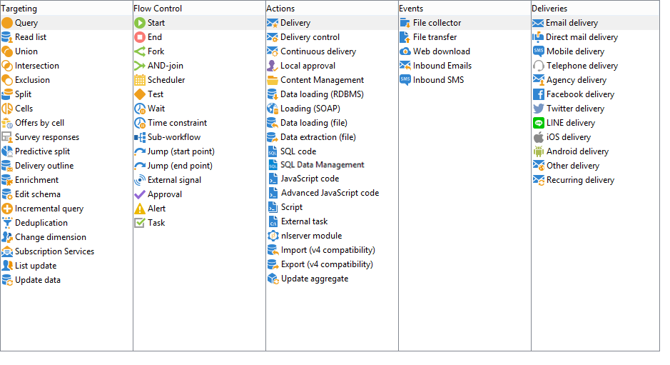

# Arbetsflödesaktiviteter{#wf-activities}

I det här avsnittet beskrivs alla tillgängliga aktiviteter. Beroende på noden eller i vilket sammanhang arbetsflödet skapas/redigeras kan tillgängliga aktiviteter variera. Arbetsflödena som skapas i en kampanj har till exempel kanalspecifika leveransaktiviteter.

Arbetsflödesaktiviteter grupperas efter kategori. Det finns fyra flikar tillgängliga samtidigt.

I kampanjarbetsflödena **[!UICONTROL Events]** tabben ersätts med **[!UICONTROL Deliveries]** -fliken. Aktiviteterna på den här fliken beskrivs i [Verksamheter](about-action-activities.md) -avsnitt.

Läs mer:

* [Om målinriktade aktiviteter](about-targeting-activities.md)
* [Köra ett arbetsflöde](starting-a-workflow.md)
* [God praxis för arbetsflöden](workflow-best-practices.md)
