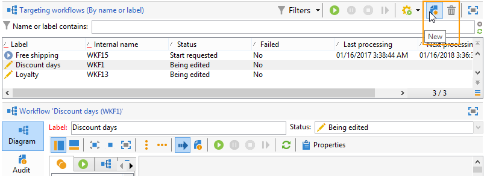

# Skapa ett arbetsflöde {#building-a-workflow}

I det här avsnittet beskrivs de viktigaste principerna och de bästa metoderna för att skapa ett arbetsflöde i Campaign.

* Skapa ett arbetsflöde, se [Skapa ett nytt arbetsflöde](#creating-a-new-workflow)
* Utforma arbetsflödesdiagrammet, se [Lägga till och länka aktiviteter](#adding-and-linking-activities)
* Åtkomstparametrar och egenskaper för aktiviteter, se [Konfigurera aktiviteter](#configuring-activities)
* Arbetsflöden för målinriktning, se [Målarbetsflöden](#targeting-workflows)
* Använda arbetsflöden för att köra en kampanj, se [Kampanjarbetsflöden](#campaign-workflows)
* Få åtkomst till och skapa tekniska arbetsflöden, se [Tekniska arbetsflöden](#technical-workflows)
* Använda mallar för att skapa arbetsflöden, se [Arbetsflödesmallar](#workflow-templates)

## Skapa ett nytt arbetsflöde {#creating-a-new-workflow}

Från **[!UICONTROL Explorer]**&#x200B;öppnar du en arbetsflödesmapp. Som standard kan du använda **[!UICONTROL Profiles and Targets]** > **[!UICONTROL Jobs]** > **[!UICONTROL Targeting workflows]**.

Klicka på **[!UICONTROL New]** ovanför listan med arbetsflöden.

Du kan också använda **[!UICONTROL Create]** knappen i arbetsflödesöversikten (**[!UICONTROL Monitoring]** > **[!UICONTROL Workflow]** länk).

Ange en etikett och klicka på **[!UICONTROL Save]**.

>[!NOTE]
>
>När du ändrar det interna namnet på en arbetsflödesaktivitet eller själva arbetsflödet måste du spara arbetsflödet innan du stänger det, så att det nya interna namnet beaktas korrekt.

## Lägga till och koppla aktiviteter {#adding-and-linking-activities}

Du måste nu definiera de olika aktiviteterna och koppla samman dem i diagrammet. I det här skedet av konfigurationen kan vi se diagrametiketten och arbetsflödesstatusen (Redigering pågår). Fönstrets nedre del används endast för att redigera diagrammet. Den innehåller ett verktygsfält, en palett med aktiviteter (till vänster) och själva diagrammet (till höger).

>[!NOTE]
>
>Om paletten inte visas klickar du på den första knappen i verktygsfältet för att visa den.

Aktiviteter grupperas efter kategori på palettens olika flikar. Tillgängliga flikar och aktiviteter kan variera beroende på arbetsflödestyp (teknik, målgruppsanpassning eller kampanjarbetsflöde).

* Den första fliken innehåller målgrupps- och datahanteringsaktiviteter. Dessa aktiviteter beskrivs närmare i [Verksamheter som riktar sig till](about-targeting-activities.md).
* På den andra fliken finns schemaläggningsaktiviteter, som huvudsakligen används för att samordna andra aktiviteter. Dessa aktiviteter beskrivs närmare i [Flödeskontroll](about-flow-control-activities.md).
* Den tredje fliken innehåller verktyg och åtgärder som kan användas i arbetsflödet. Dessa aktiviteter beskrivs närmare i [Verksamheter](about-action-activities.md).
* Den fjärde fliken innehåller aktiviteter som är beroende av en viss händelse, till exempel att ett e-postmeddelande tas emot eller att en fil tas emot på en server. Dessa aktiviteter beskrivs närmare i [Evenemangsaktiviteter](about-event-activities.md).

Så här skapar du diagrammet

1. Lägg till en aktivitet genom att markera den på paletten och flytta den till diagrammet med dra-och-släpp.

   Lägg till en **Starta** aktivitet och sedan en **Leverans** aktivitet i diagrammet.

   

1. Länka samman aktiviteterna genom att dra i **Starta** aktivitetsövergång och släppa den på **Leverans** aktivitet.

   

   Du kan automatiskt länka en aktivitet till den föregående genom att placera den nya aktiviteten i slutet av övergången.

1. Lägg till de aktiviteter du behöver och länka ihop dem enligt bilden nedan.

   

>[!CAUTION]
>
>Du kan kopiera och klistra in aktiviteter i samma arbetsflöde. Vi rekommenderar dock inte att du kopierar inklistringsaktiviteter i olika arbetsflöden. Vissa inställningar som är kopplade till aktiviteter som Leveranser och Schemaläggare kan leda till konflikter och fel när målarbetsflödet körs. I stället rekommenderar vi att du  **Duplicera** arbetsflöden. Mer information finns i [Duplicera arbetsflöden](#duplicating-workflows).

Du kan ändra visning och layout för diagrammet med följande element:

* **Använda verktygsfältet**

   Verktygsfältet för diagramredigering ger dig tillgång till arbetsflödets layout- och körningsfunktioner.

   

   På så sätt kan du anpassa layouten för redigeringsverktyget: visning av paletten och översikt, storlek och justering av grafiska objekt.

   

   Ikoner för att spåra och starta ett avancerat arbetsflöde för målinriktning beskrivs i det här [section](../../campaign/using/marketing-campaign-deliveries.md#creating-a-targeting-workflow).

* **Objektjustering**

   Om du vill justera ikoner markerar du dem och klickar på **[!UICONTROL Align vertically]** eller **[!UICONTROL Align horizontally]** ikon.

   Använd **CTRL** för att markera flera utspridda aktiviteter eller för att avmarkera en eller flera aktiviteter. Klicka på diagrambakgrunden för att avmarkera allt.

* **Bildhantering**

   Du kan anpassa bakgrundsbilden för diagrammet samt de som hör till de olika aktiviteterna. Se [Hantera aktivitetsbilder](managing-activity-images.md).

## Konfigurera aktiviteter {#configuring-activities}

Dubbelklicka på en aktivitet för att konfigurera den eller högerklicka och välj **[!UICONTROL Open...]**.

>[!NOTE]
>
>Kampanjarbetsflödesaktiviteter beskrivs i [det här avsnittet](about-activities.md).

Den första fliken innehåller den grundläggande konfigurationen. The **[!UICONTROL Advanced]** -fliken innehåller ytterligare parametrar, som används särskilt för att definiera beteenden när ett fel påträffas, ange körningstiden för en aktivitet och för att ange ett initieringsskript.

Om du vill få en bättre förståelse för aktiviteterna och om du vill förbättra arbetsflödets läsbarhet kan du skriva kommentarer i aktiviteterna: dessa visas automatiskt när operatorer rullar över aktiviteten.

## Målarbetsflöden {#targeting-workflows}

Med målarbetsflöden kan du skapa flera leveransmål. Du kan skapa frågor, definiera fackföreningar eller undantag baserat på specifika villkor, lägga till schemaläggning tack vare arbetsflödesaktiviteter. Resultatet av den här målsättningen kan automatiskt överföras till en lista som kan fungera som mål för leveransåtgärder

Förutom dessa aktiviteter kan du med alternativen för datahantering hantera data och komma åt avancerade funktioner för att tillgodose komplexa målgruppsproblem. Mer information finns i [Datahantering](targeting-data.md#data-management).

Alla dessa aktiviteter finns på den första arbetsflödesfliken.

>[!NOTE]
>
>Målinriktade aktiviteter beskrivs i [det här avsnittet](about-activities.md).

Målarbetsflöden kan skapas och redigeras via **[!UICONTROL Profiles and Targets > Jobs > Targeting workflows]** noden i Adobe Campaign-trädet eller via **[!UICONTROL Profiles and Targets > Targeting workflows]** hemsidans meny.

Målarbetsflöden inom ramen för en kampanj lagras med alla kampanjarbetsflöden.

### Viktiga steg för att skapa ett målarbetsflöde {#implementation-steps-}

Steg för att skapa ett arbetsflöde för målinriktning finns i följande avsnitt:

1. **Identifiera** data i databasen - se [Skapa frågor](targeting-data.md#creating-queries)
1. **Förbered** data för att tillgodose leveransbehov - se [Förbättra och ändra data](targeting-data.md#enriching-and-modifying-data)
1. **Använd** data för att utföra uppdateringar eller inom en leverans - se [Uppdaterar databasen](how-to-use-workflow-data.md#updating-the-database)

Resultaten av alla berikningar och all hantering som utförs under målgruppsanpassningen lagras och är tillgängliga i personaliseringsfält, särskilt för användning när personaliserade meddelanden skapas. Mer information finns i [Måldata](data-life-cycle.md#target-data)

### Målinriktning och filtrering {#targeting-and-filtering-dimensions}

Vid datasegmenteringsåtgärder mappas målnyckeln till en filtreringsdimension. Med måldimensionen kan du definiera målgruppen för åtgärden: mottagare, mottagare, mottagare, operatör, abonnenter osv. Filtreringsdimensionen gör att du kan välja populationen baserat på vissa kriterier: kontraktsägare, nyhetsbrev, prenumeranter osv.

Om du till exempel vill välja kunder som har haft en livförsäkring i över 5 år väljer du följande målgruppsdimension: **Klienter** och följande filterdimension: **Kontraktsinnehavare**. Du kan sedan definiera filtervillkoren i frågeaktiviteten

Under måldimensionens urvalsfas finns endast kompatibla filtreringsdimensioner i gränssnittet.

Dessa två dimensioner måste vara relaterade. Innehållet i **[!UICONTROL Filtering dimension]** -listan beror på måldimensionen som anges i det första fältet.

Till exempel för mottagare (**mottagare**) kommer följande filterdimensioner att vara tillgängliga:

Med **Webbprogram** innehåller listan följande filterdimensioner:

## Kampanjarbetsflöden {#campaign-workflows}

För varje kampanj kan du skapa arbetsflöden som ska köras från **[!UICONTROL Targeting and workflows]** -fliken. Dessa arbetsflöden är specifika för kampanjen.

Fliken innehåller samma aktiviteter som för alla arbetsflöden. [Läs mer](#implementation-steps-)

Förutom att rikta kampanjer kan ni med kampanjarbetsflöden skapa och konfigurera leveranser helt för alla tillgängliga kanaler. När leveransen har skapats i arbetsflödet är den tillgänglig från kontrollpanelen för kampanjen. [Läs mer](../../campaign/using/marketing-campaign-deliveries.md)

Alla kampanjarbetsflöden centraliseras via **[!UICONTROL Administration > Production > Objects created automatically > Campaign workflows]** nod.

Kampanjarbetsflöden och implementeringsexempel finns i [den här sidan](../../campaign/using/marketing-campaign-deliveries.md#building-the-main-target-in-a-workflow).

## Tekniska arbetsflöden {#technical-workflows}

Tekniska arbetsflöden medföljer Adobe Campaign. De är åtgärder eller jobb som schemalagts för periodisk körning på servern. De gör att du kan utföra underhåll i databasen, vidarebefordra spårningsinformation om leveranser och konfigurera provisoriska processer för leveranser. Tekniska arbetsflöden konfigureras via **[!UICONTROL Administration > Production > Technical workflows]** nod.

Inbyggda mallar finns för att skapa tekniska arbetsflöden. De kan konfigureras så att de passar dina behov.

The **[!UICONTROL Campaign process]** undermappen centraliserar de arbetsflöden som krävs för att köra processer i kampanjer: aktivitetsavisering, lagerhantering, kostnadsberäkning osv.

>[!NOTE]
>
>En lista över tekniska arbetsflöden som installeras med varje modul finns i en [dedikerad sektion](about-technical-workflows.md).

Du kan skapa andra tekniska arbetsflöden i **[!UICONTROL Administration > Production > Technical workflows]** trädstrukturens nod. Den här processen är dock reserverad för expertanvändare.

De aktiviteter som erbjuds är desamma som för arbetsflöden med målinriktning. [Läs mer](#implementation-steps-)

## Arbetsflödesmallar {#workflow-templates}

Arbetsflödesmallar innehåller den övergripande konfigurationen av egenskaper och eventuellt ett antal aktiviteter som sammanfogats i ett diagram. Den här konfigurationen kan återanvändas för att skapa nya arbetsflöden som innehåller ett visst antal förkonfigurerade element

Du kan skapa nya arbetsflödesmallar som baseras på befintliga mallar eller ändra ett arbetsflöde direkt till en mall.

Arbetsflödesmallar lagras i **[!UICONTROL Resources > Templates > Workflow templates]** noden i Adobe Campaign-trädet.

Förutom de vanliga arbetsflödesegenskaperna kan du med mallegenskaperna ange körningsfilen för arbetsflöden som skapas baserat på den här mallen.

## Duplicera arbetsflöden {#duplicating-workflows}

Du kan duplicera olika typer av arbetsflöden. När du har duplicerat arbetsflödet överförs inte ändringarna till kopian av arbetsflödet.

>[!CAUTION]
>
>Kopiera och klistra in är tillgängligt i arbetsflöden, men vi rekommenderar att du använder **Duplicera**. När en aktivitet har kopierats behålls hela dess konfiguration. För leveransaktiviteter (e-post, SMS, push-meddelanden..) kopieras även det leveransobjekt som är kopplat till aktiviteten, vilket kan orsaka krasch.

1. Högerklicka på ett arbetsflöde.
1. Klicka **Duplicera**.

   

1. Ändra arbetsflödesetiketten i arbetsflödesfönstret.
1. Klicka **Spara**.

Dubblettfunktionen är inte direkt tillgänglig i kampanjvyn.

Men du kan skapa en vy som visar alla arbetsflöden i instansen. I den här vyn kan du duplicera arbetsflöden med **Duplicera till**.

**Först skapar vi en vy:**

1. I **Utforskaren** går du till den mapp du behöver för att skapa vyn i.
1. Högerklicka och gå till **Lägg till en ny mapp** > **Process**, markera **Arbetsflöden**.

   

Den nya mappen **Arbetsflöden** skapas.

1. Högerklicka och välj **Egenskaper**.
1. I **Begränsning**, kontrollera **Mappen är en vy** och klicka **Spara**.

   

Mappen innehåller nu alla arbetsflöden för din instans.

**Duplicera ett kampanjarbetsflöde**

1. Välj ett kampanjarbetsflöde i arbetsflödesvyn.
1. Högerklicka **Duplicera till**.
   
1. Ändra etiketten.
1. Klicka **Spara**.

Du kan se det duplicerade arbetsflödet i arbetsflödesvyn.
