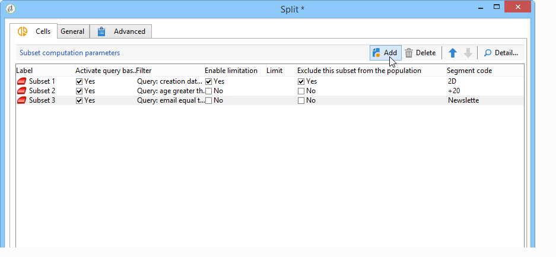

# Celler{#cells}

Aktiviteten ger **[!UICONTROL Cells]** en vy över de olika deluppsättningarna i form av datakolumner. Den underlättar delmängdsmanipulation och är även utformad för att uppmuntra personaliseringsmöjligheter.



Den här aktiviteten kan konfigureras för att ange specifika parametrar baserat på användarnas behov. Som standard visas detaljerna för varje delmängd i ett dedikerat fönster via flikarna **[!UICONTROL Selection]** och **[!UICONTROL Advanced]** . I exemplet nedan har formuläret ändrats: en **[!UICONTROL Data]** flik har lagts till för att aktivera associationen för ett erbjudande och en prioritetsnivå för varje delmängd.


För den här konfigurationen har följande information lagts till i arbetsflödesformuläret (i noden **[!UICONTROL Administration > Configurations > Input forms]** i Adobe Campaign-trädet):

```
<container img="nms:miniatures/mini-enrich.png" label="Data">
                <input xpath="@code"/>
                <container xpath="select/node[@alias='@numTest']">
                  <input alwaysActive="true" expr="'long'" type="expr" xpath="@type"/>
                  <input alwaysActive="true" expr="'Priority'" type="expr" xpath="@label"/>
                  <input label="Priority" maxValue="12" minValue="0" type="number"
                         xpath="@value" xpathEditFromType="@type"/>
                </container>
                <container xpath="select/node[@alias='@test']">
                  <input alwaysActive="true" expr="'string'" type="expr" xpath="@type"/>
                  <input alwaysActive="true" expr="'Identifier'" type="expr" xpath="@label"/>
                  <input label="Cell identifier" xpath="@value"/>
                </container>
                <container xpath="select/node[@alias='linkTest']">
                  <input alwaysActive="true" expr="'link'" type="expr" xpath="@type"/>
                  <input alwaysActive="true" expr="'nms:offer'" type="expr" xpath="@dataType"/>
                  <input alwaysActive="true" expr="'Offre'" type="expr" xpath="@label"/>
                  <input computeStringAlias="@valueLabel" label="Offers" notifyPathList="@_cs|@valueLabel"
                         schema="nms:offer" type="linkEdit" xpath="@value"/>
                </container>
```

Anpassa anmälningsformulär i Adobe Campaign är reserverat för expertanvändare. Mer information finns i det här [avsnittet](../../configuration/using/identifying-a-form.md).
