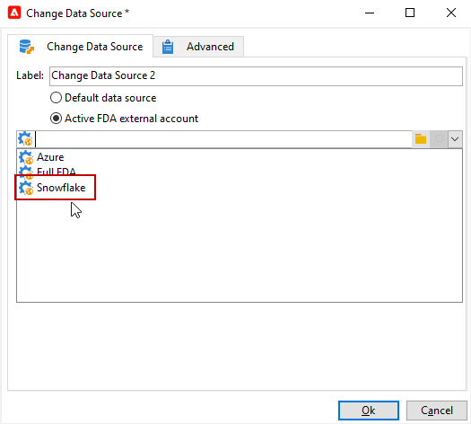

# Ändra datakälla {#change-data-source}

>[!NOTE]
>
> Aktiviteten **[!UICONTROL Change data source]** är bara tillgänglig med paketet **[!UICONTROL Access to external data (Federated Data Access)]**. Mer information om Adobe Campaign Classic inbyggda paket finns på [sidan](../../installation/using/installing-campaign-standard-packages.md).

Med aktiviteten **[!UICONTROL Change data source]** kan du ändra datakällan för arbetsflödet **[!UICONTROL Working table]**. Detta ger större flexibilitet att hantera data över olika datakällor, som FDA, FFDA och lokala databaser.

**[!UICONTROL Working table]** tillåter Adobe Campaign Classic-arbetsflöde att hantera data och dela data med arbetsflödesaktiviteter.
Som standard skapas **[!UICONTROL Working table]** i samma databas som källan för de data vi söker efter.

Om du till exempel frågar i tabellen **[!UICONTROL Profiles]**, som lagras i molndatabasen, skapar du en **[!UICONTROL Working table]** i samma molndatabas.
Om du vill ändra detta kan du lägga till aktiviteten **[!UICONTROL Change Data Source]** och välja en annan datakälla för **[!UICONTROL Working table]**.

Observera att när du använder aktiviteten **[!UICONTROL Change Data Source]** måste du växla tillbaka till molndatabasen för att kunna fortsätta med arbetsflödeskörningen.

Så här använder du aktiviteten **[!UICONTROL Change Data Source]**:

1. Skapa ett arbetsflöde.

1. Fråga dina målmottagare med en **[!UICONTROL Query]**-aktivitet.

   Mer information om aktiviteten **[!UICONTROL Query]** finns på den här [sidan](../../workflow/using/query.md#creating-a-query).

1. Lägg till en **[!UICONTROL Change data source]**-aktivitet från fliken **[!UICONTROL Targeting]**.

   

1. Dubbelklicka på din **[!UICONTROL Change data source]**-aktivitet för att välja **[!UICONTROL Default data source]**.

   Arbetstabellen, som innehåller resultatet av frågan, flyttas sedan till PostgreSQL-standarddatabasen.

   

1. Dra och släpp en **[!UICONTROL JavaScript code]**-aktivitet från fliken **[!UICONTROL Actions]** för att utföra enhetsåtgärder i arbetstabellen.

   Mer information om aktiviteten **[!UICONTROL JavaScript code]** finns på sidan [JavaScript-kod och avancerad JavaScript-kod](../../workflow/using/sql-code-and-javascript-code.md#javascript-code).

1. Lägg till ytterligare en **[!UICONTROL Change data source]**-aktivitet för att växla tillbaka till molndatabasen.

1. Dubbelklicka på din aktivitet och välj **[!UICONTROL Active FDA external account]** och sedan motsvarande **[!UICONTROL External database]**-externa konto.

   

1. Nu kan du starta arbetsflödet.
