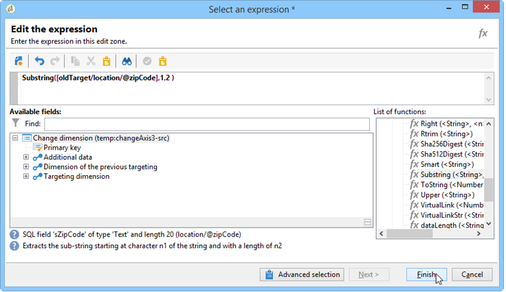

# Ändra dimension{#change-dimension}

Med aktiviteten för att ändra dimension kan du ändra måldimensionen under målkonstruktionscykeln. Axelväxling beror på datamallen och indatamängden. På så sätt kan du till exempel växla från dimensionen &quot;kontrakt&quot; till dimensionen &quot;kunder&quot;.

Du kan också använda den här aktiviteten för att definiera ytterligare kolumner för det nya målet.

Det går att definiera villkor för borttagning av dubbletter av data.

## Konfigurationsläge {#configuration-mode}

Så här konfigurerar du ändringsdimensionsaktiviteten:

1. Välj den nya måldimensionen via **[!UICONTROL Change dimension]** fältet.

   

1. Vid dimensionsändring kan du behålla alla element eller välja de som ska bevaras i utdata. I följande exempel är max. antalet dubbletter anges till 2.

   

   När du väljer att bara behålla en post visas en samling i arbetsschemat: Den här samlingen representerar alla poster som inte kommer att användas som mål i det slutliga resultatet (eftersom endast en post behålls). I likhet med alla andra samlingar kan du med den här metoden beräkna aggregeringar eller återställa information i kolumner.

   Om du till exempel ändrar dimensionen **[!UICONTROL Customers]** till **[!UICONTROL Recipients]** dimensionen kan du rikta in dig på kunder i en viss butik, samtidigt som du lägger till antalet inköp.

1. Om du väljer att inte behålla all den här informationen kan du konfigurera det duplicerade hanteringsläget.

   

   Med de blå pilarna kan du definiera den duplicerade bearbetningsprioriteten.

   I exemplet ovan dedupliceras mottagarna först till sin e-postadress och sedan till sitt kontonummer om det behövs.

1. På fliken **[!UICONTROL Result]** kan du lägga till ytterligare information.

   Du kan till exempel återskapa regionen baserat på postnumret med hjälp av en **delsträngtypsfunktion** . Så här gör du:

   * Klicka på **[!UICONTROL Add data...]** länken och välj **[!UICONTROL Data linked to the filtering dimension]**.

      

      >[!NOTE]
      >
      >Mer information om hur du skapar och hanterar ytterligare kolumner finns i [Lägga till data](../../workflow/using/query.md#adding-data).

   * Markera den tidigare måldimensionen (före axelväxling) och markera den **[!UICONTROL Zip Code]** i mottagarens **[!UICONTROL Location]** underträd och klicka sedan på **[!UICONTROL Edit expression]**.

      

   * Klicka **[!UICONTROL Advanced selection]** och välj **[!UICONTROL Edit the formula using an expression]**.

      

   * Använd funktionerna i listan och ange vilken beräkning som ska utföras.

      

   * Ange slutligen etiketten för den kolumn som du nyss skapade.

      

1. Kör arbetsflödet för att visa resultatet av den här konfigurationen. Jämför data i tabellerna före och efter ändringsdimensionsaktiviteten och jämför arbetsflödestabellernas struktur, vilket visas i följande exempel:

   

   

