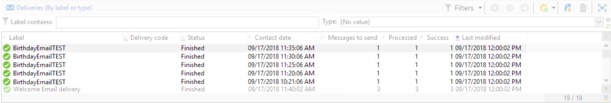

# Kontinuerlig leverans{#continuous-delivery}

Med en åtgärd av typen **kontinuerlig** leverans kan du lägga till nya mottagare till en befintlig leverans. Med den här leveranstypen slipper du skapa en ny leverans varje gång: Det här läget är ofta mer effektivt, särskilt när det gäller meddelanden om låga volymer eller meddelanden som skickas ut vid behov. På en leveransmallnivå kan du ange ett skript för att beräkna etiketten (och kampanjmappen) för den associerade leveransen. Om skriptet beräknar en leverans som inte finns än, skapas den direkt.

Alternativet visar **[!UICONTROL Process errors]** en viss övergång som aktiveras om ett fel genereras. I det här fallet försätts arbetsflödet inte i felläge och fortsätter med körningen.

Fel som beaktas är filsystemfel (filen kunde inte flyttas, katalogen kunde inte nås osv.).

Det här alternativet bearbetar inte fel relaterade till aktivitetskonfigurationen, dvs. ogiltiga värden.

## Indataparametrar {#input-parameters}

* tableName
* schema

Varje inkommande händelse måste ange ett mål som definieras av dessa parametrar.

Endast när **[!UICONTROL Specified by the inbound event]** alternativet är markerat.

## Utdataparametrar {#output-parameters}

* tableName
* schema
* recCount

Den här uppsättningen med tre värden identifierar det mål som uppstår vid leverans. **[!UICONTROL tableName]** är namnet på den tabell som memorerar målets identifierare, **[!UICONTROL schema]** är populationens schema (vanligtvis nms:mottagare) och **[!UICONTROL recCount]** är antalet element i tabellen.

Övergången som är associerad med komplementet har samma parametrar.

## Så ställer man in en kontinuerlig leverans

I det här avsnittet beskrivs hur du konfigurerar en kontinuerlig leverans.

Med den **kontinuerliga leveransen** kan du lägga till nya mottagare i en befintlig leverans och undvika att behöva skapa en ny leverans varje gång en ny mottagare läggs till. Du kan uppdatera den kreativa informationen direkt i kampanjarbetsflödet och den uppdaterar mallen i leveransmallens resursmapp.

En kontinuerlig leverans skapar en enda leverans- och leveranslogg (broadLog) och spårningsloggar som refererar till att en leverans läggs till varje gång den körs.

I den här videon visas hur du konfigurerar en kontinuerlig leverans med en stegvis fråga.

>[!VIDEO](https://video.tv.adobe.com/v/25039?quality=12)
