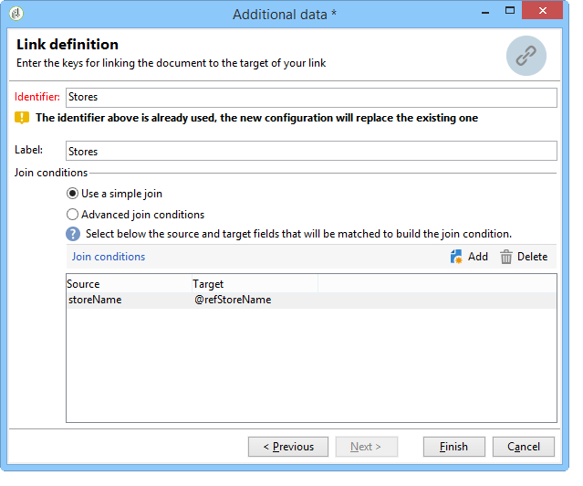

# Skapa en sammanfattningslista{#creating-a-summary-list}

I det här exemplet beskrivs hur du skapar ett arbetsflöde som du kan skapa en sammanfattningslista genom att samla in filer och följa flera förbättringar. Exemplet är baserat på en lista med kontakter som har köpt i en butik.


Följande datastruktur används:


Syftet är att

* Använda de olika alternativen för anrikningsaktiviteten
* Uppdatera data i databasen efter en avstämning
* Så här skapar du en global&quot;vy&quot; av data som berikats

Om du vill skapa en sammanfattningslista måste du följa dessa steg:

1. Samla in och läsa in en inköpsfil i arbetsflödets arbetsregister
1. Förbättra importerade data genom att skapa en länk till en referenstabell
1. Uppdaterar tabellen&quot;Inköp&quot; med data som berikats
1. Förbättra&quot;Kontaktdata&quot; med en sammanställd beräkning från tabellen&quot;Inköp&quot;
1. Skapa en sammanfattningslista

## Steg 1: Läsa in filen och stämma av importerade data {#step-1--loading-the-file-and-reconciling-the-imported-data}

De data som ska läsas in är&quot;Inköpsrelaterade&quot; data i följande format:

```
Product Name;Product price;Store
Computer;2000;London 3
Tablet;600;Cambridge
Computer;2000;London 5
Comptuer;2000;London 8
Tablet;600;Cambridge
Phone;500;London 5
```

Dessa data finns i textfilen&quot;Purchases.txt&quot;.

1. Lägg till aktiviteterna **Filinsamlare** och **Datainläsning (fil)** i arbetsflödet.

   Med **filinsamlingsaktiviteten** kan du samla in och skicka filer från och till Adobe Campaign-servern.

   Med aktiviteten **Datainläsning(fil)** kan du förbättra arbetsflödets arbetsregister med insamlade data.

   Mer information om den här aktiviteten finns i [Läsa in data från en fil](../../workflow/using/importing-data.md#loading-data-from-a-file).

1. Konfigurera **filinsamlingsaktiviteten** för att samla in textfiler (*.txt) från den valda katalogen.

   

   Med **filinsamlingsaktiviteten** kan du hantera frånvaron av en fil i källkatalogen. Markera **[!UICONTROL Process file nonexistence]** alternativet om du vill göra det. I det här arbetsflödet har en **Wait** -aktivitet lagts till för att försöka med en annan filsamling om den saknas i katalogen vid tidpunkten för samlingen.

1. Konfigurera aktiviteten **Datainläsning (fil)** med en exempelfil med samma format som de data som ska importeras.

   

   Klicka på **[!UICONTROL Click here to change the file format...]** länken om du vill byta namn på kolumnerna med hjälp av de interna namnen och etiketterna i tabellen&quot;Inköp&quot;.

   

När data har importerats utförs en anrikning genom att en länk skapas till en referenstabell som matchar schemat&quot;Lagrar&quot;.

Lägg till anrikningsaktiviteten och konfigurera den enligt följande:

1. Välj huvuduppsättningen med data från aktiviteten **Datainläsning(fil)** .

   

1. Klicka **[!UICONTROL Add data]** och välj sedan **[!UICONTROL A link]** alternativet.

   

1. Välj **[!UICONTROL Define a collection]** alternativet.
1. Välj schemat&quot;Lagrar&quot; som mål.

   

Mer information om olika typer av länkar finns i [Förbättra och ändra data](../../workflow/using/targeting-data.md#enriching-and-modifying-data).

I följande fönster måste du skapa ett kopplingsvillkor genom att välja källfältet (i huvuduppsättningen) och målfältet (som tillhör schemat &quot;Stores&quot;) för att konfigurera datavstämningen.



Nu när länken har skapats ska vi lägga till en kolumn i arbetsflödets arbetstabell från schemat&quot;Stores&quot;: fältet&quot;ZipCode Reference&quot;.

1. Öppna anrikningsaktiviteten.
1. Klicka **[!UICONTROL Edit additional data]**.
1. Lägg till fältet&quot;ZipCode Reference&quot; i **[!UICONTROL Output columns]**.


Informationen i arbetsflödets arbetsregister efter denna berikning är följande:


## Steg 2: Skriva data i registret &#39;Inköp&#39; {#step-2--writing-enriched-data-to-the--purchases--table}

I det här steget beskrivs hur du skriver importerade och berikade data till tabellen&quot;Inköp&quot;. För att göra detta måste vi använda en aktivitet av typen **Uppdatera data** .

En avstämning mellan data i arbetsflödets arbetstabell och dimensionen **Inköp** riktad marknadsföring måste göras innan data i **inköpstabellen** uppdateras.

1. Klicka på **[!UICONTROL Reconciliation]** fliken för anrikningsaktiviteten.
1. Välj måldimensionen, inköpsschemat i det här fallet.
1. Välj ett källuttryck för data i arbetsflödestabellen (fältet&quot;storeName&quot; i det här fallet).
1. Välj ett måluttryck för data i tabellen&quot;Inköp&quot; (&quot;lagenamn&quot; i det här fallet).
1. Markera **[!UICONTROL Keep unreconciled data coming from the work table]** alternativet.


I aktiviteten **Uppdatera data** krävs följande konfiguration:

1. Välj **[!UICONTROL Insert or update]** alternativet i **[!UICONTROL Operation type]** fältet för att undvika att skapa nya poster varje gång filen samlas in.
1. Välj **[!UICONTROL By directly using the targeting dimension]** värdet för **[!UICONTROL Record identification]** alternativet.
1. Välj schemat&quot;Inköp&quot; som ett **[!UICONTROL Document type]**.
1. Ange listan med fält som ska uppdateras. I **[!UICONTROL Destination]** kolumnen kan du definiera fälten i köpschemat. I kolumnen kan du **[!UICONTROL Expression]** välja de fält i arbetstabellen som ska utföra en mappning.
1. Klicka på **[!UICONTROL Generate an outbound transition]** alternativet.


## Steg 3: Förbättrar &#39;Kontaktdata&#39; {#step-3--enriching--contact--data-}

Schemat&quot;Kontakter&quot; är fysiskt länkat till schemat&quot;Inköp&quot;. Det innebär att du kan använda ett annat alternativ för alternativet &quot;Anrikning&quot;: lägga till data som är länkade till filtreringsdimensionen.

Syftet med den andra anrikningen är att skapa en sammanställning av inköpsschemat för att beräkna det totala antalet inköp för varje identifierad kontakt.

1. Lägg till en **frågetypsaktivitet** som gör att du kan återställa alla lagrade **kontakter** .
1. Lägg till en **anrikningsaktivitet** och välj sedan den huvuduppsättning som är resultatet av föregående fråga.
1. Klicka på Lägg till **[!UICONTROL Data]**.
1. Klicka på **[!UICONTROL Data linked to the targeting dimension]** alternativet.
1. Klicka på **[!UICONTROL Data linked to the filtering dimension]** alternativet i **[!UICONTROL Select fields to add]** fönstret.
1. Markera **[!UICONTROL Purchases]** noden och klicka sedan på **[!UICONTROL Next]**.

   

1. Ändra **[!UICONTROL Collected data]** fältet genom att markera **[!UICONTROL Aggregates]** alternativet.

   

1. Klicka **[!UICONTROL Next]**.
1. Lägg till följande uttryck för att beräkna inköpsvolymen för varje kontakt: &quot;Sum(@prodprice)&quot;.

   

Om du vill förbereda sammanfattningslistan måste du lägga till fält från fälten&quot;Inköp&quot; och från den första berikningen: fältet&quot;ZipCode Reference&quot;.

1. Klicka på **[!UICONTROL Edit additional data...]** länken i anrikningsaktiviteten.
1. Lägg till fälten&quot;Butiksnamn&quot; och&quot;Inköp/Postnummerreferens&quot;.

   

1. Klicka på **[!UICONTROL Properties]** fliken.
1. Ändra den andra länken så att bara en rad skapas.

   

## Steg 4: Skapa och lägga till i en sammanfattningslista {#step-4--creating-and-adding-to-a-summary-list}

Det sista steget är att skriva alla data som berikats till en lista.

1. Lägg till en **listuppdateringsaktivitet** i arbetsflödet. Denna verksamhet måste vara kopplad till den utgående övergången för den andra anrikningsaktiviteten.
1. Välj **[!UICONTROL Create the list if necessary (Calculated name)]** alternativet.
1. Välj ett värde för det beräknade namnet. Etiketten som väljs för listan är dagens datum: &lt;%= formatDate(new Date(), &quot;%2D/%2M/%2Y&quot;) %>.

När arbetsflödet är klart kommer listan att innehålla:

* en förteckning över kontakter,
* a &quot;Total purchasing&quot; column,
* en&quot;Store name&quot;-kolumn,
* en kolumn av typen&quot;Postnr&quot; angiven för alla butiker som finns i butiksreferensschemat.


