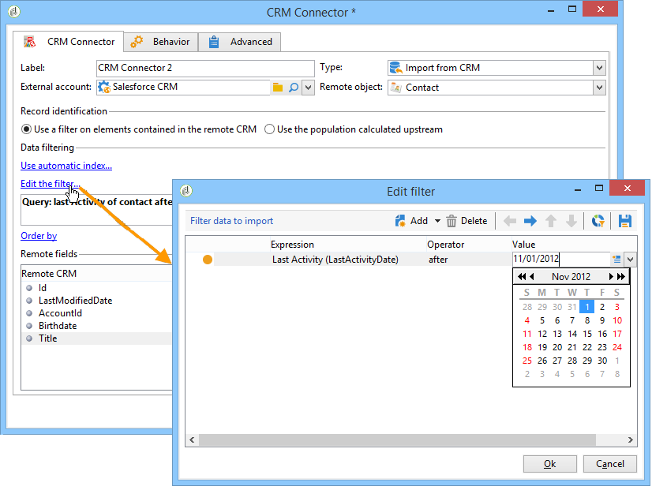
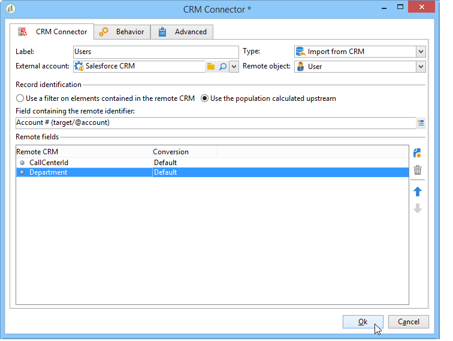

# CRM Connector{#crm-connector}

Med **CRM-kopplingen** kan du konfigurera datasynkroniseringen mellan Adobe Campaign och en CRM.

Mer information om CRM-anslutningar i Adobe Campaign finns i det här [avsnittet](../../platform/using/crm-connectors.md).

Det innebär att du kan:

* Importera från CRM (se [Importera från CRM](#importing-from-the-crm)),
* Exportera till CRM (se [Exportera till CRM](#exporting-to-the-crm)).
* Importera objekt som tagits bort i CRM (se [Importera objekt som tagits bort i CRM](#importing-objects-deleted-in-the-crm)),
* Ta bort objekt i CRM (se [Ta bort objekt i CRM](#deleting-objects-in-the-crm)).


Välj det externa konto som matchar det CRM-konto som du vill konfigurera synkronisering med och välj sedan det objekt som ska synkroniseras (konton, affärsmöjligheter, kontakter osv.).


Aktivitetens konfiguration beror på vilken process som ska utföras. Olika konfigurationer beskrivs nedan.

## Importera från CRM {#importing-from-the-crm}

Om du vill importera data via CRM i Adobe Campaign måste du skapa följande arbetsflöde:


Konfigurationsstegen för en import-aktivitet i **CRM Connector** är:

1. Välj en **[!UICONTROL Import from the CRM]** åtgärd.
1. Gå till den **[!UICONTROL Remote object]** nedrullningsbara listan och markera objektet som berörs av processen. Det här objektet sammanfaller med en av tabellerna som skapades i Adobe Campaign under konfigurationen av kopplingen.
1. Gå till **[!UICONTROL Remote fields]** avsnittet och ange fälten som ska importeras.

   Om du vill lägga till ett fält klickar du på **[!UICONTROL Add]** knappen i verktygsfältet och sedan på **[!UICONTROL Edit expression]** ikonen .

   

   Om det behövs ändrar du dataformatet via listrutan för **[!UICONTROL Conversion]** kolumnerna. Möjliga konverteringstyper finns på den här [sidan](../../platform/using/crm-connectors.md#data-format).

   >[!CAUTION]
   >
   >Identifieraren för posten i CRM är obligatorisk för att länka objekt i CRM och i Adobe Campaign. Den läggs automatiskt till när aktiviteten godkänns.
   > 
   >Det sista ändringsdatumet på CRM-sidan är också obligatoriskt för inkrementell dataimport.

1. Du kan även filtrera data som ska importeras efter dina behov. Klicka på **[!UICONTROL Edit the filter...]** länken om du vill göra det.

   I följande exempel kommer Adobe Campaign endast att importera kontakter för vilka viss aktivitet har registrerats sedan den 31 juli 2012.

   

   Begränsningarna som är kopplade till datafiltreringslägena beskrivs i avsnittet [Filter på data](#filter-on-data) .

1. Med det här **[!UICONTROL Use automatic index]** alternativet kan du automatiskt hantera inkrementell objektsynkronisering mellan CRM och Adobe Campaign, beroende på datum och senaste ändring.

   Mer information finns i [Variabelhantering](#variable-management).

## Variabelhantering {#variable-management}

Om du aktiverar **[!UICONTROL Automatic index]** alternativet kan du bara samla in objekt som har ändrats sedan den senaste importen.


Datumet för den senaste synkroniseringen lagras som standard i det alternativ som anges i konfigurationsfönstret:

```
LASTIMPORT_<%=instance.internalName%>_<%=activityName%>
```

Du kan ange vilket CRM-fjärrfält som ska beaktas för att identifiera de senaste ändringarna.

Som standard används följande fält (i den angivna ordningen):

* För Microsoft Dynamics: **modifiedon**,
* För Oracle On Demand: **LastUpdated**, **ModifiedDate**, **LastLoggedIn**,
* För Salesforce.com: **LastModifiedDate**, **SystemModstamp**.

När du aktiverar **[!UICONTROL Automatic index]** alternativet genereras tre variabler som kan användas i synkroniseringsarbetsflödet via en **[!UICONTROL JavaScript code]** typaktivitet. Dessa verksamheter är följande:

* **varscrmOptionName**: representerar namnet på alternativet som innehåller det senaste importdatumet.
* **vars.crmStartImport**: representerar startdatumet (inkluderat) för den senaste dataåterställningen.
* **vars.crmEndDate**: representerar slutdatumet (exkluderat) för den senaste dataåterställningen.

   Dessa datum visas i följande format: **yyyy/MM/dd hh:mm:ss**.

## Filtrera data {#filter-on-data}

För att de olika CRM-systemen ska fungera effektivt måste du skapa filter enligt följande regler:

* Varje filtreringsnivå får bara använda en typ av logisk operator.
* Operatorn EXCEPT (AND NOT) stöds inte.
* Jämförelser kan bara gälla null-värden (&#39;är tom&#39;/&#39;är inte tom&#39;) eller tal. Detta innebär att resultatet av denna bedömning måste vara ett tal när kolumnen (den högra kolumnen) har **[!UICONTROL Value]** bedömts.
* Data i **[!UICONTROL Value]** kolumnen utvärderas i JavaScript.
* JOIN-jämförelser stöds inte.
* Uttrycket i den vänstra kolumnen måste vara ett fält. Det kan inte vara en kombination av flera uttryck, ett tal osv.

Filtreringsvillkoret som visas nedan är INTE giltigt för en CRM-import, eftersom:

* Operatorn OR placeras på samma nivå som operatorn AND.
* Jämförelser görs av textsträngar.


## Beställ av {#order-by}

I Microsoft Dynamics och Salesforce.com kan du sortera de fjärrfält som ska importeras i stigande eller fallande ordning.

Det gör du genom att klicka på **[!UICONTROL Order by]** länken och lägga till kolumnerna i listan.

Sorteringsordningen för kolumnerna i listan är:


## Registrerings-ID {#record-identification}

I stället för att importera element som ingår (och eventuellt filtreras) i CRM kan du använda en population som beräknas i förväg i arbetsflödet.

Det gör du genom att markera **[!UICONTROL Use the population calculated upstream]** alternativet och ange fältet som innehåller fjärr-ID:t.

Markera sedan fälten för den inkommande ifyllning som du vill importera, så som visas nedan:



## Exportera till CRM {#exporting-to-the-crm}

Genom att exportera Adobe Campaign-data till CRM kan du kopiera hela innehållet till en CRM-databas.

Om du vill exportera data till CRM måste du skapa följande arbetsflöde:


För en export använder du följande konfiguration för aktiviteten **CRM Connector** :

1. Välj en **[!UICONTROL Export to CRM]** åtgärd.
1. Gå till den **[!UICONTROL Remote object]** nedrullningsbara listan och markera objektet som berörs av processen. Det här objektet sammanfaller med en av tabellerna som skapades i Adobe Campaign under konfigurationen av kopplingen.

   >[!CAUTION]
   >
   >Exportfunktionen för aktiviteten **CRM Connectors** kan infoga eller uppdatera fält på CRM-sidan. Om du vill aktivera fältuppdateringar i CRM måste du ange fjärrtabellens primärnyckel. Om nyckeln saknas infogas data (i stället för att uppdateras).

1. I **[!UICONTROL Mapping]** avsnittet anger du fälten som ska exporteras och deras mappning i CRM.

   

   Om du vill lägga till ett fält klickar du på **[!UICONTROL Add]** knappen i verktygsfältet och sedan på **[!UICONTROL Edit expression]** ikonen .

   Om ingen matchning har definierats på CRM-sidan för ett givet fält kan värdena inte uppdateras: De infogas direkt i CRM.

   Om det behövs ändrar du dataformatet via listrutan för **[!UICONTROL Conversion]** kolumnerna. Möjliga konverteringstyper beskrivs i det här [avsnittet](../../platform/using/crm-connectors.md#data-format).

   Listan med poster som ska exporteras och resultatet av exporten sparas i en temporär fil som är tillgänglig tills arbetsflödet har slutförts eller startats om. Detta gör att du kan starta processen igen om fel uppstår utan att du riskerar att exportera samma post flera gånger eller förlora data.

## Dataformat och felhantering {#data-format-and-error-processing}

Du kan konvertera dataformat direkt när du importerar dem till eller från CRM.

Det gör du genom att välja den konvertering som ska användas i den matchande kolumnen.


I **[!UICONTROL Default]** läget används automatisk datakonvertering, som i de flesta fall motsvarar en kopia/inklistring av data. Tidszonshantering används dock.

Andra konverteringar är:

* **[!UICONTROL Date only]**: I det här läget tas datum- och tidstypsfält bort.
* **[!UICONTROL Without time offset]**: I det här läget avbryts den tidszonshantering som används i standardläget.
* **[!UICONTROL Copy/Paste]**: I det här läget används rådata som strängar (ingen konvertering).


Inom ramen för import och export av data kan du tillämpa en specifik process på fel och avslag. Det gör du genom att markera alternativen **[!UICONTROL Process rejects]** och **[!UICONTROL Process errors]** på **[!UICONTROL Behavior]** fliken.

Dessa alternativ placerar de matchande utgående övergångarna.


Placera sedan de aktiviteter som är relevanta för de processer du vill tillämpa.

Om du till exempel vill bearbeta fel kan du lägga till en vänteaktivitet och schemalägga nya arbetsflödesförsök.

Avvisade registreras med sin felkod och det relaterade meddelandet, vilket innebär att du kan ställa in spårning av avvisade för att optimera synkroniseringsprocessen.

Även om **[!UICONTROL Process rejects]** alternativet inte är aktiverat genereras en varning för varje avvisad kolumn med en felkod och ett meddelande.

Med den **[!UICONTROL Reject]** utgående övergången kan du komma åt det utdataschema som innehåller de specifika kolumner som är relevanta för felmeddelanden och koder. Följande kolumner är:

* För Oracle On Demand: errorLogFilename **(** loggfilens namn på Oracle-sidan), **errorCode** (felkod), **errorSymbol** (felsymbol, som inte är felkoden), **errorMessage** (beskrivning av felkontexten).
* För Salesforce.com: **errorSymbol** (felsymbol, skiljer sig från felkoden), **errorMessage** (beskrivning av felkontexten).

## Importera objekt som tagits bort i CRM {#importing-objects-deleted-in-the-crm}

Om du vill kunna konfigurera en omfattande datasynkroniseringsprocess kan du importera objekt som tagits bort i CRM till Adobe Campaign.

Gör så här:

1. Välj en **[!UICONTROL Import objects deleted in the CRM]** åtgärd.
1. Gå till den **[!UICONTROL Remote object]** nedrullningsbara listan och markera objektet som berörs av processen. Det här objektet sammanfaller med en av tabellerna som skapades i Adobe Campaign under konfigurationen av kopplingen.
1. Ange den borttagningsperiod som ska beaktas i **[!UICONTROL Start date]** och i **[!UICONTROL End date]** fälten. Dessa datum inkluderas i perioden.

   

   >[!CAUTION]
   >
   >Elementets raderingsperiod måste sammanfalla med de begränsningar som är specifika för CRM. Det innebär att för Salesforce.com kan element som togs bort för över 30 dagar sedan inte återställas.

## Ta bort objekt i CRM {#deleting-objects-in-the-crm}

Om du vill ta bort objekt på CRM-sidan måste du ange primärnyckeln för de fjärrelement som ska tas bort.


På fliken **[!UICONTROL Behavior]** kan du aktivera bearbetning av avvisade. Det här alternativet genererar en andra utdataövergång för **[!UICONTROL CRM connector]** aktiviteten. Mer information finns i det här [avsnittet](../../platform/using/crm-connectors.md#error-processing).

Även när **[!UICONTROL Process rejects]** alternativet är inaktiverat genereras en varning för varje avvisad kolumn.

## Exempel på hur du konfigurerar en kontaktimport {#example-of-how-to-configure-a-contact-import}

I följande exempel är aktiviteten konfigurerad att importera kontakter från ett Oracle On Demand CRM. Innan CRM-fälten importeras markeras de på ett sätt så att de sammanfaller med de som redan finns i Adobe Campaign-databasen.


